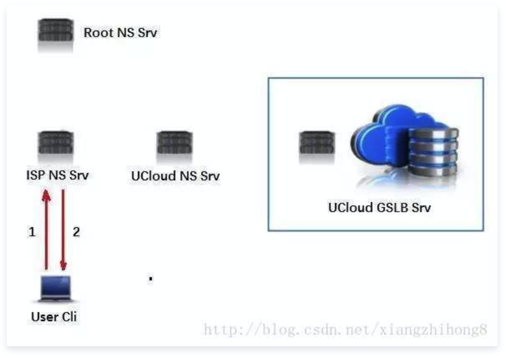

# 你想知道的直播技术都在这里了

# 概述

2016年基本上可以说一个直播年，各大互联网挣相进入直播行业，成就了直播技术的发展。之前我们也对[直播连麦技术](http://blog.csdn.net/xiangzhihong8/article/details/53009877)做了一个简单的分析，但是没有从整体上介绍，今天我们就组一个整体的介绍（本文部分资料来源于网络）。  我们先来看看视频直播的5个关键的流程：录制->编码->网络传输->解码->播放。每个环节对于直播的延迟都会产生不同程度的影响，这里重点分析移动设备的情况。针对移动场景总结出直播延迟优化的4个点：网络、协议、编解码、移动终端，达到UCloud直播云实现低延迟、秒开的技术细节。

# 直播技术分析

## UCloud直播云

### 1）全局[负载均衡](https://cloud.tencent.com/product/clb?from=10680)-就近接入

实现就近接入的技术比较广为人知，就是[CDN](https://cloud.tencent.com/product/cdn?from=10680)即Content Delivery Network （[内容分发网络](https://cloud.tencent.com/product/cdn?from=10680)）。CDN包含两大核心技术：负载均衡和分发网络，随着10多年的演进，对负载均衡和分发的实现方式已多种多样，分发网络的构建策略通常是经过日积月累的总结出一套最合适的分发路由，并且也不是一成不变，需时刻关注调整，动态运营。这里重点介绍下CDN的负载均衡技术。  负载均衡是如何实现让用户就进访问的呢？比较普遍的实现方式：通过用户使用的DNS服务器来判断客户端所在的网络位置，从而返回对应的服务IP。有点类似于网络的优先选路算法（这里不做过多的介绍）。如下图示例:  

  HTTPDNS是实现更精准的调度一种方式：  

  如图所示，HTTPDNS的好处显而易见：一可精准获得用户端的IP，有效避免用户配错Ldns（有时是网络中心配错DNS）的情况，可更精准定位用户所在网络位置。二可避免DNS解析劫持。

### 2）BGP中转架构-最短传输路径

BGP即Border Gateway Protocol （边界网关协议），业内简称BGP。为什么BGP中转架构对直播加速和分发如此重要？不得不提国内复杂的网络状况，较广为人知的是“南电信北联通”的宽带用户分布。那一个简单的问题，电信主播发起了直播，联通的用户想看怎么办呢？ 从结构上讲，肯定是有有限个电信联通两个运营商的交汇点，相当于信息桥梁。 这就会带来两个问题：1、路程要绕远，网络延迟高且不稳定；2、高峰期拥堵，导致直播流卡顿。  BGP的技术原理往简单的说就是允许同一IP在不同网络中广播不同的路由信息，效果就是同一个IP，当电信用户来访问时走电信网内的路由，联通用户来访问时走的联通的路由（即IP唯一性）。所以BGP技术对跨运营商的访问带来了巨大的便利，特别是直播场景。不同于传统的文件缓存场景，一个图片哪怕第一次是跨了遥远的距离从源站获取后，本地网络进行缓存，后面的访问都走本地网络。直播加速是流式的，并且当要做到低延迟的时候，中间的缓存要尽可能少。 BGP相当于给跨网的用户就近搭建了一坐桥梁，不必绕远路，延时和稳定性都大大提高了。原理运行图如下：  

  经过BGP的优化之后，我们还需要对网络的机房选路有一个优化。在国内一般而言相同的接入运营商（电信、联通、移动）并且地理位置最近的情况网络延迟最优，小于15ms。跨省同运营商的网络延迟25~50ms，跨运营商情况更复杂一些，在50~100ms。总结起来，直播当中每个包的延时可以缩短100ms，由于网络的叠加效果，反射到上层是秒级的延迟缩减。

## 直播协议的选择

直播技术涉及很多的协议，如RTMP、HLS、HDL（HTTP-FLV）、RTP，大家见得比较多的就是rtmp协议，现在国内很多的直播平台还在使用，HLS用的也是比较多的，接下来我们分别对上面的协议做一个简单的介绍。

### RTMP协议

是Adobe的专利协议，现在大部分国外的CDN已不支持。在国内流行度很高。原因有几个方面：

1、开源软件和开源库的支持稳定完整。如斗鱼主播常用的OBS软件，开源的librtmp库，服务端有nginx-rtmp插件。

2、播放端安装率高。只要浏览器支持FlashPlayer就能非常简易的播放RTMP的直播，协议详解可以Google了解。相对其他协议而言，RTMP协议初次建立连接的时候握手过程过于复杂（底层基于TCP，这里说的是RTMP协议本身的交互），视不同的网络状况会带来给首开带来100ms以上的延迟。基于RTMP的直播一般内容延迟在2~5秒。  

### HTTP-FLV协议

即使用HTTP协议流式的传输媒体内容。相对于RTMP，HTTP更简单和广为人知，而且不担心被Adobe的专利绑架。内容延迟同样可以做到2~5秒，打开速度更快，因为HTTP本身没有复杂的状态交互。所以从延迟角度来看，HTTP-FLV要优于RTMP。

### HLS 协议

HLS即Http Live Streaming，是由苹果提出基于HTTP的流媒体传输协议。HLS有一个非常大的优点：HTML5可以直接打开播放；这个意味着可以把一个直播链接通过微信等转发分享，不需要安装任何独立的APP，有浏览器即可，所以流行度很高。社交直播APP，HLS可以说是刚需，下来我们分析下其原理 。  基于HLS的直播流URL是一个m3u8的文件，里面包含了最近若干个小视频TS（一种视频封装格式，这里就不扩展介绍）文件，如 http://www.ucloud.cn/helloworld.m3u8 是一个直播留链接，其内容如下：  

  假设列表里面的包含5个TS文件，每个TS文件包含5秒的视频内容，那么整体的延迟就是25秒。当然可以缩短列表的长度和单个TS文件的大小来降低延迟，极致来说可以缩减列表长度为1，1秒内容的m3u8文件，但是极易受网络波动影响造成卡顿。那么我们怎么解决这个问题呢？后面将专门为大家讲解优化方案。

### RTP协议

RTP即Real-time Transport Protocol，用于Internet上针对多媒体数据流的一种传输层协议。实际应用场景下经常需要RTCP（RTP Control Protocol）配合来使用，可以简单理解为RTCP传输交互控制的信令，RTP传输实际的媒体数据。  RTP在视频监控、视频会议、IP电话上有广泛的应用，因为视频会议、IP电话的一个重要的使用体验：内容实时性强。

对比与上述3种或实际是2种协议，RTP和它们有一个重要的区别就是默认是使用UDP协议来传输数据，而RTMP和HTTP是基于TCP协议传输。为什么UDP 能做到如此实时的效果呢？关于TCP和UDP差别的分析文章一搜一大把，这里不在赘述，简单概括：  **UDP：单个数据报，不用建立连接，简单，不可靠，会丢包，会乱序；**  **TCP：流式，需要建立连接，复杂，可靠 ，有序。**  实时音视频流的场景不需要可靠保障，因此也不需要有重传的机制，实时的看到图像声音，网络抖动时丢了一些内容，画面模糊和花屏，完全不重要。TCP为了重传会造成延迟与不同步，如某一截内容因为重传，导致1秒以后才到，那么整个对话就延迟了1秒，随着网络抖动，延迟还会增加成2秒、3秒，如果客户端播放是不加以处理将严重影响直播的体验。  **总结一下**：在直播协议的选择中，如果选择是RTMP或HTTP-FLV则意味着有2~5秒的内容延迟，但是就打开延迟开，HTTP-FLV 要优于RTMP。HLS则有5~7秒的内容延迟。选择RTP进行直播则可以做到1秒内的直播延迟。但就目前所了解，各大CDN厂商没有支持基于RTP直播的，所以目前国内主流还是RTMP或HTTP-FLV。

### Google的WebRTC视频方案

HLS的优点点是显而易见的：移动端无需安装APP使用兼容HTML5的浏览器打开即可观看，所有主流的移动端浏览器基本都支持HTML5，在直播的传播和体验上有巨大的优势。

而看起来唯一的缺点：内容延迟高（这里也有很多HLS限制没有提到，比如必须是H264+AAC编码，也可认为是“缺点”之一）。如果能得到解决，那将会是直播技术非常大的一个进步。或者换个说法，有没有更低延迟可直接用链接传播的直播方案？不局限于HLS本身。  对于浏览器直接的视频互动，Google一直在推WebRTC，目前已有不少成型的产品出现，可以浏览器打开即实时对话、直播。但是目前覆盖还不是很广泛，从测试结果看，该项目的代码相对较薄，还没达到工业级的成熟度，需要大规模应用估计需要自填不少坑，有兴趣的同学可以学习研究。

## 流媒体内容缓存与传输策略优化

### 基础知识：I帧、B帧、P帧

**I帧表示关键帧**。你可以理解为这一帧画面的完整保留；解码时只需要本帧数据就可以完成。  **P帧表示这一帧跟之前的一个关键帧（或P帧）的差别**。解码时需要用之前缓存的画面叠加上本帧定义的差别，生成最终画面。  **B帧是双向差别帧**。B帧记录的是本帧与前后帧的差别（具体比较复杂，有4种情况）。换言之，要解码B帧，不仅要取得之前的缓存画面，还要解码之后的画面，通过前后画面的与本帧数据的叠加取得最终的画面。  注：B帧压缩率高，但是编解码时会比较耗费CPU，而且在直播中可能会增加直播延时，因此在移动端上一般不使用B帧。  

### 关键帧缓存策略

如：一个典型的视频帧序列为IBBPBBPBBP……  对于直播而言，为了减少直播的延时，通常在编码时不使用B帧。P帧B帧对于I帧都有直接或者间接的依赖关系，所以播放器要解码一个视频帧序列，并进行播放，必须首先解码出I帧，其后续的B帧和P帧才能进行解码，这样服务端如何进行关键帧的缓存，则对直播的延时以及其他方面有非常大的影响。  比较好的策略是服务端自动判断关键帧的间隔，按业务需求缓存帧序列，保证在缓存中存储至少两个或者以上的关键帧，以应对低延时、防卡顿、智能丢包等需求。

### 延迟与卡顿的方案选择

直播的延时与卡顿是分析直播业务质量时，非常关注的两项指标。  然而，这两项指标从理论上来说，是一对矛盾的关系——需要更低的延时，则表明服务器端和播放端的缓冲区都必须更短，来自网络的异常抖动容易引起卡顿；业务可以接受较高的延时时，服务端和播放端都可以有较长的缓冲区，以应对来自网络的抖动，提供更流畅的直播体验。所以我们需要在延迟与卡顿选择一个比较折中的方案。  这里通常有两种技术来平衡和优化这两个指标：  **服务端提供灵活的配置策略**，对于延时要求更敏感的，则在服务端在保证关键帧的情况下，对每个连接维持一个较小的缓冲队列；对于卡顿要求更高的直播，则适当增加缓冲队列的长度，保证播放的流畅。  **服务端对所有连接的网络情况进行智能检测**，当网络状况良好时，服务端会缩小该连接的缓冲队列的大小，降低延迟；而当网络状况较差时，特别是检测到抖动较为明显时，服务端对该连接增加缓冲队列长度，优先保证播放的流畅性。

### 丢包策略

什么时候会造成丢包？对于一个网络连接很好，延时也比较小的连接，丢包策略永远没有用武之地的。而网络连接比较差的用户，因为下载速度比较慢或者抖动比较大，这个用户的延时就会越来越高。另外一种情况是，如果直播流关键帧间隔比较长，那么在保证首包是关键帧的情况下，观看这个节目的观众，延迟有可能会达到一个关键帧序列的长度。上述两种情况，都需要启用丢包策略，来调整播放的延时。  丢包的解决方案：  一是正确判断何时需要进行丢包；  二是如何丢包以使得对观众的播放体验影响最小。较好的做法是后端周期监控所有连接的缓冲队列的长度，这样队列长度与时间形成一个离散的函数关系，后端通过自研算法来分析这个离散函数，判断是否需要丢包。  所以在使用丢包策略的时候为了给用户更好的体，而应该是后台采用逐步丢帧的策略，每个视频帧序列，丢最后的一到两帧，使得用户的感知最小，平滑的逐步缩小延时的效果。

## 客户端解析优化

基于可控和容灾的需要，移动端代码一般不会hardcode 推流、播放的服务器IP地址，而选用域名代替。在IP出现宕机或网络中断的情况下，还可以通过变更DNS来实现问题IP的剔除。而域名的解析时间需要几十毫秒至几秒不等，对于新生成热度不高的域名，一般的平均解析延迟在300ms，按上图的各个环节只要有一个通路网络产生波动或者是设备高负载，会增加至秒级。几十毫秒的情况是ISP NS这一层在热度足够高的情况下会对域名的解析进行缓存。如下图：  

  按我们上面分析的情况，本省延迟大概是15ms左右，那么域名解析最低也可以做到15ms左右。但由于直播场景的特殊性，推流和播放使用的域名使用的热度较难达到ISP NS缓存的标准，所以经常需要走回Root NS进行查询的路径。  客户端解析优化：本机缓存域名的解析结果，对域名进行预解析，每次需要直播推流和播放的时候不再需要再进行DNS过程。

## 播放优化

直播流程如下：

  如图所示：直播技术涉及到直播延时、首屏时间（指从开始播放到第一次看到画面的时间）、音视频同步、软解码、硬解码等技术。  **播放步骤分析：**

1. 根据协议类型（如RTMP、RTP、RTSP、HTTP等），与服务器建立连接并接收数据
2. 解析二进制数据，从中找到相关流信息；
3. 根据不同的封装格式（如FLV、TS）解复用（demux）；
4. 分别得到已编码的H.264视频数据和AAC音频数据；
5. 使用硬解码（对应系统的API）或软解码（FFMpeg）来解压音视频数据；
6. 经过解码后得到原始的视频数据（YUV）和音频数据（AAC）；
7. 因为音频和视频解码是分开的，所以我们得把它们同步起来，否则会出现音视频不同步的现象，比如别人说话会跟口型对不上；
8. 最后把同步的音频数据送到耳机或外放，视频数据送到屏幕上显示。  针对视频播放的流程，我们做以下的优化：  
**首屏时间优化**  
9. 从步骤2入手，通过预设解码器类型，省去探测文件类型时间；
10. 从步骤5入手，缩小视频数据探测范围，同时也意味着减少了需要下载的数据量，特别是在网络不好的时候，减少下载的数据量能为启动播放节省大量的时间，当检测到I帧数据后就立马返回并进入解码环节。   
**延时优化**  
  视频缓冲区或叫视频缓存策略，该策略原理是当网络卡顿时增加用户等待时间来缓存一定量的视频数据，达到后续平滑观看的效果，该技术能有效减少卡顿次数，但是会带来直播上的内容延时，所以该技术主要运用于点播，直播方面已去掉该策略，以此尽可能去掉或缩小内容从网络到屏幕展示过程中的时间。  下载数据探测池技术，当用户下载速度不足发生了卡顿，然后网络突然又顺畅了，服务器上之前滞留的数据会加速发下来，这时为了减少之前卡顿造成的延时，播放器会加速播放探测池的视频数据并丢弃当前加速部分的音频数据，以此来保证当前观看内容延时稳定。  
**推流优化**  
推流流程图：  

**优化一：适当的Qos（Quality of Service，服务质量）策略。**  推流端会根据当前上行网络情况控制音视频数据发包和编码，在网络较差的情况下，音视频数据发送不出去，造成数据滞留在本地，这时，会停掉编码器防止发送数据进一步滞留，同时会根据网络情况选择合适的策略控制音视频发送。  比如网络很差的情况下，推流端会优先发送音频数据，保证用户能听到声音，并在一定间隔内发关键帧数据，保证用户在一定时间间隔之后能看到一些画面的变化。  **优化二：合理的关键帧配置。**  合理控制关键帧发送间隔（建议2秒或1秒一个），这样可以减少后端处理过程，为后端的缓冲区设置更小创造条件。

## 软硬编解选择

推流编码： 推荐Andorid4.3（API18）或以上使用硬编，以下版本使用软编；iOS使用全硬编方案；

播放解码：Andorid、iOS播放器都使用软解码方案，经过我们和大量客户的测试以及总结，虽然牺牲了功耗，但是在部分细节方面表现会较优，且可控性强，兼容性也强，出错情况少，推荐使用。  软编码硬编码优缺点对比：  

# 总结

分析很多直播后端、终端的关于低延迟、秒开的优化技术，在UCloud直播云上都已有了相关的实践，都是一些较“静态”的技术。实际提供稳定、低延迟、流畅的直播服务，是日常中非常大量细致的监控、算法和动态运营的结果，并不是实现了某些的技术点，就能坐享一套稳定的直播服务，我们需要根据实际情况做一个最好的适合自己的视频直播方案。    