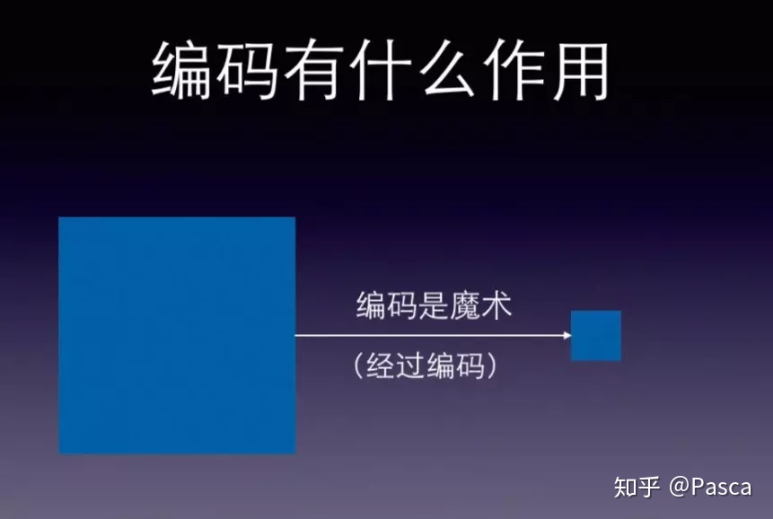
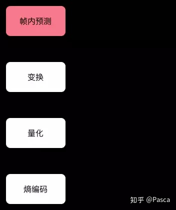
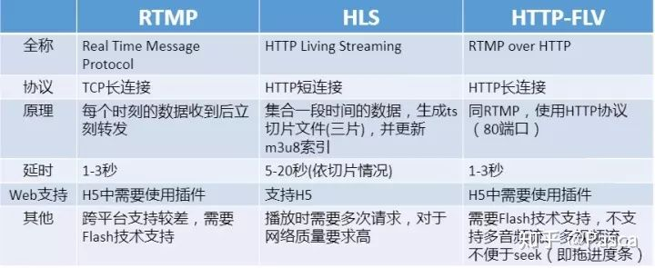

一、直播科普
1、直播是什么
在之前一篇文章详细解答过关于视频的结构，这里就直接上个思维导图。

理解视频的结构有助于我们更好的去理解直播。从本质上讲，直播就是一帧帧的数据加上时序标签流式传输。 这里有个悖论：一个容器封装好后的视频是“结构化”的，即不可变的，那直播又是怎么产生的呢？或者说，怎么去打破这个已经产生的“结果”，从而还往里面加上时序标签流式传输的呢？ 很简单，那就是**“边生产边传输边播放”。** 至于如何达到这种效果，我们继续往下看。
2、视频编码压缩
前面讲直播，怎么又突然讲到视频了呢？ 简而言之，视频和直播息息相关。当然，这也是既定的事实，所以也不多说。 那这里讲的编码压缩又是什么呢？ 采集设备采集一帧图像会生成无损的**.bmp**文件格式的图片文件，一个6M通过有损压缩得到200kb的JPEG文件，压缩比就是1/30。 但是视频不需要单独传输一张张压缩图，只需要记录每帧之间的差别即可。于是，根据I帧（200K原始图像）生成差异文件P帧，通过I帧和P帧再生成B帧。 这，就是H.264编码。**

**如上图所示，编码压缩就像魔术一般，一段视频，如果经过编码压缩后，可以大幅度的缩小体积。而各种**不同的压缩算法就是编码格式**，如今主流的音视频编码格式就是**H.264+AAC**，也是各大平台兼容性最好的编码格式方案。 视频内容经过编码压缩大幅度的减少体积后，有利于存储和压缩。但是相应的，传输时也是被压缩算法所“加密”的视频。所以，在播放端也需要一个“解密”的过程。 因此，在编码和解码之间，显然需要一个编码器和解码器都可以理解的约定，就图像而言：**生产端的编码器将多张图像进行编码后生成一段端的GOP（Group of pictures）， 播放端的解码器则是读取一段段的GOP解码后读取画面再渲染显示**。 编码过程如下图所示：

一个公式： **GOP = I(帧内编码帧) + B（双向预测帧） + P（前向预测帧）** 其中I帧也叫关键帧，是一副完整的画面，而P帧则是记录I帧的变化（H.264中通过补偿算法根据I帧得到的差异文件），B帧类似。 再简单点说，如果**没有I帧，P帧和B帧也无法解码**。这也很好理解，没有原始对比文件，只有差异文件是无法渲染画面的。 GOP结构一般两个数字，如M=1，N=2。M指定I帧和P帧之间的距离，N指定两个I帧之间的距离，其他都是B帧填充。如M=1，N=2这里的例子是IDR PB I排序。 有些地方会讲IDR帧，其实就是GOP的第一个I帧，这个帧很重要，因为关于首开优化基本上都在去尽可能减小IDR帧的大小。

总结，编码后的视频（video） = 一组 GOP 画面 = 一组 I帧 +B帧 +P帧。
如果用物理学上的概念来比喻，**Video就是“物体”， GOP好比“分子”，I/P/B帧的图像就是“原子”**。 而直播，就是利用video的“原子”传输。
3、视频直播的准确定义
到这里，我们终于可以来尝试来给直播表述较为准确的一个定义。
直播就是将每帧数据（Video/Audio/Data Frame），打上时序标签后进行流式传输的过程。发送端源源不断的采集音视频数据，经过编码、封包、推流，再经过中继分发网络进行扩散传播。播放端则源源不断的下载数据并按时序进行解码播放。 这样就完成了“边生产、边传输、边播放”的直播过程了。 **简而言之，视频直播技术，就是将视频内容的最小颗粒（I/P/B帧）,基于时序标签，以流式传输的一种技术。**
***题外话：GOP越长，所包含的B帧和P帧越多，响应的压缩比也会更高。 GOP越短，I帧比例增高，压缩比增加，同码率下视频质量会下降。\***
二、常见直播技术梳理
1、直播业务逻辑
直播也分为两种，一种就是直播服务，一种叫互动直播。打个比方，如果 直播 服务是个信号发射塔，那 互动直播 就是个带舞台的剧院。

今天我们这里主要讲述的主要是前一种，也就是“信号塔”式直播。相比较“舞台式”互动直播，“信号塔”式直播只要知道发射塔的信号频率(即频道号或链接)就能收看它发送的节目，但是并不能很好的去实时交互动。而对于互动直播来说，“舞台上”的演员可以很多个，观众也可能被邀请到舞台上面对面交流，所以互动直播的延时会比直播更低，甚至达到了毫秒级（100ms）。 当然，互动直播经过旁路转推也可以经过“发射塔”播出去，这就是“旁路转推”功能。
常见直播业务逻辑如下：

**推流：指的是把采集阶段封包好的内容传输到服务器的过程 拉流：即将服务器封包好的内容拉取到播放端解码播放的过程**
2、直播技术栈

上图是一个如今主流的直播泳道，非常直白的表述了从主播端采集视频到观看端播放直播的数据流向，下面我们根据其中主要的几大模块一一详解。
**数据采集→数据预处理→数据编码→数据传输(流媒体服务器)→解码数据→直播播放**
1、数据采集（主播端）
采集设备：手机、电脑、摄像机

2、数据预处理
涉及功能：美颜、滤镜 涉及技术：SDK内置算法或第三方特效
3、数据编码
编码器主要流程：

上图为帧内编码（I 帧），帧间编码（P帧）类似。
编码方式：CBR（静态码率）和VBR（动态码率） 视频编码格式：H.265、H.264、MPEG-4等 音频编码格式： Opus、G711、AAC、Speex、3A等 视频封装容器：封装容器有TS、MKV、AVI、MP4等 音频封装容器：MP3、OGG、AAC等
4、数据传输
传输协议：

- 推流：RTSP、RTMP、QUIC
- 拉流：RTMP、HTTP-FLV、HLS 控制信令：SIP、SDP、SNMP

5、解码数据
涉及技术：编码器自带解码器
6、数据播放（播放端）
播放渠道：移动端（手机、平板等）、客户端（PC等）、网页端（各终端）
三、直播协议的区别以及应用场景
在第二部分，我们已经详细介绍了直播的流程，其中还简要的介绍的直播过程中拉流和推流所使用到的协议，下面我们来一一详解。
1、推流
推流协议：RTMP、RTSP和QUIC 备注：RTSP、RTMP、QUIC协议都在应用层。

- RTSP是流媒体协议，主要应用于安防监控，目前绝大多数的摄像头默认支持RTSP推流。一般传输的是 ts、mp4 格式的流。RTSP在体系结构上位于RTP和RTCP之上，它使用TCP或UDP完成数据传输。但是实现复杂，各家CDN支持度不高，一般需要将直播流转码成CDN支持更好的RTMP。

一般来说，视频数据由RTP传输、视频质量由RTVP/RTCP控制，视频建议和控制由RTSP控制。 备注：作为点播协议实现倍数播放必须使用到RTSP，因为RTSP是双向协议。

- RTMP也是流媒体协议，属于Adobe，基于TCP长链接一般传输的是 flv，f4v 格式流。优点是延时低，国内CDN厂商都兼容。这也是主要的推流方式。但是在浏览器中只能使用 Flash 实现播放器。但作为拉流协议时无法支持移动端 Web 播放（手机无法安装flash）是它的硬伤。
- QUIC全称 quick udp internet connection，即“快速 UDP 互联网连接”。是谷歌公司制定的一种基于 UDP 协议的低时延互联网传输协议。使用QUIC推流，针对弱网用户也能够有很好的用户体验。

各大平台对QUIC都大同小异，而在七牛。主要是将基于TCP的RTMP传输改成基于QUIC的RTMP传输，即对外暴露的推流地址都是RTMP形式。

2、拉流
有直播推流到流媒体服务器，那肯定也会有相应的拉流方式。相比较于推流，目前主流的拉流协议有三种：**RTMP、HLS、HTTP-FLV。**

RTMP拉流：

1. 基于TCP长连接，默认使用端口1935，延时在1-3s左右
2. Web端依赖flash，H5需要安装插件
3. 手机浏览器由于flash原因，不能使用RTMP拉流

HLS拉流：

1. 基于HTTP短连接，默认80端口，由苹果公司创造。
2. 对H5支持较好，但是延时一般在10S以上
3. 可以使用 HTTPS 做加密通道

HTTP-FLV：

1. 基于HTTP长链接，默认80端口，延时在1-3s左右
2. 使用B站开源flv.js可以很好的支持H5，否则也依赖flash
3. 很好的支持移动端（Android，IOS）
4. 可以使用 HTTPS 做加密通道

在支持浏览器的协议里，延迟排序是： HTTP-FLV >= RTMP < HLS 而性能排序恰好相反： RTMP > HTTP-FLV > HLS 就目前主流直播平台（斗鱼、虎牙、熊猫等）清一色的都是使用HTTP-FLV（主）+RTMP（备）协议。而手机web端（小程序）则大多数使用的HLS协议。
3、开源推拉流软件推荐
1、推流工具
Windows端：

- OBS（Open Broadcaster Software）
- Adobe Flash Media Encoder（不再更新）
- XSplit推流器
- ffmpeg命令行工具

移动端（IOS和Andriod）：

- 七牛开源SDK

**备注：不支持H5推流**
2、播放工具
Web端：

- 七牛云Web sdk
- 超酷开源播放软件

Windows：

- 七牛windows开源播放器
- VLC播放器

移动端（IOS和Andriod）：

- 七牛开源移动播放器

四、使用七牛云从0到1打造直播平台
1、简要流程
通过七牛开发者平台快速创建直播空间、直播流及获取推流播放地址等操作，一站式完成直播业务的基本推流及播放。

**备注：申请七牛云直播需审核以及一个双备案（ICP及公安部）的域名。**
2、产品框架

主要分为四部分：

- 业务服务器 负责协调直播类应用的业务逻辑，包括但不限于：
- 创建直播房间
- 返回直播房间播放地址列表
- 关闭直播房间
- LiveNet 实时流网络 负责流媒体的分发、直播流的创建、查询等相关操作
- 采集端
- 负责采集和推送流媒体
- 播放端
- 负责拉取并播放流媒体