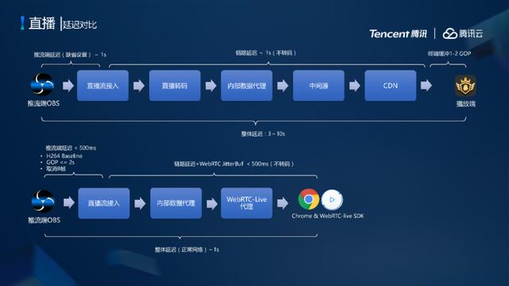
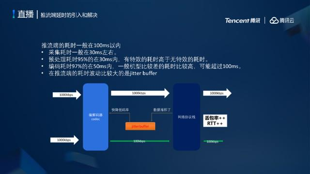

# 腾讯云低延时直播系统架构设计与弱网优化实践

> “直播带货”可能是2020年最具代表性的词汇之一，那么传统电商该如何融合直播系统，直播过程如何保障用户的最佳观看体验？本文由腾讯云资深架构师何书照在LiveVideoStack线上分享中的内容整理而成，详解了大规模、低延时电商直播系统架构设计以及电商直播的难点、技术挑战与突破。

文 / 何书照

整理 / LiveVideoStack

直播回放：[http://scrmtech.gensee.com/webcast/site/vod/play-6ced83f94af24094b6d8329948addb09](https://link.zhihu.com/?target=http%3A//scrmtech.gensee.com/webcast/site/vod/play-6ced83f94af24094b6d8329948addb09)

本次主要为大家分享最近腾讯云在低延时电商直播系统架构的设计与弱网优化实践。

- 电商直播的难点、挑战与技术突破
- 大规模、低延时电商直播系统架构设计
- 低延时直播系统弱网优化与互动连麦实践

## 电商直播的难点、挑战与技术突破

电商直播主要分为两种：其一，当前直播或短视频公司正在拥抱电商，其面临的挑战并非直播相关技术，反而是电商系统的设计架构。其二，线下电商类客户正在接触直播，拥抱疫情期间出现的新形势，其面临的挑战是如何将直播引入到电商系统中。

电商直播其实是“电商+直播”的过程，直播过程是实时的流媒体，该流媒体强烈依赖从主播端到观众端的整条链路，整条链路中任何一个环节出问题，都可能导致用户无法抢购商品、转化率降低。

## 大规模、低延时电商直播系统架构设计

标准的电商系统的设计流程有7步：浏览产品 → 拍下订单 → 支付商品 → 查看订单 → 查看物流 → 确认收货 → 退货流程。

如上图所示有三个模块：便捷入口和渠道；快捷、交互、专家导购、购物体验；更好服务的支持。我认为直播属于第二模块的直播导购。

电商直播最近成为热点，一方面是疫情原因；另一方面，以前的页面式或货架式的电商，是客户通过发现需求寻找不同的产品，再决定是否购买。随着新技术的逐渐引入，这个过程需要更加切合用户需求，而电商直播符合该趋势。趋势在于有一个专业导购，帮你匹配痛点，替代用户进行货比三家等购物时普遍的痛点，也就是将线下在商场中的体验搬到线上。

从我的观察来看，电商直播领域刚刚开始，因为目前电商直播的模式刚刚兴起，大家开始探讨其中的一些体验、互动甚至试穿等，未来还有很大的发展空间，电商直播将会是一个比较火热的趋势。

若要在现有的直播技术基础上做好电商直播，首先需要了解业界的直播架构是怎样的。如上图，业界端到端的直播架构主要分为四部分，整体的直播流程是：主播端和源站通过推流SDK或开源工具，通过RTMP协议推流到流媒体处理中心（一个中心节点或中心机房），其中会进行很多处理，后通过CDN进行分发，最后观众端通过SDK或者Web页面的H5观看直播。

通过图中的四大接入流程，将直播融入电商，最重要的接入流程是主播端和观众端。主播端需要通过APP进行宏观的定制开发，将以前的电商系统结合到直播系统中，进行界面的互动，并且集成一些SDK等的推流支持。最重要的是观众体验要好，让观众通过直播引起购买欲直至下单。因此，观众端需要将当前电商能力与音视频领域的技术能力良好结合。

另外直播后台需要与电商后台互通，做到人、货、主播间的管理良好匹配，当出现大规模秒杀时，可以及时更新数据。

如图是根据近期的客户需求整理的流程以及工作量

- **主播端**的工作量主要在产品和UI侧，需要设计比较好的产品，产生较好的用户体验。剩余的技术工作可以基于原有系统迭代，根据云上的直播SDK接口很容易接入。
- **服务端**的挑战是研发能力，是在电商能力基础上快速迭代直播CDN能力。由于能力全部云化，因此集成工作很简单，其次需要做的是对房间和用户的管理。腾讯云有很多DSMO可直接使用，集成工作完成后，再与电商系统相结合即可。
- **用户端**主要将商品相关和UI能力复用。

对于产品评估，个人认为方向有两方面：一是产品和UI侧，根据能力设计体验。二是技术调研，即主播端、服务端、用户端平行开发利用云的能力。

## 低延时直播系统弱网优化与互动连麦实践

图中架构省略了某些直播过程中需要关注的、需要处理的点

如上图为腾讯云直播架构，主播端通过SDK推流到上行接入点的数据中心，在数据中心进行相关处理后，进行转码，再利用CDN三级回源架构，通过用户被动触发进行拉流。腾讯云的设计宗旨是不做无谓的浪费，只有当观众需要某一条数据流，发起拉流转码时，再转码。

围绕整个腾讯云直播架构进行拆分，上行分为三种方式：

1. 最常用的通过RTMP推流方式推到云端。
2. 通过RTMP拉流的方式，拥有自己的上行源站。
3. 通过HLS拉流方式，上行推到腾讯云，腾讯云处理加速之后通过协议分发。

**最常用的是通过HTTP-FLV协议分发；通过HLS协议分发大多用在Web端或长视频的处理，较少的使用RTMP协议处理。**

主要看下行进行对应协议的选择，若关心延时问题，则正常情况下会选择RTMP上行推流，端到端的延时可控制在2-5秒，下行一般选择HTTP-FLV协议，其时延在2-5秒之间，缺点是Web端的兼容问题稍差。

Web端较为常用的是HLS协议，基于HTTP切片，集合一段时间的数据进行，其不足是若切片大小不一致会造成整体延时较大，一般在10秒以上。RTP协议是目前的终极优化方案，其延时可达到100毫秒以下，大部分连麦是使用这种方式进行。

腾讯云直播架构中的**延时分为三部分**：

1. 主播端的采集、预处理、编码、发送以及上行的网络等推流端引入的延时；
2. 云处理部分产生的延时，包括链路延时、转码引入的延时、不同的协议引入的延时不同，映射为上行-转码-下行；
3. 下行的接收端与网络强相关，映射为接收-解码-后处理-展示，都会产生相应延时。

对以上产生延时的点进行分析，以发现可优化部分。

**低延时直播主要的优化方向和技术方向：**

1. 上行或者下行一般基于原有的CDN架构进行正常优化；
2. Quic相较于HTTP/2更好一点，Quic优化的效果很明显；
3. 使用WebRTC进行优化。

未来随着5G甚至6G技术的发展，对于直播方面的优化方向会更多……

**直播主要的质量监控和评测方式有以下6点**：卡顿率、时延、开播失败率、首帧时间、视频帧率、视频码率，前四项，就可以反映出本场直播的质量问题。

在未进行低延时优化之前的CDN上出现卡顿，如图为卡顿的判定路径，首先需要关注出现卡顿的情况，若房间所有用户都出现卡顿还是部分用户卡顿。

全部用户卡顿的情况则需要检查上行过程，上行卡顿会导致整个房间都卡顿，首先进行同频对比，其次确认上行推流的帧率、码率是否正常，检查流畅度，这些通过腾讯云的后台可以获取。

部分用户卡顿的情况需要检测下行拉流情况，根据用户检查其回源情况，通过检查拉流节点或者检查用户的卡顿日志。

对于卡顿的优化，**主播推流端**需要进行的工作是：

- 网络诊断：选用质量好的网络
- 设置合理的参数：编码设置，如帧率设置为15以上。
- GOP设置为合理的值。大型秀场或电商类直播一般设置为1-2秒。

**用户端**需要进行的工作：

- 查看CPU使用率，CPU被占用较大，会出现卡顿
- 使用适合的码率帧率对应使用的网络环境
- 对于软解码建议开启硬件加速
- 播放缓冲调整，可将播放端的缓冲加大，当网络延时比较大时，可以使用足够的缓存消除卡顿
- 网络情况诊断，进行网络情况较差，建议切换等提示
- 动态调整播放码率：当正常使用HLS拉流，可以与多种码率匹配，使用FLV拉流，腾讯云SDK可以无缝切换码率。

以上各种工作情况都可以通过腾讯云的后台进行状态查询。

对于标准直播的延时，通过CDN的时延优化同样分为两部分：

**主播推流端：**

- 网络诊断：选用质量好的网络
- GOP设置为合理的值，若所有GOP值，延时也会缩小相应倍数，但同时会出现卡顿率变大的问题，因此需要设置合理的值。一般推荐为1-2秒左右。
- 调整buffer，特别在OBS推流时，是自适应buffer，另外SDK的buffer也需要进行适配。
- 服务器避免转码，选择中等码率直接推流。

**用户播放端：**

- 缓存DNS解析的IP,或者并行解析DNS
- 异步鉴权，先播放再鉴权。一般的鉴权服务器是3D设计，先推流，在后台进行鉴权，若鉴权失败断开后续推流即可。
- 播放缓冲合理设置：缓冲越大时延越长。若使用IGK或其他开源播放器建议设置GB为1秒内，网络的catch按照用户对时延的要求对应设置，一般为1-4秒之间（若想要追求非常低的时延，例如RTMP连麦时延等，设置为1秒以内即可）。
- 选择性丢帧：丢帧的策略在CDN和播放端都会使用，在CDN侧若发现用户是一个慢速用户，网络状况很差的情况下，CDN就会选择性丢帧，同样播放器也会选择同样策略，以降低延时播放。
- SDK的快速播放策略：网络良好的情况下，按照1.5倍播放速度进行缓冲，网络状况降低时，再调整为慢播放，平衡选择，以降低延时、减少卡顿。

若使用腾讯云的SDK推流，上行速率掉底了，但是编码器的音视频码率没变化，这时就会出现卡顿，出现数据的堆积，当数据堆积超出红线以上，就说明会出现卡顿和延时的问题。

腾讯云的SDK主要关注3个参数：网络上行速率SPD、音视频编码时的VRA和ARA，正常情况下，VAR+ARA=SPD

腾讯云SDK的下行回调参数会更加丰富些，针对这些参数的调整可以优化延时和卡顿的问题。

腾讯云SDK对低门槛用户提供三种模式：自动模式（根据网络状况自动调整）、极速模式（不引入链路延时，Catch设置为1秒左右）、流畅模式，在电商或秀场类的直播情景通常会选择极速模式。

若对延时和卡顿有更高要求，还有两种匹配的优化方案。其一是基于QUIC的方式优化，其二是基于WebRTC进行优化，腾讯云目前已经支持QUIC加速，通过RTMP推流时加标志即可通过QUIC方式推流，这种加速方式一般要基于极速模式，下行可以通过QUIC或WebRTC加速。

目前主流模式是通过WebRTC进行加速，优点是SDK变动较小。基于标准OBS协议推流，上行处理过程即便每一个过程都进行延时的缺省，也会有3-10秒的延时。

若利用WebRTC策略，上行通过RTMP标准协议计入成功后，通过WebRTC下行处理，同时优化转码、CDN分发等，通过代理的方式直接通到SDK，当客户端集成SDK或使用Chrome浏览器默认支持，延时可以控制在1秒以内。

第二个优化策略是使用TRTC技术，连麦互动时通过WebRTC或RTC进行上行承接，基于UDP加速，通过WebRTC到最近的服务端与通过TRTC的客户端到最近的服务端两种策略的时延都很小，这种策略适用于主播与观众连麦或者多个主播间PK的场景。

在TRTC基于UDP模式下进行的数据分析，端到端的延时大概在350毫秒左右，其优化点关注在350毫秒以上的优化。

对于推流端延时的解决方案，一般在SDK中埋点，推流端整体耗时在100毫秒以内；采集数据耗时一般在30毫秒左右；预处理耗时在30毫秒左右，有特效的耗时高于无特效耗时；编码耗时一般在50毫秒以内，低端机型耗时较高；推流端耗时较大的是jitter buffer。

对于网络耗时，通过分析后，使用WebRTC技术可以将整个网络的耗时维持在50毫秒以内。

对于播放端的耗时一般在100毫秒以内。

- 播放的解码耗时一般在20毫秒以内，也有5%左右的超过50毫秒；
- 渲染耗时一般在20毫秒以内，有特效的耗时高于无特效耗时；
- 在播放端影响较大的是网络波动，引入的耗时是20-200毫秒不等。

图中表格数据为协议详细对比，网络质量波动时，播放延时不会越来越大，网络恢复后延迟可以及时恢复。

WebRTC技术的网络控制和播放策略是流畅优先，弱网环境下依然可以保障能播放，不会一直卡住。

在低延时直播领域，除了传统直播和WebRTC直播两个主要的优化方向之外，还有基于QUIC方式的优化。基于QUIC的模式，大部分应用于CDN下行。

在弱网条件下对打开和关闭QUIC两种情况下的卡顿率进行比较，可以看出，打开QUIC比关闭QUIC的卡顿率稍好。现阶段一些大型厂商，也都在进行QUIC相关的优化和测试。

同样，对打开QUIC和关闭QUIC条件下的时延情况进行对比，网络稳定状态下，打开QUIC时延可以降低100毫秒左右。