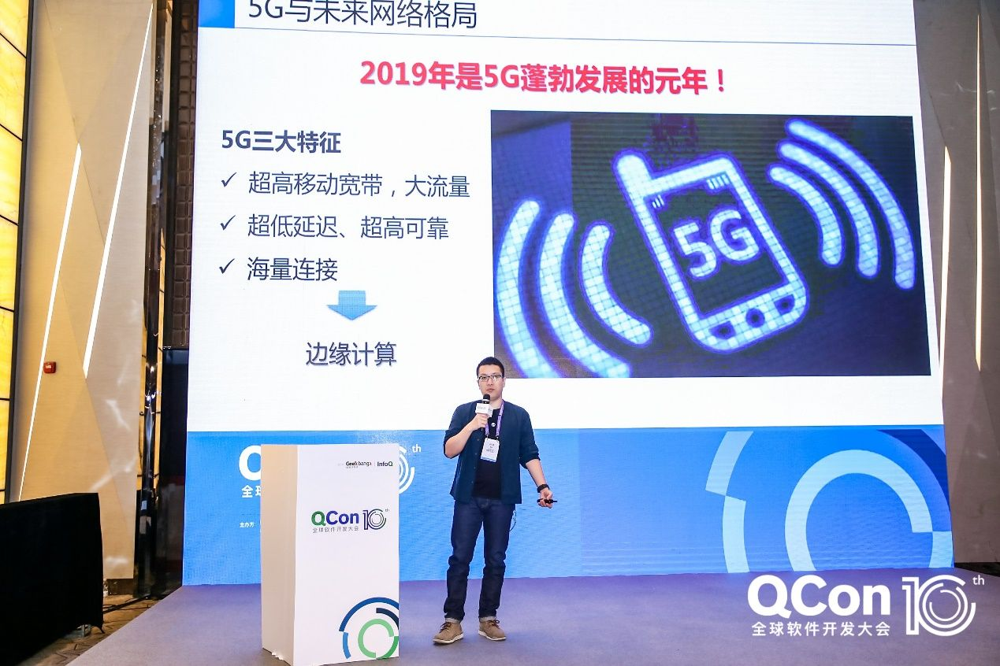
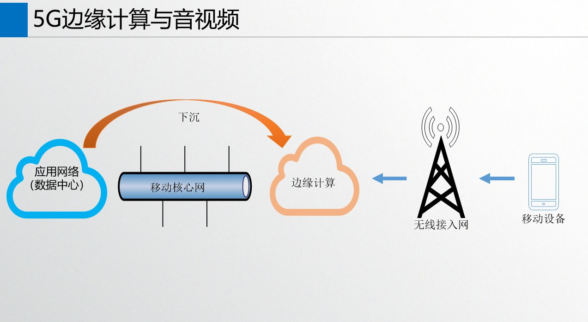
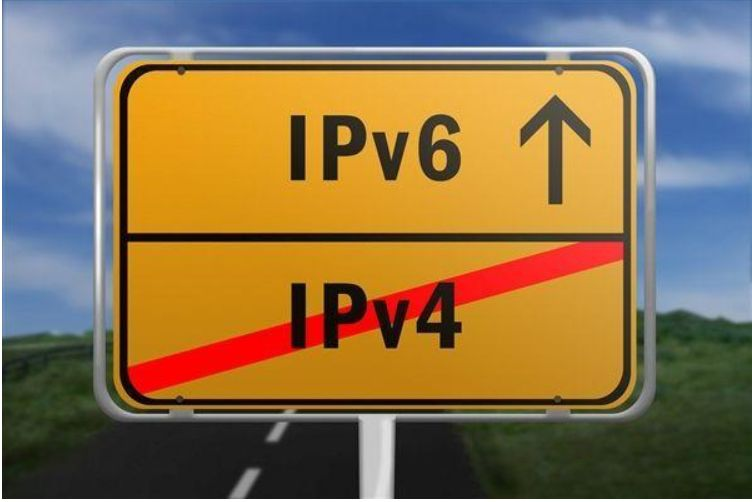
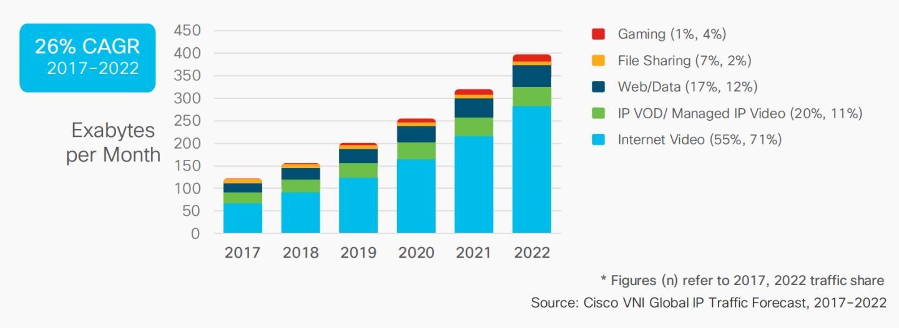
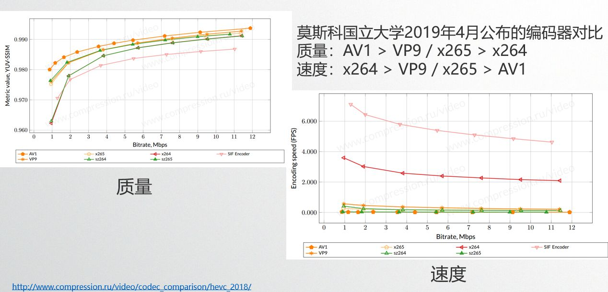

> 4G 带来了音视频 APP 的爆发，各路音视频业务为主的公司百花齐放，音视频技术无论在广度还是深度上都蓬勃发展，迎来了质的飞跃。而5G 高带宽，低延迟的特性，更是为音视频技术带来无限可能。
> 网易云信多媒体资深技术架构师吴桐受邀参加 2019 QCon 全球软件开发大会上海站，发表了题为《**超高清4K视频低延时直播与RTC融合架构设计**》的精彩分享。

本文整理自吴桐的分享内容，因为干货过多，本篇演讲实录将分为3篇主题文章发布。分别为：

- 超高清4K视频低延时直播与RTC融合架构设计①：**5G与未来的网络格局**
- 超高清4K视频低延时直播与RTC融合架构设计②：**直播与RTC低延时方案**
- 超高清4K视频低延时直播与RTC融合架构设计③：**直播与RTC融合架构设计**

以下是第一篇分享，网易云信多媒体资深技术架构师吴桐从5G的背景、特点说起，与大家探讨了边缘计算、IPv6等热门话题，同时分享了超高清编码器的选择方向。

关注“网易云信”公众号，回复“知乎”，获取2019技术干货合集>>>

[免费试用](https://link.zhihu.com/?target=https%3A//yunxin.163.com/netcall/%3Ffrom%3Dzhihu%26utm_source%3Dzhihu%26utm_medium%3Darticle%26utm_content%3D191023)网易云信音视频产品>>>>

## **5G与未来的网络格局**

2019年是5G蓬勃发展的元年。今年6月，工信部为运营商颁发了5G牌照；9月，国民骄傲华为发布了首款真5G手机Mate 30，首次将处理器和5G基带集于一体；同时，大家也看到了特朗普政府对华为5G的种种刁难。所有这些都预示着，5G时代真的要来了。

那么，5G为音视频技术带来了哪些变化？我们先看看5G的三大特征。

1. **超高的移动带宽，大流量。**这个特征是大家最容易感受到的变化，上下行带宽变大了。回看这几年，我们从2.5G->3G->4G->5G一路走来，视频清晰度也从低清->标清->高清->超高清，到1080p，2k，4k。随着带宽不断变大，大家对于视频的清晰度的要求只会越来越高。在下文的超高清编码部分，会与大家进一步分享这个话题。
2. **超低延迟、超高可靠**。5G虽然为大家提供了超低延迟的基础，但想要真正实现直播和RTC的低延迟，我们还有很多工作要做，这也是我们接下来两篇文章的重点。
3. **海量连接。**未来的连接是海量的，以前大家使用PC电脑上网，后来，大家使用手机，现在已经有越来越多的智能设备可以连接上网，比如智能音箱、智能电视等。可以预见，越来越多的iOT设备将会拥有音视频能力，这是机遇也是挑战，我们需要在音视频服务器架构上做好海量设备接入的准备，这部分内容在接下来的两篇文章中也会涉及。

聊完三大特征，我们也基本把分享的大致内容圈定。而5G网络的这三个特征的在具体场景的落地实现还和5G的另一个核心能力紧密相关，那就是边缘计算。接下来，我们来聊聊5G的另一个热点话题：5G与边缘计算。

## **5G与边缘计算**

MEC不是一个新概念，早期它是Mobile Edge Computing移动边缘计算的简称，后来欧洲电信标准协会(ETSI)又扩展为Multi-Access Edge Computing，也就是多接入边缘计算。其实两者本质上没有区别，都是将互联网云端的计算能力下沉到移动网络的边缘，只是后者进一步延伸了这个边缘所在的位置。

下沉后有哪些好处呢？

1. 因为离用户更近了，所以**用户感受到的传输延时更小**；
2. **网络拥塞被显著控制**；
3. 因为能力下沉，所以**运营商可以开放更多的网络信息和拥塞控制功能给开发者**。

为了优化音视频场景下的用户体验，网易云信也在边缘计算领域进行积极地探索。今年，网易云信与运营商开展了MEC边缘计算能力合作，实践5G网络下在视频通话场景的体验优化。

上文5G三大特征里提到海量连接，接下来我想和大家分享一下与之相关、但大家可能会忽视的一个小话题。那就是：5G与IPv6。

## **5G与IPv6**

IPv6想来大家一定不会陌生，我们在本科的计算机网络课程中早已学习了相关背景知识，也早就知道了IPv4的局限。

我们来看几个数据：

1. 全球的IPv4早在2011年2月已经分完了，我们现在主要靠运营商NAT分配私网地址；
2. 全球的IPv6普及率突破30%，中国部署率大概为5%，这个数据可能不准确，但是就我个人使用体验而言，我确实没有感受到IPv6的普及。

而未来物联网及海量5G设备时代肯定是IPv6的天下。在5G时代背景下，IPv4+NAT的局限性愈发明显，现在工信部等国家相关机关，已经开始不断强调IPv6的重要性，网易也响应国家号召，要求集团内部的主要部门必须要加快实施。云信作为网易集团内IM和音视频能力底层提供方，自然属于第一批实施IPv6之列。**网易云信当前已经完成了大部分IM和音视频相关服务器与客户端程序的IPv6兼容工作**，其实这部分从技术实现上难度并不大；**其次要做好机房路由器和交换机的相关IPv6部署改造工作**。希望大家要重视IPv6的相关改造工作，在5G时代全面到来前，都能快速平稳过度到IPv6下。

接下来，我们聊一聊超高清编码。

## **超高清编码**

我们先看一组数据，在思科发布的未来网络预测白皮书中显示，网络视频的流量占比在2022年将高达82%，其中4K视频流量将占所有视频流量的62%，而4K视频的码率也将达到18Mbps。

我们对于清晰度的需求越来越高，因此在项目中如何选择合适的编码尤为重要。这几年，我们最常用的视频编码是H.264、VP8，但它们的压缩率已经无法满足超高分辨率。那么在超高分辨率下，我们还有什么可以选择？现在流行的编码有：HEVC(H.265)、VP9、AV1、以及下一代视频编码标准VVC。

选择编码器，我们最主要考察它的两个方面：**编码质量和速度**。这里提供几个编码器数据，以供参考。这份数据由莫斯科国立大学在2019年4月份公开。质量方面：AV1 > VP9 / x265 > x264；速度方面：x264 > VP9 / x265 > AV1；其中VP9与x265的质量和速度都很接近。

依照上面的数据，我们可以得到一个超高清编码器的选择建议：

1. 在Web端，也就是有WebRTC参与的场景下，优先选择VP9；
2. 对于iOS和Android的旗舰机型，优先使用H.265的硬件编码；
3. 服务器上可以使用H.265的硬件加速，其中NVIDIA、Intel和Xilinx等很多芯片硬件和FPGA公司都提供相关解决方案；
4. AV1的视频压缩质量很高，且AV1具备开放的特性，因此它是一个非常具有前景的编码器，我们当前对它保持重点关注，而对于VVC，在它2020年标准化后，我们也会保持关注。

以上就是吴桐《超高清4K视频低延时直播与RTC融合架构设计》系列分享的第一篇文章，更多干货内容敬请期待。

关注“网易云信”公众号，回复“知乎”，获取2019技术干货合集>>>

[免费试用](https://link.zhihu.com/?target=https%3A//yunxin.163.com/netcall/%3Ffrom%3Dzhihu%26utm_source%3Dzhihu%26utm_medium%3Darticle%26utm_content%3D191023)网易云信音视频产品>>>>

邀请好友使用网易云信，好友下单成功即可获得1000元网易考拉/严选无门槛现金券，[点击立即推荐](https://link.zhihu.com/?target=https%3A//hubble.netease.com/sl/aaacQz)>>

了解[网易云信](https://link.zhihu.com/?target=https%3A//yunxin.163.com/%3Ffrom%3Dzhihu%26utm_source%3Dzhihu%26utm_medium%3Darticle%26utm_content%3D191023)，来自网易核心架构的通信与视频云服务>>