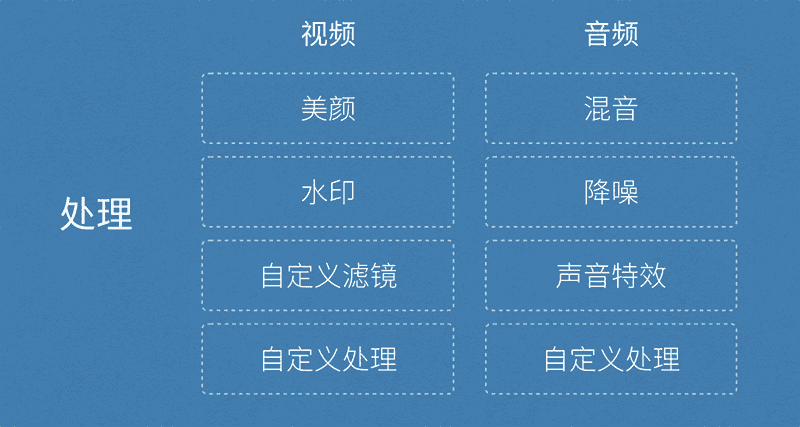
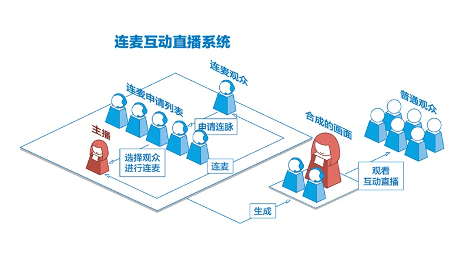
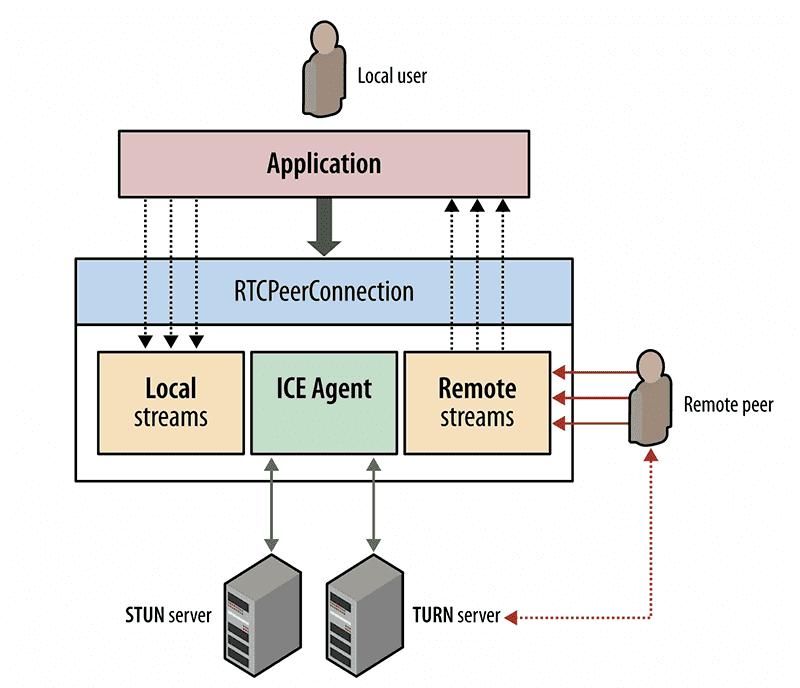
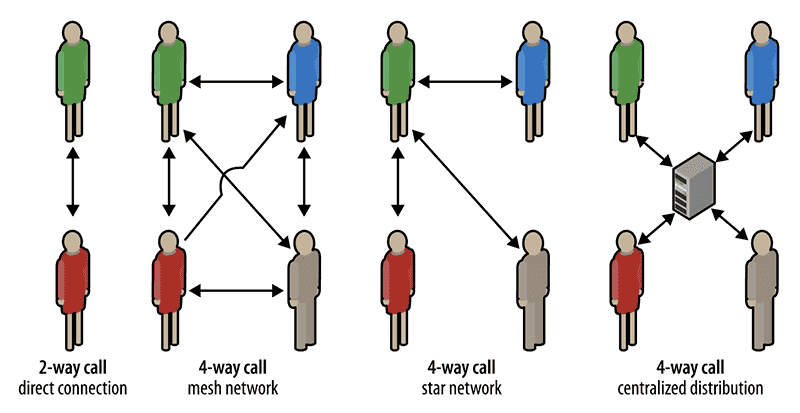
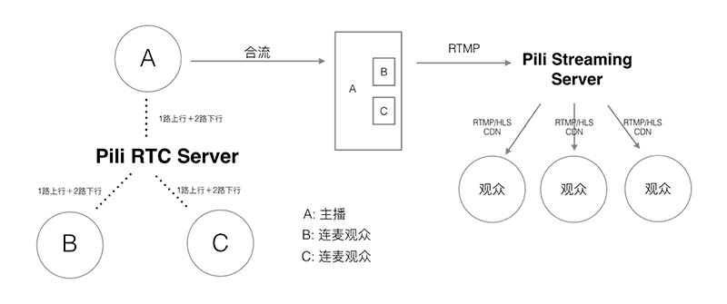

七牛云于 6 月底发布了一个针对视频直播的实时流网络 LiveNet 和完整的直播云解决方案，很多开发者对这个网络和解决方案的细节和使用场景非常感兴趣。

我们将用七篇文章，更系统化地介绍当下大热的视频直播各环节的关键技术，帮助视频直播创业者们更全面、深入地了解视频直播技术，更好地技术选型。

本系列文章大纲如下，想复习之前文章的直接点击直达链接：
（一）[采集](https://zhuanlan.zhihu.com/p/22502905)

（二）处理

（三）编码和封装

（四）推流和传输

（五）延迟优化


（六）现代播放器原理


（七）SDK 性能测试模型

在上期[采集](https://zhuanlan.zhihu.com/p/22502905)中，我们介绍了视频采集针对音频采集和图像采集以及它们分别对应两种完全不同的输入源和数据格式。 本篇是《解密视频直播技术》系列之二：处理。我们将讲解常见视频处理功能如美颜、视频水印、滤镜、连麦等。

视频或者音频完成采集之后得到原始数据，为了增强一些现场效果或者加上一些额外的效果，我们一般会在将其编码压缩前进行处理，比如打上时间戳或者公司 Logo 的水印，祛斑美颜和声音混淆等处理。在主播和观众连麦场景中，主播需要和某个或者多个观众进行对话，并将对话结果实时分享给其他所有观众，连麦的处理也有部分工作在推流端完成。


### **开放式设计**



如上图所示，处理环节中分为音频和视频处理，音频处理中具体包含混音、降噪和声音特效等处理，视频处理中包含美颜、水印、以及各种自定义滤镜等处理。对于七牛这样的直播云服务来说，为了满足所有客户的需求，除了要提供这些「标准」处理功能之外，我们还需要将该模块设计成可自由接入自定义处理功能的方式。

iOS SDK 地址：[https://github.com/pili-engineering/PLMediaStreamingKit](https://link.zhihu.com/?target=https%3A//github.com/pili-engineering/PLMediaStreamingKit)


Android SDK 地址：[GitHub - pili-engineering/PLDroidMediaStreaming](https://link.zhihu.com/?target=https%3A//github.com/pili-engineering/PLDroidMediaStreaming)


### **常见视频处理功能**

**1.美颜**

都说「80% 的主播没有美颜根本没法看」，美颜是直播产品中最常见的功能之一。最近准备在香港上市的美图公司的主打产品就是美颜相机和美拍，有媒体戏称其会冲击化妆品行业，其实就是美颜的效果的功劳，让美女主播们不化妆也可以自信的直播，而美颜相机的用户则可以拍出「更好的自己」。

美颜的主要原理是通过「磨皮+美白」来达到整体美颜的效果。磨皮的技术术语是「去噪」，也即对图像中的噪点进行去除或者模糊化处理，常见的去噪算法有均值模糊、高斯模糊和中值滤波等。当然， 由于脸部的每个部位不尽相同，脸上的雀斑可能呈现出眼睛黑点的样子，对整张图像进行「去噪」处理的时候不需要将眼睛也去掉，因此这个环节中也涉及到人脸和皮肤检测技术。

在我们的直播系统中提供的 iOS 和 Android 推流 SDK 中内置了美颜功能，你可以根据自己的需要选择开关美颜功能，并且能够自由调节包括美颜，美白，红润等在内的参数。其中 iOS 端 SDK PLCameraStreamingKit 的参数设置如下：


1）按照默认参数开启或关闭美颜：

```text
-(void)setBeautifyModeOn:(BOOL)beautifyModeOn;
```

2）设置美颜程度，范围为 0 ~ 1：

```text
-(void)setBeautify:(CGFloat)beautify;
```

3）设置美白程度，范围为 0 ~ 1

```text
-(void)setWhiten:(CGFloat)whiten;
```

4）设置红润程度，范围为 0 ~ 1

```text
-(void)setRedden:(CGFloat)redden;
```

**2.视频水印**

水印是图片和视频内容中常见的功能之一，它可用于简单是版权保护，或者进行广告设置。处于监管的需求，国家相关部门也规定视频直播过程中必须打上水印，同时直播的视频必须录制存储下来保存一定的时间，并在录制的视频上打上水印。

视频水印包括播放器水印和视频内嵌水印两种方式可供选择，对于播放器水印来说，如果没有有效的防盗措施，对于没有播放鉴权的推流，客户端拿到直播流之后可以在任何一个不带水印的播放器里面播放，因此也就失去了视频保护的能力。综合考虑云端录制对于水印的需求，我们一般会选择「视频内嵌水印」的方式打水印。

在我们的直播系统中提供的 iOS 和 Android 推流 SDK 中也内置了水印功能，你可以根据自己的需要添加水印或移除水印，并且能够自由设置水印的大小和位置。其中 iOS 端 SDK PLCameraStreamingKit 的参数设置如下：

1）添加水印

```text
-(void)setWaterMarkWithImage:(UIImage *)wateMarkImage position:(CGPoint)position;
```

该方法将为直播流添加一个水印，水印的大小由 wateMarkImage 的大小决定，位置由 position 决定，需要注意的是这些值都是以采集数据的像素点为单位的。例如我们使用AVCaptureSessionPreset1280x720 进行采集，同时 wateMarkImage.size 为 (100, 100) 对应的origin 为 (200, 300)，那么水印的位置将在大小为 1280x720 的采集画幅中位于 (200, 300) 的位置，大小为 (100, 100)。

2）移除水印

```text
-(void)clearWaterMark;
```

**3.滤镜**

除了上面提到的美颜和水印之外，视频中还有很多其它的处理效果也在这个环节完成。七牛直播云提供的 SDK 在开放性设计基础之上，通过数据源回调接口，可以支持各种自定义滤镜的接入。

为了实现丰富的滤镜效果，在 iOS 端可以考虑使用 GPUImage 这个库，这是一个开源的基于GPU的图片或视频的处理框架，内置了多达120多种常见的滤镜效果。有了它，添加实时的滤镜只需要简单地添加几行代码，还可以基于这个库自己写算法实现更丰富端效果。GPUImage 地址：[GitHub - BradLarson/GPUImage: An open source iOS framework for GPU-based image and video processing](https://link.zhihu.com/?target=https%3A//github.com/BradLarson/GPUImage)


除了 iOS 端之外，Android 也有 GPUImage 这个库的移植：[GitHub - CyberAgent/android-gpuimage: Android filters based on OpenGL (idea from GPUImage for iOS)](https://link.zhihu.com/?target=https%3A//github.com/CyberAgent/android-gpuimage)

同时，Google 官方也开源了一个伟大的库，覆盖了 Android 上面很多多媒体和图形图像相关的处理：[GitHub - google/grafika: Grafika test app](https://link.zhihu.com/?target=https%3A//github.com/google/grafika)

**4.连麦**




连麦是互动直播中常见的需求，其流程如上图所示。主播和部分观众之间可以进行实时互动，然后将互动结果实时播放给其他观众观看。

基于以上业务需求，我们很容易想到基于单向直播原理，在主播端和连麦观众端进行双向推流和双向播流的方式互动，然后在服务端将两路推流合成一路推送给其他观众。但 RTMP 带来的延迟决定了这种方式无法做到用户可接受的互动直播。

实际上，互动直播的主要技术难点在于：
1）低延迟互动：保证主播和互动观众之间能够实时互动，两者之间就像电话沟通，因此必须保证两者能在秒级以内听到对方的声音，看到对方的视频；

2）音画同步：互动直播中对音画同步的需求和单向直播中类似，只不过互动直播中的延迟要求更高，必须保证在音视频秒级传输情况下的秒级同步。

3）音视频实时合成：其他观众需要实时观看到对话结果，因此需要在客户端或者服务端将画面和声音实时合成，然后以低成本高品质的方式传输观众端。

在视频和电话会议领域，目前比较成熟的方案是使用思科或者 WebEx 的方案，但这些商用的方案一不开源，二比较封闭，三成本比较高。对于互动人数比较少的互动直播，目前市场上比较成熟的方案是使用基于 WebRTC 的实时通讯方案。




上图是一个基于 WebRTC 协议实现多方实时通讯的示意图，本地用户（主播）和远程用户（连麦观众）之间的连接通过 RTCPeerConnection API 管理，这个 API 包装了底层流管理和信令控制相关的细节。基于该方案可以轻松实现多人（14 人以下）的多方实时通信，如下图所示：




当然，在通信人数少的情况下，其复杂度相对简单，如 2 人情况下。但人数增多至 4 人之后，其可选的网络结构就增多了，如上图所示，可以每个点之间形成自组织网络的方式通信，也可以以 1 人为中心形成星型通信网络，还可以让大家都通过一个集中式的服务端进行通信。




作为一个高性能、可伸缩的直播基础服务提供商，七牛直播云经过评估选择了以主播为中心形成星形通信网络，支持主播和多个观众之间的互动质量。同时，为了保证合成后的音视频实时传输到其他观众端，这里采用经过改造的 UDP 协议传输：

1. 通过 UDP 降低传输延迟。
2. 在 UDP 之上进行传输控制，保证用户互动体验 QoS。

在下一篇连载中，我们将详细介绍编码和封装。