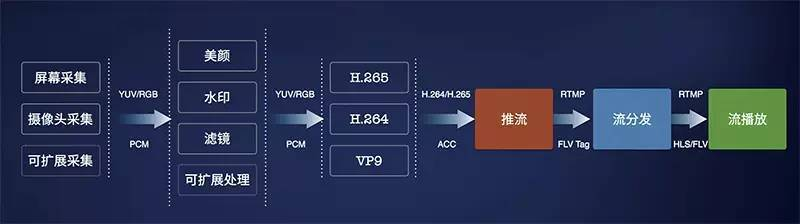
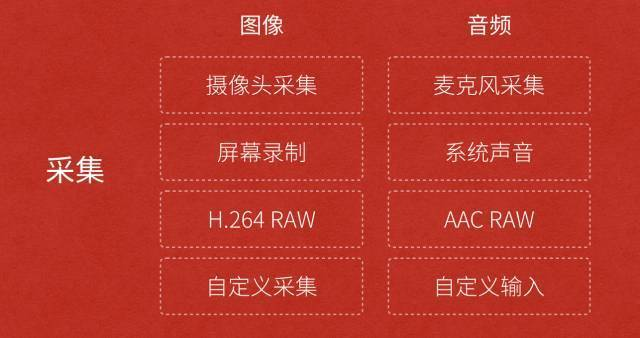

关于直播的技术文章不少，成体系的不多。我们将用七篇文章，更系统化地介绍当下大热的视频直播各环节的关键技术，帮助视频直播创业者们更全面、深入地了解视频直播技术，更好地技术选型。

本系列文章大纲如下：

（一）采集

（二）处理

（三）编码和封装

（四）推流和传输

（五）延迟优化


（六）现代播放器原理


（七）SDK 性能测试模型




本篇将重点聊聊：**采集**。

采集是整个视频推流过程中的第一个环节，它从系统的采集设备中获取原始视频数据，将其输出到下一个环节。视频的采集涉及两方面数据的采集：音频采集和图像采集，它们分别对应两种完全不同的输入源和数据格式。


### **采集内容**

**1.音频采集**

音频数据既能与图像结合组合成视频数据，也能以纯音频的方式采集播放，后者在很多成熟的应用场景如在线电台和语音电台等起着非常重要的作用。音频的采集过程主要通过设备将环境中的模拟信号采集成 PCM 编码的原始数据，然后编码压缩成 MP3 等格式的数据分发出去。常见的音频压缩格式有：MP3，AAC，HE-AAC，Opus，FLAC，Vorbis (Ogg)，Speex 和 AMR等。

音频采集和编码主要面临的挑战在于：延时敏感、卡顿敏感、噪声消除（Denoise）、回声消除（AEC）、静音检测（VAD）和各种混音算法等。

在音频采集阶段，参考的主要技术参数有 ：

- 采样率（samplerate）：采样就是把模拟信号数字化的过程，采样频率越高，记录这一段音频信号所用的数据量就越大，同时音频质量也就越高。
- 位宽：每一个采样点都需要用一个数值来表示大小，这个数值的数据类型大小可以是：4bit、8bit、16bit、32bit 等等，位数越多，表示得就越精细，声音质量自然就越好，而数据量也会成倍增大。我们在音频采样过程中常用的位宽是 8bit 或者 16bit。
- 声道数（channels）：由于音频的采集和播放是可以叠加的，因此，可以同时从多个音频源采集声音，并分别输出到不同的扬声器，故声道数一般表示声音录制时的音源数量或回放时相应的扬声器数量。声道数为 1 和 2 分别称为单声道和双声道，是比较常见的声道参数。
- 音频帧（frame）：音频跟视频很不一样，视频每一帧就是一张图像，而从上面的正玄波可以看出，音频数据是流式的，本身没有明确的一帧帧的概念，在实际的应用中，为了音频算法处理/传输的方便，一般约定俗成取 2.5ms~60ms 为单位的数据量为一帧音频。这个时间被称之为“采样时间”，其长度没有特别的标准，它是根据编解码器和具体应用的需求来决定的。

根据以上定义，我们可以计算一下一帧音频帧的大小。假设某音频信号是采样率为 8kHz、双通道、位宽为 16bit，20ms 一帧，则一帧音频数据的大小为：

```text
size = 8000 x 2 x 16bit x 0.02s = 5120 bit = 640 byte
```

2.图像采集图像采集的图片结果组合成一组连续播放的动画，即构成视频中可肉眼观看的内容。图像的采集过程主要由摄像头等设备拍摄成 YUV 编码的原始数据，然后经过编码压缩成 H.264 等格式的数据分发出去。常见的视频封装格式有：MP4、3GP、AVI、MKV、WMV、MPG、VOB、FLV、SWF、MOV、RMVB 和 WebM 等。

图像由于其直观感受最强并且体积也比较大，构成了一个视频内容的主要部分。图像采集和编码面临的主要挑战在于：设备兼容性差、延时敏感、卡顿敏感以及各种对图像的处理操作如美颜和水印等。

在图像采集阶段，参考的主要技术参数有：

- 图像传输格式：通用影像传输格式（Common Intermediate Format）是视讯会议（video conference）中常使用的影像传输格式。
- 图像格式：通常采用 YUV 格式存储原始数据信息，其中包含用 8 位表示的黑白图像灰度值，以及可由 RGB 三种色彩组合成的彩色图像。
- 传输通道：正常情况下视频的拍摄只需 1 路通道，随着 VR 和 AR 技术的日渐成熟，为了拍摄一个完整的 360° 视频，可能需要通过不同角度拍摄，然后经过多通道传输后合成。
- 分辨率：随着设备屏幕尺寸的日益增多，视频采集过程中原始视频分辨率起着越来越重要的作用，后续处理环节中使用的所有视频分辨率的定义都以原始视频分辨率为基础。视频采集卡能支持的最大点阵反映了其分辨率的性能。
- 采样频率：采样频率反映了采集卡处理图像的速度和能力。在进行高度图像采集时，需要注意采集卡的采样频率是否满足要求。采样率越高，图像质量越高，同时保存这些图像信息的数据量也越大。

以上，构成了一个视频采集的主要技术参数，以及视频中音频和图像编码的常用格式。而对于直播 App 开发者来说，了解这些细节虽然更有帮助，但实际开发过程中可能很少能够关注采集环节中技术参数的控制，而是直接在 SDK 中将采集后的数据传递给下一个「处理」和「编码」环节。


### **采集源**

**1.摄像头采集**

对于视频内容的采集，目前摄像头采集是社交直播中最常见的采集方式，比如主播使用手机的前置和后置摄像头拍摄。在现场直播场景中，也有专业的摄影、摄像设备用来采集。安防监控场景中也有专业的摄像头进行监控采集。

目前七牛提供的 SDK 对以上两类摄像头的采集都支持，对于手机，iOS 和 Android 分别支持前置后置摄像头的采集，只是 iOS 由于设备种类和系统版本不多，因此采集模块兼容性较好；而 Android 需要适配的硬件设备和系统则非常多，目前支持 Android 4.0.3 及以上的摄像头采集。对于专业摄像机或者摄像头，七牛云提供了兼容适合嵌入式系统的 C 语言采集模块的实现，欢迎参考使用：[GitHub - pili-engineering/ipcam_sdk](https://link.zhihu.com/?target=https%3A//github.com/pili-engineering/ipcam_sdk)

**2.屏幕录制**

屏幕录制采集的方式在游戏直播场景中非常常见，目前我们在 Android SDK 中实现了屏幕录制的功能。而 iOS 则由于系统本身没有开放屏幕录制的权限而没法直接操作，但对于 iOS 9 以上的版本，是有个取巧的办法，可以通过模拟一个 AirPlay 镜像连接到（当前 App）自身，这样就可以在软件上捕获到屏幕上的任何操作，达到录制屏幕的效果。

在教育直播或者会场演讲场合，我们经常看见需要录制电脑桌面上 PPT 的场景，针对这种场景，目前市面上比较方便的方案是使用开源的桌面推流工具 OBS 来进行屏幕录制和推流：[Open Broadcaster Software](https://link.zhihu.com/?target=https%3A//obsproject.com/)

**3.从视频文件推流**

除了从硬件设备采集视频进行推流之外，我们也可能需要将一个视频或者音频文件以直播流的形式实时传输给观众，比如在线电台或者电视节目，它们的输入可能直接来自于一些已经录制剪辑好的视频内容。


### **开放式设计**

以上从采集内容和采集源两个维度分别介绍了视频采集相关的知识，但对于采集源来说，市场上可见的采集源远远不止这三种，即便是摄像头也有很多分类。对于一个完整的覆盖推流、传输和播放三个环节的直播云服务来说，支持尽可能多的采集源和播放终端是一项既无法规避也很难完成的工作。

为了支持市场上所有采集源的接入，我们在 SDK 中采用了开放式的设计，只要采集源实现方遵循相应的接口，即可支持任意的采集源。




图中我们把采集的内容分为图像和音频，其中图像的采集源包含摄像头、屏幕录制或者本地的视频文件，甚至是其它需要重新定义和实现的采集源。而音频的采集源包含麦克风、系统声音或者本地音频文件，当然也可以为它定义别的输入源。

这样设计最大的好处在于，可以以轻量的设计方式支持丰富的采集源，而采集源的具体实现也可以交给使用者。

在下一篇连载中，我们将详细介绍下直播中的处理环节，解答如何满足市场上主播的各种需求如美颜、水印、连麦互动等。