前言:
网络视频直播存在已有很长一段时间，随着移动上下行带宽提升及资费的下调，
视频直播被赋予了更多娱乐和社交的属性，人们享受随时随地进行直播和观看，
直播的打开时间和延迟变成了影响产品功能发展重要指标。
 
注：本文是以原文为主体，加上我自己的一些总结和补充写的

那么，问题来了： 
如何实现低延迟、秒开的直播？

先来看看视频直播的5个关键的流程：
  **录制->编码->网络传输->解码->播放，**

每个环节对于直播的延迟都会产生不同程度的影响。
这里重点分析移动设备的情况。
受限于技术的成熟度、硬件环境等，我们针对移动场景简单总结出直播延迟优化的4个点：
  **网络、协议、编解码、移动终端，**
并将分四大块来一一解密UCloud直播云实现低延迟、秒开的技术细节。

# 一、UCloud直播云实现接入网络优化的技术细节：

## 1）全局负载均衡-就近接入

实现就近接入的技术比较广为人知，就是CDN即Content Delivery Network （内容分发网络）。
CDN包含两大核心技术：
 负载均衡和分发网络。

随着10多年的演进，对负载均衡和分发的实现方式已多种多样，
分发网络的构建策略通常是经过日积月累的总结出一套最合适的分发路由，
并且也不是一成不变，需时刻关注调整，动态运营。
这里重点介绍下CDN的负载均衡技术。
负载均衡是如何实现让用户就近访问的呢？
比较普遍的实现方式：通过用户使用的DNS服务器来判断客户端所在的网络位置，
从而返回对应的服务IP。
如下图示例:
 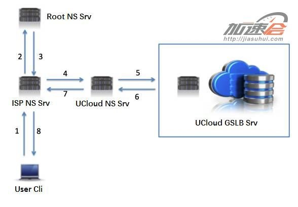
Fig-2
广东电信用户IP:1.1.1.1 需要看一个直播http://www.ucloud.cn/helloworld.flv ，
实现就近访问的过程是：

S1. 用户向配置的DNS服务器1.1.1.0
   (通常是运营商指定，也称local DNS，后面简称Ldns)发起www.ucloud.cn 的查询；
S2. Ldns 上没有该域名的记录，则往顶级即Root NS上发起查询；
S3. Root NS返回告知Ldns该域名的权威解析记录在UCloud NS上；
S4. Ldns 向UCloud NS发起查询；
S5. UCloud NS 向UCloud GSLB服务发起查询，GSLB发现 Ldns1.1.1.0是属于广东电信；
S6. 返回广东电信的就近节节点IP1.1.1.2；
S7. 返回1.1.1.2给Ldns；
S8. 返回给用户1.1.1.2，用户到1.1.1.2上去获取直播内容。

链路很长，
但是每个Ldns上都会对查询过的域名做合理的缓存，
下一个广东电信的用户再来查询的时候就可以直接返回1.1.1.2。
架构并不复杂，关键点是如何知道Ldns是位于广东电信，这就涉及一个IP地址库。
有开源地址库，也有商业地址库，可以按需求采购即可，一般一年1万左右。
例如，淘宝的IP地址库
淘宝官方ip地址库 http://ip.taobao.com/
接口说明
\1. 请求接口（GET）：
http://ip.taobao.com/service/getIpInfo.php?ip=[ip地址字串]
\2. 响应信息：
（json格式的）国家 、省（自治区或直辖市）、市（县）、运营商
\3. 返回数据格式：
{"code":0,"data":{"ip":"210.75.225.254","country":"\u4e2d\u56fd","area":"\u534e\u5317",
"region":"\u5317\u4eac\u5e02","city":"\u5317\u4eac\u5e02","county":"","isp":"\u7535\u4fe1",
"country_id":"86","area_id":"100000","region_id":"110000","city_id":"110000",
"county_id":"-1","isp_id":"100017"}}
其中code的值的含义为，0：成功，1：失败。

这里不难看出来，调度的准确度是完全依赖用户配置的Ldns，
而这些Ldns大多数是省级别的，即GLSB只知道用户是广东电信，
但是常常分不出来是广东广州电信，还是广东深圳电信。

HTTPDNS就是实现更精准的调度一种方式：
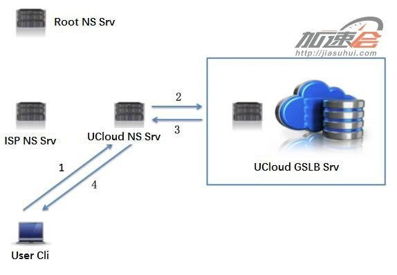
Fig-3
S1. 用户1.1.1.1通过HTTP协议直接向UCloud NS请求直播域名www.ucloud.cn；
S2. UCloud NS发现用户IP1.1.1.1属于广东深圳电信；
S3. 返回广东深圳电信节点1.1.1.11给UCloud NS；
S4. 返回给用户。

HTTPDNS的好处显而易见：
一可精准获得用户端的IP，有效避免用户配错Ldns（有时是网络中心配错DNS）的情况，
  可更精准定位用户所在网络位置。
二可避免DNS解析劫持。

## 2）BGP中转架构-最短传输路径

BGP即Border Gateway Protocol （边界网关协议），业内简称BGP。
为什么BGP中转架构对直播加速和分发如此重要？
不得不提国内复杂的网络状况，较广为人知的是“南电信北联通”的宽带用户分布。
那一个简单的问题，电信主播发起了直播，联通的用户想看怎么办呢？ 
从结构上讲，肯定是有有限个电信联通两个运营商的交汇点，相当于信息桥梁。 
这就会带来两个问题：
1、路程要绕远，网络延迟高且不稳定；
2、高峰期拥堵，导致直播流卡顿。
BGP的技术原理往简单的说就是允许同一IP在不同网络中广播不同的路由信息，
效果就是同一个IP，当电信用户来访问时走电信网内的路由，
联通用户来访问时走的联通的路由。
所以BGP技术对跨运营商的访问带来了巨大的便利，特别是直播场景。
不同于传统的文件缓存场景，一个图片哪怕第一次是跨了遥远的距离从源站获取后，
本地网络进行缓存，后面的访问都走本地网络。
直播加速是流式的，并且当要做到低延迟的时候，中间的缓存要尽可能少。 
BGP相当于给跨网的用户就近搭建了一坐桥梁，不必绕远路，延时和稳定性都大大提高了。
 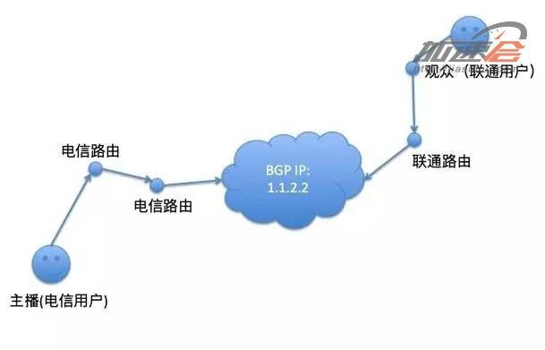
Fig-4
技术原理部分介绍完了，那么它对直播延迟影响有多少改善呢？
首先这里的就近，不一定是物理距离近，不考虑瞬时负载情况下，
更多是指测速延时最优的机房。
在国内一般而言相同的接入运营商（电信、联通、移动）
并且地理位置最近的情况网络延迟最优，小于15ms。
跨省同运营商的网络延迟25~50ms，
跨运营商情况更复杂一些，在50~100ms。
总结起来，直播当中每个包的延时可以缩短100ms，
由于网络的叠加效果，反射到上层是秒级的延迟缩减。

【总结】
所以，网络部分的优化是两点:
\1. 使用自己的HTTPDNS， 换句话说，就是要搭建自己的快速高并发的调度系统；
\2. 使用BGP机房；

# 二、直播应用层协议及传输层协议的选择以及对直播体验影响的分析 

直播协议的选择
国内常见公开的直播协议有几个：RTMP、HLS、HDL（HTTP-FLV）、RTP，
我们来逐一介绍。
RTMP协议：
是Adobe的专利协议，现在大部分国外的CDN已不支持。
在国内流行度很高。原因有几个方面：
1、 开源软件和开源库的支持稳定完整。
   如斗鱼主播常用的OBS软件，开源的librtmp库，服务端有nginx-rtmp插件。
2、 播放端安装率高。
只要浏览器支持FlashPlayer就能非常简易的播放RTMP的直播，
协议详解可以Google了解。
相对其他协议而言，RTMP协议初次建立连接的时候握手过程过于复杂
（底层基于TCP，这里说的是RTMP协议本身的交互），
视不同的网络状况会带来给首开带来100ms以上的延迟。
基于RTMP的直播一般内容延迟在2~5秒。
 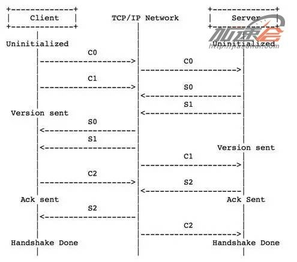
Fig-5

HTTP-FLV协议：
即使用HTTP协议流式的传输媒体内容。
相对于RTMP，HTTP更简单和广为人知，而且不担心被Adobe的专利绑架。
内容延迟同样可以做到2~5秒，打开速度更快，因为HTTP本身没有复杂的状态交互。
所以从延迟角度来看，HTTP-FLV要优于RTMP。

HLS 协议：
即Http Live Streaming，是由苹果提出基于HTTP的流媒体传输协议。
HLS有一个非常大的优点：HTML5可以直接打开播放；
这个意味着可以把一个直播链接通过微信等转发分享，
不需要安装任何独立的APP，有浏览器即可，所以流行度很高。
社交直播APP，HLS可以说是刚需，下来我们分析下其原理 。
基于HLS的直播流URL是一个m3u8的文件，
里面包含了最近若干个小视频TS（一种视频封装格式，这里就不扩展介绍）文件，
如 http://www.ucloud.cn/helloworld.m3u8  是一个直播留链接，
其内容如下：
 
假设列表里面的包含5个TS文件，每个TS文件包含5秒的视频内容，
那么整体的延迟就是25秒。
当然可以缩短列表的长度和单个TS文件的大小来降低延迟，
极致来说可以缩减列表长度为1，1秒内容的m3u8文件，
但是极易受网络波动影响造成卡顿。
通过公网的验证，目前按同城网络可以做到比较好的效果是5~7秒的延迟，
也是综合流畅度和内容延迟的结果。
那么HTML5是否可以有更低延迟直接打开的直播流技术呢？ 我们在最后会探讨这个问题。

RTP协议：
即Real-time Transport Protocol，用于Internet上针对多媒体数据流的一种传输层协议。
实际应用场景下经常需要RTCP（RTP Control Protocol）配合来使用，
可以简单理解为RTCP传输交互控制的信令，RTP传输实际的媒体数据。
RTP在视频监控、视频会议、IP电话上有广泛的应用，
因为视频会议、IP电话的一个重要的使用体验：内容实时性强。
对比与上述3种或实际是2种协议，
RTP和它们有一个重要的区别就是默认是使用UDP协议来传输数据，
而RTMP和HTTP是基于TCP协议传输。

为什么UDP 能做到如此实时的效果呢？
关于TCP和UDP差别的分析文章一搜一大把，这里不在赘述，简单概括：
UDP：单个数据报，不用建立连接，简单，不可靠，会丢包，会乱序；
TCP：流式，需要建立连接，复杂，可靠 ，有序。
实时音视频流的场景不需要可靠保障，因此也不需要有重传的机制，
实时的看到图像声音，网络抖动时丢了一些内容，画面模糊和花屏，完全不重要。
TCP为了重传会造成延迟与不同步，如某一截内容因为重传，导致1秒以后才到，
那么整个对话就延迟了1秒，随着网络抖动，延迟还会增加成2秒、3秒，
如果客户端播放是不加以处理将严重影响直播的体验。

总结一下：
在直播协议的选择中，如果选择是RTMP或HTTP-FLV则意味着有2~5秒的内容延迟，
但是就打开延迟来看，HTTP-FLV 要优于RTMP。
HLS则有5~7秒的内容延迟。
选择RTP进行直播则可以做到1秒内的直播延迟。
但就目前所了解，各大CDN厂商没有支持基于RTP直播的，
所以目前国内主流还是RTMP或HTTP-FLV。

是否有除了HLS外更低延迟的方案？
HLS的优点点是显而易见的：移动端无需安装APP使用兼容HTML5的浏览器打开即可观看，
所有主流的移动端浏览器基本都支持HTML5，在直播的传播和体验上有巨大的优势。

而看起来唯一的缺点：
内容延迟高
（这里也有很多HLS限制没有提到，比如必须是H264 AAC编码，也可认为是“缺点”之一）。
如果能得到解决，那将会是直播技术非常大的一个进步。
或者换个说法，有没有更低延迟可直接用链接传播的直播方案？
不局限于HLS本身。
对于浏览器直接的视频互动，Google一直在推WebRTC，目前已有不少成型的产品出现，
可以浏览器打开即实时对话、直播。但来看看如下的浏览器覆盖图：
 
非常遗憾的说，在直至iOS 9.3上的Safari仍然不能支持WebRTC。
继续我们的探索，那Websocket支持度如何呢？
 
除了老而不化的Opera Mini外，所有的浏览器都支持WebSocket。
这似乎是个好消息。
如果采用HTML5 WebSocket来做直播，
那我们先来梳理一下HTML5 WebSocket直播需要解决的问题：
1、后端兼容
2、传输
3、解码播放
对于
\#1似乎不是特别大问题，对于做过RTMP转HLS、RTP来说是基本功。
\#2对于浏览器来说使用HTTP来传输是比较好的选项。
对于#3 这里推荐一个开源的JS解码项目jsmpeg: https://github.com/phoboslab/jsmpeg，
里面已有一个用于直播的stream-server.js的NodeJS服务器。
从测试结果看，该项目的代码相对较薄，还没达到工业级的成熟度，
需要大规模应用估计需要自填不少坑，有兴趣的同学可以学习研究。

以上就是直播云：直播应用层协议及传输层协议的选择以及对直播体验影响的分析 。
关于接入网络优化、内容缓存与传输策略优化、终端优化，请参阅接下来发布的其他部分。

【我的总结】
\1. 以延时从低到高来看，协议上方案选择为:
RTP/UDP: 可以做到秒内延时，目前国内的CDN都不支持，
但有些公司开发了私有协议实现了基于它们的直播，而且它们的延时都小于1秒，
甚至小于500ms, 像YY， 映客直播采用的第三方技术等；
webRTC: 可以做到秒内延时，实际上它也是使用的RTP，
单列出来是因为它是Google开源出来的，目前社区也开始活跃，做的人也多了；
依据它出服务的公司国内有声网，中国电信研究院等；
HTTP-FLV: 内容延迟可以做到2~5秒，打开快；
RTMP: 内容延迟可以做2~5秒，当网络不好造成重传时，延时会大量增加；
HTML5 WebSocket: 方案还不成熟，延时可能也会在2~5秒；
HLS:  有5~7秒的内容延迟

# 三、在传输直播流媒体过程中的内容缓存与传输策略优化细节原理

基础知识：I帧、B帧、P帧
I帧表示关键帧。
你可以理解为这一帧画面的完整保留；解码时只需要本帧数据就可以完成。
（因为包含完整画面）
P帧表示这一帧跟之前的一个关键帧（或P帧）的差别。
解码时需要用之前缓存的画面叠加上本帧定义的差别，生成最终画面。
（也就是差别帧，P帧没有完整画面数据，只有与前一帧的画面差别的数据）
B帧是双向差别帧。
B帧记录的是本帧与前后帧的差别（具体比较复杂，有4种情况）。
换言之，要解码B帧，不仅要取得之前的缓存画面，还要解码之后的画面，
通过前后画面的与本帧数据的叠加取得最终的画面。
B帧压缩率高，但是编解码时会比较耗费CPU，而且在直播中可能会增加直播延时，
因此在移动端上一般不使用B帧。
 
Fig-6

关键帧缓存策略
一个典型的视频帧序列为IBBPBBPBBP……
对于直播而言，为了减少直播的延时，通常在编码时不使用B帧。
P帧B帧对于I帧都有直接或者间接的依赖关系，
所以播放器要解码一个视频帧序列，并进行播放，必须首先解码出I帧，
其后续的B帧和P帧才能进行解码，
这样服务端如何进行关键帧的缓存，则对直播的延时以及其他方面有非常大的影响。
比较好的策略是服务端自动判断关键帧的间隔，
按业务需求缓存帧序列，保证在缓存中存储至少两个或者以上的关键帧，
以应对低延时、防卡顿、智能丢包等需求。

延迟与卡顿的折中
直播的延时与卡顿是分析直播业务质量时，非常关注的两项指标。
互动直播的场景对延时非常敏感，新闻体育类直播则更加关注播放的流畅度。
然而，这两项指标从理论上来说，是一对矛盾的关系
---需要更低的延时，则表明服务器端和播放端的缓冲区都必须更短，
来自网络的异常抖动容易引起卡顿；
---业务可以接受较高的延时时，服务端和播放端都可以有较长的缓冲区，
以应对来自网络的抖动，提供更流畅的直播体验。
当然，对于网络条件非常好的用户，这两项是可以同时保证的，
这里主要是针对网络条件不是那么好的用户，如何解决延时与卡顿的问题。

这里通常有两种技术来平衡和优化这两个指标。
一是服务端提供灵活的配置策略，
. 对于延时要求更敏感的，
则在服务端在保证关键帧的情况下，对每个连接维持一个较小的缓冲队列；
. 对于卡顿要求更高的直播，
则适当增加缓冲队列的长度，保证播放的流畅。
二是服务端对所有连接的网络情况进行智能检测，
当网络状况良好时，服务端会缩小该连接的缓冲队列的大小，降低延迟；
而当网络状况较差时，特别是检测到抖动较为明显时，
服务端对该连接增加缓冲队列长度，优先保证播放的流畅性。
 
丢包策略
什么时候需要丢包呢？
对于一个网络连接很好，延时也比较小的连接，丢包策略永远没有用武之地的。
而网络连接比较差的用户，因为下载速度比较慢或者抖动比较大，
这个用户的延时就会越来越高。
另外一种情况是，如果直播流关键帧间隔比较长，
那么在保证首包是关键帧的情况下，观看这个节目的观众，
延迟有可能会达到一个关键帧序列的长度。
上述两种情况，都需要启用丢包策略，来调整播放的延时。

关于丢包，需要解决两个问题：
一是正确判断何时需要进行丢包；
二是如何丢包以使得对观众的播放体验影响最小。
较好的做法是后端周期监控所有连接的缓冲队列的长度，
这样队列长度与时间形成一个离散的函数关系，后端通过自研算法来分析这个离散函数，判断是否需要丢包。
一般的丢帧策略，就是直接丢弃一个完整的视频帧序列，这种策略看似简单，但对用户播放的影响体验非常大。
而应该是后台采用逐步丢帧的策略，每个视频帧序列，丢最后的一到两帧，使得用户的感知最小，
平滑的逐步缩小延时的效果。

# 四、客户端的优化

解析优化
参见之前介绍的DNS过程，如下图：
 
Fig-7

基于可控和容灾的需要，
移动端代码一般不会hardcode 推流、播放的服务器IP地址，而选用域名代替。
在IP出现宕机或网络中断的情况下，还可以通过变更DNS来实现问题IP的剔除。
而域名的解析时间需要几十毫秒至几秒不等，对于新生成热度不高的域名，
一般的平均解析延迟在300ms，按上图的各个环节只要有一个通路网络产生波动或者是设备高负载，会增加至秒级。
几十毫秒的情况是ISP NS这一层在热度足够高的情况下会对域名的解析进行缓存。如下图：
 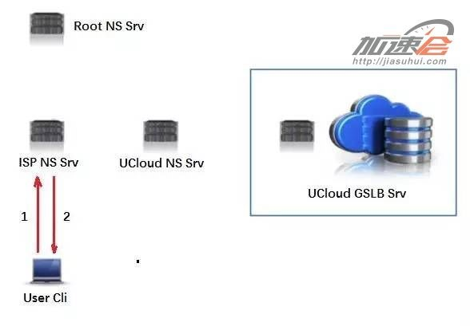
Fig-8

按我们上面分析的情况，本省延迟大概是15ms左右，
那么域名解析最低也可以做到15ms左右。
但由于直播场景的特殊性，推流和播放使用的域名使用的热度较难达到ISP NS缓存的标准，
所以经常需要走回Root NS进行查询的路径。
那客户端解析优化的原理就出来了：
本机缓存域名的解析结果，对域名进行预解析，
每次需要直播推流和播放的时候不再需要再进行DNS过程。
此处节省几十到几百毫秒的打开延迟。

播放优化
直播播放器的相关技术点有：直播延时、首屏时间（指从开始播放到第一次看到画面的时间）、
音视频同步、软解码、硬解码。参考如下播放流程：
 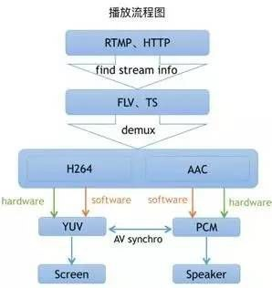
Fig-9

播放步骤描述：
S1. 根据协议类型（如RTMP、RTP、RTSP、HTTP等），与服务器建立连接并接收数据；
S2. 解析二进制数据，从中找到相关流信息；
S3. 根据不同的封装格式（如FLV、TS）解复用（demux）；
S4. 分别得到已编码的H.264视频数据和AAC音频数据；
S5. 使用硬解码（对应系统的API）或软解码（FFMpeg）来解压音视频数据；
S6. 经过解码后得到原始的视频数据（YUV）和音频数据（AAC）；
   因为音频和视频解码是分开的，所以我们得把它们同步起来，
   否则会出现音视频不同步的现象，比如别人说话会跟口型对不上；
S7. 最后把同步的音频数据送到耳机或外放，视频数据送到屏幕上显示。

了解了播放器的播放流程后，我们可以优化以下几点：
首屏时间优化
从步骤2入手，通过预设解码器类型，省去探测文件类型时间；
从步骤5入手，缩小视频数据探测范围，同时也意味着减少了需要下载的数据量，
特别是在网络不好的时候，减少下载的数据量能为启动播放节省大量的时间，
当检测到I帧数据后就立马返回并进入解码环节。

延时优化
视频缓冲区或叫视频缓存策略，
该策略原理是当网络卡顿时增加用户等待时间来缓存一定量的视频数据，
达到后续平滑观看的效果，该技术能有效减少卡顿次数，
但是会带来直播上的内容延时，所以该技术主要运用于点播，直播方面已去掉该策略，
以此尽可能去掉或缩小内容从网络到屏幕展示过程中的时间；（有利于减少延时）。
下载数据探测池技术，当用户下载速度不足发生了卡顿，然后网络突然又顺畅了，
服务器上之前滞留的数据会加速发下来，这时为了减少之前卡顿造成的延时，
播放器会加速播放探测池的视频数据并丢弃当前加速部分的音频数据，
以此来保证当前观看内容延时稳定。

推流优化
 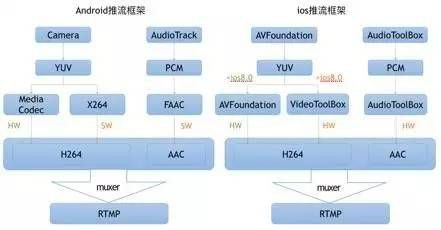
Fig-10

推流步骤说明：很容易看出推流跟播放其实是逆向的，具体流程就不多说了。
优化一：适当的Qos（Quality of Service，服务质量）策略。
推流端会根据当前上行网络情况控制音视频数据发包和编码，
在网络较差的情况下，音视频数据发送不出去，造成数据滞留在本地，
这时，会停掉编码器防止发送数据进一步滞留，
同时会根据网络情况选择合适的策略控制音视频发送。
比如网络很差的情况下，推流端会优先发送音频数据，保证用户能听到声音，
并在一定间隔内发关键帧数据，保证用户在一定时间间隔之后能看到一些画面的变化。

优化二：合理的关键帧配置。
合理控制关键帧发送间隔（建议2秒或1秒一个），这样可以减少后端处理过程，
为后端的缓冲区设置更小创造条件。

软硬编解选择
网上有不少关于选择软解还是硬解的分析文章，这里也介绍一些经验，
但根本问题是，没有一个通用方案能最优适配所有操作系统和机型。

推流编码： 推荐Andorid4.3（API18）或以上使用硬编，以下版本使用软编；iOS使用全硬编方案；

播放解码：Andorid、iOS播放器都使用软解码方案，经过我们和大量客户的测试以及总结，
虽然牺牲了功耗，但是在部分细节方面表现会较优，且可控性强，兼容性也强，出错情况少，推荐使用。

附软硬编解码优缺点对比：
 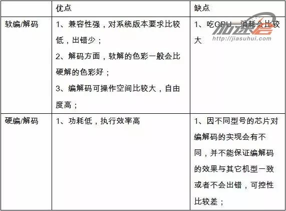
Fig-11

云端机型及网络适配
上面分析了很多针对视频编解码的参数，
但实际情况最好的编解码效果是需要根据机型的适配的，
由于iOS的设备类型较少，可以做到每个机型针对性的测试和调优，
但是对于Android就非常难做到逐款机型针对性调优，并且每年都会出产不少的新机器，
如果代码中写死了配置或判断逻辑将非常不利于维护和迭代。
 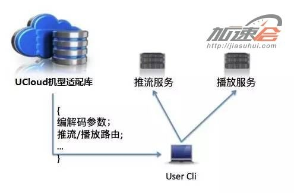
Fig-12

所以我们就诞生了一个想法，这些判断逻辑或配置是否可以放在云上呢?  
这样就产生了云端机型与网络适配的技术。
终端在推流、播放前会获取通过协议上报当前的机型配置、网络情况、IP信息。
云端会返回一个已最适合的编解码策略配置：
走软编还是硬编、各项参数的配置，就近推流服务的IP，就近播放服务的IP。 
终端获取一次即可，不需要每次推流、播放前都去获取一次。
这样，在我们不断的迭代和完善机型编解码适配库的同时，
所有使用该技术的直播APP都将收益。

总结
分析很多直播后端、终端的关于低延迟、秒开的优化技术，
在UCloud直播云上都已有了相关的实践，都是一些较“静态”的技术。
实际提供稳定、低延迟、流畅的直播服务，
是日常中非常大量细致的监控、算法和动态运营的结果，并不是实现了某些的技术点，
就能坐享一套稳定的直播服务，只能说是完成了万里长城的第一道砖。

# 五、CDN分发策略对直播体验影响的分析

在整个直播链条中，除了上面的内容外，实际上还有两项重要的核心技术文章回避了没有讲，
一个是CDN分发策略，一个是P2P技术；

CDN分发策略指的是对于一个源(文件或直播流)，如何快速分发到成百上千的边缘节点；
对于直播来说，一种策略是全连通结构，一种是树状结构

实际上，对于实际大型应用或商用的CDN网络，它们在做内容分发时，
并不是使用上面所讲的传输协议，
例如，对于RTMP接入流，就用RTMP协议；而对于HTTP-FLV接入流,就用HTTP协议，将数据从源分发到边缘节点；
实际的做法是将所有接入流数据进行私有协议的转封装，然后再用自已开发私有的(如基于UDP)传输协议进行分发；
只有这样，才能做到多业务兼容和扩展，以及减少开发和运营成本；

## 5.1 全连通结构

全连通结构如图所示:
 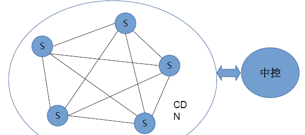
Fig-13
上图中，中控的作用有:
 . 管理节点配置
 . 评估节点间网络质量
 . 构造全连通图

全连通结构的特点是:
\1. 结构扁平化，所有的服务器位置平等，全连通；
\2. 被动触发，
意思是系统先分配一个离用户最近/网络最好/负载最小的边缘节点给用户，
如果这个节点有数据，则从这个节点取数据；
如果这个节点没有数据，则从离他最近/网络最好/负载最低的有数据的节点(或源节点)取数据，再转给用户；
当节点间数据传输的链接建立后，就一直保持，直到整个分发完成或直播结束；
\3. 数据传输速度快，
因为他的网络结构扁平，级数少，可以做到分级缓存，分层管理；
可以利用内存来处理数据，便于小文件效率高
\4. 适合于小规模(如秀场等，并发量在10W 以下)直播

因为它的结构扁平，经过优化，延时可以做到2秒以内；

5.2 树状结构
树状结构如图所示:
 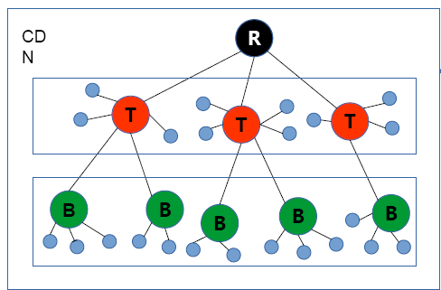
Fig-14

树状结构的特点是:
\1. 树状结构能避免环路和孤岛；
\2. 使用TCP长连接，可以以帧为最小单位传输；
\3. 在策略上，可以将网络质量差的节点自动挂载到树的下层；
\4. 树的根节点、主干和支节点都不提供对外服务，只在叶节点提供对外服务；
这样做是最大可能的保证了骨干网络的传输快速和健壮；
\5. 树要预先建立，并将内容提前分发，这样的话树的建立需要一定的时间 
\6. 适合于大规模(如大型节目，NBA等，并发在10W以上)的直播；

因为它的分发结构是树状多层，每层都会带来延时，经过测试，它的延时通常在2秒以上；

# 六、P2P技术对直播体验影响的分析

应当说，只有大型直播采用P2P才有价值，
因为P2P的特点是观看同一场直播的用户越多，能分享的Peer也就越多，也就越流畅；
它的引入，对于直播来说通常有超过5秒以上的延时；
因为要实现P2P，就需要将流缓冲，以切成文件，再做分享；