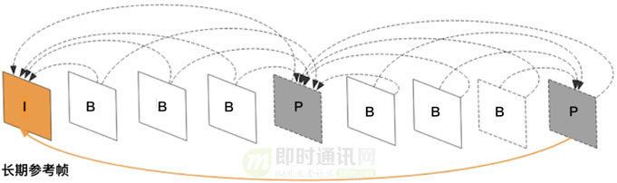
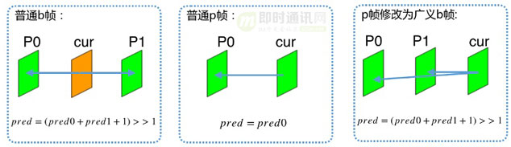

**淘宝直播技术干货：高清、低延时的实时视频直播技术解密**

## 1、引言

目前，5G技术应用正在逐步推进，相比目前广泛使用的4G， 它具有更高的速率，更大的容量，同时延迟更低， 可靠性更高。

在5G时代，得益于网络带宽的提升，视频未来将成为主流的传播媒介。越来越多的业务和应用将视频化、直播化。 大量互动的内容将通过5G以低延时的方式以视频的形式传输。5G将对视频分辨率和清晰度提出越来越高的要求。

淘宝作为一个数亿级用户的短视频与直播平台，业务多样，两端用户分布广，设备和网络情况复杂，给多媒体内容存储和分发带来巨大挑战。

本文由淘宝直播音视频算法团队分享，对实现高清、低延时实时视频直播技术进行了较深入的总结，希望分享给大家。

**本文已同步发布于“即时通讯技术圈”公众号，欢迎关注**。公众号上的链接是：[点此进入](https://mp.weixin.qq.com/s/D5KGvccoYM9zjp0doFgpNQ)。

## 2、入门文章

**如果你对视频直播技术没什么了解，可以先读以下入门文章：**

- 《[移动端实时音视频直播技术详解（一）：开篇](http://www.52im.net/thread-853-1-1.html)》
- 《[移动端实时音视频直播技术详解（二）：采集](http://www.52im.net/thread-955-1-1.html)》
- 《[移动端实时音视频直播技术详解（三）：处理](http://www.52im.net/thread-960-1-1.html)》
- 《[移动端实时音视频直播技术详解（四）：编码和封装](http://www.52im.net/thread-965-1-1.html)》
- 《[移动端实时音视频直播技术详解（五）：推流和传输](http://www.52im.net/thread-967-1-1.html)》
- 《[移动端实时音视频直播技术详解（六）：延迟优化](http://www.52im.net/thread-972-1-1.html)》

## 3、正文概述

**面对实时视频直播技术的的高需求，当前面临的主要问题有：**

- 1）需要在内容生产过程中把控好质量和成本；
- 2）需要在内容分发和消费过程中确保用户体验。

**为了解决这个问题, 我们有两个优化目标：**

- 1）一是在画质不变的前提下降码率；
- 2）二是在码率不变的前提下提升画面质量。

**在降码率上，我们通过以下手段有效地降低了视频码率带宽：**

- 1）自研高效编码器；
- 2）升级播放架构；
- 3）添加智能ROI；
- 4）场景编码；
- 5）智能码控等工具。

**在这些技术中：**

- 1）高效的编码器能够在质量不变的前提下显著降低码率；
- 2）场景编码能够根据不同的画面内容配置合适的编码参数；
- 3）ROI挑出画面中人眼比较关注的区域交给编码器重点编码；
- 4）智能码控根据人眼主观特性，消除因为超过人眼阈值而浪费的码字。

**在画质上，我们使用了以下算法提高生产内容的观感质量：**

- 1）前处理增强；
- 2）去噪；
- 3）超分高动态范围等。

**在体验优化上：**通过低延时编码技术，在降低了编码延迟的同时损失很小的码率，增加观众和主播的体验。

围绕着提高问题发现、问题处理效率的出发点，具备数据采集、存储、异常事件收集、智能告警、告警数据运营、可编码诊断平台、故障自动化处理、变更联动等能力。我们搭建了一套基于淘宝直播的全链路监控体系，从音频，视频，网络这三个方面入手去解决目前淘宝直播全链路的现有问题以及将来可能出现的问题。不断去优化整套高画质低延时系统。

与此同时，我们建立了客观质量和主观质量评价体系，采用vmaf、psnr、ssim这一系列的指标作为客观质量评价。针对海量无源场景，我们还基于cnn建立了无源评价模型，保证无源场景下质量评价的准确性。以这些有效的评价手段来确保“画质不变”，并监控线上视频质量。

下面的章节将针对上述的主要技术实践，进行深入的分享。

## 4、窄带高清实践

### 4.1自研的S265编码器

带宽成本是视频服务中非常重的基础设施成本，如何在保证视频质量的前提下降低成本是整个链路中至关重要的一环。

**相机采集到的视频数字信号，数据带宽通常都非常高：**以720p 25fps为例，带宽高达263.67Mbps，很难存储和发送。

好在视频图像内部，帧与帧之间存在非常高的相关性，采用视频压缩技术去除相关性后，可以将带宽降低到原来的100-400倍。（有关视频编码技术，这里有篇更通俗的：《[零基础，史上最通俗视频编码技术入门](http://www.52im.net/thread-2840-1-1.html)》，建议入门必读）

视频压缩标准主要由ISO（国际标准组织）制定的MPEG系列和ITU（国际电信联盟）主导的H.26X系列， 每隔十年时间，视频压缩标准升级带来的压缩率会提升一倍。

h265作为比h264更新一代的视频压缩标准，提供了更灵活的编码结构和划分方式，并在在运动补偿、运动矢量预测、帧内预测、变换、去块滤波、熵编码等方面进行了大量改进与优化， 得益于这些新的编码工具和特色技术，相同画质下最高可以比H.264节省一半码率， 为了在不牺牲画质的前提下节省码率，h265成为我们首选的编码标准。

Ali265是淘宝自研的高性能H.265编码器，对比业界开源的X265可实现BDrate20%以上的增益，对比X264则有40%以上的增益。目前已在淘宝直播，优酷视频，阿里郎会议、VMate、UC云盘等业务中上线使用。

淘宝直播技术团队联合阿里云团开发了s265编码器，对比业界常用的开源软件X265，1pass单遍编码在相同psnr指标下：

- 1）veryslow速度档次有28%码率节省；
- 2）medium速度档次有36%码率节省；
- 3）crf模式与abr模式节约的码率接近。

S265编码从码率控制、编码工具两个方向优化编码质量，并从快速算法、工程算法两方面引入速度优化算法。下节将详细分享。

### 4.2S265编码器的主要优化方法

***4.2.1）码率控制：\***

为了进一步提高压缩质量，在编码器框架标准一定的情况下，编码器算法优化主要的方向是找到策略选择出最优的编码方法和编码参数，从而获得更好的码率节约。

合理分配码率是编码器的一个重要工作， 码率控制的目标是把码字分配到更有价值的地方，从而在目标码率下使得编码失真降到最低，或者在失真固定的前提下使码率降到最低。

**码控需要解决两个经典问题：**

- 1）一是帧级码控和块级码控根据目标码率来分配每个GOP、帧、编码块的码字数量；
- 2）二是块内编码时以最合理的方式把这些码字分配到每个编码块中。

在帧级别码控中，传统方法统计所有已编码帧的长期复杂度, 根据长期复杂度及当前码率之间的比例计算出QP。

这样一来，QP对帧复杂度越来越不敏感,导致编码质量下降或码率过剩。 特别是在计算首帧qp时，以往算法采用了一个只和当前码率有关的经验值。 我们基于cutree理论准确估计预分析长度中ipb帧的码率占比和预期编码大小，从而在编码前获得更准确的量化系数。

块级码控分配则受时域cutree和空域AQ影响。在时域上IBP帧的重要性是明显不同的，被后续帧参考的块，不仅影响自已本身的质量，还会影响到后续帧的质量， 因此被参考更多的块需要进行高质量编码。

cutree算法根据帧内预测代价和帧间预测代价计算信息的传递比例, 算出当前块对后续序列的影响程度，进而调整qp偏移。 但考虑到在不同的噪声能量，运动强度，纹理边缘强度，以及编码参数下，不同参考块的调节为后续帧的节约比例是不一样的， 所以s265通过参数训练的方法，获得多个因素对传递效率的影响，得到一个更准确的信息传递比递，从而更合理地在时域上分配码率。

▲ cutree传递过程

另一方面，空域上各块之间的重要程度也是不一样的。

人眼是视频的最终观察者，从人类视觉系统出发，不同的块在人眼中的视觉冗余不相同， 比如人眼存在视觉掩蔽效果， 它对显著纹理和强边缘附近的噪声不敏感，将码率更多分配向人眼敏感的平坦区域，可以得到更好的主观质量。

在编码器中，我们通过计算块的方差能量及边缘能量作为块的代价， 研究不同块能量和人眼感知程度之间的关系， 估计出块间码率配分对人眼注意力的影响，合理分配码率到更重要的纹理块，提高视频感知编码效率。

***4.2.2）编码工具：\***

在编码工具上，S265对传统的场景切换检测、帧类型决策、SAO、DEBLOCK、两遍编码、RDOQ等编码工具算法做了改进，并实现一批编码工具。

**比如：**在参考帧模块, 有较多的工具可以提高参考效率。

**首先：**长期参考帧和广义B帧等帧类型可以提高预测质量，长期参考帧针对背景很少发生变化的直播场景，它有效减少信息经过多帧传递带来的损失，引用长期参考帧可将平均EV提高大概0.25dB。 而传统P帧改为广义b帧， 采用双向预测取代单向预测从而降低噪声，光照变化，采样误差等预测残差源。

在扩充了帧类型后，我们基于参考强度做IBP帧帧类型决策。

**然后：**在minigop内部，我们使用金字塔结构的参考关系, 得到比传统结构获得更短的参考距离。

**最后：**在管理和选择参考帧时，我们考虑到静止块和运动块的区别，静止块倾向于参考质量高的帧，运动块倾向于参考时间近的帧， 所以针对场景筛选出这两种类型的参考帧能得到更好的参考质量。

***4.2.3）速度优化：\***

HEVC编码器带来了编码效率的提升，但很多新的编码工具都存在计算复杂度过高的问题。

**因此：**优化编码器速度，在高端机上能打开更多的编码工具，搜索更大的编码模式空间。进一步提升编码质量，在低端机上则能降低CPU发烫和编码卡顿的现象。

HEVC可以将图像块从64x64划分到4x4，同时块的类型模式激增，备选的编码模式数量是h264的数倍，块划分及模式决策因此成为一个重要的瓶颈。

**所以：**在RDO中，减少CU划分层级的搜索次数，筛选出一些必要的层级是减少计算量的重要手段。

**首先：**利用时间和空间相关性，可以从参考块获取到一些先验信息, 再结合本块的运动信息和纹理信息， 分析预判出当前块CU层级的最大估计层级和最小估计层级。

**其次：**在决策过程中的提前跳出策略也可以大幅降低计算量， 我们根据图像纹理的平坦程度, 或者各种模式下的rdcost对比，提前跳出当前的模式遍历。而在一些图像非线性的场景，我们通过CNN深度学习模型辅助决策模式。

**进入决策模块的内部：**同样存在大量复杂的计算。

帧内预测存在35种模式，我们可以通过贝叶斯理论，求出最简单的几种模式后，估计出最佳模式最可能出现的位置，从而为帧内模式筛选过程提升一倍速度并将损失控制在0.01db。

另外，帧间预测的运动搜索是从参考帧寻找最佳匹配块的过程，它的分像素搜索需要做7抽头或者8抽头的插值滤波，计算量很大。我们所以可以利用整像素的信息建立二元二次误差平面方程，估算最佳分像素点的位置，避免了分像素的完整搜索过程。

在评价模式的优劣时通常采用rdcost作为模式的代价，它需要计算编码比特数和编码失真。

这就需要将编码系数进行熵编码计算码流长度，同时还要将编码系数变换回时域求失真。

**为了降低rdcost的计算量， 我们采用了失真和码率的线性估计算法，包括两个部分：**

- 1）其一是量化误差能量在频域计算，利用IDCT变换的能量不变性，计算量化余数的平方和估计失真；
- 2）其二是建立编码系数特征信息和码流大小之间的线性关系，直接从系数特征信息估计出熵编码的大小。

通过这个方法可以跳模式代价计算的熵编码过程以及，反变换，反量化，重建，SSE等过程。 节约了大量的计算。

**在rdo之外：**我们还改进了slicetype决策算法，动态拉格朗日因子调整算法，快速deblock和sao决策等。

**在工程优化方面我们也添加了多项优化：**

- 1）C函数优化，通过优化流程逻辑、拆分特殊路径、合并分支、查表、循环优化等给rdoq模块、系数解析、deblock等模块带来近一倍的提升；
- 2）针对密集计算的函数我们simd化并优化汇编代码的执行速度。

s265经过快速算法与工程两个层次上的优化，我们为HEVC编码带来了明显的性能提升。从而在低端iphone上实现720P 30帧每秒的实时编码。

### 4.3智能码控

智能码控是淘宝自研的码率控制算法。

普通ABR或CBR码率控制为了追求目标码率，在低复杂度场景浪费了大量码率，根据人眼主观质量模型，当psnr高于一定阈值后再提高质量人眼无法察觉只会消耗过多码字。

我们使用机器学习方法，根据17种历史编码信息和待编码帧的复杂度，预估出待编码帧在质量阈值以上的量化系数，并限定在ABR目标码率以下，确保每个帧都能以最合适的码率编码。

经过淘宝直播线上验证，可达到15%的省流，在钉钉直播中使用更是节省了52%的带宽并降低了62%的推流侧卡顿。

### 4.4场景编码

由于当前淘宝直播种类的丰富性，各种场景下的纹理、光照、背景、运动程度都是不一样的。

**比如：**

- 1）户外主播经常走动，画面帧变化幅度频率高；
- 2）美妆主播大多坐在室内，光照基本上比较偏亮；
- 3）珠宝类主播主要是拍摄物品，画面多静止不动。

面对形形色色的直播场景，单一的编码器配置并不能满足当前淘宝直播的需求，开启或关闭某些编码工具对视频编码效果影响不一致，如何针对内容选择最佳参数成为业界研究的方向。

在此需求下，我们提出了基于不同场景的编码参数配置策略。

**首先：**我们通过多个深度学习与机器学习模型对数万条各种内容的直播视频进行了数据训练分类。

**包含两个大的特征维度，分别是：**

- 1）语义特征；
- 2）信号特征。

**语义特征包含：**

- 1）主播分级；
- 2）商品特征；
- 3）环境特征；
- 4）声音特征；
- 5）时域空域RoI。

**信号特征包含：**

- 1）运动特征；
- 2）纹理特征；
- 3）噪声特征；
- 4）亮度特征。

通过对不同特征种类的视频集，我们单独使用大规模服务器集进行最佳编码参数搜索，自动化高效地搜索到适合当前视频编码的最佳编码参数组合，在提升画质的同时能尽可能地减少码率消耗。并最终根据编码参数集进行聚类分为多个参数配置项。

在主播需要推流的时候，首先进行标准的编码参数配置进行推流。收集一定的数据之后，我们将得到的视频语义特征和信号特征送入自适应决策引擎，通过里面的深度神经网络进行视频分类，决策出当前视频应该下发的编码参数配置，然后我们将新的参数配置重新送入编码器进行新的推流，以此优化使主播获得当前情况下最优质的视频编码。

通过此方法，我们在淘宝直播里面获得了7-10%的BDrate收益，在淘拍场景下获得了40%的BDrate收益。

### 4.5低延时编码

在直播中，低时延意味着高效率和优质体验。

**试想以下场景：**

- 1）场景一：当主播展示下一个商品后，10秒才收到上一个的商品的提问；
- 2）场景二：钉钉课堂直播中，老师提问后迟迟得不到学生的反馈，浪费部分时间。

这些场景给用户带来糟糕的体验，使得直播卖货、直播课堂效率低下。

当5G普及，会带来更低的时延，带来更好的体验，但是当下还是4G为主，降低时延有很有必要。

**端到端延迟主要分布在：**

- 1）采集；
- 2）编码；
- 3）传输；
- 4）转码；
- 5）分发；
- 6）播放。

这部分主要优化编码延迟。

**编码延迟又分为：**

- 1）多线程导致的延迟；
- 2）缓存帧数延迟；
- 3）B帧数带来的延迟等。

其中编码延迟最大的一部分来源于编码器缓存，通过分析编码前的缓存图像，可以大大的增加编码效率。如果粗暴的降低编码器缓存，可以实现较低的延迟，但是质量损失比较高。

所有产生了一种想法，能不能用较少的缓存去模拟较长的缓存的效果？

通过分析cutree的原理，结合统计lookahead长度跟传递代价的关系，可以发现缓存长度跟传递代价很强的线性关系。

**如下图所示：**

根据场景可以用不同的预测模型变种，最终实现用较短的lookahead模拟较长的lookahead的效果，测试在直播素材中lookahead4优化后比优化前可以节省13.5%的码率,有效的降低了编码延迟。

**结果示意图如下：**

同时，在之前的测试中发现，该优化对场景不敏感，运动简单场景和运动复杂场景提升同样有效。

过去一年，我们采用前述优化，将265码流在画质不变的前提下，将码率从1.4M下降到800K。

### 4.6画质增强

在淘宝直播的场景中，大主播有自己的专业设备与团队，直播出来的视频与音频都是比较高质量的。但是针对中小主播，用户的行为不可控。

因此产生的结果就是很多中小主播产生的视频质量比较低，收获的观众数量也比较少。

针对这种情况，我们选取了用户习惯产生最严重的几种情况，对这一类主播进行了画质增加的，显著提升了用户的直播体验。

下面介绍一些已经有的应用效果。

***4.6.1）去抖：\***

▲ 去抖动效果（[原始视频链接点此查看](https://video.zhihu.com/video/1307737033939320832?)）

现代编码器能够较好的处理平坦纹理和平移运动，前者通过帧内预测来消除空间相关性，后者通过运动搜索来消除帧与帧之间的时间相关性。

但是在视频采集过程中，由于摄像机抖动产生的视频帧抖动，编码器不能够很好的处理。

由于抖动剧烈的一般是中小主播，且携带的设备比较老旧，我们考虑从采集源来改善视频帧，最终在这里我们采用相机路径平滑算法来去除视频帧中的抖动。

***4.6.2）去噪：\***

视频直播在灯光不太理想的情况下，摄像头采集的画面会产生明显的飞蚊噪声和高斯白噪声，严重影响用户对视频内容的感受，这种情况下，有必要对视频进行降噪。

现有的很多优秀的云端去噪算法，其实对于移动端来说采用深度学习的方法就不合适。

虽然现在有很多移动端深度学习框架，但是毕竟还没有跟机器是配得非常好，针对很多中低端的手机其实跑不动这种生成模型的。

基于此，我们在移动端主要是考虑效率，那么我们就采了基于维纳滤波的时域降噪算法方式来实现，进行训练和优化。

***4.6.3）超分：\***

针对一些小微主播，录播设备只能支持360p，最终观众端看到的视频会通过插值等传统方法进行放大为720p。这样获得的视频帧难免产生模糊效果，影响直播观感。

得益于深度学习在移动端的优化，我们在部分高端机实现了移动端视频帧的实时超分。

在众多的网络架构中，我们最终选择了性能最佳的FSRCN方案，网络的架构图如下所示。

**在训练过程中：**我们精选了1W+淘宝个品类的高清大图，结合业界的高清开源数据集，利用样本增强技术，训练了5000轮左右的模型达到收敛效果。

**此外：**为了消除图像分块带来的边界效应，我们做了图像重叠合并的操作，在增加部分计算时间的情况下带来了更好的超分效果。

**为了在手机端实时运行：**避免占用过多资源，我们优化反卷积计算，并针对人眼视觉特性，对强纹理和静止区域部分像素进行超分，以此大幅提高移动端的效率。

## 5、低延迟传输实践

### 5.1低延迟播放器

***5.1.1）常规播放器的延迟分析：\***

目前基于TCP的直播传输技术主要有 HLS和RTMP/HTTP-FLV两个协议。

其中HLS直播的延迟一般在10秒以上，HTTP-FLV直播的延迟一般在6到9秒，从推流、cdn分发到播放的整个直播链路看，延迟的大头来自播放端。

在播放器中，几乎每个线程都有自己的缓冲区，这些缓冲区的作用是平滑整个播放链路的抖动，它们的大小决定了播放过程中的播放延迟和播放的流畅性。

VideoBuffer和AudioBuffer用来存放待解码的音视频 packet，该缓冲区是为了平滑网络的抖动，推流、CDN传输和播放下载的抖动都会堆积到播放端，这是常规播放器延迟最大的一个产生点，为提升直播的整体流畅度，缓冲区延迟一般在5秒以上。

**基于TCP的媒体传输并不适用于低延迟直播场景，主要原因如下：**

- 1）重传慢：TCP追求的是完全可靠性和顺序性，丢包后会持续重传直至该包被确认，否则后续包也不会被上层接收，且重传超时时间一般200ms，会造成接收侧帧抖动；
- 2）上层无法针对优化：TCP拥塞控制和 Qos 策略在操作系统内核层实现；
- 3）拥塞判断不准确：基于丢包的拥塞控制跟实际网络情况不符，丢包并不等于拥塞，也会造成发送链路 bufferbloat，链路RTT增大。

我们的低延迟传输SDK是基于WebRTC打造的，使用了WebRTC的几个核心模块，包括 RTP/RTCP、FEC、NACK、NetEQ、JitterBuffer、音视频同步、拥塞控制等。

NetEQ和JitterBuffer分别是音频和视频的网络抖动缓存区，这是传输SDK延迟最大的一个产生点。

RTP over UDP能够更好地对抗公网的丢包，结合自适应缓存和Qos优化，确保直播整体流畅度的条件下，我们的JitterBuffer的缓冲区延迟能够控制在700毫秒以下，直播观看延迟在1秒左右。

***5.1.2）播放器对低延迟传输SDK的接入适配：\***

我们对低延迟传输模块封装了FFmpeg的扩展demuxer，将支持低延时传输协议的demuxer注册到FFmpeg，播放器通过FFmpeg打开网络连接读取数据，这种接入方案基本不影响播放器原有逻辑，对播放器改动较小。

**主要改动点如下：**

- 1）缓冲区大小控制：
  使用低延迟传输协议拉流时，网络的抖动缓冲区是底层传输模块的JitterBuffer，播放器层的JitterBuffer的缓存应设置为0秒，否则会引入多余的延迟；
- 2）卡顿统计修改：
  一般播放器根据缓冲区水位大小判断卡顿事件，当缓冲区为空或持续空一段时间，这会导播放画面卡顿，同时触发卡顿事件，播放器的JitterBuffer被低延迟传输SDK接管后，卡顿事件也应该由低延迟传输SDK触发；
- 3）音频解码流程：
  从NetEQ获取的音频已经是PCM数据了，播放器读取的音频数据可直接渲染，如果音频使用硬解，可能会出现解码兼容问题，现象是听不到声音，使用FFmpeg软解也是可以兼容的。

### 5.2低延迟服务器

低延迟传输是一个综合性的问题，要从整体入手，不仅要从设计上考虑，还需要客户端，服务器，数据系统紧密配合。

从传输协议设计上采用rtp/rtcp方案。基于udp半可靠传输，技术成熟，更加适合音视频场景。难点在于既要降卡顿，也要降延迟。

**我们使用的整体算法策略如下：**

**a）拥塞控制：**拥塞控制gcc&bbr算法针对直播场景深度优化，同时兼顾秒开和延迟。

**b）分层丢帧：**基于B帧的SVC算法和丢gop策略在网络拥塞时保证快速降低码率，解决拥塞。

**c）重传控制：**重传控制既要抑制重传风暴，也要保障快速重传。

**d）平滑发送优化：**平滑发送策略防止网络突发，平滑流量。同时针对秒开场景深度定制。重新设计发送机制和算法，发送 性能大大提高。

**e）秒开优化：**服务器和端配合的多种秒开策略，保证极速开播。淘宝直播大盘平均秒开率94%以上。

**f）信令优化：**从信令设计上采用rtcp app私有协议，和音视频传输使用一个socket连接。建联协议更加精简，保障 1RTT快速给出媒体数据。

除此之外还进行了大量策略到算法上的改进和优化，基于数据驱动，针对场景不断迭代优化。

### 5.3端到端全链路分段统计

我们设计的端到端延迟分段统计系统，既能统计单次播放的总体延迟，也能统计每个阶段延迟。

不依赖ntp时间，适合超大规模网络。

通过分析不同平台推流端，服务器，播放器各个阶段的延迟情况，大盘展示出来，可以针对专项做优化。

## 6、展望未来

伴随着5G网络的提速，主播侧到用户侧的延时将会越来越短。

移动端本身的性能提升，各种画质增强，图像渲染技术也会慢慢硬件化。

移动端的深度学习模型也逐渐变得轻量化，这使得学术界各种越来越先进的创新也得以工程化。