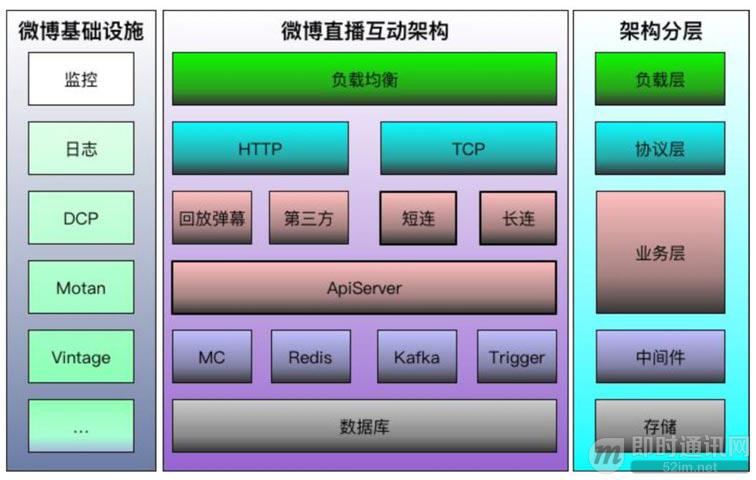
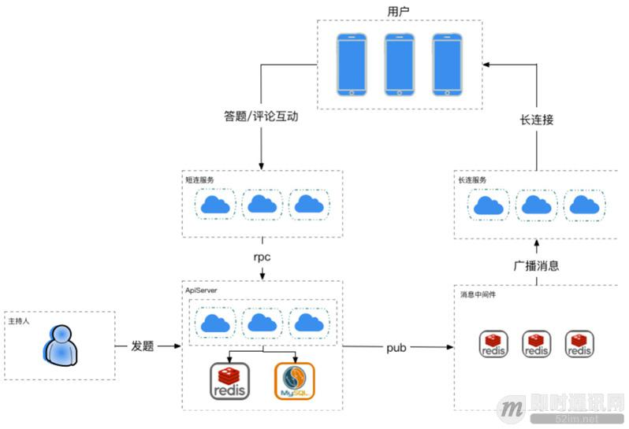
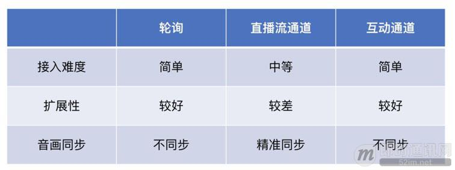
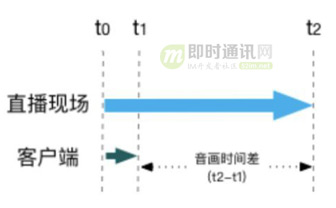
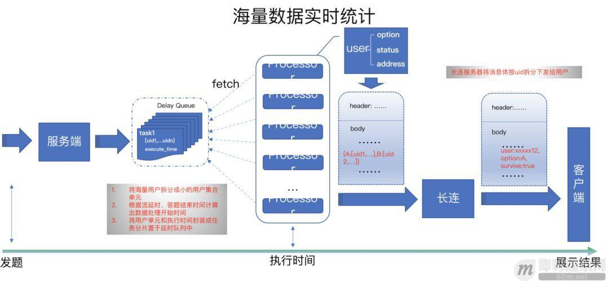
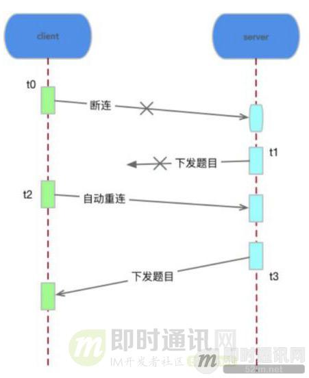
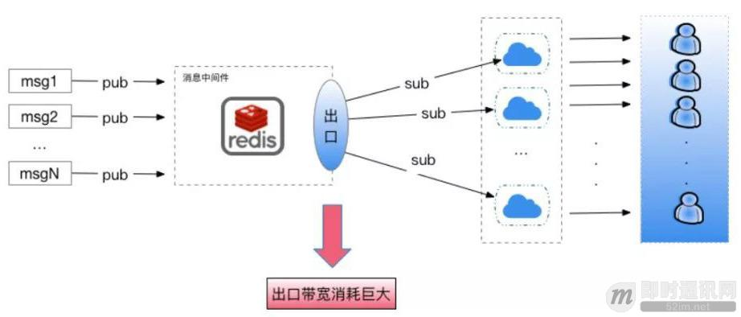

**新浪微博技术分享：微博实时直播答题的百万高并发架构实践**

## 1、概述

本文将分享新浪微博系统开发工程师陈浩在 [RTC 2018 实时互联网大会](http://www.52im.net/article-335-1.html)上的演讲。他分享了新浪微博直播互动答题架构设计的实战经验。其背后的百万高并发实时架构，值得借鉴并用于未来更多场景中。本文正文是对演讲内容的整理，请继续往下阅读。

**另外，即时通讯网整理的直播答题相关文章有：**

- 《[近期大热的实时直播答题系统的实现思路与技术难点分享](http://www.52im.net/thread-1369-1-1.html)》
- 《[2018新“风口”——直播答题应用原理解析](http://www.52im.net/thread-1378-1-1.html)》

新浪微博团队分享的：《[新浪微博技术分享：微博短视频服务的优化实践之路](http://www.52im.net/thread-1843-1-1.html)》一文，您也可能感兴趣。

## 2、什么是直播答题

首先，如下图所示，这是一个传统的直播页面。它的主页面是直播的音视频流，下面显示的是消息互动，包括评论、点赞和分享。什么是直播答题呢？

直播答题其实本质上还是一个直播的场景，只是引入了答题的互动方式。主持人可以通过口令控制客户端的行为，比如控制发题。同时，直播答题通过奖金激励，带动更多用户参与进来。在每一次答题之后，会将数据实时展示出来。下图展示的是直播答题的流程，中间的部分是会重复进行的环节。

## 3、直播答题的技术挑战

直播答题的核心需求用一句话就可以概括：海量用户同时在线的场景下，确保用户的答题画面能展现，在直播过程中流畅地参与答题，最终分到奖金。

**这一句话中有三个关键点，分别对应了不同的技术要求：**

*第一个：*就是“海量用户同时在线”。海量用户带来的就是海量的数据。在这个场景下第一个用户高峰出现在活动开始前，海量的用户会在几分钟内加入房间。在直播进行中，答题的十秒倒计时内，海量用户会同时提交答案，会产生海量的答题消息，包括我们互动与题目结果的消息，所以下发、上传双向都会出现高并发。这就考验我们对海量数据高并发的处理能力。

*第二个：*关键点是“答题画面能够展示”，这是非常基础且首要的需求，因为用户参与答题，如果画面都展示不出来，那么这场游戏就没法进行下去了。每一轮答题都可能淘汰一批用户，淘汰答错题的用户是正常的，但如果是因为未能展示出答题画面而淘汰，那就是技术问题。其技术难点在于海量题目的下发成功率要有保证，给技术提出的对应要求就是服务的可靠性。

*最后一个：*是“流畅地参与答题”，这与用户体验相关，每一轮答题时间间隔很短，一旦错过一道题的答题时间，用户就没法完成这个游戏，所以要保证消息下发后，10秒内让用户收到并且正常展示。同时，每一轮答题后，主持人需要立刻看到答题数据，包括有多少用户答对，有多少用户使用了复活卡等。这给我们带来的是对海量数据进行实时下发、实时统计的挑战。

## 4、答题直播技术方案

我们基于微博直播的技术现状，设计了一个方案。如下图所示，这是我们微博直播互动的架构图。左侧是微博的基础设施服务，基本上都是自研的，比如最核心的短连使用的是自研的 wesync 协议，支持SSL，是支撑百万互动消息下发的核心服务之一。长连维护消息通道可动态扩容，海量用户同时涌入后会进行容量的计算，对我们的资源进行扩缩容。

在直播答题方案设计（下图）中，最核心的就是解决答题信令通道的选择问题。我们想到了三个方案来解决。

**方案一：轮询**

客户端不断进行请求，由服务端控制时间窗口，到时间我们开放请求，结果返回。优点是实现简单。缺点在于大量无用请求会消耗大量带宽资源，给服务端带来持续性的压力。而且，题目到达时间与音视频流到达时间难以保持一致。

**方案二：复用音视频通道**

我们可以在音视频流里面直接加入题目的信息。在主持人口令位置插入题目消息。客户端播放音视频流，收到题号数据的时候，直接把题目给展示出来。这个方案的特点就是题目展示的时间能和主持人口令一致，也就是说用户是感知不到时间差的，体验非常好。缺点是太依赖于音视频流，一旦出现网络抖动，或者直播流中断，用户可能会收不到题目，这个游戏就没法继续下去了。

**方案三：复用互动通道**

直播有音视频流通道和互动通道，题目使用互动通道独立下发。它的特点是题目下发不依赖于音视频流，它的通道是独立的，不受直播流的影响，即使直播中断了，哪怕是黑屏，我们也可以把题目的画面展示给用户。缺点也是一样，因为它并不是跟音视频在一个通道，所以它们两者时间难以保持一致。

我们从接入难度、扩展性和音视频同步三方面，对三个方案进行了对比。针对以上三个方案，我们最终使用方案三。首先要保证答题不受直播流信号的影响。我们现在微博直播现有的架构上能够支持千万级消息的下发，我们把答题信息放到互动通道下发，这是我们有能力支持的。答题和互动的上行消息由短连服务支撑，在发题以及结果展示信息的时候，我们直接通过主动推送，经过广播消息，通过长连最终发给用户。也就是说整个答题就直接采用了互动的通道，与音视频流完全隔离开来。

## 5、如何解决实时性、可靠性与高并发？

针对实时性、可靠性和高并发，三个典型的问题，我们也有不同的解决方法。

实时性问题主要体现在两方面，一个是答题画面的实时展现，另一个是海量数据的实时统计。

### 5.1答题画面的实时展现

直播流经过采编设备发给用户客户端是有延时的，中间经过编解码，到达客户端的时间和主持人发出口令时间，有一个时间间隔。我们采用互动通道的时候，这两个时间我们是不容易做同步的。客户端收到题目和视频流最终到达的时间会出现不一致的情况。

我们看下图，当主持人 T0 时间发题，用户在 T2 时间有可能才收到这个视频流。如果我们 T0 的时间进行发题，在 T1 的时间题目就到用户客户端了。问题在于我们如何抹去 T2-T1 的时间差。对于用户体验来说，我们在 T1 把题目画面展示出来，在下一秒才能听到主持人说“请听题”，这体验肯定不好。

我们的处理方式是在音视频每隔一帧，或者一定帧数内，插入服务器的时间戳。同时，我们在下发的消息体内也埋入服务器的时间戳。客户端播放音视频流的时候，到达相应的时间戳时，把跟这个时间戳相匹配的消息在页面上渲染出来，也就是展示出了答题的画面。通过使用统一时间戳进行对标，就抹平了视频与题目的时间差。

### 5.2海量用户数据实时统计

我们每一轮答题结束的时候，都要统计用户的答题状态，比如用户答案是否正确，用户是否复活，以及他是否有复活卡。当这些逻辑都放在一起需要处理，并且又是在一个海量数据场景下时，就变得非常复杂了。

另一方面，每一轮的答题只有发题和展示答案两个指令。主持人在发题时会说题目是什么，最终说出结果是什么。没有单独指令触发告诉服务器端什么时候进行数据处理。而且，海量数据需要得到快速的计算。

把海量用户产生的海量数据一次性的获取出来，这是不现实的，耗费资源相当巨大，所以我们的思路就是化整为零，做并行处理。

首先，当发题指令到达服务端的时候，我们按照一定的规则对用户进行细粒度的拆分。同时根据倒计时和流延时等等时间综合考虑，能够计算出我们什么时候才能开始进行数据处理。然后将刚才做好的用户分片，封装成任务分片，放在延时队列当中。到达这个执行时间的时候，由我们处理机的机群拉取这个任务，只有在执行时间才会去处理这个任务，不会出现用户答案没有提交上来，我们就开始计算了。所以不会有将一部分用户漏掉的状况。

处理机拉到用户的任务分片时，根据用户选择、状态，以及长连的地址，我们对用户的消息整合。因为有海量的用户，所以体量巨大，但是答案选择往往只有 A、B、C、D 四种，针对答案我们可以做一个分组，比如选 A 用户有多少，选 B 用户有多少。我们把单独消息进行合并，选A的用户做为一个集合。

也就是说这一个消息体其实包含了很多用户的消息，从消息体量上，我们进行降量，把小的消息合成成一个消息体，把一个消息体发给我们长连接的服务，长连接收到这个消息体的时候再进行拆分。它类似于消息的一个包，我们把它按照用户的维度进行拆分，比如用户选择了什么答案，它是否使用过复活卡，以及它的状态，进行拆分后，最终下发给用户。这样在前面进行拆，在后面进行合，合完之后再拆一遍，这是我们解决海量数据实时计算的思路。

### 5.3海量题目下发的可靠性

刚才我们提到，用户如果在弱网情况下发生丢包，我们推送的消息有可能他没法收到，他一旦收不到消息，整个答题没有办法进行，有可能导致他在这一轮就被淘汰了。我们的解决方案是实现更稳定更快速的自动重连。虽然用户的网络环境是我们没有办法去保证的，但我们可以更快速发现他和我们长连服务器断连，并进行更快速的重连。

同时，在答题倒计时内我们无条件对题目消息进行重传。例如我们 T0 的时候发现用户断连，他在 T1 的时候，下发的题目收不到，然后我们在 T2 进行重连，在 T3 进行无条件重传的时候保证他收到这个题目。我们在消息体埋了一个最迟的展现时间，到这个时间后客户端一定会把题目展示出来，保证他就算直播流断了，我们也可以正常答题。面对黑屏的场景我们也可以完成答题的游戏。

### 5.4高并发提交答案

每道题目下发后有一个10秒倒计时。假设有百万用户在线，在10秒之内都可以提交完答案，用户提交答案大概集中在第3至第6秒之间，QPS 峰值预估会有30万。其次，我们保证用户答案在短时间都能提交，因为它是有时间限制的，如果我们做了削峰限流，他就会错过答题的时间窗口。所以我们不能对请求做削峰限流。

我们的解决方案就是用户请求处理快速返回时，把重逻辑往后延，前面上行请求只是保证轻逻辑，让它可以迅速返回。

同时，在资源层，我们对数据进行处理时，把用户提交的请求做一个合并，交给独立的资源池进行批量提交。我们的设计方案有一个阈值，当遇到不可控，比如负荷达到我们设计的阈值时，我们有自动随机重试的机制，保证用户把答案都可以提交上来。对于重试请求我们做针对性的时间补偿，这样保证流量达到我们负载的时候，答题请求也可以提交上来。

### 5.5海量消息下发

一条题目消息，会被复制N份后下发给用户。百万用户产生的答案消息是海量的，对于千万级消息实时下发的系统来说，订阅端的网络带宽压力也是巨大的。如下图所示，消息出口的带宽消耗非常大，因为我们是针对海量用户的连接。

我们的解决方法有两方面。第一就是针对海量消息下发，对消息进行体积上的压缩，减少消息传输的冗余。压缩消息的时候我们采用了一个私有协议，我们尽量压缩里面无用的东西，减小传输冗余，减小带宽的消耗。

第二个是消息降量，我们根据用户的答案进行分组，按照分组把这些消息进行合并，由原来的一条消息都要推送一次，转变成下发一个消息集合。同时，我们提升消息的吞吐量，采用中间件的集群，进行多端口并行的下发。

### 5.6上线前的保障

直播答题场景有一个特别明显的特征，它不像我们上线其它功能或者接口，我们可以进行灰度放量。直播答题一上线，就是全量，没有能通过灰度放量发现问题的过程。所以我们对系统服务承载能力需要有一个量化的评估。

我们的处理方式就是进行多轮压测和持续的性能优化。

首先我们做开发的时候已经开始同步压测。我们进行一些功能问题修复的时候，压测的同事可以进行做一些单接口的压测，找出接口性能的临界点。开发的同事做优化的同时，压测组模拟海量用户在线的场景，搭建压测的环境。

**总体来讲，有四轮压测：**

- 1）单机单接口压测：掌握单机性能数据；
- 2）单机综合压测：定位性能损耗点，优化业务处理逻辑；
- 3）负载均衡压测：评估负载均衡数量；
- 4）集群全链路压测：
    \- a. 搭建起压机测试集群，保证能模拟百万量级用户产生的数据量；
    \- b. 按照预估百万量级用户消耗的公网带宽配置起压机出口带宽，真实模拟线上业务场景；
    \- c. 按照预估用户量和资源消耗量对线上服务及资源集群进行扩容，对线上服务真实压测。

## 6、本文小结

简单总结一下，针对音画与题目同步的实时性问题，我们将直播流和互动通道进行对标，解决题目与音视频之间的同步问题。

针对海量消息的实时下发问题，我们通过将用户分组，把大体量的消息任务化整为零，做分布式的分批次处理。

针对可靠性的问题，我们通过完善快速自动断连重试机制，以及题目消息无条件重传，来保证弱网下的用户也能正常参与答题活动。

另外，对于高并发问题，我们将消息按照用户选项进行分组，化零为整，降低信息的推送量。同时，我们对消息结构进行了优化，从这两方面解决高并发问题。

最后，还有一个关键的核心，就是压测，通过压测我们可以快速了解上述解决方案是否有效，让我们可以持续优化解决方案