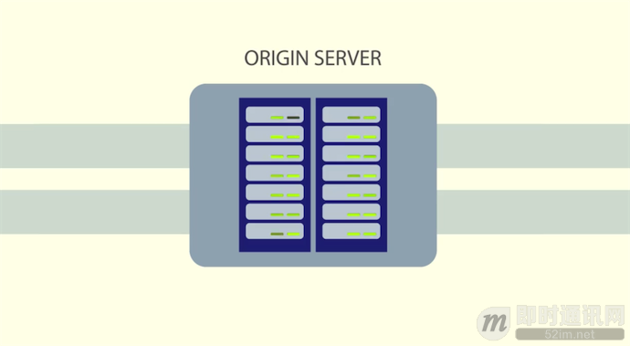
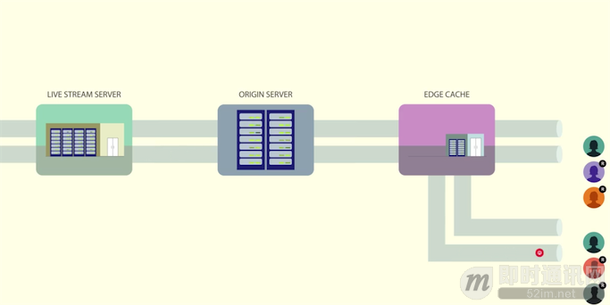

**技术揭秘：支持百万级粉丝互动的Facebook实时视频直播**

## 前言

几个月前，我们开始推出 Facebook Mentions 的 Live 功能，该功能让认证后的公众人物可以通过 Mentions 对其 Facebook上 的粉丝进行视频直播。我们在这次部署中学到了很多，并且我们已经开始测试 Facebook 用户使用的视频直播分享功能，第一步我们先从美国使用 iPhone 的这一小部分用户开始测试。

为 Facebook 构建视频直播是一项具有挑战性的大规模工程活动。在 Facebook Mentions 的 Live 功能上，我们必须解决巨大的流量峰值问题。Facebook 上的公众人物粉丝可能多达百万，这些粉丝全都想要在同一时间观看视频；我们还有一个目标，就是创造均衡负载的新办法。为了开始向更多的人推出视频直播，我们通过允许 RTMP 进行回放，从而把直播的延迟压缩到几秒钟。我们希望这些低延迟的直播会改善用户体验，让直播者和观看者之间更高的互动性。在这篇文章中，我们将粗略地看一下我们在每次发布时解决的问题，我还将向你解释我们为负载均衡和 RTMP 实现问题所选择的解决方案。

## 英文原文

本文翻译自Fackbook官方团队的博文分享，原文地址《[Under the hood: Broadcasting live video to millions](https://code.facebook.com/posts/1653074404941839/under-the-hood-broadcasting-live-video-to-millions)》。

## 解决“惊群效应”问题的思路分享

Facebook 上有一些公众人物的粉丝多达百万。这就意味着当公众人物开始视频直播时，我们需要能够处理超过一百万人同时观看直播的潜在情况，比如范·迪塞尔的现场直播就是如此。大规模系统都不喜欢流量高峰，特别是当很多请求在一瞬间一起发生时。每到这种时候，我们就说我们遇到了一个“惊群效应”问题——太多的请求可能会使系统过载，导致直播的延迟、信息丢失，以及连接断开。

可以说，防止过载的最好方法就是不让负载穿过大门。与其让客户端直接和直播流服务器连接，我们让边缘缓存（edge caches）的网络分布到全局。

在我们的实现中，一个视频直播被分割成了 3 秒的 HLS 段。显示直播的视频播放器会继续请求这些段。边缘数据中心的一个 HTTP 代理会处理段请求，该数据中心会检查这个段是否已经存在于一个边缘缓存中。如果在缓存中，它就会被返回。如果不在，代理就会向源缓存发出 HTTP 请求，而源缓存是另一个具有相同架构的缓存层。

如果段不在源缓存中，就需要向处理这个特定视频流的服务器请求。

然后服务器用段来返回 HTTP 响应，这个段就被缓存在每一层中，所以接下来客户端就会更快地收到这个段。利用这种组合，超过 98% 的段都已经存在了离用户较近的边缘缓存中，而源服务器只会收到很少部分的请求。

这个解决方案很不错，但是当你处于我们这样的规模时就会发生一些泄露——约有1.8%的请求会穿过边缘缓存。当你处理上百万个观看者时，这仍然是一个大数字。为了确保起源层不会发生故障，我们应用了一种名为请求合并的技术。

人们通常都会在不同时间观看常规的非直播视频。如果有什么东西突然爆红了，你就能看到流量高峰，所以这方面并没有分钟对分钟的平衡负载需求。但是对于视频直播来说，在事先没有通知的情况下大量的人都会在同一时间观看同一视频，这就造成了一个负载问题和一个缓存问题。人们在同一时间请求相同的视频段，而这个段可能还不在缓存中。如果没有防止惊群效应的计划，边缘缓存就会为所有客户端请求返回缓存未命中，而所有这些请求都会找到源缓存，然后进一步流向直播流服务器。这意味着一个单独的服务器会收到海量的请求。

为了防止这种情况发生，边缘缓存为第一个请求返回缓存未命中，然后把接下来的请求放进队列中。一旦 HTTP 响应从服务器回来，这个段就被存储在了边缘缓存中，而列队中的请求也会作为缓存访问而获得边缘的响应。

这种方法有效地解决了惊群效应，降低了输送给源服务器的负载。源服务器反过来也用相同的机制来处理来自多个边缘缓存的请求——相同的对象既可以从芝加哥的边缘缓存中请求，也可以从迈阿密的边缘缓存中请求。

## 如何降低视频延迟

为 Facebook Mentions 构建 Live 功能是一种确保系统不过载的活动，而为用户构建 Live 是一种降低延迟的活动。非公众人物更有可能向一小群交互性很强的人进行直播。我们的头等大事就是，让人们拥有接近于实时效果的对话，没有尴尬的数据传输延迟。为了把延迟压缩到 2 到 3 秒的传输内，我们决定使用 RTMP。

RTMP 是一种在整个直播过程中维护播放器和服务器之间持久的 TCP 连接的流协议。和 HLS 有所不同，RTMP 使用的是推模型。与其向播放器请求每个段，还不如让服务器持续发送视频和音频数据。当人们发出暂停和继续的请求或播放器不可见时，客户端仍然可以发出这些指令。

在 RTMP 中，直播被分成了两个流：一个视频流和一个音频流。这些流被分解成了 4KB 的区块，这些块可以在 TCP 连接中被多路复用，即视频和音频块被交叉存取。当视频比特率达到 500Kbps 时，和每个 HLS 段的 3 秒时长相比，每个块只有 64ms，它让穿过所有组件的流都更加顺畅。只要编码了 64ms 的视频数据，直播者就可以发送数据；转码服务器可以处理这个区块并且生成多种输出比特率。区块随后通过代理被转递出去，直到到达播放器。

推模型加上小区块减少了 80% 的直播者和观看者之间的延迟，产生了顺畅并且交互的体验。大部分直播流产品使用 HLS 是因为它基于 HTTP 而且容易和所有现存的 CDN 进行整合。但是我们想要实现最佳的直播流产品，所以我们决定通过修改 nginx-rtmp 并且开发一个 RTMP 代理来实现 RTMP。从 HLS 路径上得到教训让我们实现了一个可以有效扩展到几百万直播者的 RTMP 架构。

## 继续向前

关于 Facebook Mentions 的 Live 功能我们已经获得了很多不错的反馈，我们很高兴能看到人们对于这个直播新功能的想法。如果你有任何关于我们如何构建 Live 的问题，请在 Facebook Engineering 的网页上跟我们取得联系。

感谢工程师、PM，以及所有其他让这一切成为可能的团队成员。