**移动端实时视频直播技术实践：如何做到实时秒开、流畅不卡**

## 前言

现今移动直播技术上的挑战要远远难于传统设备或电脑直播，其完整的处理环节包括但不限于：音视频采集、美颜/滤镜/特效处理、编码、封包、推流、转码、分发、解码/渲染/播放等。

**移动端实时音视频直播常见的问题包括：**

- 主播在不稳定的网络环境下如何稳定推流？
- 偏远地区的观众如何高清流畅观看直播？
- 直播卡顿时如何智能切换线路？
- 如何精确度量直播质量指标并实时调整？
- 移动设备上不同的芯片平台如何高性能编码和渲染视频？
- 美颜等滤镜特效处理怎么做？
- 如何实现播放秒开？
- 如何保障直播持续播放流畅不卡顿？

本次分享将为大家揭开移动端实时音视频直播核心技术的神秘面纱。

## 分享者

**徐立**，七牛创始合伙人兼产品副总裁。

负责七牛直播云的整体研发，是国内 Go / Docker / Container 技术早期布道者，
Go / Containers / Distributed Systems 技术的忠实爱好者和实践者。
曾合著国内第一本 Go 语言图书《Go 语言编程》，翻译《Go 语言程序设计》。

## 有关音视频、直播的必备基础知识

### 1什么是视频？

首先我们需要理解一个最基本的概念：视频。从感性的角度来看，视频就是一部充满趣味的影片，可以是电影，可以是短片，是一连贯的视觉冲击力表现丰富的画面和音频。但从理性的角度来看，视频是一种有结构的数据，用工程的语言解释，我们可以把视频剖析成如下结构：

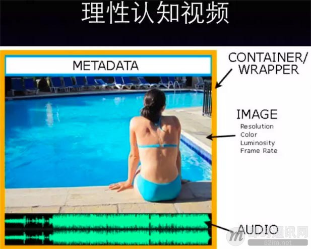

**内容元素 ( Content )：**

- 图像 ( Image )
- 音频 ( Audio )
- 元信息 ( Metadata )

**编码格式 ( Codec )：**

- Video : H.264，H.265, …
- Audio : AAC， HE-AAC, …

**容器封装 (Container)：**
MP4，MOV，FLV，RM，RMVB，AVI，…

**任何一个视频 Video 文件，从结构上讲，都是这样一种组成方式：**

- 由图像和音频构成最基本的内容元素；
- 图像经过视频编码压缩格式处理（通常是 H.264）；
- 音频经过音频编码压缩格式处理（例如 AAC）；
- 注明相应的元信息（Metadata）。

最后经过一遍容器（Container）封装打包（例如 MP4），构成一个完整的视频文件。

如果觉得难以理解，可以想象成一瓶番茄酱。最外层的瓶子好比这个容器封装（Container），瓶子上注明的原材料和加工厂地等信息好比元信息（Metadata），瓶盖打开（解封装）后，番茄酱本身好比经过压缩处理过后的编码内容，番茄和调料加工成番茄酱的过程就好比编码（Codec），而原材料番茄和调料则好比最原本的内容元素（Content）。

### 2视频的实时传输

简而言之，理性的认知视频的结构后，有助于我们理解视频直播。如果视频是一种“有结构的数据”，那么视频直播无疑是实时传输这种“有结构的数据”（视频）的方式。

那么一个显而易见的问题是：如何实时（Real-Time）传输这种“有结构的数据”（视频）呢？

这里边一个悖论是：一个经过容器（Container）封装后的视频，一定是不可变的 ( Immutable ) 视频文件，不可变的 ( Immutable ) 的视频文件已经是一个生产结果，根据“相对论”，而这个生产结果显然不可能精确到实时的程度，它已经是一段时空的记忆。

因此视频直播，一定是一个 “边生产，边传输，边消费”的过程。这意味着，我们需要更近一步了解视频从原始的内容元素 ( 图像和音频 ) 到成品 ( 视频文件 ) 之前的中间过程 ( 编码 )。

### 3视频编码压缩

不妨让我们来深入浅出理解视频编码压缩技术。

为了便于视频内容的存储和传输，通常需要减少视频内容的体积，也就是需要将原始的内容元素(图像和音频)经过压缩，压缩算法也简称编码格式。例如视频里边的原始图像数据会采用 H.264 编码格式进行压缩，音频采样数据会采用 AAC 编码格式进行压缩。

视频内容经过编码压缩后，确实有利于存储和传输; 不过当要观看播放时，相应地也需要解码过程。因此编码和解码之间，显然需要约定一种编码器和解码器都可以理解的约定。就视频图像编码和解码而言，这种约定很简单：编码器将多张图像进行编码后生产成一段一段的 GOP ( Group of Pictures ) ， 解码器在播放时则是读取一段一段的 GOP 进行解码后读取画面再渲染显示。

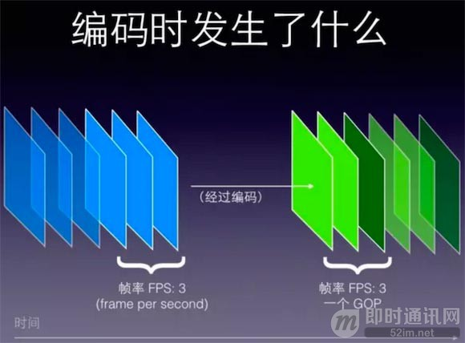

GOP ( Group of Pictures ) 是一组连续的画面，由一张 I 帧和数张 B / P 帧组成，是视频图像编码器和解码器存取的基本单位，它的排列顺序将会一直重复到影像结束。

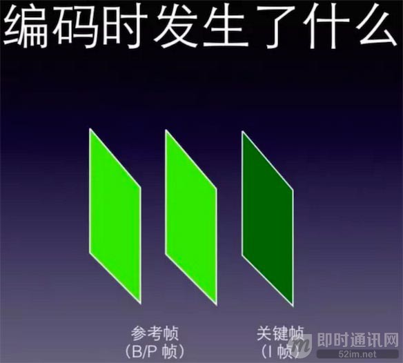

I 帧是内部编码帧（也称为关键帧），P 帧是前向预测帧（前向参考帧），B 帧是双向内插帧（双向参考帧）。简单地讲，I 帧是一个完整的画面，而 P 帧和 B 帧记录的是相对于 I 帧的变化。

如果没有 I 帧，P 帧和 B 帧就无法解码。

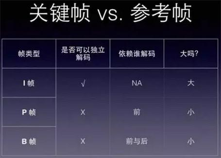

小结一下，一个视频 ( Video ) ，其图像部分的数据是一组 GOP 的集合, 而单个 GOP 则是一组 I / P / B 帧图像的集合。在这样的一种几何关系中，Video 好比一个 “物体”，GOP 好比 “分子”，I / P / B 帧的图像则好比 “原子”。想象一下，如果我们把传输一个 “物体”，改成传输一个一个的 “原子”，将最小颗粒以光速传送，那么以人的生物肉眼来感知，将是一种怎样的体验？

### 4什么是视频直播？

不难脑洞大开一下，直播就是这样的一种体验。视频直播技术，就是将视频内容的最小颗粒 ( I / P / B 帧，…)，基于时间序列，以光速进行传送的一种技术。

简而言之，直播就是将每一帧数据 ( Video / Audio / Data Frame )，打上时序标签 ( Timestamp ) 后进行流式传输的过程。发送端源源不断的采集音视频数据，经过编码、封包、推流，再经过中继分发网络进行扩散传播，播放端再源源不断地下载数据并按时序进行解码播放。如此就实现了 “边生产、边传输、边消费” 的直播过程。

理解以上两个关于 视频 和 直播 两个基础概念后，接下来我们就可以一窥直播的业务逻辑了。

### 5直播的业务逻辑

**如下是一个最精简的一对多直播业务模型，以及各个层级之间的协议：**

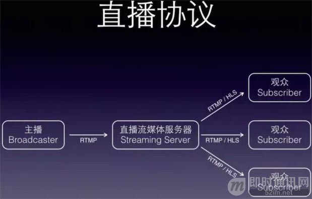

**各协议差异对比如下：**

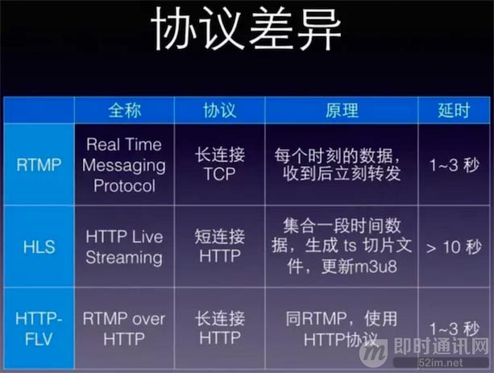

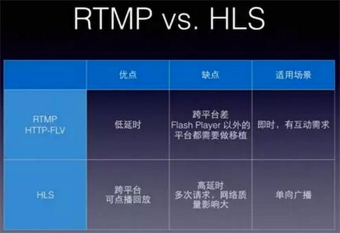

以上就是关于直播技术的一些基础概念。下面我们进一步了解下影响人们视觉体验的直播性能指标。

## 影响视觉体验的直播性能指标

### 1指标一：延迟

**直播第一个性能指标是延迟**，延迟是数据从信息源发送到目的地所需的时间。

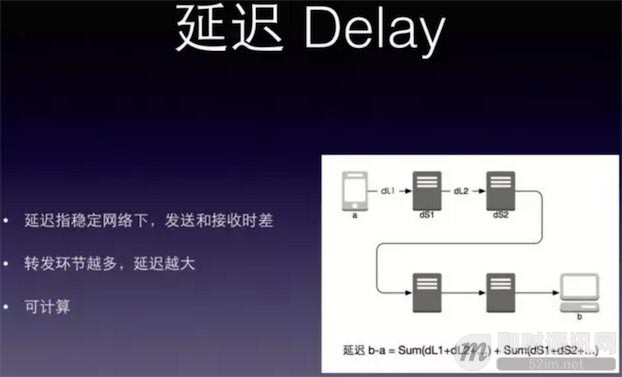

根据爱因斯坦的狭义相对论，光速是所有能量、物质和信息运动所能达到的最高速度，这个结论给传播速度设定了上限。因此，即便我们肉眼感觉到的实时，实际上也是有一定的延迟。

由于 RTMP/HLS 是基于 TCP 之上的应用层协议，TCP 三次握手，四次挥手，慢启动过程中的每一次往返来回，都会加上一次往返耗时 ( RTT )，这些交互过程都会增加延迟。

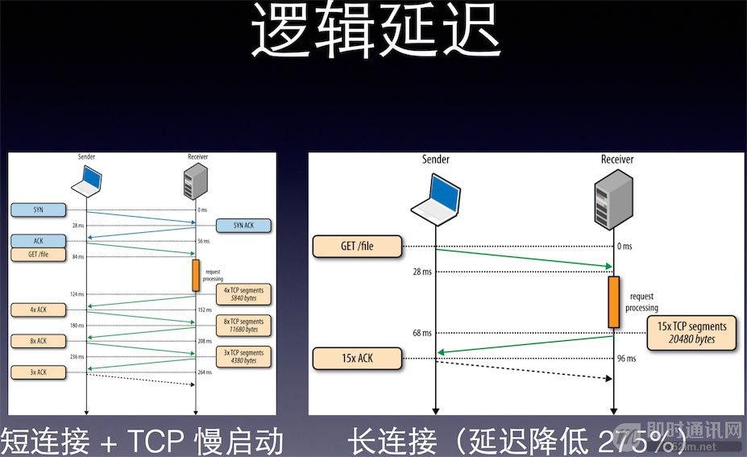

其次根据 TCP 丢包重传特性，网络抖动可能导致丢包重传，也会间接导致延迟加大。

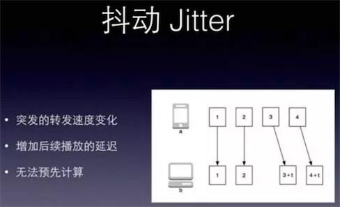

一个完整的直播过程，包括但不限于以下环节：采集、处理、编码、封包、推流、传输、转码、分发、拉流、解码、播放。从推流到播放，再经过中间转发环节，延迟越低，则用户体验越好。

### 2指标二：卡顿

**第二个直播性能指标卡顿**，是指视频播放过程中出现画面滞帧，让人们明显感觉到“卡”。单位时间内的播放卡顿次数统计称之为卡顿率。

造成卡顿的因素有可能是推流端发送数据中断，也有可能是公网传输拥塞或网络抖动异常，也有可能是终端设备的解码性能太差。卡顿频次越少或没有，则说明用户体验越好。

### 3指标三：首屏耗时

**第三个直播性能指标首屏耗时**，指第一次点击播放后，肉眼看到画面所等待的时间。技术上指播放器解码第一帧渲染显示画面所花的耗时。通常说的 “秒开”，指点击播放后，一秒内即可看到播放画面。首屏打开越快，说明用户体验越好。

如上三个直播性能指标，分别对应一个低延迟、高清流畅、极速秒开 的用户体验诉求。了解这三个性能指标，对优化移动直播 APP 的用户体验至关重要。

那么移动直播场景下具体而言有哪些常见的坑呢？根据实践总结下来的经验，移动平台上视频直播的坑主要可以总结为两方面：设备差异，以及网络环境这些场景下带来的技术考验。

## 移动直播场景的坑与规避措施

### 1不同芯片平台上的编码差异

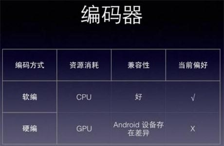

iOS 平台上无论硬编还是软编，由于是 Apple 一家公司出厂，几乎不存在因为芯片平台不同而导致的编码差异。

然而，在 Android 平台上，Android Framework SDK 提供的 MediaCodec 编码器，在不同的芯片平台上，差异表现很大， 不同的厂家使用不同的芯片，而不同的芯片平台上 Android MediaCodec 表现略有差异，通常实现全平台兼容的成本不低。

另外就是 Android MediaCodec 硬编层面的 H.264 编码画质参数是固定的 baseline，所以画质通常也一般。因此，在 Android 平台下，推荐是用软编，好处是画质可调控，兼容性也更好。

### 2低端设备如何上高性能地采集和编码？

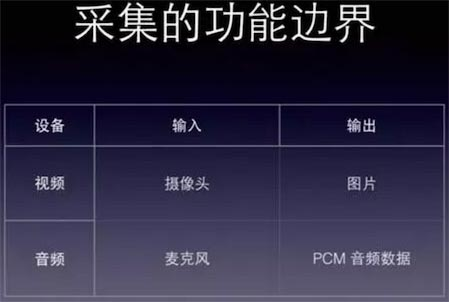

例如 Camera 采集输出的可能是图片，一张图的体积并不会小，如果采集的频次很高，编码的帧率很高，每张图都经过编码器，那么编码器又可能会出现过载。这个时候，可以考虑在编码前，不影响画质的前提下（前面我们讲过帧率的微观意义），进行选择性丢帧，以此降低编码环节的功耗开销。

### 3弱网下如何保障高清流畅推流

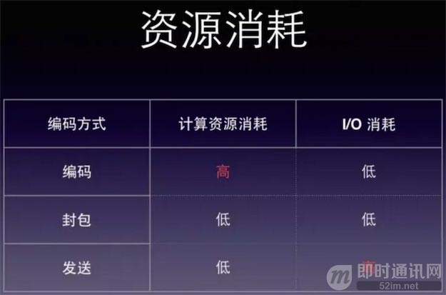

移动网络下，通常容易遇到网络不稳定，连接被重置，断线重连，一方面频繁重连，建立连接需要开销。另一方面尤其是发生 GPRS / 2G / 3G / 4G 切换时，带宽可能出现瓶颈。当带宽不够，帧率较高/码率较高的内容较难发送出去，这个时候就需要可变码率支持。

即在推流端，可检测网络状态和简单测速，动态来切换码率，以保障网络切换时的推流流畅。

其次编码、封包、推流 这一部分的逻辑也可以做微调，可以尝试选择性丢帧，比如优先丢视频参考帧（不丢 I 帧和音频帧 )，这样也可以减少要传输的数据内容，但同时又达到了不影响画质和版视听流畅的目的。

### 4需要区分直播流的状态和业务状态

直播是媒体流、APP 的交互是 API 信令流，两者的状态不能混为一谈。尤其是不能基于 APP 的交互的 API 状态来判断直播流的状态。

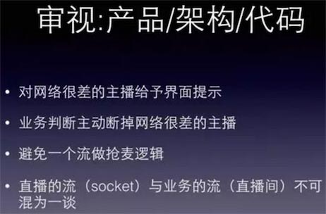

以上是移动直播场景下常见的几个坑和规避措施。

## 移动直播场景其他优化措施

### 1怎么优化打开速度，达到传说中的 “秒开”？

大家可能会看到，市面上某些手机直播 APP 的打开速度非常快，一点就开。而某些手机直播 APP，点击播放后要等好几秒以后才能播放。是什么原因导致如此的天壤之别呢？

大部分播放器都是拿到一个完成的 GOP 后才能解码播放，基于 FFmpeg 移植的播放器甚至需要等待音画时间戳同步后才能播放（如果一个直播里边没有音频只有视频相当于要等待音频超时后才能播放画面）。“秒开”可以从以下几个方面考虑。

**优化措施一：改写播放器逻辑让播放器拿到第一个关键帧后就给予显示**

GOP 的第一帧通常都是关键帧，由于加载的数据较少，可以达到 “首帧秒开”。如果直播服务器支持 GOP 缓存，意味着播放器在和服务器建立连接后可立即拿到数据，从而省却跨地域和跨运营商的回源传输时间。

GOP 体现了关键帧的周期，也就是两个关键帧之间的距离，即一个帧组的最大帧数。假设一个视频的恒定帧率是 24fps（即1秒24帧图像），关键帧周期为 2s，那么一个 GOP 就是 48 张图像。一般而言，每一秒视频至少需要使用一个关键帧。

增加关键帧个数可改善画质（GOP 通常为 FPS 的倍数），但是同时增加了带宽和网络负载。这意味着，客户端播放器下载一个 GOP，毕竟该 GOP 存在一定的数据体积，如果播放端网络不佳，有可能不是能够快速在秒级以内下载完该 GOP，进而影响观感体验。

如果不能更改播放器行为逻辑为首帧秒开，直播服务器也可以做一些取巧处理，比如从缓存 GOP 改成缓存双关键帧（减少图像数量），这样可以极大程度地减少播放器加载 GOP 要传输的内容体积。

**优化措施二：在 APP 业务逻辑层面方面优化**

比如提前做好 DNS 解析（省却几十毫秒），和提前做好测速选线（择取最优线路）。经过这样的预处理后，在点击播放按钮时，将极大提高下载性能。一方面，可以围绕传输层面做性能优化；另一方面，可以围绕客户播放行为做业务逻辑优化。两者可以有效的互为补充，作为秒开的优化空间。

### 2美颜等滤镜如何处理？

在手机直播场景下，这就是一个刚需。没有美颜功能的手机直播 APP，主播基本不爱用。可以在采集画面后，将数据送给编码器之前，将数据源回调给滤镜处理程序，原始数据经过滤镜处理完后，再送回给编码器进行编码即可。

除了移动端可以做体验优化之外，直播流媒体服务端架构也可以降低延迟。例如收流服务器主动推送 GOP 至边缘节点，边缘节点缓存 GOP，播放端则可以快速加载，减少回源延迟。

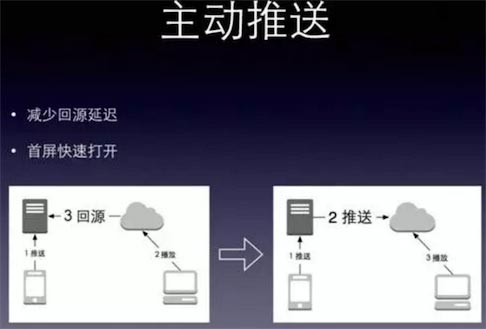

其次，可以贴近终端就近处理和分发。

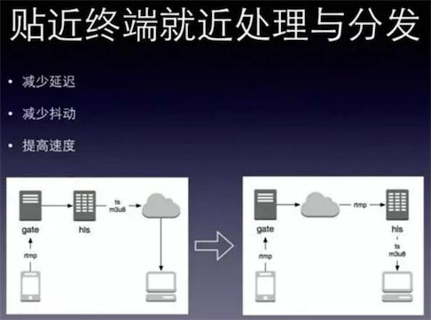

### 3如何保障直播持续播放流畅不卡顿？

“秒开”解决的是直播首次加载的播放体验，如何保障直播持续播放过程中的画面和声音视听流畅呢？因为，一个直播毕竟不是一个 HTTP 一样的一次性请求，而是一个 Socket 层面的长连接维持，直到直到主播主动终止推流。

**上述我们讲过卡顿的定义：**即播放时画面滞帧，触发了人们的视觉感受。在不考虑终端设备性能差异的情况下，针对网络传输层面的原因，我们看看如何保障一个持续的直播不卡顿。

这其实是一个直播过程中传输网络不可靠时的容错问题。例如，播放端临时断网了，但又快速恢复了，针对这种场景，播放端如果不做容错处理，很难不出现黑屏或是重新加载播放的现象。

为了容忍这种网络错误，并达到让终端用户无感知，客户端播放器可以考虑构建一个FIFO（先进先出）的缓冲队列，解码器从播放缓存队列读取数据，缓存队列从直播服务器源源不断的下载数据。通常，缓存队列的容量是以时间为单位（比如3s），在播放端网络不可靠时，客户端缓存区可以起到“断网无感”的过渡作用。

显然，这只是一个“缓兵之计”，如果直播服务器边缘节点出现故障，而此时客户端播放器又是长连接，在无法收到对端的连接断开信号，客户端的缓冲区容量再大也不管用了，这个时候就需要结合客户端业务逻辑来做调度。

重要的是客户端结合服务端，可以做精准调度。在初始化直播推流之前，例如基于 IP 地理位置和运营商的精确调度，分配线路质量最优的边缘接入节点。在直播推流的过程中，可以实时监测帧率反馈等质量数据，基于直播流的质量动态调整线路。

## 热门问答整理

**1. 关键帧设置频率一般是多少？有没有根据接入动态设置？过长首屏秒会很难做到。**
**徐立：**关键帧间隔越长，也就是 GOP 越长，理论上画面越高清。但是生成 HLS 直播时，最小切割粒度也是一个 GOP，所以针对交互直播，通常不建议 GOP 设置太长。直播一般 2 个关键帧间隔即可。比如帧率是 24fps， 那么 2 个关键帧的间隔就是 48fps ，这个 GOP 就是2s。

**2. 七牛这个直播是用的网宿加速？有遇到什么坑没？**
**徐立：**七牛在直播方面主要是自建节点，也支持融合众多第三方 CDN 服务商，多样化的线路组合为客户提供更优质的服务。在和第三方 CDN 合作的过程中遇到的问题等有机会再做更细粒度的交流和分享。

**3. RTMP 直播流除了优化线路外，还有什么加速手段吗？**
**徐立：**物理上优化线路，逻辑上优化策略，比如选择性丢帧，不影响编码画质的前提下减轻传输体积。

**4. OBS 推流，播放端 HLS 出现视/音频不同步是哪个环节的问题？怎么优化？**
**徐立：**有可能是采集端的问题，如果是采集端编码环节就出现音画不同步，可以在收流服务器上做音画时间戳同步，这样是全局的校对。如果是播放端解码性能问题，那么需要调节播放逻辑，比如保证音画时间戳强一致性的前提下，选择性丢一部帧。

**5. PPT 前几页中一个概念好像错了，I 帧不是关键帧，IDR 帧才是。IDR 帧是 I 帧，但是 I 帧不一定是 IDR 帧。只有 IDR 帧才是可重入的。**
**徐立：**中文都把 I 帧翻译成关键帧了，不过既然提到了 IDR 帧，可以展开说明一下。所有的 IDR 帧都是 I 帧，但是并不是所有 I 帧都是 IDR 帧，IDR 帧是 I 帧的子集。I 帧严格定义是帧内编码帧，由于是一个全帧压缩编码帧，通常用 I 帧表示 “关键帧”。IDR 是基于 I 帧的一个 “扩展”，带了控制逻辑，IDR 图像都是 I 帧图像，当解码器解码到 IDR 图像时，会立即将参考帧队列清空，将已解码的数据全部输出或抛弃。重新查找参数集，开始一个新的序列。这样如果前一个序列出现重大错误，在这里可以获得重新同步的机会。IDR 图像之后的图像永远不会使用 IDR 之前的图像的数据来解码。

**6. 有没有调研过 nginx rtmp module，为什么没有用，对它有什么评价？**
**徐立：**有调研过，nginx_rtmp_module 是单进程多线程，非 go 这种轻量级线程/协程用并发自然语义的方式编写流业务。nginx 原本的代码量较大（约 16 万行，但和直播业务相关的功能并不是很多）。且主要靠写 nginx.conf 做配置租户，通常单租户可以，但业务可扩展性方面不是很灵活，可满足基本需求，不满足高级功能。

**7. 用到了那些开源软件？编码用的是 x264 吗？直播服务器你们自己开发还是开源的？**
**徐立：**直播服务器用 go 开发的，移动端编码优先硬编，软编用 x264

**8. 请教一下用 OBS 推流到 nginx_rtmp_module 的时候是已经做了视频压缩了还是需要基于 OBS 再开发？**
**徐立：**OBS 把编码压缩都做了，不需要再开发。

**9. 视频直播想在 HLS 流中无缝插入一段广告的 ts 文件，有问题想请教一下：1、这段 ts 的分辨率是否一定要和之前的视频流一致？2、pts 时间戳是否要和上一个 ts 递增？**
**徐立：**1、可以不一致。这种情况两段视频完全是独立状态，可以没有任何关系，只需要插入 discontinue 标记，播放器在识别到这个标记之后重置解码器参数就可以无缝播放，画面会很平滑的切换。2、不需要递增。举个例子，视频 A 正在直播，播放到 pts 在 5s 的时候，插入一个视频 B，需要先插入一个 discontinue，再插入 B，等 B 播放完之后，再插入一个 discontinue，再插入 A，这个时候 A 的 pts 可以和之前递增，也可以按照中间插入的 B 的时长做偏移，一般做点播和时移的时候 pts 会连续递增，直播的话会算上 B 的时长。