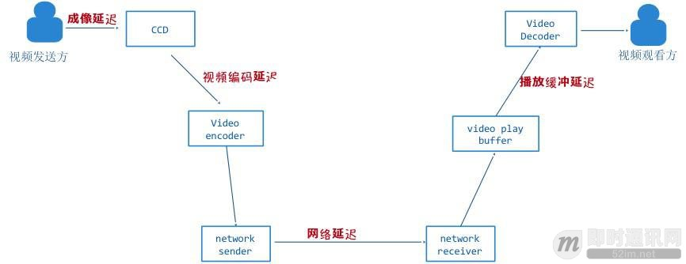
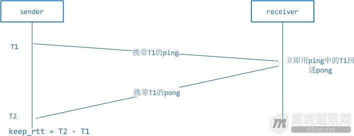
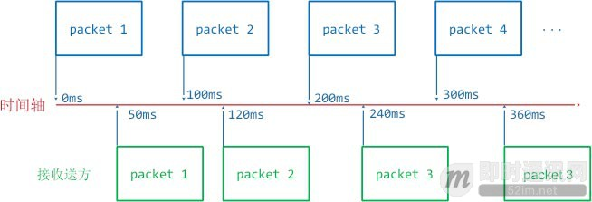
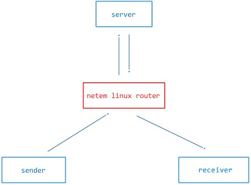

**实现延迟低于500毫秒的1080P实时音视频直播的实践分享**

## 1、前言

实时视频直播是很多技术团队及架构师关注的问题，在实时性方面，大部分直播是准实时的——存在 1-3 秒延迟。本文由袁荣喜分享其将1080P高清实时视屏直播延迟控制在 500ms 的背后的技术挑战以及实践结论等，期待与各同行共同讨论、学习和进步。

## 2、本文作者

**袁荣喜**

学霸君工程师。
2015 年加入学霸君，负责学霸君的网络实时传输和分布式系统的架构设计和实现。
专注于基础技术领域，在网络传输、数据库内核、分布式系统和并发编程方面有一定了解。

## 3、内容概述

最近由于公司业务关系，需要一个在公网上能实时互动超清视频的架构和技术方案。众所周知，视频直播用 CDN + RTMP 就可以满足绝大部分视频直播业务，我们也接触了和测试了几家 CDN 提供的方案，单人直播没有问题，一旦涉及到多人互动延迟非常大，无法进行正常的互动交谈。对于我们做在线教育的企业来说没有互动的直播是毫无意义的，所以我们决定自己来构建一个超清晰（1080P）实时视频的传输方案。

先来解释下什么是实时视频，实时视频就是视频图像从产生到消费完成整个过程人感觉不到延迟，只要符合这个要求的视频业务都可以称为实时视频。

**关于视频的实时性归纳为三个等级：**

- 伪实时：视频消费延迟超过 3 秒，单向观看实时，通用架构是 CDN + RTMP + HLS，现在基本上所有的直播都是这类技术。
- 准实时： 视频消费延迟 1 ~ 3 秒，能进行双方互动但互动有障碍。有些直播网站通过 TCP/UDP + FLV 已经实现了这类技术，YY 直播属于这类技术。
- 真实时：视频消费延迟 < 1秒，平均 500 毫秒。这类技术是真正的实时技术，人和人交谈没有明显延迟感。QQ、微信、Skype 和 WebRTC 等都已经实现了这类技术。

市面上大部分真实时视频都是 480P 或者 480P 以下的实时传输方案，用于在线教育和线上教学有一定困难，而且有时候流畅度是个很大的问题。在实现超清晰实时视频我们做了大量尝试性的研究和探索，在这里会把大部分细节分享出来。

## 4、缩短视频直播延迟从何入手？

要实时就要缩短延迟，要缩短延迟就要知道延迟是怎么产生的，视频从产生、编码、传输到最后播放消费，各个环节都会产生延迟，**总体归纳为下图：**

**成像延迟**：一般的技术是毫无为力的，涉及到 CCD 相关的硬件，现在市面上最好的 CCD，一秒钟 50 帧，成像延迟也在 20 毫秒左右，一般的 CCD 只有 20 ~ 25 帧左右，成像延迟 40 ~ 50 毫秒。

**编码延迟**：和编码器有关系，在接下来的小结介绍，一般优化的空间比较小。

我们着重针对网络延迟和播放缓冲延迟来进行设计，在介绍整个技术细节之前先来了解下视频编码和网络传输相关的知识和特点。

## 5、视频编码那些事

我们知道从 CCD 采集到的图像格式一般的 RGB 格式的（BMP），这种格式的存储空间非常大，它是用三个字节描述一个像素的颜色值，如果是 1080P 分辨率的图像空间：1920 x 1080 x 3 = 6MB，就算转换成 JPG 也有近 200KB，如果是每秒 12 帧用 JPG 也需要近 2.4MB/S 的带宽，这带宽在公网上传输是无法接受的。

视频编码器就是为了解决这个问题的，它会根据前后图像的变化做运动检测，通过各种压缩把变化的发送到对方，1080P 进行过 H.264 编码后带宽也就在 200KB/S ~ 300KB/S 左右。在我们的技术方案里面我们采用 H.264 作为默认编码器（也在研究 H.265）。

### 1H.264 编码

前面提到视频编码器会根据图像的前后变化进行选择性压缩，因为刚开始接收端是没有收到任何图像，那么编码器在开始压缩的视频时需要做个全量压缩，这个全量压缩在 H.264 中 I 帧，后面的视频图像根据这个I帧来做增量压缩，这些增量压缩帧叫做 P 帧，H.264 为了防止丢包和减小带宽还引入一种双向预测编码的 B 帧，B 帧以前面的 I 或 P 帧和后面的 P 帧为参考帧。H.264 为了防止中间 P 帧丢失视频图像会一直错误它引入分组序列（GOP）编码，也就是隔一段时间发一个全量 I 帧，上一个 I 帧与下一个 I 帧之间为一个分组 GOP。

**它们之间的关系如下图：**

PS：在实时视频当中最好不要加入 B 帧，因为 B 帧是双向预测，需要根据后面的视频帧来编码，这会增大编解码延迟。

### 2马赛克、卡顿和秒开

前面提到如果 GOP 分组中的P帧丢失会造成解码端的图像发生错误,其实这个错误表现出来的就是马赛克。因为中间连续的运动信息丢失了，H.264 在解码的时候会根据前面的参考帧来补齐，但是补齐的并不是真正的运动变化后的数据，这样就会出现颜色色差的问题，这就是所谓的马赛克现象，如图：

这种现象不是我们想看到的。为了避免这类问题的发生，一般如果发现 P 帧或者 I 帧丢失，就不显示本 GOP 内的所有帧，直到下一个 I 帧来后重新刷新图像。但是 I 帧是按照帧周期来的，需要一个比较长的时间周期，如果在下一个 I 帧来之前不显示后来的图像，那么视频就静止不动了，这就是出现了所谓的卡顿现象。如果连续丢失的视频帧太多造成解码器无帧可解，也会造成严重的卡顿现象。视频解码端的卡顿现象和马赛克现象都是因为丢帧引起的，最好的办法就是让帧尽量不丢。

知道 H.264 的原理和分组编码技术后所谓的秒开技术就比较简单了，只要发送方从最近一个 GOP 的 I 帧开发发送给接收方，接收方就可以正常解码完成的图像并立即显示。但这会在视频连接开始的时候多发一些帧数据造成播放延迟，只要在接收端播放的时候尽量让过期的帧数据只解码不显示，直到当前视频帧在播放时间范围之内即可。

### 3编码延迟与码率

前面四个延迟里面我们提到了编码延迟，编码延迟就是从 CCD 出来的 RGB 数据经过 H.264 编码器编码后出来的帧数据过程的时间。我们在一个 8 核 CPU 的普通客户机测试了最新版本 X.264 的各个分辨率的延迟，数据如下：

从上面可以看出，超清视频的编码延迟会达到 50ms，解决编码延迟的问题只能去优化编码器内核让编码的运算更快，我们也正在进行方面的工作。

在 1080P 分辨率下，视频编码码率会达到 300KB/S，单个 I 帧数据大小达到 80KB，单个 P 帧可以达到 30KB，这对网络实时传输造成严峻的挑战。

## 6、网络传输质量因素

实时互动视频一个关键的环节就是网络传输技术,不管是早期 VoIP，还是现阶段流行的视频直播，其主要手段是通过 TCP/IP 协议来进行通信。但是 IP 网络本来就是不可靠的传输网络，在这样的网络传输视频很容易造成卡顿现象和延迟。先来看看 IP 网络传输的几个影响网络传输质量关键因素。

### 1TCP 和 UDP

对直播有过了解的人都会认为做视频传输首选的就是 TCP + RTMP，其实这是比较片面的。在大规模实时多媒体传输网络中，TCP 和 RTMP 都不占优势。TCP 是个拥塞公平传输的协议，它的拥塞控制都是为了保证网络的公平性而不是快速到达，我们知道，TCP 层只有顺序到对应的报文才会提示应用层读数据，如果中间有报文乱序或者丢包都会在 TCP 做等待，所以 TCP 的发送窗口缓冲和重发机制在网络不稳定的情况下会造成延迟不可控，而且传输链路层级越多延迟会越大。

关于 TCP 的原理：http://www.52im.net/thread-513-1-1.html
关于 TCP 重发延迟：http://blog.jobbole.com/85508/

在实时传输中使用 UDP 更加合理，UDP 避免了 TCP 繁重的三次握手、四次挥手和各种繁杂的传输特性，只需要在 UDP 上做一层简单的链路 QoS 监测和报文重发机制，实时性会比 TCP 好，这一点从 RTP 和 DDCP 协议可以证明这一点，我们正式参考了这两个协议来设计自己的通信协议。

### 2延迟

要评估一个网络通信质量的好坏和延迟一个重要的因素就是 Round-Trip Time（网络往返延迟）,也就是 RTT。

**评估两端之间的 RTT 方法很简单，大致如下：**

- 发送端方一个带本地时间戳 T1 的 ping 报文到接收端；
- 接收端收到 ping 报文，以 ping 中的时间戳 T1 构建一个携带 T1 的 pong 报文发往发送端；
- 发送端接收到接收端发了的 pong 时，获取本地的时间戳 T2，用 T2 – T1 就是本次评测的 RTT。

**示意图如下：**

上面步骤的探测周期可以设为 1 秒一次。为了防止网络突发延迟增大，我们采用了借鉴了 TCP 的 RTT 遗忘衰减的算法来计算，假设原来的 RTT 值为 rtt，本次探测的 RTT 值为 keep_rtt。那么新的 RTT 为：

new_rtt = (7 * rtt + keep_rtt) / 8

可能每次探测出来的 keep_rtt 会不一样，我们需要会计算一个 RTT 的修正值 rtt_var，算法如下：

new_rtt_var = (rtt_var * 3 + abs(rtt – keep_rtt)) / 4

rtt_var 其实就是网络抖动的时间差值。

如果 RTT 太大，表示网络延迟很大。我们在端到端之间的网络路径同时保持多条并且实时探测其网络状态，如果 RTT 超出延迟范围会进行传输路径切换（本地网络拥塞除外）。

### 3抖动和乱序

UDP 除了延迟外，还会出现网络抖动。

什么是抖动呢？举个例子，假如我们每秒发送 10 帧视频帧，发送方与接收方的延迟为 50MS，每帧数据用一个 UDP 报文来承载，那么发送方发送数据的频率是 100ms 一个数据报文，表示第一个报文发送时刻 0ms， T2 表示第二个报文发送时刻 100ms . . .，如果是理想状态下接收方接收到的报文的时刻依次是（50ms, 150ms, 250ms, 350ms….），但由于传输的原因接收方收到的报文的相对时刻可能是（50ms, 120ms, 240ms, 360ms ….），接收方实际接收报文的时刻和理想状态时刻的差值就是抖动。

**如下示意图：**

我们知道视频必须按照严格是时间戳来播放，否则的就会出现视频动作加快或者放慢的现象，如果我们按照接收到视频数据就立即播放，那么这种加快和放慢的现象会非常频繁和明显。也就是说网络抖动会严重影响视频播放的质量，一般为了解决这个问题会设计一个视频播放缓冲区，通过缓冲接收到的视频帧，再按视频帧内部的时间戳来播放既可以了。

UDP 除了小范围的抖动以外，还是出现大范围的乱序现象，就是后发的报文先于先发的报文到达接收方。乱序会造成视频帧顺序错乱，一般解决的这个问题会在视频播放缓冲区里做一个先后排序功能让先发送的报文先进行播放。

播放缓冲区的设计非常讲究，如果缓冲过多帧数据会造成不必要的延迟，如果缓冲帧数据过少，会因为抖动和乱序问题造成播放无数据可以播的情况发生，会引起一定程度的卡顿。关于播放缓冲区内部的设计细节我们在后面的小节中详细介绍。

### 4丢包

UDP 在传输过程还会出现丢包，丢失的原因有多种，例如：网络出口不足、中间网络路由拥堵、socket 收发缓冲区太小、硬件问题、传输损耗问题等等。在基于 UDP 视频传输过程中，丢包是非常频繁发生的事情，丢包会造成视频解码器丢帧，从而引起视频播放卡顿。这也是大部分视频直播用 TCP 和 RTMP 的原因，因为 TCP 底层有自己的重传机制，可以保证在网络正常的情况下视频在传输过程不丢。基于 UDP 丢包补偿方式一般有以下几种：

- **报文冗余：**
  报文冗余很好理解，就是一个报文在发送的时候发送 2 次或者多次。这个做的好处是简单而且延迟小，坏处就是需要额外 N 倍（N 取决于发送的次数）的带宽。
- **FEC：**
  Forward Error Correction，即向前纠错算法，常用的算法有纠删码技术（EC），在分布式存储系统中比较常见。最简单的就是 A B 两个报文进行 XOR（与或操作）得到 C，同时把这三个报文发往接收端，如果接收端只收到 AC,通过 A 和 C 的 XOR 操作就可以得到 B 操作。这种方法相对增加的额外带宽比较小，也能防止一定的丢包，延迟也比较小，通常用于实时语音传输上。对于 1080P 300KB/S 码率的超清晰视频，哪怕是增加 20% 的额外带宽都是不可接受的，所以视频传输不太建议采用 FEC 机制。
- **丢包重传：**
  丢包重传有两种方式，一种是 push 方式，一种是 pull 方式。Push 方式是发送方没有收到接收方的收包确认进行周期性重传，TCP 用的是 push 方式。pull 方式是接收方发现报文丢失后发送一个重传请求给发送方，让发送方重传丢失的报文。丢包重传是按需重传，比较适合视频传输的应用场景，不会增加太对额外的带宽，但一旦丢包会引来至少一个 RTT 的延迟。

### 5MTU 和最大 UDP

**IP 网定义单个 IP 报文最大的大小，常用 MTU 情况如下：**

- 超通道 65535
- 16Mb/s 令牌环 179144
- Mb/s 令牌环 4464
- FDDI 4352
- 以太网 1500
- IEEE 802.3/802.2 1492
- X.25 576
- 点对点（低时延）296

红色的是 Internet 使用的上网方式，其中 X.25 是个比较老的上网方式，主要是利用 ISDN 或者电话线上网的设备，也不排除有些家用路由器沿用 X.25 标准来设计。所以我们必须清晰知道每个用户端的 MTU 多大，简单的办法就是在初始化阶段用各种大小的 UDP 报文来探测 MTU 的大小。MTU 的大小会影响到我们视频帧分片的大小，视频帧分片的大小其实就是单个 UDP 报文最大承载的数据大小。

分片大小 = MTU – IP 头大小 – UDP 头大小 – 协议头大小;
IP 头大小 = 20 字节， UDP 头大小 = 8 字节。

为了适应网络路由器小包优先的特性，我们如果得到的分片大小超过 800 时，会直接默认成 800 大小的分片。

## 7、传输模型

我们根据视频编码和网络传输得到特性对 1080P 超清视频的实时传输设计了一个自己的传输模型，这个模型包括一个根据网络状态自动码率的编解码器对象、一个网络发送模块、一个网络接收模块和一个 UDP 可靠到达的协议模型。

**各个模块的关系示意图如下：**

### 1通信协议

先来看通信协议，我们定义的通信协议分为三个阶段：接入协商阶段、传输阶段、断开阶段。

**接入协商阶段：**
主要是发送端发起一个视频传输接入请求，携带本地的视频的当前状态、起始帧序号、时间戳和 MTU 大小等，接收方在收到这个请求后，根据请求中视频信息初始化本地的接收通道，并对本地 MTU 和发送端 MTU 进行比较取两者中较小的回送给发送方， 让发送方按协商后的 MTU 来分片。示意图如下：

**传输阶段：**
传输阶段有几个协议，一个测试量 RTT 的 PING/PONG 协议、携带视频帧分片的数据协议、数据反馈协议和发送端同步纠正协议。其中数据反馈协议是由接收反馈给发送方的，携带接收方已经接收到连续帧的报文 ID、帧 ID 和请求重传的报文 ID 序列。同步纠正协议是由发送端主动丢弃发送窗口缓冲区中的报文后要求接收方同步到当前发送窗口位置，防止在发送主动丢弃帧数据后接收方一直要求发送方重发丢弃的数据。示意图如下:

**断开阶段：**
就一个断开请求和一个断开确认，发送方和接收方都可以发起断开请求。

### 2发送

发送主要包括视频帧分片算法、发送窗口缓冲区、拥塞判断算法、过期帧丢弃算法和重传。先一个个来介绍。

**帧分片：**
前面我们提到 MTU 和视频帧大小，在 1080P 下大部分视频帧的大小都大于 UDP 的 MTU 大小，那么就需要对帧进行分片，分片的方法很简单，按照先连接过程协商后的 MTU 大小来确定分片大小（确定分片大小的算法在 MTU 小节已经介绍过），然后将 帧数据按照分片大小切分成若干份，每一份分片以 segment 报文形式发往接收方。

**重传：**
重传比较简单，我们采用 pull 方式来实现重传，当接收方发生丢包，如果丢包的时刻 T1 + rtt_var< 接收方当前的时刻 T2，就认为是丢包了，这个时候就会把所有满足这个条件丢失的报文 ID 构建一个 segment ack 反馈给发送方，发送方收到这个反馈根据 ID 到重发窗口缓冲区中查找对应的报文重发即可。

为什么要间隔一个 rtt_var 才认为是丢包了？因为报文是有可能乱序到达，所有要等待一个抖动周期后认为丢失的报文还没有来才确认是报文丢失了，如果检测到丢包立即发送反馈要求重传，有可能会让发送端多发数据，造成带宽让费和网络拥塞。

**发送窗口缓冲区：**
发送窗口缓冲区保存这所有正在发送且没有得到发送方连续 ID 确认的报文。当接收方反馈最新的连续报文 ID，发送窗口缓冲就会删除所有小于最新反馈连续的报文 ID，发送窗口缓冲区缓冲的报文都是为了重发而存在。这里解释下接收方反馈的连续的报文 ID，举个例子，假如发送方发送了 1. 2. 3. 4. 5，接收方收到 1.2. 4. 5。这个时候最小连续 ID = 2，如果后面又来了 3，那么接收方最小连续 ID = 5。

**拥塞判断：**
我们把当前时间戳记为 curr_T，把发送窗口缓冲区中最老的报文的时间戳记为 oldest_T，它们之间的间隔记为 delay，那么：

delay = curr_T - oldest_T

在编码器请求发送模块发送新的视频帧时，如果 delay > 拥塞阈值 Tn，我们就认为网络拥塞了，这个时候会根据最近 20 秒接收端确认收到的数据大小计算一个带宽值，并把这个带宽值反馈给编码器，编码器收到反馈后，会根据带宽调整编码码率。如果多次发生要求降低码率的反馈，我们会缩小图像的分辨率来保证视频的流畅性和实时性。Tn 的值可以通过 rtt 和 rtt_var 来确定。

但是网络可能阶段性拥塞，过后却恢复正常，我们设计了一个定时器来定时检查发送方的重发报文数量和 delay，如果发现恢复正常，会逐步增大编码器编码码率，让视频恢复到指定的分辨率和清晰度。

**过期帧丢弃：**
在网络拥塞时可能发送窗口缓冲区中有很多报文正在发送，为了缓解拥塞和减少延迟我们会对整个缓冲区做检查，如果有超过一定阈值时间的 H.264 GOP 分组存在，我们会将这个 GOP 所有帧的报文从窗口缓冲区移除。并将它下一个 GOP 分组的 I 的帧 ID 和报文 ID 通过 wnd sync 协议同步到接收端上，接收端接收到这个协议，会将最新连续 ID 设置成同步过来的 ID。这里必须要说明的是如果频繁出现过期帧丢弃的动作会造成卡顿，说明当前网络不适合传输高分辨率视频，可以直接将视频设成更小的分辨率

### 3接收

接收主要包括丢包管理、播放缓冲区、缓冲时间评估和播放控制，都是围绕播放缓冲区来实现的，一个个来介绍。

**丢包管理：**
丢包管理包括丢包检测和丢失报文 ID 管理两部分。丢包检测过程大致是这样的，假设播放缓冲区的最大报文 ID 为 max_id，网络上新收到的报文 ID 为 new_id，如果 max_id + 1 < new_id，那么可能发生丢包，就会将 [max_id + 1, new_id -1] 区间中所有的 ID 和当前时刻作为 K/V 对加入到丢包管理器当中。如果 new_id < max_id，那么就将丢包管理中的 new_id 对应的 K/V 对删除，表示丢失的报文已经收到。当收包反馈条件满足时，会扫描整个丢包管理，将达到请求重传的丢包 ID 加入到 segment ack 反馈消息中并发往发送方请求重传，如果 ID 被请求了重传，会将当前时刻设置为 K/V 对中，增加对应报文的重传计数器 count，这个扫描过程会统计对包管理器中单个重发最多报文的重发次数 resend_count。

**缓冲时间评估：**
在前面的抖动与乱序小节中我们提到播放端有个缓冲区，这个缓冲区过大时延迟就大，缓冲区过小时又会出现卡顿现象，我们针对这个问题设计了一个缓冲时间评估的算法。缓冲区评估先会算出一个 cache timer，cache timer 是通过扫描对包管理得到的 resend count 和 rtt 得到的，我们知道从请求重传报文到接收方收到重传的报文的时间间隔是一个 RTT 周期，所以 cache timer 的计算方式如下。

cache timer = (2 * resend_count+ 1) * (rtt + rtt_var) / 2

有可能 cache timer 计算出来很小（小于视频帧之间间隔时间 frame timer），那么 cache timer = frame timer，也就是说网络再好，缓冲区缓冲区至少 1 帧视频的数据，否则缓冲区是毫无意义的。

如果单位时间内没有丢包重传发生，那么 cache timer 会做适当的缩小，这样做的好处是当网络间歇性波动造成 cache timer 很大，恢复正常后 cache timer 也能恢复到相对小位置，缩减不必要的缓冲区延迟。

**播放缓冲区：**
我们设计的播放缓冲区是按帧 ID 为索引的有序循环数组，数组内部的单元是视频帧的具体信息：帧 ID、分片数、帧类型等。缓冲区有两个状态：waiting 和 playing，waiting 状态表示缓冲区处于缓冲状态，不能进行视频播放直到缓冲区中的帧数据达到一定的阈值。Playing 状态表示缓冲区进入播放状态，播放模块可以从中取出帧进行解码播放。我们来介绍下这两个状态的切换关系：

- 当缓冲区创建时会被初始化成 waiting 状态。
- 当缓冲区中缓冲的最新帧与最老帧的时间戳间隔 > cache timer 时，进入 playing 状态并更当前时刻设成播放绝对时间戳 play ts。
- 当缓冲区处于 playing 状态且缓冲区是没有任何帧数据，进入 waiting 状态直到触发第 2 步。

播放缓冲区的目的就是防止抖动和应对丢包重传，让视频流能按照采集时的频率进行播放，播放缓冲区的设计极其复杂，需要考虑的因素很多，实现的时候需要慎重。

**播放控制：**
接收端最后一个环节就是播放控制，播放控制就是从缓冲区中拿出有效的视频帧进行解码播放。但是怎么拿？什么时候拿？我们知道视频是按照视频帧从发送端携带过来的相对时间戳来做播放，我们每一帧视频都有一个相对时间戳 TS，根据帧与帧之间的 TS 的差值就可以知道上一帧和下一帧播放的时间间隔，假如上一帧播放的绝对时间戳为 prev_play_ts，相对时间戳为 prev_ts，当前系统时间戳为 curr_play_ts，当前缓冲区中最小序号帧的相对时间戳为 frame_ts，只要满足：

Prev_play_ts + (frame_ts – prev_ts) < curr_play_ts 且这一帧数据是所有的报文都收齐了

这两个条件就可以进行解码播放，取出帧数据后将 Prev_play_ts = cur_play_ts，但更新 prev_ts 有些讲究，为了防止缓冲延迟问题我们做了特殊处理。

如果 frame_ts + cache timer < 缓冲区中最大帧的 ts，表明缓冲的时延太长，则 prev_ts = 缓冲区中最大帧的 ts - cache timer。 否则 prev_ts = frame_ts。

## 8、量化与测量方法

再好的模型也需要有合理的测量方式来验证，在多媒体这种具有时效性的传输领域尤其如此。一般在实验室环境我们采用 netem 来进行模拟公网的各种情况进行测试，如果在模拟环境已经达到一个比较理想的状态后会组织相关人员在公网上进行测试。下面来介绍怎么来测试我们整个传输模型的。

### 1netem 模拟测试

Netem 是 Linux 内核提供的一个网络模拟工具，可以设置延迟、丢包、抖动、乱序和包损坏等，基本能模拟公网大部分网络情况。关于 netem 可以访问它的官网：https://wiki.linuxfoundation.org/networking/netem

**我们在实验环境搭建了一个基于服务器和客户端模式的测试环境，下面是测试环境的拓扑关系图：**

我们利用 Linux 来做一个路由器，服务器和收发端都连接到这个路由器上，服务器负责客户端的登记、数据转发、数据缓冲等，相当于一个简易的流媒体服务器。Sender 负责媒体编码和发送，receiver 负责接收和媒体播放。为了测试延迟，我们把 sender 和 receiver 运行在同一个 PC 机器上，在 sender 从 CCD 获取到 RGB 图像时打一个时间戳，并把这个时间戳记录在这一帧数据的报文发往 server 和 receiver，receiver 收到并解码显示这帧数据时，通过记录的时间戳可以得到整个过程的延迟。我们的测试用例是用 1080P 码率为 300KB/S 视频流，在 router 用 netem 上模拟了以下几种网络状态：

- 环路延迟 10m，无丢包，无抖动，无乱序
- 环路延迟 30ms，丢包 0.5%，抖动 5ms, 2% 乱序
- 环路延迟 60ms，丢包 1%，抖动 20ms, 3% 乱序，0.1% 包损坏
- 环路延迟 100ms，丢包 4%，抖动 50ms, 4% 乱序，0.1% 包损坏
- 环路延迟 200ms，丢包 10%，抖动 70ms, 5% 乱序，0.1% 包损坏
- 环路延迟 300ms，丢包 15%，抖动 100ms, 5% 乱序，0.1% 包损坏

**因为传输机制采用的是可靠到达，那么检验传输机制有效的参数就是视频延迟，我们统计 2 分钟周期内最大延迟，以下是各种情况的延迟曲线图：**

从上图可以看出，如果网络控制在环路延迟在 200ms 丢包在 10% 以下，可以让视频延迟在 500ms 毫秒以下，这并不是一个对网络质量要求很苛刻的条件。所以我们在后台的媒体服务部署时，尽量让客户端到媒体服务器之间的网络满足这个条件，如果网路环路延迟在 300ms 丢包 15% 时，依然可以做到小于 1 秒的延迟，基本能满足双向互动交流。

### 2公网测试

公网测试相对比较简单，我们将 Server 部署到 UCloud 云上，发送端用的是上海电信 100M 公司宽带，接收端用的是河北联通 20M 小区宽带，环路延迟在 60ms 左右。总体测试下来 1080P 在接收端观看视频流畅自然，无抖动，无卡顿，延迟统计平均在 180ms 左右。

## 10、我所遇到的坑

在整个 1080P 超清视频的传输技术实现过程中，我们遇到过比较多的坑。大致如下。

**Socket 缓冲区问题：**
我们前期开发阶段都是使用 socket 默认的缓冲区大小，由于 1080P 图像帧的数据非常巨大（关键帧超过 80KB），我们发现在在内网测试没有设置丢包的网络环境发现接收端有严重的丢包，经查证是 socket 收发缓冲区太小造成丢包的，后来我们把 socket 缓冲区设置到 128KB 大小，问题解决了。

**H.264 B 帧延迟问题：**
前期我们为了节省传输带宽和防丢包开了 B 帧编码，由于 B 帧是前后双向预测编码的，会在编码期滞后几个帧间隔时间，引起了超过 100ms 的编码延时，后来我们为了实时性干脆把 B 帧编码选项去掉。

**Push 方式丢包重传：**
在设计阶段我们曾经使用发送端主动 push 方式来解决丢包重传问题，在测试过程发现在丢包频繁发生的情况下至少增加了 20% 的带宽消耗，而且容易带来延迟和网络拥塞。后来几经论证用现在的 pull 模式来进行丢包重传。

**Segment 内存问题：**
在设计阶段我们对每个视频缓冲区中的帧信息都是动态分配内存对象的，由于 1080P 在传输过程中每秒会发送 400 - 500 个 UDP 报文，在 PC 端长时间运行容易出现内存碎片，在服务器端出现莫名其妙的 clib 假内存泄露和并发问题。我们实现了一个 memory slab 管理频繁申请和释放内存的问题。

**音频和视频数据传输问题：**
在早期的设计之中我们借鉴了 FLV 的方式将音频和视频数据用同一套传输算法传输，好处就是容易实现，但在网络波动的情况下容易引起声音卡顿，也无法根据音频的特性优化传输。后来我们把音频独立出来，针对音频的特性设计了一套低延迟高质量的音频传输体系，定点对音频进行传输优化。

后续的工作是重点放在媒体器多点分布、多点并发传输、P2P 分发算法的探索上，尽量减少延迟和服务带宽成本,让传输变的更高效和更低廉。

## 11、热门问答