**P2P技术如何将实时视频直播带宽降低75%？**

## 1、前言

实时视频直播经过去年的千播大战后已经成为互联网应用的标配技术，但直播平台的成本却一直居高不下，各个平台除了挖主播、挖网红以外，其背后高额的带宽费用也是他们最大的一块成本。

**现阶段直播技术在传输方面分为两块：**

- CDN ：负责流媒体的分发传输；
- 连麦系统：负责解决同时多个主播间互动的实时通信传输问题。

我们始终认为基于 CDN+ 连麦系统的直播技术是一个高成本高消耗的技术，从各大直播平台纷纷亏损来看就验证了这一点。除了带宽成本，延迟问题也是现在直播技术的一个硬伤。我们很早就意识到现在这种传统的直播技术是无法大规模进行在线教育互动直播的，所以学霸君从 2016 年下半年就开始研发基于 UDP 和 P2P 技术的互动直播系统。

**整个系统的设计目标是：**

- 端到端延迟控制在秒级范围之内；
- 在不影响视频质量的情况下尽力节省分发带宽。

基于 P2P 技术的整个分发架构在一个 10W+ 直播平台上进行了 9 个月的测试和调优，初步达成了设计目标。

那整个系统是怎么设计的？使用了哪些技术来达成目标？接下来我来重点分享一下架构设计和技术细节。

## 2、分享者介绍

**袁荣喜：**学霸君资深架构师，2015年加入学霸君，负责学霸君的网络实时传输和分布式系统的架构设计和实现，专注于基础技术领域，在网络传输、数据库内核、分布式系统和并发编程方面有一定了解。

## 3、基于P2P的实时视频直播分发网络架构

### 3.1基本架构

传输分发网络中我们把连麦系统和分发系统合二为一，将分布式推流与边缘节点分发作为一套传输体系，通过服务之间的 P2P 通信和路由选择来实现连麦的最小时延。

**架构如下图：**

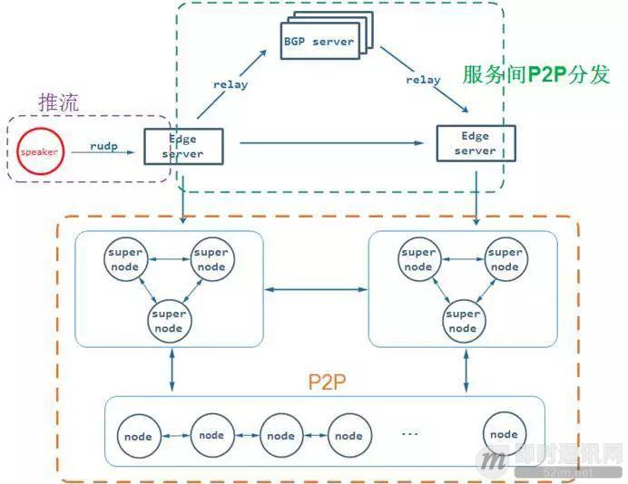

**整个传输分发网络分为三部分：**

- 推流部分；
- 服务之间 P2P；
- 客户节点 P2P。

这个传输网络有一个系统锚点：假定推流者 speaker 推到 Edge server 上是不会发生丢包和延迟的，Edge server 会通过服务间 P2P 快速将收到的流数据分发到其他的 Edge server，而且在这个过程也不会发生延迟和丢包。

为什么需要这样一个锚点？因为在客户节点的 P2P 网络需要保证流畅性和最小延迟，也就是要求所有的 Edge server 在最短时间周期内拥有完整的数据，至于为什么要这样，后面我们在流补偿环节重点介绍。

我将通过整个流数据传输过程来解析具体的技术细节，但在这之前首先要解决的就是媒体数据分片问题，所有的传输过程会基于分片 (segment) 来设计。

### 3.2媒体数据分片

媒体数据分片是整个分发传输系统中最为基础的部分，我们在设计分片时主要考虑的是时延和消耗的问题，分片如果太大，传输的时延就会越高，例如 HLS；如果分片太细，网络中回馈报文就会很多，对 P2P 网络来说额外的消耗也是个问题。

**最后我们借鉴了 RTP 和 FLV 中的经验，采用按帧来做数据分片，这样做有以下几个好处：**

- 按帧分片延迟粒度小，可以在帧传输进行延时优化；
- 实现简单，与编解码器编码原则一致；
- 组合灵活，可以实现播放 buffer 无缝结合。

每一个分片称作为 segment，用一个自增长的 32 位 ID 来表示唯一性，传输过程都是以这个 ID 为标示来确定数据的完整性。

### 3.3推流与连麦

确定好了媒体分片就可以进行推流了，我们把推流和分发的路径合二为一，上麦者是将流数据 segment 推送到离自己最近的 Edge server 上，而不是推送到专门的连麦系统上。我们推流传输使用的是 RUDP 传输算法，这个 RUDP 是采用了类似 BBR 基于延迟和丢包来设计的拥塞算法，并且对报文做了拥塞丢弃。

**示意图如下：**

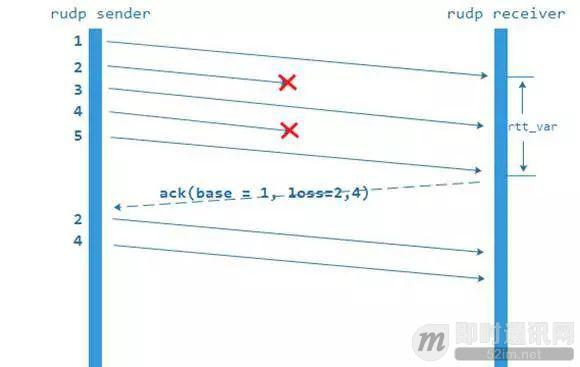

关于 RUDP 的细节可以参考我的另一篇文章《[怎么让不可靠的UDP可靠？](https://mp.weixin.qq.com/s?__biz=MzIwMzg1ODcwMw==&mid=2247487188&idx=1&sn=2e1280a6a672d66b4f87c036a6c44ca6&chksm=96c9b8b4a1be31a2aca62731912f594f380bf3b4326797a2a013c54e7789095bf5721b5f55f1&scene=21#wechat_redirect)》。至于为什么不采用 RTP 或者 RTMP/TCP 来推流，因为 RTP 虽然是基于 UDP 的，但需要通过 RTCP 和 NACK 来保证可靠性，需要设计拥塞算法，也需要对 RTP 进行改造扩展，而且还受 RTP 协议本身的限制，所以我们并没有直接采用 RTP。使用 RTMP/TCP 来设计是很简单的，但在弱网环境延迟很大，而且容易引起重连，所以在设计之初也否定了。

### 3.4Server 间的 P2P

因为整个传输分发网络是分布式的，由多个 Edge server 组成，所以基于系统锚点，媒体数据分片到 Edge server 上必须尽快分发到其他 Edge server 上。最早我们是统一用 BGP server 来中转，这样耗费的 BGP 带宽很多，而且 BGP server 一旦异常，整个 Edge server 之间的通信就中断了。

其实大部分时间跨运营商的 Edge server 之间延迟也没有想象的那么大，这可以考虑使用 Edge server 之间点对点通信来解决问题，所以我们设计了一个基于 RUDP 无窗口多路径的传输模型来进行 Edge server 之间的通信，如下图：

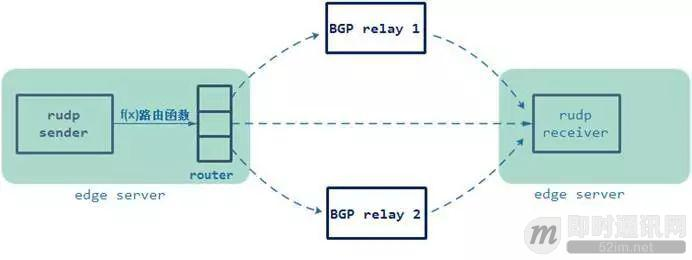

上图的通信模型是一个多路径并联通信模型，我们在 RUDP 发送前添加了一个路径路由表，这个路由表记录了各个路径的分发概率，RUDP 每次向接收端发送包时会通过路由表中的概率来选取路径。那么确定路由表概率就是一个非常重要的事情。我们通过 RUDP 实时 ACK 反馈和路径实时 ping 探测来得到网络的状态 (丢包、延迟、抖动)，再将网络状态参数输入到逼近函数 f(x) 来确定各条路由的概率，这里有条原则：如果 Edge server 之间直连的延迟和丢包足够小的情况下，直连通信路由的概率将会接近 100%，如果某一条路由出现周期性断开或者延迟超过 200ms，它的概率会接近 0。

**以下是整个路由概率评估的过程示意图：**

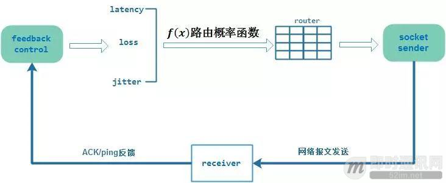

## 4、基于P2P的实时视频直播网络构建过程

媒体流数据通过 Edge server 间的 P2P 多路径传输网络到达各个 Edge server 上，接下来每个 Edge server 需要将流数据分片下发到各个客户节点上，我们针对上麦节点做了传输特殊处理让时延更小，过程和普通的 RTC 通信模型相似，这里就不赘述了。观看节点上分发采用自组织 P2P 网络，既然是通过 P2P 下发的，那么就要在客户节点群构建一个 P2P 网络，这个网络是怎么构建的？具体分为三步：连接、评估、分层。

### 4.1连接

客户节点程序是运行在客户机上的，大部分客户节点都会在路由器或者 NAT 后面，他们之间要相互建立连接，必须穿越彼此的 NAT 和防火墙。虽然现在穿越 NAT 的方法有很多，如 STUN、ICE 等，但穿越连通率始终是一个问题，如果穿越率太低，会让很多优质的节点资源得不到充分利用。

在设计穿越方案时我们将直连连通率放在第一位，通过修改 STUN 协议设计了一种基于端口多次猜测和尝试的穿越机制。首先通过类似 STUN 协议判断 NAT 类型、NAT 端口变化规律、NAT 是否有黑名单机制等信息，然后将这些信息存到辖区连接中的 Edge server 中，当有伙伴节点来与它穿越，会交换彼此的这些信息，不同的排列组合会有不同的穿越策略，每一次穿越的过程和结果都会记录到我们的后台数据库，我们会周期性地将这些数据进行分析并调整协商穿越策略。如下图：

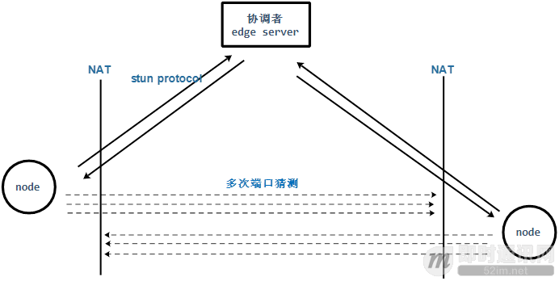

穿越完成后，节点之间就会进行连接握手和身份证书认证（关于为什么要证书后面细讲），建立通信联系和邻居关系。那么邻居关系是怎么动态变化的呢？

### 4.2邻居关系与评估

**【邻居问题】：**

连接一旦完成，节点与节点之间就成为邻居，彼此会进行状态交换和心跳，那么问题来了，一个直播系统有成千上万的节点参与，如果都两两相连的话光心跳通信就可以将客户节点的上传带宽占满。我们设计了一个节点 LRU 淘汰链表，链表中保持 40 个联系的邻居节点，老的节点会退出，新的节点会加入，LRU 会根据邻居与自己的通信状态来进行 LRU 新增和淘汰，原则如下：

- 就近原则，内网优先，同城同一运营商网络次之；
- 周期性评测延迟和媒体分片命中率，末位淘汰；
- 当 LRU 列表中节点不足 40 个时会从备用节点列表中选取新的节点进行连接并加入到 LRU 中。

**【节点评估】：**

每个客户节点的计算能力、通信能力和网络分区等都不一样，这使得我们必须对每个节点做一个评价，对一个节点的评价分为两部分：邻居节点对自己的评价和自己对自己的评估。

**邻居评价主要是：**

- RTT；
- 丢包率；
- 请求命中率。

通过这三个参数会对每个邻居计算出一个亲和力分值 score，这个值会用于后面的分发选择。

**主要评估自己这几点：**

- CPU、内存；
- 网络类型：WIFI/4G/ 有线网络；
- 上传带宽。

节点会周期性计算这两类参数，通过一个网络 QOS 收敛函数 f(x) 来计算节点能力和对邻居 QOS 策略。

### 4.3节点分层

节点评估最终的目的是让有能力的节点成为超级节点（super node）来分担 Edge server 的分发压力。

**那么一个节点成为超级节点的条件是什么呢？有以下几个条件：**

- 有足够的上传带宽，4G 和弱 WIFI 下不能成为超级节点；
- 有空闲的 CPU 和内存，计算能力不够的低端移动设备不能成为超级节点；
- 对邻居通信友好，不是通信孤岛；
- 得到 Edge server 的任命，和 Edge server 之间通信顺畅。

超级节点如果性能衰减了怎么办？答案是会退化成普通节点，因为节点评估是周期性实时进行的，如果发现节点性能衰减，Edge server 会让其退化。

既然任命了超级节点，那么超级节点是怎么工作的？每一个超级节点在被任命时都会分配到一个分组 ID，Edge server 会根据自己辖区的超级节点数量进行分组，每个分组由多个超级节点组成，分组内的超级节点负担自己分组的媒体分片分发。例如：有 5 个超级节点分组，这时单位周期内有 1 ~ 20 个 segment，那么第一个分组负责 1、6、11、16 编号的 segment 分发，以此类推第二组负责 2、7、12、17 ……这样做是为了防止单个超级节点失效，增强了 P2P 分发的稳定性。

**示意图如下：**

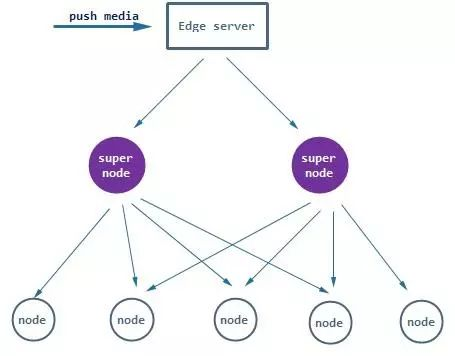

## 5、基于P2P的实时视频直播流媒体分发过程

通过上面的 P2P 网络构建过程我们知道整个 P2P 网络其实是一个分层有向图分发网络，那么具体是怎么进行流数据分发的呢？也分三步：先推 (push)、后拉 (pull)、再补偿。下面来仔细解释是怎么实现的。

### 5.1push

在介绍超级节点时有提到会根据 segment ID 将数据推到对应的超级节点分组群上，超级节点收到这些 segment 后怎么进行处理呢？按照 P2P 设计的原理应该将数据转发到其他分组的超级节点或者普通节点上，但是如果都这样推有可能会造成网络发送冗余而消耗过多的带宽。

为了解决这个问题我们设计了一个预先订阅机制，原理就是每个 P2P 客户节点会根据自己缓冲区最大的 segment ID 来进行预订，提前预订 10 秒以后的媒体数据分片，预订请求要根据节点评估出来的亲和力值 score 做权衡，收到这些请求的超级节点会将预订的分片请求信息保存下来，等到 Edge server 推送这个分片到这个超级节点，它就会无条件转发这些被预订的报文给发起预订的节点，如下图所示：

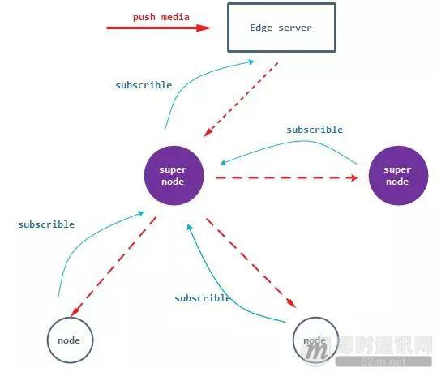

**从上图中可以看出以下几个原则：**

- 从 Edge server 到所有节点路径最多两层，这样做是为了控制链路延迟；
- 不同分组 super node 之间会相互订阅对应分组的 segment；
- 普通 node 只会向 super node 发起订阅。

### 5.2pull

数据 segment 通过预先订阅的方式进行 push 推送到各个客户节点，但网络是会丢包的，super node 也有可能会中途退出，这样就会造成最终的节点发生丢包，那丢包了我们怎么办？

**我们设计一个向邻居拉取缺失分片的机制，大致的流程如下：**

- 节点周期性检查丢失分片的信息和收到分片的信息，构建一个 gossip 协议向邻居交换缓冲区信息；
- 节点收到邻居的 gossip 信息，将对方拥有的分片信息记录到本地；
- 本地根据记录邻居的分片信息查找自己丢失的分片，通过邻居亲和力值 score 进行权衡随机选取邻居，并向选取的邻居发起 pull 请求；
- 收到邻居拉取分片请求，将分片发往请求的节点。

**整个步骤会周期性尝试多次拉取，示意图如下：**

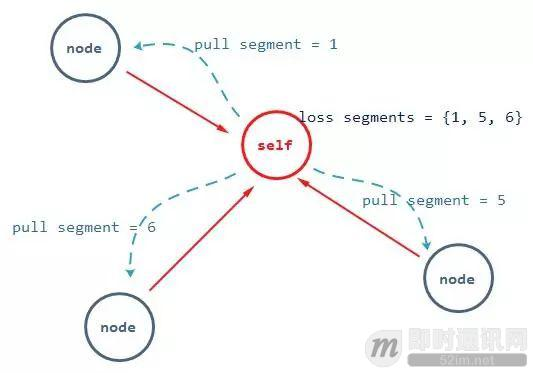

这里值得一说的是因为会周期性交换缓冲区的 gossip 信息，这意味着缓冲区的 gossip 信息越小越好，我们设计了一个类似 bloom filter 来描述 gossip 信息，不仅可以减小 gossip 报文的数据大小，而且比对速度也很快。

### 5.3补偿

因为 P2P 的客户节点是不稳定的，有可能某个 segment 通过拉取多次还是没有收到，这个 segment 又临近播放位置，那么缺失这个 segment 的节点会直接向 Edge server 请求补偿让其尽快传送这个分片，这样做的目的是防止因为 P2P 通信造成丢包的卡顿。这也就是说每个 Edge server 需要拥有所有分片数据，这也就是系统的锚点。

**流程如下图：**

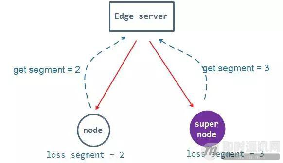

这个流程大部分情况下没有问题，但如果同一时刻大部分客户节点都缺失某几个 segment 分片，会有大量的补偿请求到 Edge server 上，这会造成网络风暴。我们在应对这个问题时设计了一个稀缺评估和拒绝服务的机制。这个机制是指当单位时间内太多个补偿请求到达 Edge server，那么这个 Edge server 会拒绝自己承受能力之外的请求，只重发承受范围之内的分片。而且这个过程还会对补偿请求做稀缺评估，如果某个分片大部分节点都没有，它会主动将这个分片通过 super node 群再推送一次。

### 5.4缓冲 buffer 与时延控制

通过上面的三个阶段可以将所有数据 segment 分发到每个客户节点上，但客户节点需要一个缓冲 buffer 来配合这个三个阶段和本地的播放，buffer 如果缓冲时间过长，会引起不必要的延迟，如果过短会造成卡顿和三个阶段不完整。

**为此我们设计了一个三阶段 buffer 动态缓冲区，如下图所示：**

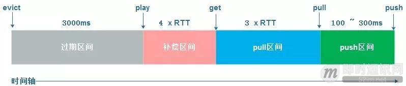

**下边解释一下上图各个区间的意思：**

- **push 区间：**因为分片是通过不同的 super node 推送过来的，那么必然会造成一定的抖动，所以在 buffer 最开始的头上会有一个 jitter 缓冲阶段，直到第一个邻居节点 gossip 信息中有这个分片 push 位置结束，这个阶段一般持续 100 ~ 300ms；
- **pull 区间：**分片时序进入 pull 区间后，会周期性检查丢失的分片，根据 gossip 掌握的邻居进行权衡拉取，会进行 3 次尝试，每一次尝试时间是本地节点与邻居之间的 RTT 值。3 次失败则进入补偿区间；
- **补偿区间：**分片时序进入补偿区间后，也会周期检查丢失的分片，根据丢失的分片 ID 直接向 Edge server 请求拉取，尝试 4 次，每次尝试时间为一个本地节点与 Edge server 之间的 RTT。如果 4 失败则进行 waiting 状态，等待邻居 gossip 或者 Edge server 主动推送；
- **过期区间：**被播放后的分片会放到这个过期区间中而不是立即删除，为什么呢？因为每一个节点的播放时间点不同，有可能本地播放的分片正是其他节点丢失的分片，有可能其他节点会通过 pull 来拉取，所以我们会把播放后的分片放在过期区间 3 秒后再删除。

### 5.5秒开问题

上面分发的三个阶段和 buffer 控制解决了流持续分发和播放延迟控制问题，但现阶段所有的直播技术必须要有秒开，其实 P2P 分发在解决秒开问题上比单纯的 Server CDN 转发要更加简单。秒开就是用户进入直播间时瞬间能看到主播的视频图像，秒开的宗旨是新进入的客户节点要求服务端边缘节点从视频的上一个 GOP 关键帧开始发送数据，客户节点再根据视频编码器从这个 GOP 关键帧零等待加速播放。我们在 P2P 分发网络中新进入的节点会收到 Edge server 的上一个 GOP 关键帧分片 ID，客户节点根据这个 ID 从各个邻居中快速拉取整个 GOP 分片数据，而不是单纯地让 Edge server 来发，秒开的速度平均缩短了 100 毫秒。

## 6、基于P2P的实时视频直播内容授权

直播分发技术除了传输分发以外，还需要考虑内容防盗和授权，P2P 系统中更加需要考虑系统安全性。我们引入了 CA 证书和双端协商加密方案来保证链路的合法性。大致的做法是每个合法的节点单元（Edge server 和所有的客户节点）会向 CA 发起合法校验，如果检验通过，CA 会根据节点的 ID、节点 RSA 公钥、授权起始时间和授权终止时间等信息利用 CA 的 RSA 进行证书生成。每个拿到证书的节点单元需要和其他的节点进行通信，先交换证书，校验对方证书的合法性，然后利用证书中 RSA 公钥加密算法的 KEY 返回给证书方，证书方收到加密的 KEY 后会用 RSA 私钥解密得到对称加密的 KEY，这样双方就完成了合法性校验并利用这个交换的 KEY 进行报文加解密通信。

**流程如下图：**

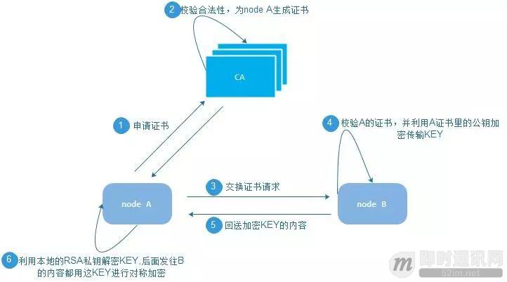

## 7、线上数据对比

上面的技术分析只是帮助读者理解这个系统的运作机理，除此以外，当然需要公布一下线上数据来佐证下系统可行性，下图是一个 10W+ 在线直播平台使用了这套 P2P 系统后线上的对比数据。我们在同一个 Edge server 上的同一个直播间对象中，把一半的用户节点关闭 P2P，一半的用户开启 P2P，来观察一天中同一个 Edge server 上这两部分用户群的带宽消耗情况。

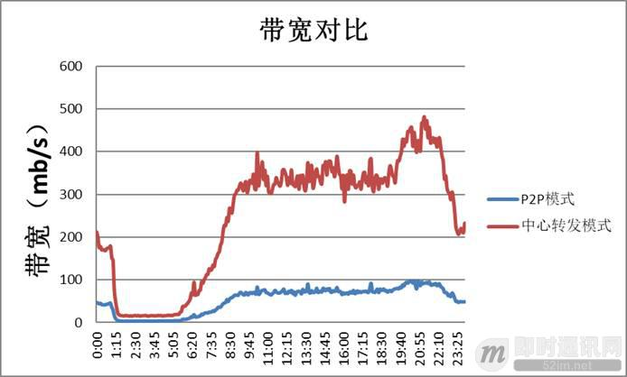

从上图可以看出，P2P 模式带宽消耗只有不开启 P2P 模式的 1/4，我们这个 P2P 系统节省了 75% 的带宽成本。这个数据的视频样本是单路 480P 800kps 码率的直播流，高峰期真实节点数 1000+，最终所有终端的平均延迟是 1.07 秒。

## 8、本文小结

到这里关于 P2P 分发网络的技术解析就结束了，P2P 技术从产生到现在已经经历了 19 年，而且 P2P CDN 也是下一代 CDN 的主体技术，P2P 技术和模型也一直变化改进。我们在直播分发领域使用 UDP 和 P2P 是想从成本和延迟上来解决我们教育场景互动的问题，出发点不一样，也就会得到不一样的结果，如果你遇到成本和延迟的困扰，可以尝试使用这种技术来解决问题。