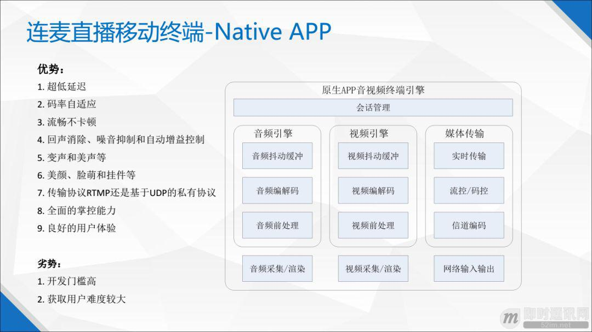
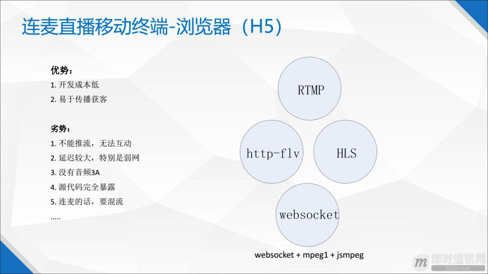
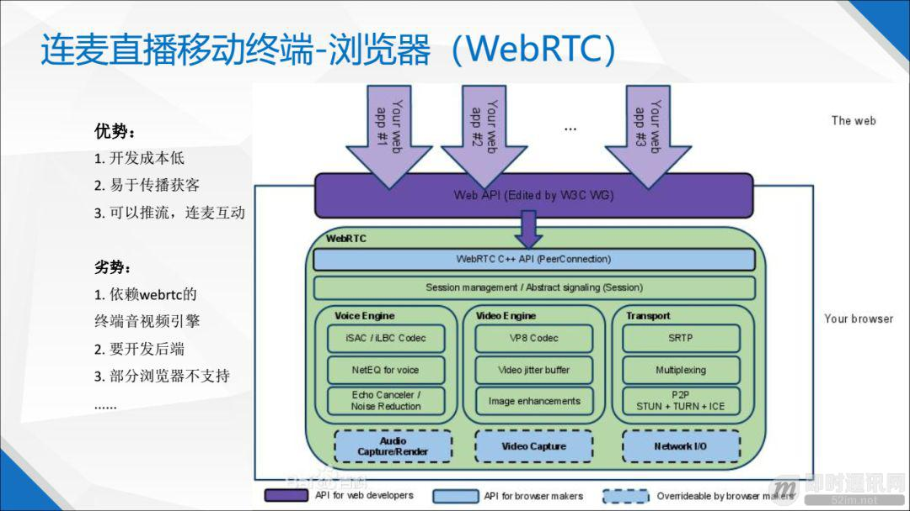
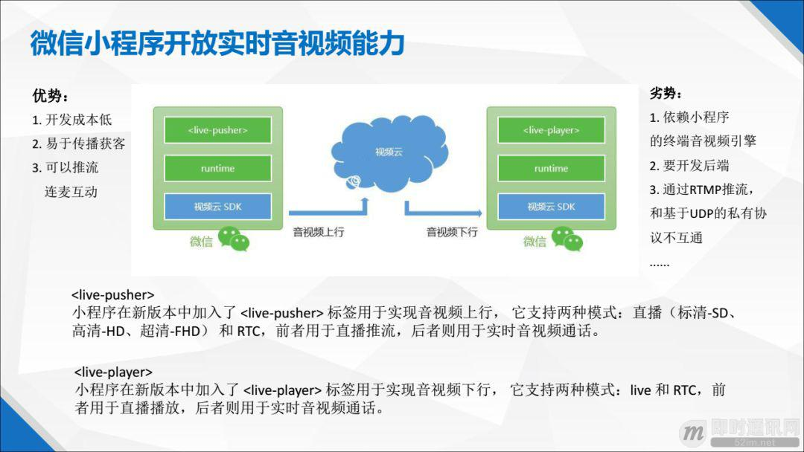
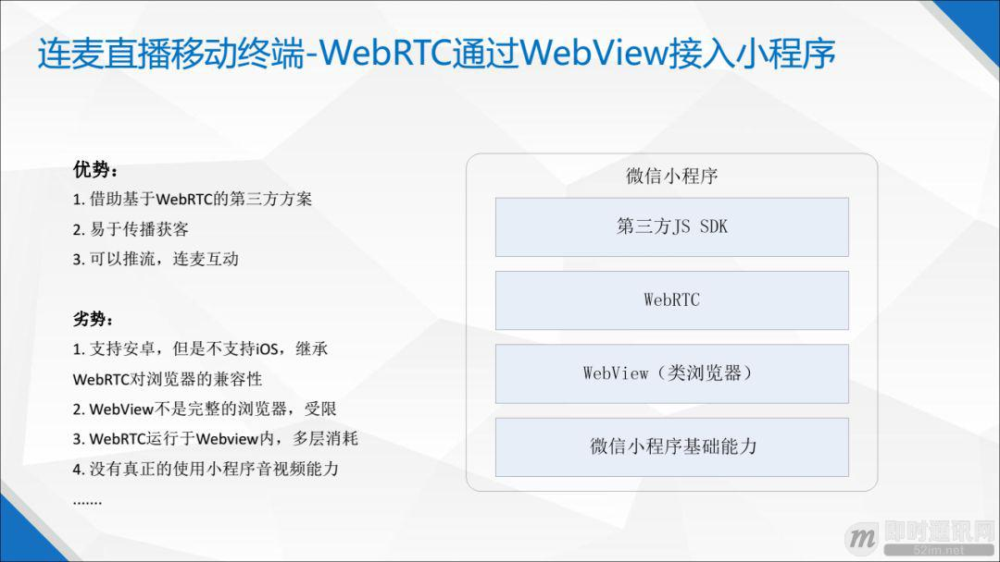

**实时视频直播客户端技术盘点：Native、HTML5、WebRTC、微信小程序**

## 1、前言

2017 年 12 月，微信小程序向开发者开放了实时音视频能力，给业内带来广阔的想象空间。连麦互动视频直播技术在 2016 年直播风口中成为视频直播的标配，然而只有在原生的 APP 上才能保障良好的用户体验。

那时候，在微信小程序中无法进行实时音视频互动。微信小程序在去年 12 月宣布开放实时音视频能力，再加上去年 6 月苹果宣布即将支持 WebRTC，业内一下子千树万树梨花开，前途一片光明。

连麦互动直播技术和微信小程序以及 WebRTC 能产生怎么样的化学作用？开发者在微信小程序或者浏览器 WebRTC 上实现连麦互动直播技术的时候，需要知道什么和考虑什么？

连麦视频直播的客户端主要包括：原生 APP、浏览器 H5、浏览器 WebRTC、微信小程序。浏览器上的应用包括 H5 和 WebRTC，前者可以拉流观看，后者可以实现推流和拉流。

## 2、本文作者

**冼牛：**即构科技资深语音视频专家，北京邮电大学计算机硕士，香港大学工商管理硕士，多年从事语音视频云服务技术研究，专注互动直播技术、语音视频社交和实时游戏语音。

作者的文章《[近期大热的实时直播答题系统的实现思路与技术难点分享](http://www.52im.net/thread-1369-1-1.html)》、《[IM实时音视频聊天时的回声消除技术详解](http://www.52im.net/thread-939-1-1.html)》也已整理并发布于即时通讯网，有兴趣的可以看看。

## 3、直播技术文章参考

《[七牛云技术分享：使用QUIC协议实现实时视频直播0卡顿！](http://www.52im.net/thread-1406-1-1.html)》
《[实时音视频聊天中超低延迟架构的思考与技术实践](http://www.52im.net/thread-1465-1-1.html)》
《[理解实时音视频聊天中的延时问题一篇就够](http://www.52im.net/thread-1553-1-1.html)》
《[浅谈开发实时视频直播平台的技术要点](http://www.52im.net/thread-475-1-1.html)》
《[实现延迟低于500毫秒的1080P实时音视频直播的实践分享](http://www.52im.net/thread-528-1-1.html)》
《[移动端实时视频直播技术实践：如何做到实时秒开、流畅不卡](http://www.52im.net/thread-530-1-1.html)》
《[技术揭秘：支持百万级粉丝互动的Facebook实时视频直播](http://www.52im.net/thread-541-1-1.html)》
《[移动端实时音视频直播技术详解（一）：开篇](http://www.52im.net/thread-853-1-1.html)》
《[移动端实时音视频直播技术详解（二）：采集](http://www.52im.net/thread-955-1-1.html)》
《[移动端实时音视频直播技术详解（三）：处理](http://www.52im.net/thread-960-1-1.html)》
《[移动端实时音视频直播技术详解（四）：编码和封装](http://www.52im.net/thread-965-1-1.html)》
《[移动端实时音视频直播技术详解（五）：推流和传输](http://www.52im.net/thread-967-1-1.html)》
《[移动端实时音视频直播技术详解（六）：延迟优化](http://www.52im.net/thread-972-1-1.html)》
《[理论联系实际：实现一个简单地基于HTML5的实时视频直播](http://www.52im.net/thread-875-1-1.html)》
《[浅谈实时音视频直播中直接影响用户体验的几项关键技术指标](http://www.52im.net/thread-953-1-1.html)》
《[首次披露：快手是如何做到百万观众同场看直播仍能秒开且不卡顿的？](http://www.52im.net/thread-1033-1-1.html)》
《[Android直播入门实践：动手搭建一套简单的直播系统](http://www.52im.net/thread-1154-1-1.html)》
《[网易云信实时视频直播在TCP数据传输层的一些优化思路](http://www.52im.net/thread-1254-1-1.html)》
《[P2P技术如何将实时视频直播带宽降低75%？](http://www.52im.net/thread-1289-1-1.html)》
\>> [更多同类文章 ……](http://www.52im.net/forum.php?mod=collection&action=view&ctid=4)

## 4、视频直播客户端技术之Native APP

原生 APP 终端音视频引擎的结构框图如下，基本包括了音频引擎、视频引擎和网络传输，合称实时语音视频终端引擎。这里还包含底层的音视频采集和渲染，还有网络的输入输出能力，这是操作系统开放的能力。

原生 APP 有个天然的好处，它是直接和操作系统打交道的，操作系统开放的资源和能力它都可以直接用，比如说音视频的采集渲染，还有网络的输入输出。套用一句时髦的广告语：“没有中间商赚差价”，直接和操作系统对接，可以获得比较好的用户体验。

在原生 APP 上实现连麦直播的优势是，对上面所说的七个环节有较好的把控，可以获得比较低的延迟，能自研实现语音前处理 3A 算法，包括回声消除，还有对抖动缓冲策略和码率自适应的策略都有比较好的把控。另外，可以自主选择使用 RTMP 协议还是基于 UDP 的私有协议，对抗弱网环境更加有保障。

市面上比较流行的前处理技术，比如美颜、挂件、变声等，原生 APP 都可以通过开放前处理接口让开发者实现或者对接这些技术。为什么要强调这个呢？因为浏览器 WebRTC 和微信小程序都没有开放前处理接口，开发者没有办法自行实现或者对接第三方的美颜或者挂件等技术模块。

在原生 APP 上，开发者可以得到全面的把控能力，让用户可以获得更好的体验。主流的视频直播平台都有自己的原生 APP 平台，而浏览器和微信小程序相对来说是辅助的。原生 APP 的用户体验是最好的，而且对开发者来说也是最可控的。

在原生 APP 上实现连麦直播的劣势是什么呢？开发门槛高，开发周期长、人力成本高。另外，从获取用户和传播的角度来讲，也没有浏览器和微信小程序那么便利。

## 5、视频直播客户端技术之浏览器（HTML5）

浏览器 H5 就像一个硬币有两面，有好处也有劣势，好处是开发成本低，容易传播，劣势是只能拉流，不能推流，不能做到多个用户连麦直播。另外，在浏览器 H5 上延迟也是比较大。如果使用 RTMP 或者 HTTP-FLV，延迟会在 1 秒到 3 秒之间，如果用 HLS 延迟会大于 8 秒甚至 10 秒，这么大的延迟就根本就不允许实现连麦直播。

使用这三种协议都是通过浏览器 H5 中的播放器来播放的。在多主播连麦互动的场景中，一个播放器里面只能播一路视频流，三个主播就得三个播放器，因此看不到多个主播同框连麦互动的情形。如果要看到多个主播同框互动的画面，就必须把多路流混合成一路流，在单个播放器里面播放。

另外，浏览器 H5 的源代码是开放的。如果在浏览器上把音视频终端引擎实现了，相当于对外公开了所有核心的源代码。因此，还没有见过哪个厂商在浏览器 H5 上完整地把音视频引擎真正做出来。即使你愿意做出来，浏览器也不会允许你这样做，开发者和操作系统之间隔着浏览器，如果浏览器不把操作系统的核心能力开放给开发者，开发者就不能自主采集和渲染，不能掌控网络输入输出，类似流控码控等功能无法实现。

在浏览器 H5 中也可以通过 websocket 来传输，用 jsmpeg 来播放，视频编解码的格式用 mpeg1。

mpeg1 是一个比较老的媒体格式，所有浏览器都支持。在浏览器中使用 jsmpeg 播放器播放 mpeg1，所有浏览器也可以支持。这么做可以获得比较低的延迟，但是还是无法推流，没办法实现连麦直播。

## 6、视频直播客户端技术之浏览器（WebRTC）

大家可能会觉得很遗憾，浏览器 H5 虽然很容易传播，开发简单但是体验欠佳，不能连麦直播。那么在浏览器上能不能推流，能不能实现连麦直播呢？答案是可以的，那就要用到 WebRTC。

这里说的 WebRTC 是指已经被内嵌到浏览器里面，被浏览器支持的 WebRTC，而不是 WebRTC 的源代码。部分主流浏览器内嵌了 WebRTC，对开发者开放了浏览器的实时音视频能力。

上图是 WebRTC 的结构图。我们可以看到 WebRTC 包括了音频引擎，视频引擎、传输引擎等，最底层的虚线框表示可以重载，也就是说浏览器把最底层的音视频渲染和网络传输的底层能力开放给开发者，开发者可以根据自己的需求选择是否进行重载。音频引擎中，包括了两个编解码器：iSAC 和 iLBC，前者针对宽带和超宽带的音频编解码，后者针对窄带音频编解码。

音频引擎还包括了音频抖动缓冲，回声消除和噪音抑制模块等。抖动缓冲中的 NetEQ 算法可以说是 WebRTC 里面的精华之一。

视频引擎中，包括了 VP8 和 VP9 的视频编解码器，甚至是即将到来的 AV1。视频引擎还包括视频抖动缓冲和图像质量增强等模块。传输引擎，WebRTC 使用的是 SRTP（Secured Realtime Transport Protocol）安全实时传输协议。

最后，WebRTC 采取 P2P 的通信方式，没有媒体服务器等后端的实现。以上是 WebRTC 的简单介绍。

浏览器 WebRTC 一般的优势和劣势这里就不再重复，请大家自行百度，这里只说重点。浏览器 WebRTC 的好处就是实现了相对完整的音视频终端引擎，允许在浏览器上推流，可以实现连麦直播。

**然而，浏览器 WebRTC 也有不足：**

- 没有开放前处理接口，美颜和挂件这些模块没办法接入第三方的或者自研方案；
- 媒体服务器后端没有实现，开发者要实现媒体服务器，然后通过开源 WebRTC 网关（比如说 janus）接入；
- 编解码器、抖动缓冲和语音前处理 3A 等能力只能依靠 WebRTC，不能自行定制化；
- 部分主流浏览器是不支持 WebRTC 的，特别是苹果的浏览器。虽然说去年苹果宣布支持 WebRTC, 但是目前 iOS Safari 最新版本对 WebRTC 的支持并不好，iOS Safari 的主流版本并不支持 WebRTC，在 iOS 上面微信浏览器也是不支持 WebRTC 的。

由于 WebRTC 不提供媒体服务器的实现，因此需要把浏览器 WebRTC 接入到媒体服务器后端，这个可以是自研的，也可以是第三方的服务。浏览器 WebRTC 和媒体服务器后端之间的协议和媒体格式是不一样的，因此要做协议和格式的转换。WebRTC 用的基于 UDP 的 SRTP，需要把它转换成媒体服务器的基于 UDP 的私有协议。另外，媒体格式也需要转换，因为 WebRTC 中语音视频格式默认用的是 VP8 或者 VP9。同时实时传输网络中有关信令调度也需要做一些调整。浏览器 WebRTC 和媒体服务器后端之间的接入层也可以采用开源的 WebRTC Gateway（比如说 janus）来实现。

浏览器是类似操作系统的一种超级应用，它坐拥重要的流量入口，然而它也是开发者和操作系统之间的“中间商”。开发者通过 WebRTC 获得浏览器开放的实时音视频能力，然而也必须要承受 WebRTC 带来的痛苦。

## 7、视频直播客户端技术之微信小程序

微信小程序是什么？是跑在微信上面的轻型应用。微信是什么？是类操作系统的超级应用。这些特征和浏览器以及 H5 是不是很接近？H5 是浏览器支持的轻型应用，而浏览器是类操作系统的超级应用。浏览器背后是各大国际科技巨头，不像微信这样背后只有腾讯一个互联网巨头。因此，从这个角度来看，微信小程序、浏览器 WebRTC 和 H5 是有相通之处的。

微信小程序可以类比为浏览器 H5 那样的客户端和服务器的结构。其中 HTML 对应微信小程序的 WXML，CSS 对应小程序的 WXSS，小程序的脚本语言和 JS 是一样的，只是框架不一样。微信小程序提供了两个标签，一个是<live-pusher>，一个是<live-player>。<live-pusher>就是推流，<live-player>就是拉流，可以实现单向直播或者连麦直播。小程序提供两种模式：LIVE 和 RTC，LIVE 支持单向直播，RTC 支持低延迟的连麦直播。目前微信小程序推流采用 RTMP 协议，如果要和私有协议互通，需要进行协议转换。

微信小程序开放了实时音视频能力，对业界来说是重大利好。然而，根据上面的信息和逻辑，我们也看到采用微信小程序实现连麦互动直播的好处和不足。

**好处有三点：**

- 1）开发成本低，开发周期短，基本和 H5 的开发难度差不多；
- 2）很容易传播和获客，充分利用好微信的优质流量；
- 3）可以推流和拉流，允许实现连麦直播和实时语音视频通话。

**不足有四点：**

- 1）你会受制于微信小程序的实时音视频能力，比如说，如果它的回声消除有某些问题，你只能等微信团队按照自己的节奏来优化，而自己没有任何办法去优化；
- 2）小程序没有开放前处理接口，只能使用小程序自带的美颜或者变声功能（如果有），不能对接自行研发或者第三方的美颜或者变声模块；
- 3）通过 RTMP 协议推流和拉流，不能和基于 UDP 的私有协议互通连麦。如果要实现和基于 UDP 的私有协议互通连麦，就必须要增加接入层来转换协议格式甚至媒体格式；
- 4）没有实现后端媒体服务器，开发者必须要自行实现媒体服务器，或者把微信小程序接入到第三方的实时通信网络。

浏览器通过 WebRTC 开放了浏览器的实时音视频能力，而微信通过小程序开放了微信的实时音视频能力，在两个类操作系统的平台上允许开发者去实现连麦直播和实时音视频通话。然而，无论 WebRTC 还是小程序只是在终端上带你入门，对开发者来说，要真正实现整套系统，还有很多工作需要做的。

如果要将微信小程序接入实时音视频传输网络，中间得有接入服务器，我们叫接入层。在接入层我们需要做协议的转换，比如说，如果实时音视频传输网络是使用基于 UDP 的私有协议，那么要把 RTMP 协议转为基于 UDP 的私有协议。还有媒体格式的转换，如果和实时传输网络的媒体格式不一样，还需要进行转换。

## 8、视频直播客户端技术之WebRTC 通过WebView接入小程序

还有别的方法在小程序上做连麦直播互动吗？必须要使用微信小程序开放的语音视频能力吗？也不一定。下图展示了我在市面上看过的一个技术方案，它绕过了微信小程序实时语音视频能力，通过微信小程序 WebView 组件实现了连麦直播的方案。这里和大家分享一下。

这个方案的基本思路是利用 WebView 的浏览器特点，在 WebView 内使用 WebRTC 的 Web API，从而在小程序上获得实时音视频能力。上图是这个方案的架构图。最底层是微信小程序的基础能力。上一层是 WebView，微信小程序的 WebView 类似浏览器，那么就可能会支持 WebRTC。然而必须要注意到，微信小程序的 WebView 在安卓平台上支持 WebRTC，但在 iOS 平台上面不支持 WebRTC。

**虽然这个方案理论上也能在微信小程序上实现连麦直播，但是它有以下的局限性：**

- 1）在 iOS 平台上，微信小程序不支持这个方案，上面已经说过；
- 2）小程序 WebView 不是完整的浏览器，要比普通浏览器表现差而且有很多的限制；
- 3）开发者和操作系统之间隔了好几层：微信底层，小程序，WebView，WebRTC，然后才是开发者的小程序应用。每一层的抽象都会带来性能上的消耗，都会影响到最终的体验。

这个方案本质上还是一个基于 WebRTC 的解决方案，没有用到微信小程序开放的实时音视频能力，而是快速地借助 WebView 组件，剑走偏锋，十分讨巧地在微信小程序里使用了 WebRTC。

## 9、本文小结

连麦直播技术逐步在原生 APP, 浏览器 H5，浏览器 WebRTC，微信小程序上延伸，衍生出更加丰富的生态，提供更加便捷和良好的用户体验，对视频直播平台和用户来说是好消息。然而，欲带皇冠，必承其重。特别是在浏览器 WebRTC 和微信小程序上，开发者要充分理解这些类型终端的特点和局限，才能更好地在上面利用连麦直播技术进行创新，服务用户。