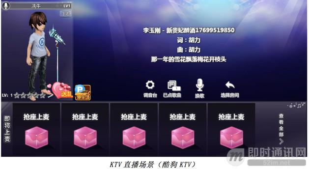
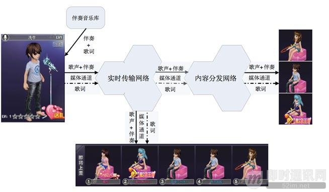
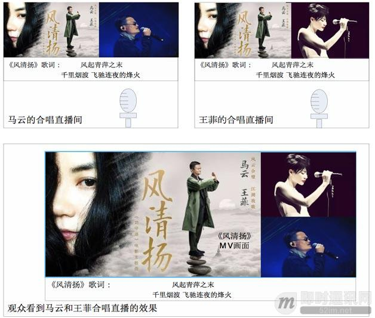
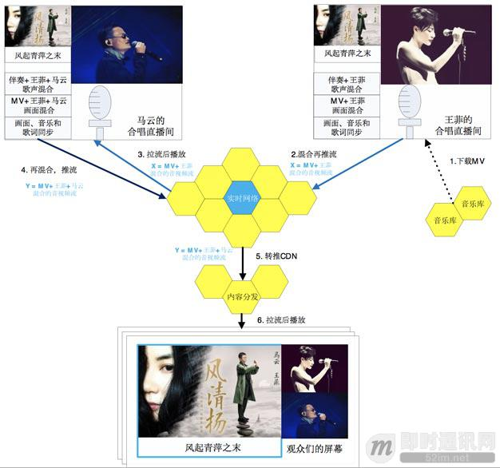
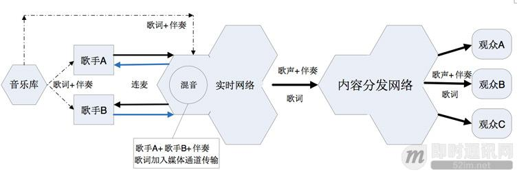

**实时音频的混音在视频直播中的技术原理和实践总结**

## 1、前言

随着视频直播应用被越来越广泛地接受，视频直播应用的相关技术和玩法也在不断翻新，以便持续地吸引和留住用户。这半年来，一些典型的创新玩法，包括K歌直播和合唱直播等都是非常受用户欢迎的。这些创新玩法都用到了实时音频混音技术。

今天，我们就来聊一聊混音技术在视频直播应用中的实现原理、方案等，及其在创新玩法中的实践应用。

## 2、本文作者

**冼牛：**即构科技资深语音视频专家，北京邮电大学计算机硕士，香港大学工商管理硕士，多年从事语音视频云服务技术研究，专注互动直播技术、语音视频社交和实时游戏语音。

作者的《[IM实时音视频聊天时的回声消除技术详解](http://www.52im.net/thread-939-1-1.html)》、《[实时视频直播客户端技术盘点：Native、HTML5、WebRTC、微信小程序](http://www.52im.net/thread-1564-1-1.html)》、《[近期大热的实时直播答题系统的实现思路与技术难点分享](http://www.52im.net/thread-1369-1-1.html)》也已整理并发布于即时通讯网，有兴趣的可以看看。

## 3、直播技术相关文章

《[浅谈开发实时视频直播平台的技术要点](http://www.52im.net/thread-475-1-1.html)》
《[实现延迟低于500毫秒的1080P实时音视频直播的实践分享](http://www.52im.net/thread-528-1-1.html)》
《[移动端实时视频直播技术实践：如何做到实时秒开、流畅不卡](http://www.52im.net/thread-530-1-1.html)》
《[技术揭秘：支持百万级粉丝互动的Facebook实时视频直播](http://www.52im.net/thread-541-1-1.html)》
《[移动端实时音视频直播技术详解（一）：开篇](http://www.52im.net/thread-853-1-1.html)》
《[移动端实时音视频直播技术详解（二）：采集](http://www.52im.net/thread-955-1-1.html)》
《[移动端实时音视频直播技术详解（三）：处理](http://www.52im.net/thread-960-1-1.html)》
《[移动端实时音视频直播技术详解（四）：编码和封装](http://www.52im.net/thread-965-1-1.html)》
《[移动端实时音视频直播技术详解（五）：推流和传输](http://www.52im.net/thread-967-1-1.html)》
《[移动端实时音视频直播技术详解（六）：延迟优化](http://www.52im.net/thread-972-1-1.html)》
《[理论联系实际：实现一个简单地基于HTML5的实时视频直播](http://www.52im.net/thread-875-1-1.html)》
《[浅谈实时音视频直播中直接影响用户体验的几项关键技术指标](http://www.52im.net/thread-953-1-1.html)》
《[首次披露：快手是如何做到百万观众同场看直播仍能秒开且不卡顿的？](http://www.52im.net/thread-1033-1-1.html)》
《[Android直播入门实践：动手搭建一套简单的直播系统](http://www.52im.net/thread-1154-1-1.html)》
《[网易云信实时视频直播在TCP数据传输层的一些优化思路](http://www.52im.net/thread-1254-1-1.html)》
《[P2P技术如何将实时视频直播带宽降低75%？](http://www.52im.net/thread-1289-1-1.html)》
《[近期大热的实时直播答题系统的实现思路与技术难点分享](http://www.52im.net/thread-1369-1-1.html)》

## 4、混音的应用场景

混音，顾名思义，就是把两路或者多路音频流混合在一起，形成一路音频流。笔者曾经写过两篇关于混流的文章，混流也被称为合流，指的是把视频画面和音频对齐，然后混合成一路音视频流。我们今天要聊的实时音频混音，指的只是音频流的混合。

混音的逻辑可以在终端设备上实现，也可以在服务器上实现，因此可以分为终端混音和云端混音。终端混音一般应用于背景配音，音乐伴奏等场景。云端混音可以是云端混流的一部分，主要目的是利用云端的计算能力去做多路音视频流的音画对齐，还有降低下行带宽成本；也可以做纯粹的云端混音，来实现合唱直播等场景的需求。

混音技术在视频直播应用场景中并不新鲜。视频直播间里比较机械化的掌声、笑声、口哨声甚至背景音乐，都是混音技术的应用。在主播端，采集主播的声音形成音频流A1，从音频文件中读取音频流A2，把A1和A2两路音频流混合，形成一路音频流，这就是混音。

然而，视频直播的玩法创新日新月异。2017年12月酷狗直播上线了KTV直播的玩法，主播可以在线跟随伴奏K歌，直播间的观众能听到主播和伴奏的歌声，还能看到歌词字幕。2018年5月全民K歌上线了合唱直播的玩法，主播和嘉宾一起在线同唱同一首歌，直播间的观众能听到主播和嘉宾的合唱以及伴奏。

这些新的玩法都是对混音技术的深度应用。本文后面将对这两种玩法的逻辑展开讨论。

## 5、混音之前的处理

并非任何两路音频流都可以直接混合。

**两路音视频流，必须符合以下条件才能混合：**

- 1）格式相同，要解压成PCM格式；
- 2）采样率相同，要转换成相同的采样率。主流采样率包括：16k Hz、32k Hz、44.1k Hz和48k Hz；
- 3）帧长相同，帧长由编码格式决定，PCM没有帧长的概念，开发者自行决定帧长。为了和主流音频编码格式的帧长保持一致，推荐采用20ms为帧长；
- 4）位深（Bit-Depth）或采样格式(Sample Format)相同，承载每个采样点数据的bit数目要相同；
- 5）声道数相同，必须同样是单声道或者双声道(立体声)。这样，把格式、采样率、帧长、位深和声道数对齐了以后，两个音频流就可以混合了。

在混音之前，还需要做回声消除、噪音抑制和静音检测等处理。回声消除和噪音抑制属于语音前处理范畴的工作。在编码之前，采集、语音前处理、混音之前的处理、混音和混音之后的处理应该按顺序进行。静音抑制（VAD，Voice Activity Detect）可做可不做。对于终端混音，是要把采集到的主播声音和从音频文件中读到的伴奏声音混合。如果主播停顿一段时间不发出声音，通过VAD检测到了，那么这段时间不混音，直接采用伴奏音乐的数据就好了。然而，为了简单起见，也可以不做VAD。主播不发声音的期间，继续做混音也可以（主播的声音为零振幅）。

## 6、基础混音算法

我们的周遭环境就是个天然的混音场，各种声波在空气中传播，相互叠加，传入到我们的耳朵里。不同声波在空气中的振幅叠加是线性的，因此，在混音算法中，音频采样数据表征声音的振幅，音频数据的叠加也是线性的。

然而，我们需要考虑两方面的因素。

**混合权重：**

两个音频流的振幅表示声音的能量水平，然而两个声音可能一个很大，一个很小，对比悬殊。在混音的时候，从用户听音的主观感受来说，是希望两个声音混合后听起来比较均衡。因此，混音算法要考虑两个声音振幅的权重，或者说调节音量。

实践经验表明，采集到的主播声音相对比较小，而文件读取的音频声音比较大，推荐保持主播的声音音量不变，而调节伴奏音乐的音量到一个比较合适的水平，然后再混合。

**溢出处理：**

两个音频流的两个对应的采样点的数据线性相加可能会造成溢出。每一个音频采样点的数据由16bit，也就是2个字节来表示，能够表示的有符号整型数的范围是-32768~32767。

两个音频流的两个对应的采样点由两个16bit的整数表示，这两个整数相加可能会溢出，向上溢出或者向下溢出。因此，混音算法要能够处理溢出的情况。

溢出处理的方法有很多，这里只提一种：直接加和并且钳位，加和后往上溢出的话，就采用最大正值（32767），如果往下溢出，就采用最大负值（-32768）。

## 7、混音之后的处理

混音处理以后，要做溢出检测，针对溢出的采样点做溢出处理。也可以做一些平滑处理的操作，不过这不是必要的。混音的效果好不好，最终还是要以用户的主观听感来做判断标准。

混音技术一般不会单独使用。在视频直播场景中，往往是和其它一些技术混合使用。比如说，K歌直播场景中，用到的技术包括混音技术，歌词与媒体同步传输技术。合唱直播场景中，用到的技术包括混音技术，连麦直播技术等。多种技术的灵活组合使用，就能创造出让主播和用户喜爱的玩法，拉升直播平台的用户活跃度。

## 8、混音与KTV直播

KTV直播，也就是线上K歌房的玩法，真实地还原了线下K歌房的玩法。举个例子，小明是个麦霸，周末想去K歌房K歌，可是朋友们都没空，约不到人一起K歌。于是小明就通过手机或者PC，进入线上的K歌房，房间里有和小明一样的其它用户。和其它用户一样，小明要排队轮流上麦K歌，在上麦之前要点好要唱的歌曲。K歌的时候，小明能听到伴奏和看到歌词，其它同在K歌房的用户能听到小明的歌声和伴奏，还能看到同步的歌词，完美地还原了线下K歌房的体验。这样，小明就算约不到朋友，也可以在线上KTV找到网友一起K歌。

从技术的角度来看，本质上KTV直播是在视频直播的基础上，混音技术和媒体通道传数据技术的应用。混音技术在上面已经详细介绍，媒体通道传数据技术就是在媒体通道内传输数据信息，比如说歌词等信息。下图展示了KTV直播的技术架构。

**KTV直播的技术架构图：**

在歌手的终端，歌手的歌声和伴奏音乐被混合，和歌手的视频一起编码成音视频流推送到实时传输网络。这是混音技术，前面已经介绍过。歌词信息和音视频信息是在同一个媒体通道传输的，这样可以保障歌词和音视频同步。这就是媒体通道传数据技术，可以被应用到KTV直播，还有直播答题和在线教育等场景。

**大概的业务流程如下：**

- 1）歌手端从伴奏音乐库下载伴奏音乐和歌词信息，并实时播放；
- 2）歌手演唱，歌手端采集歌手的歌声和视频画面；
- 3）歌声和伴奏被混音，形成单一的音频流；
- 4）歌词信息和音视频数据一起被编码；
- 5）音视频流和歌词信息同步被推送到实时传输网络；
- 6）音视频流经过实时传输网络加速，转发到内容分发网络；
- 7）轮麦的用户从实时传输网络拉流播放，歌声和歌词同步；
- 8）普通的用户从内容分发网络拉流播放，歌声和歌词同步。

这是典型的视频直播场景，再加上混音技术和媒体通道传数据技术结合，真实地还原线下KTV的效果。

## 9、混音与合唱直播

合唱直播，其实是KTV直播加上合唱的场景，真实地还原了在线下K歌房中合唱的玩法。合唱直播，指的是两个或者以上的用户，随着伴奏看着歌词一起K歌。合唱直播和KTV直播的关键区别在于，有两个或者以上的用户一起K歌，混音的场所（在哪个终端？是终端还是云端？）是考虑的关键，最终要让歌声、伴奏和歌词同步。KTV直播混音的场所是歌手端设备，而合唱直播的混音场所可以是歌手端设备，也可以是云端，要根据不同的方案而定。

去年11月，马云和王菲合唱一首《风清扬》，作为《功守道》的主题曲，成了刷爆朋友圈的热点。

**如果马云和王菲使用合唱直播技术在线上合唱的话，效果图大概如下：**

从技术的角度来看，本质上合唱直播是在视频直播的基础上，混音技术、媒体通道传数据技术甚至加上连麦直播技术的应用。

一般来说，合唱直播有两种方案。

***【方案一】：\***

两个歌手不连麦，混音在终端完成，歌声、伴奏和歌词严格同步，但是只有一个歌手能听到另外一个歌手的歌声。

**方案一的架构图如下：**

**这里以马云和王菲线上合唱为例，来说明方案一的业务逻辑：**

- 1）王菲的手机从音乐库下载MV播放，包含伴奏音乐、MV视频和歌词；
- 2）王菲伴随着伴奏音乐演唱，歌声和伴奏音乐混音，形成音视频流X推送到实时传输网络；
- 3）马云的手机从实时网络拉取音视频流X播放，伴奏音乐包含王菲的歌声和MV伴奏；
- 4）马云伴随着伴奏音乐演唱，歌声和伴奏被混音，形成音视频流Y推送到实时传输网络；
- 5）音视频流Y经过实时传输网络加速后，被转推内容分发网络（CDN）进行分发；
- 6）直播间的观众从内容分发网络拉取音视频流Y播放。

至此，直播间的观众能听到马云和王菲合唱的歌声，好像他们两个就是在同一个KTV里面合唱一样。

- **方案一的优点是：**两位歌手的歌声、画面和歌词严格同步，观众的体验最优；
- **方案一的不足是：**王菲听不到马云的歌声，而马云能听到王菲的歌声，两位歌手没有连麦，缺乏互动。

***【方案二】：\***

两个歌手连麦，混音在云端完成，两个歌手能相互听到对方的歌声，但是歌声、伴奏和歌词难以做到严格同步。

**方案二的架构图如下：**

**这里以歌手A和歌手B合唱为例，来说明方案二的业务逻辑：**

- 1）歌手A从音乐库下载伴奏音乐和歌词，歌手B同样；
- 2）歌手A随着伴奏音乐和字幕演唱，歌手B同样；
- 3）歌手A把采集到的歌声和视频，封装成音视频流，推送到实时网络，歌手B同样；
- 4）歌手A从实时网络拉取歌手B的音视频流播放，歌手B同样，两个歌手实现连麦互动；
- 5）在云端把歌手A的歌声、歌手B的歌声、伴奏音乐混音，封装成音视频流；
- 6）在云端把歌词加入音视频流的媒体通道传输；
- 7）在云端把音视频流转推内容分发网络；
- 8）观众们从内容分发网络拉取音视频流播放。

**这样可以实现全互动的合唱直播，好像歌手A和歌手B就在同一个K歌房里合唱一样：**

- 1）歌手A和歌手B相互能听到对方的歌声；
- 2）歌手A和歌手B跟随着伴奏一起演唱；
- 3）观众们能听到歌手A和歌手B合唱，歌声和伴奏还有歌词大致同步。

- **方案二的优点是：**互动感强，两位歌手能相互听到对方的歌声，歌手的体验最优；
- **方案二的不足是**：两位歌手的歌声、伴奏还有歌词很难做到严格同步，原因是两个歌手的歌声、还有伴奏的音乐（三者对应的时间戳）抵达云端的时间难以做到完全一致，受到网络延迟的影响较大。

网络状况好的情况下，同步效果较好，和方案一相当，网络不好的情况下，不同步的情况就比较明显。

## 10、本文小结

混音技术作为一项技术，常常被和其它技术灵活组合，来实现具体场景中的玩法创新。上面提到的KTV直播和合唱直播都是混音技术的具体应用。视频直播作为一个综合的应用场景，随着技术和业务的发展，逐渐衍生出众多的微场景，包括上面提到的两个微场景。在视频直播微场景需求的驱动下，各种音视频技术点灵活组合能衍生出各种技术方案。