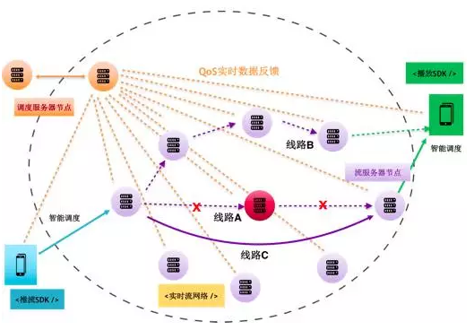

### **一、七牛直播云**

**1.业务模型**

七牛直播云是一个完整的解决方案，它包括推流端、网络和播放端三个部分。

图 1

图 1 为七牛直播云业务模型。左下角是推流端；中间是实时流网络，可以理解为 CDN，但其网络架构与 CDN 不同；右上角是播放客户端。

经常看直播的朋友接触最多的是右上角的播放端；中间为实时流网络，紫色部分代表网络节点，节点之间的线路代表直播流的流向；左上角黄色部分为调度中心，异地双活的调度中心保存了当前网络的所有节点状态，并能实时控制推流数据的走向。中间红色节点表示当前故障节点，从图 1 可看出，经过故障节点的路是不通的。这样就构成了直播解决方案的基本业务模型，它涵盖推流端推流，分发网络以及播放端等完整的环节。

本次分享的内容主要和性能相关，而直播的性能实际上涉及整个链路，包括推流端的性能、网络端性能以及播放端性能三个部分。

**2.产品内核**

图 2

图 2 为七牛直播云的产品内核。它提供了三个端的 SDK：推流 SDK、服务端 SDK、播放端 SDK。其中，推流 SDK 控制视频流的采集、处理和编码，服务端 SDK 主要负责流的推流、传输和播放控制，播放端 SDK 负责视频流的解码和播放。

**3.产品架构**

图 3

图 3 为七牛的产品架构示意图。七牛云以存储起家，有一个非常成熟的对象存储系统。后来，为了满足客户快速上传、下载文件的需求，基于存储搭建了静态内容分发网络，即 CDN。然后，为了满足客户对静态文件的计算需求，搭建了基于对象存储的数据处理平台，甚至是更为通用的数据处理平台，在这个平台上用户不仅可以部署基于对象存储的计算任务，还可以部署完整的 Web 后端服务。

直播实际上是一个解决方案，它包含推流端 SDK，播放端 SDK，以及直播云的 API。直播云 API 在云端会对直播流进行处理。我们知道，直播是一个分发通道，它包含两个层面的含义，一：作为纯粹的分发通道，二：对分发通道上的内容进行处理。其中内容处理包括：录制回放点播、转码及内容处理、统计报表、内容识别、推流及播放加速。内容识别中最常见的是视频鉴黄。而推流和播放加速是这个通道的主要功能。另外，基于直播云解决方案，我们还需要开发一些运营相关功能，比如开发分区域甚至是更细粒度的报表系统等，以实时查看当前所有用户的推流数据。

**4.使用范式**

图 4

图 4 是使用七牛直播云的用户或者直播类 App 开发者的使用范式示意图。开发者需要有一个 App Server，配合我们提供的推流 SDK、直播云 SDK 以及播放端 SDK。App 中除了 Server 端和 DB 外，可能还需要实现一些业务相关的东西，比如弹幕、道具、点赞、聊天等功能。目前七牛没有提供实现这类功能的基础服务，但是作为一个开放的平台，我们引入了一些提供 IM 服务的合作伙伴，可以基于 IM 服务和简单的 App 业务开发实现这类功能。

### **二、需求和挑战**

在正式讨论直播的性能优化之前，我们先来看看对于一个直播产品来说，它的关键性能指标有哪些？作为一个服务多个重量级直播 App 的直播基础服务平台，我们面临着哪些挑战？

**1.直播关键性能指标**

- 首开时间。以映客为例，在视频列表中随意点开某个视频，它的打开时间最好控制在 1 秒内。
- 累计延迟。视频观看与事件实际发生时间相距不能超过 3 秒，最好控制在1 秒内。
- 卡顿。在不同的码率和分辨率情况下，都能够做到让用户流畅地观看视频。
- 高可用。节点和线路是足够冗余的，并且不会有太大浪费；当节点或者线路出现故障时，可以通过快速的切换来恢复，这样不影响终端用户的体验。
- 低成本。对于创业公司来说，成本的控制非常重要。七牛作为一家创业型公司，我们一直在追求以技术的方式做到同样高可靠、高可用、高性能以及体验速度领先的情况下尽可能的节省成本。

**2.挑战**

- 实时传输。对于直播而言，实时性非常重要，其中的优化主要体现在传输协议、网络节点以及链路方面。
- 海量终端用户。当某个节点瞬间涌入大量用户时，会出现惊群效应，它可能导致节点内所有用户发生拥堵现象。
- 存储。直播是一种时效性非常强的内容载体，当前直播的内容过期不候。相比点播视频，它最大的缺点在于要求所有观众在同一时间在场，因此录制存储对于部分长尾用户来说非常重要。另一方面，我们知道，出于监管的目的，国家要求必须将直播的内容录制存储下来，并保存一定的时间。这样就构成了直播对于海量存储的强需求。
- 多屏终端。随着移动互联网的发展，市场上出现了越来越多不同尺寸不同种类的手机。为了满足不同屏幕尺寸和硬件设备的播放需求，服务端需要将原始视频转码成多种不同格式和尺寸的可播放视频。

### **三、直播推流端**

**1.推流性能优化**

图 5

如图 5 所示，视频流输出前，需经历采集、处理、编码三个环节。为了每个环节做到最优控制，这一过程中需要设立一系列的 Buffer。

- 采集环节：采样率控制。这个环节中我们主要控制音视频的采样率，通过后一个环节中 CPU 的处理能力，实时调整采集原始视频的清晰度和声音质量的高低。
- 处理环节：这个环节包括滤镜、美颜、水印等处理功能，一般使用 GPU 对视频进行处理。处理和编码之间的 Buffer 主要用于控制编码效率和编码码率。
- 编码环节：编码在推出前，会经过一个控制推流效率的 Buffer 区。这样，客户端和服务端配合，收到服务端的实时反馈后便可以实时调整推流码率。大家知道，客户端劫持在中国是非常严重的现象，而即使没有劫持，我们的解析也有可能失败。这些情况下，就需要配合服务端，在网络方面做一些智能调度策略。比如，在弱网环境中，我们可能会采取丢帧措施进行推流，从而优化推流效率。

除了这些缓冲区带来的优化，推流端更大的优化在于视频处理和编码算法，采用 GPU 代替 CPU 进行计算是较好的优化之一。而基于 H.265 标准的编码算法则能带来比 H.264 更好的性能结果。当然，其中每一个话题都是领域相关的深水区，具体内容这里不再展开，可以参考[编码性能优化的文章](https://zhuanlan.zhihu.com/p/22544282)。

**2.推流端性能监测**

除了与编码相关环节处理优化外，质量实时上报模块（QoS ）也是非常重要的一环。目前，七牛将自己与第三方的模块相组合，以 SDK 的形式提供给客户，其中 QoS 模块作为可选模块，可以选择性开启。当终端用户使用带有我们 SDK 的直播 App 时，如果开启了 QoS 模块，我们可以对终端用户连接的节点进行实时监控，了解其推流失败次数、卡顿次数以及卡顿时长。通过推流性能的实时监控和服务端实时调度系统的结合，可以实现对推流用户线路和节点的实时调整。

另外，离线数据是一个非常重要的数据。仅看实时数据时，我们只能调整当前某个主播的推流调优。而对于整个网络而言，CDN 或者推流实时网络是一个不断演化的过程，因此我们需要通过一些汇总的数据来判断服务质量的好坏，例如，直播的总体卡顿次数，卡顿时长、卡顿率、平均推流时长、以及历史可用性等指标。对于这些指标，我们与听云这类第三方 APM 服务提供商合作，通过第三方服务来收集和分析。

除实时 QoS 模块和离线数据收集模块外，我们还提供了一个可选的 App 报障模块，用于错误数据的收集。App 出现 crush 后，我们可以将这些错误数据通过**「App －> SDK －> 服务端－> 分析报告」**这样一个路径，排查 crush 的原因，通过真实用户的反馈逐步改善 SDK 和 App 的稳定性。

### **四、直播服务端**

**1.实时流网络优化**

图 6

如图 6 所示，紫色表示收流节点，收流后通过一系列线路将流转发到另外一个节点。图 7 中所有节点都对等，节点选择遵循最优和就近原则。与传统 CDN 节点分层的网络架构不同，图中每个节点都可以进行收流、分流、转发，或者对流进行处理。图中假设，线路 A 经过的中间节点（红色）出现故障，那么调度中心会重新选择一条线路 （线路 C）进行传输。也可以使用线路 B 进行传输，只是线路 B 和线路 C 的传输路径较长，不符合最优和就近原则。

- 去中心化网络

我们现在有很多海外用户，其中有些从事跨境电商购物，因此对海外节点的需求比较强。对于一个去中心化网络架构来说，直接在日本或者新加坡部署一个节点非常方便，推流到用户所在地区，然后走专线拉到国内的实时流网络节点进行分发和播放。因此，它的全球覆盖面能够快速构建 PoP ( Point of Presence )节点 。另外，通过边缘节点缓存分流，能够很好抵抗惊群效应。这样，就能做到快速扩容缩容，即让该节点快速上线下线，不需要很大的缓存区，构建一个低成本而高效的流传输网络。

- 节点无状态化

无状态化非常重要。实时流网络中的节点只负责处理无状态的事情。比如，收流后，对收到的流进行分发，当这个节点失灵，我们可以选择一个临近的节点和旁路进行分发，不需要关心原来节点上保存的状态。

- 智能调度

为了保证整个网络中的节点和线路可以随时被替换，整个网络需要有一个多活调度中心，实时收集和探测节点与线路的状态，通过调度和监控中心做每 5 秒一次的探活、节点之间的连通性以及带宽的测试，保持传输网络和处理节点始终灵活高效。

- 监测（调度中心）

监测是非常重要的一环。当流推过来，它每经过一个节点，我们都会统计其增率 FPS。一般来说，推流过程中流的码率不会发生太大变化，但是其帧率的细微变动很可能对终端用户产生很大影响。了解实时增率，可以帮助我们监控整个链路质量。譬如，当北京联通的客户发生卡顿现象，我们可以知道他连接的边缘节点是哪个，流从哪来，以及它经过每个节点时的 FPS 是多少，从而快速定位问题。另外，通过汇总数据，我们可以判断当前选择的节点的网络质量和处理能力，并结合历史数据快速调整选点。

**2.直播协议优化**

图 7

讨论了网络后，服务端还有一块重要内容，即传输协议。目前常用的三个传输协议包括：RTMP、HLS、HTTP-FLV。RTMP 延迟能控制在 1 到 3 秒；HLS 延迟可能会超过 10 秒，但是目前我们做到将其延迟控制在 6 到 7 秒；HTTP-FLV，顾名思义，是基于 HTTP 协议，只不过是基于长连接的 HTTP，延迟可以控制在 1 到 3 秒。

图 8

图 8 我们重点对比了 RTMP、HTTP-FLV 与 HLS协议的优缺点。如果我们更看重实时性，一般会选择 RTMP 或者 HTTP-FLV，因为它们能满足场景中较高的互动性需求。如果对跨平台有较高要求，则 HLS 是更好的选择。因为 RTMP 或者 HTTP-FLV 需要有一些特殊的支持，比如 Flash 播放器的支持，所以很难做成通用跨平台的。而 HLS 则相对比较通用，它基于 HTTP，数据分发基于传统 CDN，是将一个文件切成小片，之后不断更新其索引文件。因此，它的优点是对已有CDN 兼容性非常好，可以直接使用已有的 CDN 网络，缺陷是单向广播，互动性比较低，这样也导致了其延迟相对较大。

**3.定制传输协议**

除了刚才提及的协议，我们还可以使用定制的协议进行传输。RTMP 是基于 TCP 的 ，而 TCP 的传输控制会带来一些额外的延迟。如果我们可以基于不需要做传输控制的 UDP 协议，进行直播流的传输，再加上比 TCP 更简化的传输控制，就可以实现更低延迟。实测数据，延迟最低可到达只有 500 毫秒。

但是，七牛为什么没有选择去定制协议？

对于云服务提供商来说，第一，自己定制的协议不够健壮，假如上生产环境后产生问题，则需要我们和客户一起背债，不断填坑。而 TCP 或者 UDP 已经经历了几十年的考验。

第二，现在的网络分发，无论是使用自建节点，或者第三方节点，都是基于 HTTP 或者 RTMP 协议的。当你的用户量不大时，你可以自己定制协议，但当你的用户量大起来之后，使用自己的定制协议则非常危险。拿 Facebook 来说，他们本来也可以尝试定制协议，但目前来看他们依然使用 RTMP 这类古老的协议，因为它足够健壮，并且在所有 CDN 厂商中足够通用，兼容性足够好。实际上，无论是基于UDP 进行定制还是基于 P2P 进行传输，都是可行的。但是，作为一家需要对所有客户都负责的基础服务公司，我们现在还不太适合使用通用性不够强的定制协议，这等于绑架用户。

**4.转码优化**

图 9

转码优化是服务端另一个重要环节。图 9 中每个节点都是对等的，从收到数据流到分发至下一个节点，过程中的每个节点都可以进行转码。其中，我们标记了两类转码节点，即收流时转码节点和播流时转码节点。为什么会有这两种区分？为什么这两种都可行？

一般来说，RTMP 原始码率不会小于末端码率，因此使用 RTMP 传输时，如果在收流节点进行转码，那么内部转发环节只需转发低码率的目标码流即可，这样可以降低内部整体转发带宽。如果基于 HLS 进行传输，则可以在靠近播流端的边缘节点中进行转码。因为 HLS 传输是基于HTTP 协议的，如果在收流端进行转码，则结果 ts 片段在内部转发的效率太低，并且容易出错。因此，建议使用 RTMP 协议传输，到达靠近播放端的边缘节点后再进行转码。

那么，如何做到每个节点都可以进行转码？我们前面说过，每个分发节点都是无状态的，而转码也只是对文件进行处理的过程，因此，节点不需要维持状态，转码结束后，将流分发到下一个节点即可。实际上，目前一些新酷技术已经做到每个节点都可以转码。比如基于 Docker 的容器虚拟化，当容器中已经存入转码程序，那么我们将自己的程序放入容器后可直接启动转码程序。实际上，我们是在节点中部署了一个虚拟化的计算平台，可秒级启动其中的程序。如果该节点资源不够，则可以将转码程序非常便捷的调度到其它节点进行处理。

另外，我们需要将流进行存储，有时是为了回看，有时是因为监管需求。比如，在教育直播中，为了满足观众回看的需求，需要把一些精品讲师的视频内容储存下来，我们可以在靠近存储的机房进行转码，而对于社交等其他场景，我们可以根据播放设备的尺寸和硬件条件需要进行转码。

以上，是我们对实时流网络基础结构、传输协议以及转码基础架构和流程等优化的介绍，基本覆盖了服务端优化的所有环节，这样就构成了一个对流的传输和处理都比较高效的环节，同时能够最大化网络和服务器资源的利用率。

### **五、播放端**

**1.播放性能优化**

播放端是离用户最近的一端，即我们常谈的最后一公里。播放端的性能主要关注三个点：首开延迟优化、累计延迟消除优化以及卡顿率优化。

1）首开延迟优化

要做到首开延迟，我们通常会在服务端缓存一个 GOP，并且让它的第一帧尽量是 I 帧，这样客户端播放器配合拿到第一个 GOP 数据后即可立即解码播放，不需要等待。根据我们 Flash 播放器的实验，目前这个延迟数据最低可以到 0.5 秒。

2）累计延迟消除优化：网络抖动

播放控制需要通过缓存来消除累计延迟。对于首开延迟来说，缓存越小越好，即拿到数据最好可以直接播放。但是，用户的网络可能不太稳定，比如从 WIFI 环境切换到 3G 或 4G 网络环境时，网络会产生抖动。因此，为了消除网络抖动带来的影响，我们需要在播放器端做一系列 Buffer，尽管 Buffer 会影响首开时间，但存在必要性，因此如何去平衡是优化的关键。

此外，视频信息中的 B 帧和 P 帧都是参考帧，它们没有包含视频的全量信息，在解码播放的时候它们都需要参考关键帧中的全量信息进行解码。B 帧是压缩效率最高的数据帧，但它解码时需要同时参考前后的 I 帧，即从拿到数据到正常播放需要等数帧时间，会带来较大延迟。因此，除非网络或者解码性能非常好，否则可以采取直接去掉 B 帧，以加快解码，降低整体的延迟。

3）卡顿率优化

产生卡顿感的原因有多种，主要包括由于带宽不足和 I 帧不足带来的卡顿感。其中，带宽不足在推流端、传输端和播放端都可能发生，推流端的带宽不足导致推流 FPS 下降，导致整体用户推流和播放卡顿，传输端带宽不足导致所有播放用户卡顿，播放端带宽不足导致当前观看用户卡顿。而 I 帧不足即 GOP 太大，则会导致解码播放过程中所需关键帧到达的速度跟不上播放器解码和播放速度。

因此，卡顿的优化是整个环节的优化过程，只有七牛直播云这样提供覆盖多个端的解决方案才能进行彻底排查优化，而接下来要介绍的自适应播放只是卡顿优化的一部分内容。

**2.HTTP 自适应播放流程**

图 10

那么，如何基于 HTTP 实现码率自适应的播放呢？从图 10，我们可以看出基于 HTTP 协议的缓存分发方式，可以预先在服务端边缘节点缓存多份不同码率的数据，播放端可以根据当前网络质量和请求的效果，实时调整当前请求的码率，从而达到播放端自适应播放的效果。

**3.自适应播放原理**

图 11

图 11 是一个非常简单的自适应播放模型，从图中我们可以看到视频播放器中自适应播放常用的三大模块，以及播放流程。播放流程如下：首先，服务端会将数据切成多个码率的视频文件并存储下来。然后，播放端向服务端发出请求获得 A 码率数据 ，服务端通过 HTTP 将 A 码率的数据传到客户端。客户端除请求外，还扮演了更多角色，首先它有一个带宽预估模块，即通过当前用户的带宽大小，及其可承受的视频码率大小进行带宽预估，后通过预估结果为用户选择相应的码率，并进行实时调整。选择码率后，通过下载调度模块实时调度当前码率，然后通过 HTTP 接口到服务端拉取数据，再将数据拉到播放端进行播放。接着，根据当前播放效果进行数据反馈。比如，拉一个 ts 片断所耗时长，通过计算平均拉取花费的时间，预估下一次拉取的数据大小。当然，图 12 中演示的是基于 HTTP 的自适应播放原理，实际上该原理和协议无关，基于 TCP 协议的播放也可以做到。只是无状态的 HTTP 更符合 CDN 分发的直觉，所以拿它来举例。

**4.播流性能监测**

通过带宽预估模块、码率选择模块、下载片段调度等三大模块可以很好的控制视频片断的拉取，并通过实时反馈进行码率调整。

带宽和播放运营数据的流向仅限于播放器内部。而实际上，在播放端，除了与播放相关的模块，与推流端类似的 QoS 模块也可以利用带宽和播放运营数据。QoS 模块负责播放过程中对性能进行监控，当然我们也可以基于第三方模块对性能进行监控，比如，听云的监控调优和报警。而监控中我们主要关注什么？

- 首开时间。刚刚提到我们能做到首开时间 0.5 秒，其实它是平均值，有些可能是 0.1 秒，有些可能超过 1 秒，我们需要进行筛选，再进行。
- 播放的失败次数。到底是推流失败导致视频无法播放，还是因为用户本身的网络导致播放失败？假如用户没网，则这些数据无法上报。
- 卡顿次数和卡顿时常。整个播放过程中卡顿了多少次？总计时常是多少？用户播放过程中码率的切换是否频繁？切换码率之后是否有效？

除了上述提及的实时数据之外，我们还需要评估离线的历史数据，即通过汇总报告来综合评估整个推流、播放、网络效果，以及终端用户的网络分布，而这些功能在一些第三方服务比如听云中已经非常完善了。