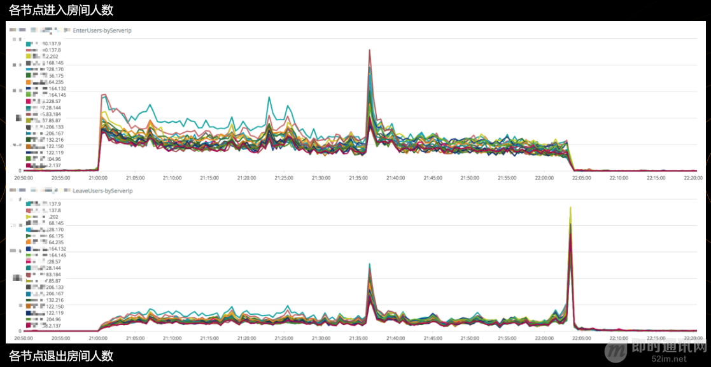

**首次披露：快手是如何做到百万观众同场看直播仍能秒开且不卡顿的？**

## 1、前言

移动视频直播经过2016年的井喷期，已经进入下半场，大家的关注点已经从如何构建完善的直播平台的粗放增长阶段，转入精细化运营阶段。如何在巨大的流量、复杂的应用场景、复杂的网络条件下，持续优化用户体验，是业界十分关注的话题。

快手拥有5亿注册用户，单个直播间人数峰值已经超过180万，他们针对海量用户，基于大数据技术，在首屏和流畅度优化上做了大量的探索与实践。快手直播是如何设计全链路质量监控方案、如何搭建大数据处理Pipeline 、如何解决开播跳帧、首屏卡顿优化等问题的？本文干货满满，全面解密快手直播大数据技术架构与优化实践。

**注：**来文整理自快手软件工程师罗喆在ArchSummit深圳2017上的演讲，演讲原题为《[快手在大数据驱动下的直播体验优化](https://v.qq.com/x/page/e0535r60kln.html)》，感兴趣的读者可[点击观看罗喆现场演讲视频](https://v.qq.com/x/page/e0535r60kln.html)。

## 2、分享者

**罗喆**，快手 软件工程师，最早加入快手的视频技术工程师，负责移动直播系统的构建和调优，并且搭建了基于大数据的质量监测系统。 加入快手之前在腾讯从事实时视音频传输优化工作。

## 3、开场白

s
大家下午好，我是罗喆，来自快手，过去的一年多我在快手做直播的体验优化相关的工作。今天给大家分享的主题是快手如何在大数据的驱动下来优化直播的质量。

加入公司这一年多，公司的注册用户和日活每天都刷新峰值，到现在，快手的注册用户已经超过5亿，短视频数量已经超过了int32所能存储的数字的上限，也就是21个亿，日活跃用户数也已经达到6500万，而且还处于高速增长的趋势之中。

快手的直播业务2016年初上线，我们的直播业务和别的直播平台很不一样，那就是快手的直播是面向普通人的直播，而不是只有网红大V；快手的直播内容，也大多是常见的生活场景，非常多样化，这样的模式也决定了快手直播需要考虑的业务场景更复杂。

目前，快手的直播业务量迅速增长，单个直播间的观看人数峰值，最高时超过了百万人。（8月7日，在用户“MC天佑”的直播中，快手单个直播间同时在线人数最高超过了180万。）那么，我们是如何在庞大的用户基数下保证直播的流畅度呢？我将从四个方面进行解析。

## 4、快手直播面临的挑战与解决方案

### 1快手直播的特点和挑战

**快手直播有四个显著的特点，这些特点给快手带来了机遇，也让我们面临着巨大的挑战：**

- 一是随着直播业务的不断发展，用户对直播的体验要求越来越高，需要做精细的人群优化；
- 二是快手主要是面向普通人的直播，场景丰富真实，也带来一些问题，比如用户的网络情况非常复杂；
- 三是用户基数大，直播的流量巨大，为了业务的稳定性，必须采用多家供应商CDN，也带来了管理和业务上的复杂性；
- 四是不同场景的直播要求不一，我们需要在不同的场景下面对清晰or流畅、首屏秒开or低延时这样的矛盾选择。这样的业务特性下就会带来体验问题多样化、不同CDN之间的需求协调周期长，以及网络环境复杂多变的问题。

### 2数据驱动的优化方法论

**针对线上纷繁复杂的直播体验问题，快手视频团队在实践过程中总结出了一套数据驱动的优化方法论，归纳一下有三点：**

- **首先是区分痛点，设置优先级：**
  把问题分为两类：可以忍受和不能忍受，不能忍受的诸如播放失败、绿屏和黑屏等，这种影响功能可用性的问题定位高优先级，快速处理；可以忍受的包括卡顿、清晰度、延时等能看但用户体验不好的设置普通优先级，持续优化。
- **其次是制定优化方案：**
  问题出现后，定制一个合理的优化方案，这里可能涉及到多方，有快手需要解决的问题，也有CDN服务商需要解决的问题，需要合理的排期保证问题有序解决。
- **第三步是灰度验证或AB测试：**
  解决问题之后通过观测全网的数据进行灰度验证，确保方案是真正有效了之后，才全量上线。

### 3快手直播全链路质量监控

这套方法论的基础是数据，那么，快手直播到底用到哪些数据，怎么判断用户的播放体验是否OK呢？

**下面先介绍一下快手的直播系统端到端的处理流程（见下图）：**

- 视音频信号实时采集；
- 经过预处理和音视频编码；
- 封装发送到CDN源站；
- 播放端从CDN边缘拉到数据；
- 然后进行解码；
- 经过音视频同步之后；
- 给观众展现出来。

**我们在推流端和播放端分别做了非常完善的质量监测体系（见下图）：**

- 在推流端，数据的源头是摄像头采集到的画面和麦克风采集到的声音，不同的机型和系统，摄像头和麦克风的能力完全不同，所以我们首先对摄像头的分辨率、帧率、机型等关键信息进行收集；
- 接下来是视频前处理的过程，比如去噪、美颜、特效等，这些都是非常耗CPU和内存资源的操作，所以这个环节对CPU和内存的占用做了详细的上报；
- 前处理之后会进行视频编码，视频编码的质量影响整个视频的观看体验，对视频编码器，主要是上报了视频编码的客观质量和编码器的输出帧率；
- 音频数据的采集编码过程和视频类似；
- 编码完成之后的数据会进行协议封装，然后进入码率自适应模块，码率自适应模块的功能主要是调整输出码率以适应用户的网络带宽，在用户网络变差的时候，自适应模块会主动丢弃一些数据以降低对网络的压力，推流端的卡顿也主要是发生在这里，所以在这里对自适应模块的输出码率，丢帧数量，卡顿次数都做了详尽的统计；
- 数据最后到达到CDN服务商的源站，CDN服务商分配的源站节点是否合理，是否和用户在同一地域，同一运营商，都直接影响到用户的连接质量，所以源站节点的地理位置和运营商信息，也是对质量评价非常重要的信息。

**我们再来看看拉流（播放）端，拉流端整体的流程和推流端是一个反过来的流程（见下图）：**

- 客户端先经过DNS解析，连接到CDN的边缘节点，和推流端类似，需要对DNS解析时间，边缘节点的运营商、地理位置、RTT值等关键信息进行采集；
- 从CDN边缘节点拿到的http-flv数据会先经过解封装送到接收缓冲区，在这个阶段可以对CDN服务节点的首包时间，发送至接收的端到端延时进行统计；
- 接收缓冲区的长度决定了拉流端的网络抗性，这里可以采集到卡顿的次数和时长，缓冲区本身的长度也是需要监控的点；
- 数据从缓冲区输出，会分别进行音频和视频的解码，经过音视频同步，进入播放环节。这里从拉流启动到播放出第一帧画面的时间就是首帧时间。

这些复杂的过程在用户点击一个直播之后，绝大部分情况下在几百毫秒以内就会完成，我们也进一步分解了首帧各个环节的时间，能够对它进行深入的分析和优化。

## 5、直播质量数据处理Pipeline

在提取了详细的质量数据之后，接下来就是后端处理的事情了，我将从直播质量数据处理Pipeline、用户体验质量数据&服务质量数据、数据可视化监测流程三个角度为大家全面解析快手是如何发现直播当中的问题，以及是如何解决的。

### 1直播质量数据处理流程

**下图是快手现在所使用的直播数据处理Pipeline，可以很清晰的看到整个流程为数据采集→数据缓存→数据分类处理→数据索引/展示：**

我们具体看看这个流程的工作细节，数据从快手APP收集，然后经过上报服务器的简单处理之后，会存到Kafka的Topic里面，Kafka是非常可靠的数据队列服务，只要Kafka的机群够多，即使部分机器宕了数据都不会丢的。

**接下来，Kafka的数据会分出两条处理路径：**

- 第一条是实时路径，数据先经过Flink的清洗，写入Elastic Search集群，使用Kibana做数据可视化。这条路径主要是服务于实时数据分析、报表展示和监控报警，延迟控制在分钟级别，数据只保存数周；
- 另外一条是传统的批处理路径，数据先经过Hadoop集群的定期处理，注入放到Hive数据库。这是一个典型的非实时数据处理系统，延迟是小时级别的，还没有办法做到分钟级，或者秒级的实时，这条路径主要是用来处理当天的、或者当月的海量数据，最后输出一些非实时的报表。比如说一天的卡顿情况、一个月、几个月的卡顿曲线这样的数据，数据是全量保存数年的。

快手每天经过这个系统处理的直播相关的数据，在百亿条的量级，直播相关的所有的数据展示和监控都依赖于这整个Pipeline，要在分钟级要求下，支持各种业务查询需求，保证系统的平稳运行，是很不容易的。

### 2用户体验质量&服务质量

采集到了数据并且对数据进行清洗入库之后，怎么去分析数据呢？

**我们把数据可视化的监测分为两类：**

- 一类是用户体验质量（QoE，Quality of Experience），我们把它定义为一种和用户主观感受相关的数据，如同时直播房间数、直播同时在线人数、直播跳出率等，这些数据的波动有可能是技术问题导致的，也有可能是因为直播内容不符合观众预期，可以综合反映出用户对直播体验的主观感受。并且，这几项用户体验指标反映的是整体的趋势，如果真的出现技术性的问题，靠这些指标是无法追踪问题的源头的。举例来说，如果我们发现直播同时在线观看的人数降了，但这只能说明有问题，具体问题在哪里，什么原因导致的则需要通过第二类指标；
- 第二类指标：服务质量（QoS， Quality of Service）数据来进一步分析。服务质量数据是纯客观的，反映的是技术性的指标，比如下面这张示意图，是一个以时间维度的各CDN服务商的卡顿率曲线；QoE指标的波动未必一定是QoS的数据波动导致的，QoS的数据波动也不是一定会导致QoE数据的变化，比如卡顿率可能会上升，但是在可接受的范围内，同时在线人数不一定会有大的变化。

### 3数据可视化监测流程

我们以下图的“进入房间人数”和“退出房间人数”分析，说明一下我们是怎么做联合QoE数据和QoS数据进行监测和分析的。

首先看看QoE数据，左上角是快手某次直播房间的同时在线人数曲线，在直播过程中在线人数有一个“掉坑”的现象，右下角的“退出房间人数”曲线显示在九点三十多分有一个峰值，说明有大量用户退出房间，我们推测这里可能发生了某些问题导致了观看人数的大量减少，有可能是非技术性的，比如主播做了一件事情观众们不太喜欢，会导致观众大量流失。

奇怪的是，右上角的“进入房间人数”曲线显示，进入房间在同样时刻也有一个峰值，这个时候说明虽然有大量用户退出了房间，但是同时也大量的进入了该房间。

这里我们可以通过QoE数据得出一些结论，这一次观众大量退出，应该不是由于直播内容导致的，而是快手的直播服务有问题导致的，因为观众大量退出同时也大量进入，是因为观众觉得重新打开直播可能可以解决问题，退出直播并不是因为他们不再想看这个直播了 。

为了证实这个判断，我们观测QoS数据曲线。下图两条曲线是所有CDN节点进入房间人数曲线和退出房间曲线，可以看到在用户大量退出的时候，基本上各个CDN节点都会有大量的退出和进入，而不是只有少数节点才有这个行为，这样就可以进一步判断应该不是个别拉流节点的问题的问题，极有可能是主播推流发生了问题。

之后我们联合CDN把主播的录像和推流曲线拿到之后，基本上可以断定主播当时的网络发生了抖动，导致短暂的卡顿，之后又立刻恢复，短暂的卡顿导致观众大量退出直播间。

从这个例子我们可以看出QoE的指标是一个综合衡量指标，它很直观，虽然并不能直接对应到QoS服务质量指标，但我们可以通过它来全局监控，判断是技术还是内容原因出现了体验问题，如果是技术原因，我们再去详细的查看QoS指标的时候就可以查出问题的根源。

## 6、直播系统优化案例

接下来，我将通过开播跳帧优化和httpDNS首屏优化两个例子，以实例说明如何利用大数据做直播系统调优。

### 1拉流端开播的过程

拉流端开播的过程，如前面所述，主要是连接CDN节点拉取数据，数据的解码、渲染这几个步骤。CDN的边缘节点一般都会缓存一部分数据，便于拉流端在任何时刻开始拉流都能拉到数据。

为了让用户尽可能的播放流畅，CDN会尽量的向用户多发一些数据，有时候甚至超过播放端拉流的缓冲区，超过的这部分数据会造成的显著问题是，如果照单全收并且按照正常的速度播，会导致直播延时增大，互动效果变差。

业界公认的互动直播延时标准是小于5秒钟，超过5秒评论礼物互动效果就会变差。因此我们需要在保证延迟的前提下，尽量缩短首屏，提高流畅度。

如上图，拉流端接收缓冲区长度一般等同于延时，我们把它的长度设置为5s，如果CDN下发的数据大于了接收缓冲区的长度，假设超过的部分是4秒，那么如果不做任何处理，正常播放的延时是5秒加4秒等于9秒，9秒的延时在直播过程中基本上没办法做评论或者交互，体验很差。于是我们一开始尝试从客户端来单独解决这超出的部分数据导致的问题。

我们尝试了两种的解决办法：直接快进和跳帧，直接快进的方案就是将超过的部分数据快速的播放过去，视频和声音都被加速播放了，这个方案上线之后很快就收到了用户的投诉，怀疑快手的直播是假直播，真正的直播怎么会出现“快进”的现象。

然后我们修改了方案，将超出的部分数据直接跳过不进行播放，但是这又带来了新的问题，直接跳帧会导致用户的声音和画面出现突变，主播可能从画面的左边突然出现在画面的右边，体验也不是很好。总之，只在客户端做优化无法做到体验的最优。

### 2开播跳帧优化

由于导致这个问题的真正原因是CDN下发数据过多导致的，为了做到最优的体验，必须和CDN联合优化。这时，快手的多CDN策略带来一个新的问题：各家CDN开播下发数据的策略完全不同， 在开播时下发的数据长度都不一样，很难定量的评价哪一家CDN做的更好一些。

于是制定统一的评价标准成为第一个要解决问题，这里快手使用“开播前10秒跳帧时长”作为衡量CDN下发数据长度的标准，具体是指拉流端播放的前10秒内丢弃数据的总时长。

在制定统一的评价标准之后，通过线上数据观察各家CDN的跳帧指标，尝试让各CDN优化自己的指标，尽量接近最优的那一家。但是由于各CDN的开播策略都大不相同，可配置参数也完全不一样，不同的CDN之间很难做到数据完全一致。而且即使是指标最优的CDN也无法将开播前10s调整时长调整到让快手满意的程度。

于是，统一各家CDN开播数据下发策略成为第二个要解决的重要问题。

我们设计了一套统一的开播数据下发策略，让各家CDN都按照这个方案来实现。该方案总的来说遵循三个原则：

- \1. 下发数据长度不能超过快手拉流端接受缓冲区长度；
- \2. 必须从一个GOP（Group of Pictures）的开始下发；
- \3. 在不违背前面两点的情况下，下发尽可能多的数据。

**上图是两个根据服务端缓存的不同GOP结构，决定下发数据策略的实际case，假设快手拉流端接收缓冲区长度是5秒：**

- 第一个例子：
  如果从第一个GOP开始下发数据，总数据长度6.5s，大于快手接受缓冲区长度，所以只能从第二个GOP开始下发，总数据长度是4.5s，在缓冲区长度的限制下，做到了下发数据长度最大；
- 第二个例子：
  如果从第二个GOP的开始下发，数据长度已经达到6s，那么只能从最后一个GOP的开始下发，数据长度3s，在接受缓冲区长度限制范围内。

如上图提示，制定了统一的开播数据下发策略之后，在多家CDN分别上线灰度，对比观察各家CDN覆盖节点和未覆盖节点的数据，然后逐步扩大灰度范围直至全量上线。对比优化前的日均值，开播前10s跳帧时长从1500ms降低至200ms。

如上图所示，经过上一轮的CDN端优化之后，观察全网的开播跳帧数据，各家CDN的指标保持在相同的水平（开播10秒平均跳帧200ms左右），基本可以判断CDN端的优化已经到了瓶颈，客户端能否进一步优化解决掉最后的200ms呢？这里快手使用了缓慢快进的方案：将多余的200ms在用户无感知的情况下，进行加速播放，控制缓冲区的大小。

如上图所示，只要将加速程度控制在一定范围内，用户基本是没有察觉的，而正常播放时长为200ms的数据，经过加速，能很快的播放完，之后就恢复成正常速度播放，这样就保证了不会再有跳帧的现象，最后的AB TEST数据显示开播跳帧时长完全为0，而卡顿情况也有比较明显的降低。

**在解决了开播跳帧的问题之后，我们来回顾一下开播跳帧优化的整个过程（如下图所示）：**

- 统一评价标准。我们使用了多家厂商的CDN服务，为了能公平的衡量各家的开播下发数据的长度，也为了能观察后续的优化效果，快手设计了一个统一的可以定量统计的指标：开播前10s跳帧时长；
- 统一CDN端策略。在统一评价标准之后，快手的方案是统一各家CDN的数据下发策略，这个策略由快手来统一设计，让各家CDN实现，随后做灰度测试和对比，通过数据来分析CDN实现效果。通过这一步，将1500ms的延时优化到200ms；
- 客户端进一步优化。经过上一步的优化之后，开播跳帧长度并没有完全消除，而CDN端的优化手段有限，这时再尝试客户端优化掉最后的200ms。我们选择在客户端实施缓慢快进方案，让用户察觉不到播放速度的变化，但是快速的把这200ms消耗掉，通过AB TEST观察数据，然后全量上线。

在这整个过程中可以明显看到对快手整个数据平台的测试监控和统计的依赖，无论是评价CDN的质量，还是CDN优化后的对比测试，客户端的AB TEST效果验证，都需要观察对比全网的数据，才能确认优化效果，证明确实完美解决了跳帧问题。

### 3httpDNS首屏优化

我们要分享的第二个优化点是首屏的优化，首屏的整个过程，大致可以分为下图的这六个步骤，快手对各步骤的耗时做了详尽的分析，分析结果显示，DNS解析其中是最耗时的环节，因此要降低首屏时间，必须先降低DNS解析时间。

传统的DNS解析（业界统称localDNS方案）的过程很简单。整个过程如下图，APP向所在网络运营商的DNS Server发起域名解析的请求，而运营商DNS Server会向CDN的GSLB系统发起递归查询，GSLB通过运营DNS Server所属IP地址判断查询来自于哪个运营商和地理位置，然后返回若干合适的CDN边缘节点IP给它。

这个过程中，APP和CDN之间隔了运营商DNS Server这一层，CDN在分配节点的时候其实没有办法获取任何APP的信息。为了解决传统localDNS调度不精确，容易被劫持等缺点，近年业界起兴起了另一种方案httpDNS。其原理是APP通过HTTP协议直接调用CDN提供的httpsDNS API，获取一组合适的边缘节点IP。

**这两种方案互有优劣：**

- 1.localDNS的优势在于运营商的DNS Server数量较少，对CDN GSLB来说，定位运营商的DNS Server的信息比较容易，虽然粒度比较粗，但大致区域运营商判断还是准确的。
- 2.传统的localDNS解析方式依赖于系统的DNS解析机制，系统一般都有内部缓存导致解析时间不可控，httpDNS方案直接绕开系统DNS解析机制，可以在用户观看直播前就提前解析好节点ip，在真正开播的时候能完全省掉DNS解析时间。当然，localDNS也可以通过自己调用底层解析接口的方式实现域名预解析。
- \3. httpDNS的方案是由APP直接调用CDN的API，请求没有经过运营商中转，可以绕过DNS劫持设备，因此能够有效的防止运营商劫持域名。
- \4. APP直接调用CDN的httpDNS API还有一个好处是CDN能直接获取到APP的出口ip，节点的分配可以做到更加准确合理。问题是在多出口小运营商的情况下，去CDN httpDNS服务器的出口很可能是从电信联通租用的线路，容易误判，而localDNS由于是运营商地区粒度的，反而更容易判断出用户所属运营商。

localDNS和httpDNS各有优劣，而且都有一定的失败率，为了提升DNS解析的成功率，快手的DNS解析方案是localDNS和httpDNS结合使用。

**为了结合localDNS和httpDNS的优点，并且考虑到解析返回的多个CDN边缘节点的优选，快手设计了独特的DNS解析方案：**

- \1. 应用启动，TTL到期，网络切换，前后台切换的时机，通过localDNS和httpDNS分别获取到ip列表；
- \2. 对ip分别进行测速，选择测速结果最好的ip作为拉流节点；
- \3. 在用户真正开始拉流时，直接连接之前已经准备好的节点ip，完全省掉DNS解析时间。我们很快上线这个方案进行了AB TEST，但是结果却并不如预期，使用了新的DNS策略的用户，卡顿上升，观看时长下降，似乎节点优选并没有起到有应有的作用。通过进一步观察数据，发现使用新DNS策略的用户，集中从少数测速结果最优的节点拉流，导致这些节点负载过高，拉流质量反而下降。
- 于是我们对IP优选方案进行了进一步优化，测速后并不是直接选用结果最优的那一个，而是在测试结果可以接受的一定范围内进行随机挑选，这样就避免了大量用户都聚集到少数节点，导致的节点负载不均衡。

**对这个优化方案进行AB TEST，质量数据完全符合预期：**

首屏时间下降了30%，卡顿也有明显改善，节点优选的策略使得连接失败率也下降了2个百分点！一个为了优化首屏而提出的策略，对多个指标都有如此明显的正向影响，是我们一开始没有预料到的。

有关移动端网络的DNS各种杂症，你还可以进一步读一读：《[全面了解移动端DNS域名劫持等杂症：技术原理、问题根源、解决方案等](http://www.52im.net/thread-2121-1-1.html)》。

## 7、挑战与规划

**快手的直播业务现在还处于高速发展之中，对流媒体大数据分析平台也提出了新的挑战：**

- 从数据规模上看，用户规模的增长和业务类型的不断丰富造成了数据规模的指数级增长，对数据处理能力的要求也越来越高；
- 从实时性上来看，直播业务对数据的实时性要求也越来越高，质量监控，数据分析都需要处理的越快越好；
- 从分析深度上来看，指标质量监控、产品业务分析都对数据监控的维度和粒度提出了更高的要求，维度会越来越多，粒度会越来越细。

为了应对这些挑战，我们会持续加强投入，完善数据方面的核心能力。

在大数据平台之上，从整个直播体验优化层面来看，为了真正做到用户体验的端到端可控，我们需要有能力深入所有环节监测和调优。

**因此快手将建设核心技术能力作为下一步优化的基础：**

- 首先，快手会自建源站以取代CDN的源站收流服务，有了自建源站，快手流媒体大数据平台可以做到音视频传输全流程实时，智能的监控；
- 目前在业内广泛使用的rtmp推流协议在移动弱网环境下优化的手段很有限，有了自建源站，在推流端，快手将使用私有的推流协议，弱网的传输能力将大大加强；
- CDN的调度也将更加灵活，可以根据地域和运营商各CDN实时服务质量数据，进行动态的智能的流量调度。

## 8、写在最后

快手的直播业务仍在高速增长，用户数量快速的上涨对服务质量有更高的要求，流媒体大数据平台是各项视频业务的一个基础平台，需要提供完善且稳定的数据收集，数据处理，数据监控，数据分析等服务。

为了应对业务挑战，我们会持续扩充完善数据基础架构，扩张相关技术团队，欢迎更多有大数据平台实战经验，对流媒体大数据分析和优化感兴趣的牛人加入快手的视频技术团队。相信在未来，快手的流媒体大数据平台能更好的服务用户，达成快手记录世界的愿景。

## 9、本文对应的演讲稿下载