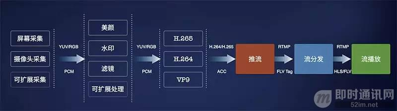

**移动端实时音视频直播技术详解（一）：开篇**

## 1、引言

随着互联网用户消费内容和交互方式的升级，支撑这些内容和交互方式的基础设施也正在悄悄发生变革。手机设备拍摄视频能力和网络的升级催生了大家对视频直播领域的关注，吸引了很多互联网创业者或者成熟企业进入该领域。

本文由七牛云技术团队原创分享，结合实时流网络 LiveNet 和直播云解决方案的实践，将用七篇文章，更系统化地介绍当下大热的视频直播各环节的关键技术，帮助视频直播创业者们更全面、深入地了解视频直播技术，更好地技术选型。

本文是《移动端实时音视频直播技术详解》系列文章之第一篇，我们将从整体介绍直播中的各个环节。

## 2、系列文章

**本文是系列文章中的第1篇，本系列文章的大纲如下：**

- 《[移动端实时音视频直播技术详解（一）：开篇](http://www.52im.net/thread-853-1-1.html)》（本文）
- 《[移动端实时音视频直播技术详解（二）：采集](http://www.52im.net/thread-955-1-1.html)》
- 《[移动端实时音视频直播技术详解（三）：处理](http://www.52im.net/thread-960-1-1.html)》
- 《[移动端实时音视频直播技术详解（四）：编码和封装](http://www.52im.net/thread-965-1-1.html)》
- 《[移动端实时音视频直播技术详解（五）：推流和传输](http://www.52im.net/thread-967-1-1.html)》
- 《[移动端实时音视频直播技术详解（六）：延迟优化](http://www.52im.net/thread-972-1-1.html)》

## 3、音视频采集

采集是播放环节中的第一环，iOS 系统因为软硬件种类不多，硬件适配性较好，所以比较简单。Android 则不同，市面上硬件机型非常多，难以做到一个库适配所有硬件。PC 端的采集也跟各种摄像头驱动有关，推荐使用目前市面上最好用的 PC 端开源免费软件 OBS。

## 4、音视频处理

「80% 的主播没有美颜根本没法看。」不光是美颜，很多其它的视频处理如模糊效果、水印等也都是在这个环节做。目前 iOS 端比较知名的是 GPUImage 这个库，提供了丰富端预处理效果，还可以基于这个库自己写算法实现更丰富端效果。Android 也有 GPUImage 这个库的移植，叫做 android-gpuimage。同时，Google 官方开源了一个伟大的库，覆盖了 Android 上面很多多媒体和图形图像相关的处理。

## 5、音视频编码

**编码主要难点有两个：**

- 处理硬件兼容性问题。
- 在高 fps、低 bitrate 和音质画质之间找到平衡。

iOS 端硬件兼容性较好，可以直接采用硬编。而 Android 的硬编的支持则难得多，需要支持各种硬件机型，推荐使用软编。

## 6、推流和传输

**传输涉及到很多端：**

- 从主播端到服务端；
- 从收流服务端到边缘节点；
- 以及再从边缘节点到观众端。

推流端和分发端理论上需要支持的并发用户数应该都是亿级的，不过毕竟产生内容的推流端在少数，和消费内容端播放端不是一个量级，但是他们对推流稳定性和速度的要求比播放端高很多，这涉及到所有播放端能否看到直播，以及直播端质量如何。

很多人吐槽现在的 CDN 不靠谱，我也承认传统的 CDN 在新时代显得心有余力不足。你能够借助 CDN 快速实现大规模的流分发，但是稳定高速的推流上传可能还需要自己做很多工作。因此，我们打造了一个直播专属的实时流网络，接下来我们会重点介绍这个网络和传统 CDN 的差别。

## 7、实时音视频转码

为了让主播推上来的流适配各个平台端各种不同协议，需要在服务端做一些流处理工作，比如转码成不同格式支持不同协议如 RTMP、HLS 和 FLV，一路转多路流来适配各种不同的网络状况和不同分辨率的终端设备。

同时，为了配合一些运营需求，比如一些监管部门的要求，我们在服务端也提供了内容识别如鉴黄的功能。

## 8、解码和渲染

解码和渲染，也即音视频的播放，目前 iOS 端的播放兼容性较好，在延迟可接受的情况下使用 HLS 协议是最好的选择，我们也提供了能够播放 RTMP 和 HLS 的播放器 SDK。Android 的硬件解码和编码一样也存在兼容性问题，目前比较好的开源播放器是基于 ffplay 的 ijkplayer，我们也基于此实现了一个更好的 Android SDK。

除了 SDK 的介绍之外，我们将重点介绍播放器的原理，以及现代视频播放器的基本架构。

## 9、直播场景化解决方案

除了整个直播流程的介绍之外，我们将围绕当下最火的直播场景如社交直播和游戏直播，介绍它背后的技术方案。这些技术方案不仅涉及到七牛这样的直播基础服务，还可能涉及到和场景相关的其它技术，如社交直播下的聊天、点赞和弹幕的支持。

## 10、下篇内容提要

在下一篇连载中，我们将详细介绍下直播播放环节的前两个环节：采集和处理。

- 面对市场上各种视频采集源，直播应用开发者应该如何去完整的覆盖？
- 市场上主播的各种需求如美颜、水印、连麦互动等该怎么去满足？

尽请期待。