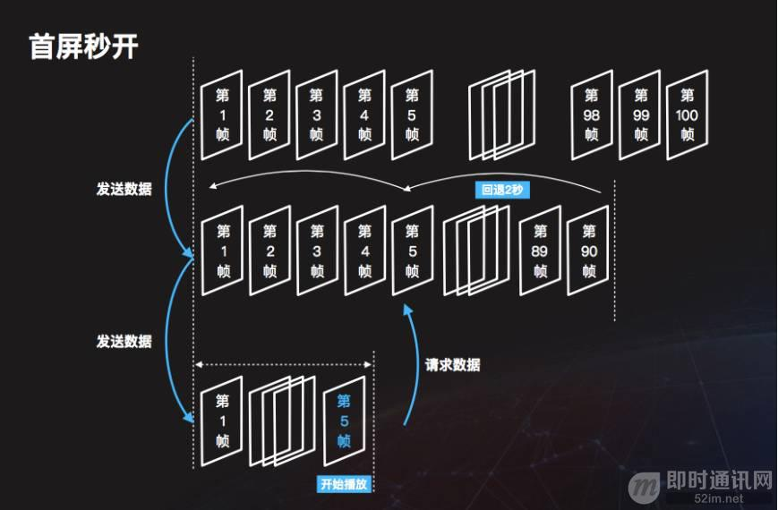
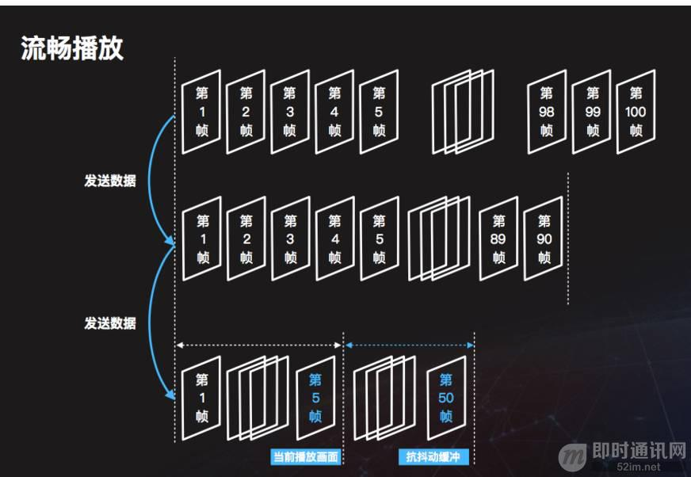
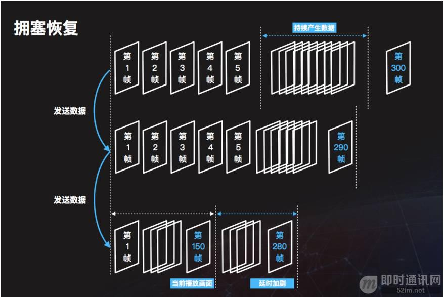
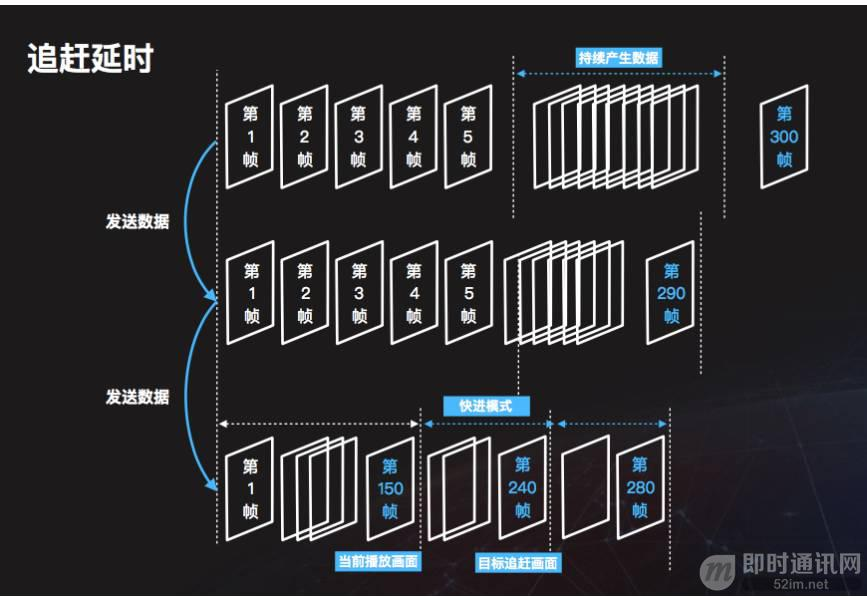

**浅谈实时音视频直播中直接影响用户体验的几项关键技术指标**

## 前言

这两年互联网领域的一个热门关键词就是实时音视频直播，从刚开始的游戏直播和秀场娱乐开始，实时音视频直播带来了远超传统互动的用户体验，现在实时音视频直播已逐渐深入当今主流的互联网应用形态里。

**本文将聊一聊实时音视频直播的几个关键技术：**

- **清晰度：**
  4K、1080p、720p，这些概念被各大电视机厂商炒作了这么多年，已经地球人都懂了。4K在互联网视频直播里现在还不普及，主要是对网络数据传输要求太高了。1080p在一些对清晰度要求较高的场景如游戏直播里已经慢慢普及，要求的数据传输速率大约在4Mbps左右。720p是现在直播的主流清晰度，速率大约在1Mbps左右。在一些要求不太高的领域，还会有540p或者360p出现。
- **流畅度：**
  如果在直播时出现卡顿、转圈，就意味着不流畅。主播和观众的连接通道好比一根水管，流量是有限的，因此如果清晰度提升意味着观众收看直播的流畅度有可能会下降。
- **延时：**
  视频直播都是讲求互动性的，如果跟秀场妹妹聊天，讲了半天都没反应就略坑爹了。但是延时也不全是坏处，适当的延迟意味着在观众端能够有一定的视频流数据缓存，当出现网络不稳定时能够抵御小范围波动而使得观众无感知。
- **首屏时间：**
  当观众进入直播间算起，到出现第一个主播画面的时间叫做首屏时间。为了保证直播流畅，会缓存一段数据之后再开始播放，但这个也不是绝对的，后文会详细描述。

下面，我们将逐一分析和总结实时音视频直播中的这几个重要技术指标。

## 首屏秒开

先从观众进入直播间那一刻说起，这相当于整个直播生命周期的开始。当进入直播间后，播放器会向CDN请求数据。此时，假设主播已经发送视频流数据到了第100帧，由于数据传输的一些延时，CDN端最新收到的数据可能在第90帧。当CDN接收到拉取视频流请求时，他会做一件非常有意思的事情，即往前回溯一段数据，在图中显示的是回溯2秒钟，那就到了视频流的第五帧。CDN会把第五帧开始往后的数据，通过RTMP或其他直播协议源源不断的发送到播放器。那为什么要往回2秒钟呢，这可能算是目前视频直播技术中一个比较有特点的技术优化，能用于很好地平衡流畅度和首屏秒开时间。具体运作机制我们接下来再看。

## 流畅播放

接下去发生的事情，很好地可以说明回退2秒的作用。因为CDN是从第5帧开始发送数据，之后的数据全部缓存在CDN服务器中，因此可以源源不断地把数据发送到客户端，图中显示了从第5帧到50帧之间的数据，全部缓存在播放器内存中。这部分数据可以用于有效的抵抗网络波动造成的影响。当然，这样做的一个缺点是播放器相比于主播，延迟时间增加了2秒。所以说，视频直播所做的事情，就是在延时和流畅度之间找到一个很好的平衡点。

## 网络拥塞

网络拥塞是互联网上最常见的一个情景，接下去讨论当发生网络拥塞时发生的情景。假设当观众播放到第150帧时，用户下行网络出现问题，如果播放器没有新的数据到来，必然会画面卡住并开始转菊花。而此时，主播端并不会感知到这个事情，主播还在正常推送视频流数据。在经过了大概4秒左右的卡顿后，观众端的网络恢复，数据又会源源不断从CDN流向播放器。在图中看到网络流畅时，播放器的缓存中已经存放了第280帧数据，此时当前画面是150帧。这会产生一个什么问题？因为播放器播放数据是按照每一帧的时间戳匀速播放，因此如果不做任何优化就意味着每经过一次卡顿，直播的延迟就会增加一段时间，而增加的时间和被卡住的时间是一致的。

## 延时追赶

经过刚刚的描述，大家一定已经明白了延时累加是一个必须解决的问题。因此，播放器还需要做的事情就是延时追赶。播放器必须要实时侦测缓存中数据的情况，一旦大于某一阈值就启动延时追赶。追赶的方式，可以是直接扔掉多余数据也可以采用快进方式。快进模式相对来说用户体验会好一些，不会产生明显跳跃，处理时要注意声音不要因为快进而产生尖刺。最后再提一下，延时追赶不能太激进，还是应该在缓存中留一段数据，用于缓解以后可能再次发生的网络拥塞。

## 小结

前文描述了首屏启动、流畅播放、网络拥塞、延时追赶的基本概念和每个阶段内部所发生的事情，整个直播就在流畅、拥塞和延时追赶三个阶段中来回往复。看完本文，有兴趣读者可以尝试利用开源软件自己去写个直播APP，可以拿来练手娱乐，如果要上线还有各种其他奇葩的坑。