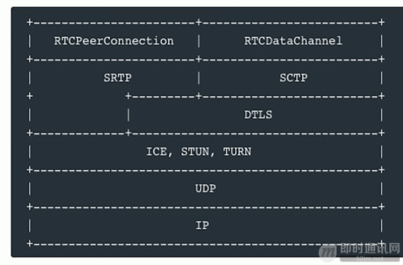
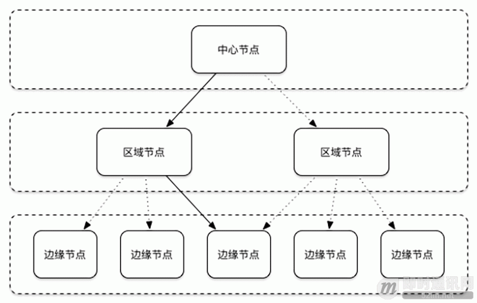
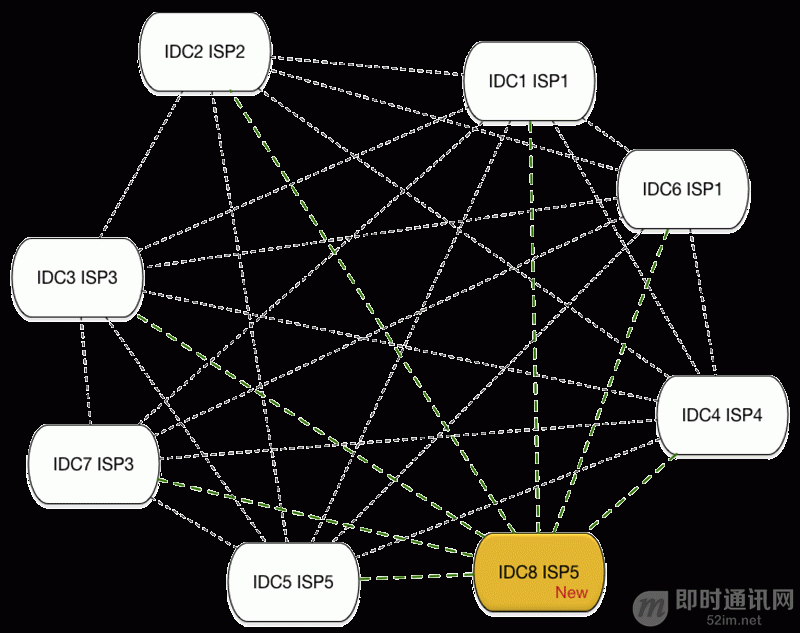
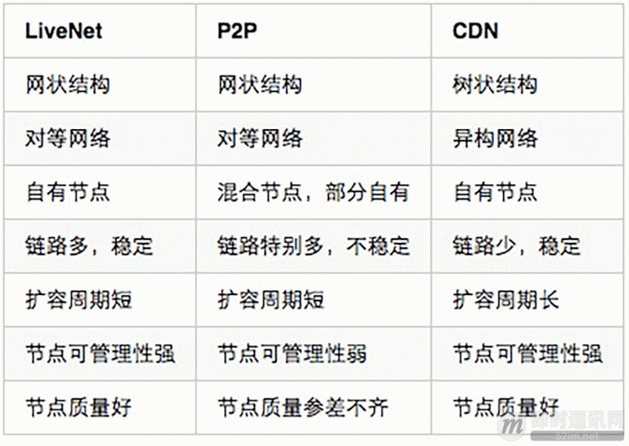

## 前言

在上一期的《[移动端实时音视频直播技术详解（四）：编码和封装](http://www.52im.net/thread-965-1-1.html)》中，我们介绍了讲解编码和封装。 本篇是《移动端实时音视频直播技术详解》系列文章之第五篇：我们将从整体讲解推流和传输。

推流是直播的第一公里，直播的推流对这个直播链路影响非常大，如果推流的网络不稳定，无论我们如何做优化，观众的体验都会很糟糕。所以也是我们排查问题的第一步，如何系统地解决这类问题需要我们对相关理论有基础的认识。

## 2、系列文章

**本文是系列文章中的第5篇，本系列文章的大纲如下：**

- 《[移动端实时音视频直播技术详解（一）：开篇](http://www.52im.net/thread-853-1-1.html)》
- 《[移动端实时音视频直播技术详解（二）：采集](http://www.52im.net/thread-955-1-1.html)》
- 《[移动端实时音视频直播技术详解（三）：处理](http://www.52im.net/thread-960-1-1.html)》
- 《[移动端实时音视频直播技术详解（四）：编码和封装](http://www.52im.net/thread-965-1-1.html)》
- 《[移动端实时音视频直播技术详解（五）：推流和传输](http://www.52im.net/thread-967-1-1.html)》（本文）
- 《[移动端实时音视频直播技术详解（六）：延迟优化](http://www.52im.net/thread-972-1-1.html)》

## 3、推送协议

**下面就先介绍一下都有哪些推送协议，他们在直播领域的现状和优缺点：**

- RTMP；
- WebRTC；
- 基于 UDP 的私有协议。

### 1RTMP

RTMP 是 Real Time Messaging Protocol（实时消息传输协议）的首字母缩写。该协议基于 TCP，是一个协议族，包括 RTMP 基本协议及 RTMPT/RTMPS/RTMPE 等多种变种。RTMP 是一种设计用来进行实时数据通信的网络协议，主要用来在 Flash/AIR 平台和支持 RTMP 协议的流媒体/交互服务器之间进行音视频和数据通信。支持该协议的软件包括 Adobe Media Server/Ultrant Media Server/red5 等。
RTMP 是目前主流的流媒体传输协议，广泛用于直播领域，可以说市面上绝大多数的直播产品都采用了这个协议。

**优点：**

- CDN 支持良好，主流的 CDN 厂商都支持；
- 协议简单，在各平台上实现容易。

**缺点：**

- 基于 TCP ，传输成本高，在弱网环境丢包率高的情况下问题显著；
- 不支持浏览器推送；
- Adobe 私有协议，Adobe 已经不再更新。

### 2WebRTC

WebRTC，名称源自网页即时通信（英语：Web Real-Time Communication）的缩写，是一个支持网页浏览器进行实时语音对话或视频对话的 API。它于 2011 年 6 月 1 日开源并在 Google、Mozilla、Opera 支持下被纳入万维网联盟的 W3C 推荐标准（[有关WebRTC的更多文章点此进入](http://www.52im.net/forum.php?mod=collection&action=view&ctid=5)）。

**目前主要应用于视频会议和连麦中，协议分层如下：**

**优点：**

- W3C 标准，主流浏览器支持程度高
- Google 在背后支撑，并在各平台有参考实现；
- 底层基于 SRTP 和 UDP，弱网情况优化空间大；
- 可以实现点对点通信，通信双方延时低。

**缺点：**
ICE、STUN、TURN 传统 CDN 没有类似的服务提供。

### 3基于 UDP 的私有协议

有些直播应用会使用 UDP 做为底层协议开发自己的私有协议，因为 UDP 在弱网环境下的优势通过一些定制化的调优可以达到比较好的弱网优化效果，但同样因为是私有协议也势必有现实问题。

**优点：**
更多空间进行定制化优化。

**缺点：**

- 开发成本高；
- CDN 不友好，需要自建 CDN 或者和 CDN 达成协议；
- 独立作战，无法和社区一起演进。

## 4、传输网络

我们推送出去的流媒体需要传输到观众，整个链路就是传输网络，类比货运物流就是从出发地到目的地见的所有路程了，如果道路的容量不够，会引发堵车也就是网络拥塞，这时我们会改变路程也就是所谓的智能调度，但是传输网络会站在全局的角度进行调度，所以会比原子世界的调度有更好的效果，可以想象有一个上帝在天空中俯视出发地和目的地间的所有的路况信息，而且还是实时的，然后给出你一条明路，何等的神奇，但这些我们在 LiveNet 中都已经实现了。

这里先回顾一下传统的内容分发网络。

### 1为什么要有内容分发网络，内容分发网络的由来

互联网起源于美国军方的一个内部网络，Tim Berners-Lee 是互联网发明者之一，他很早就预见到在不久的将来网络拥塞将成为互联网发展的最大障碍，于是他提出了一个学术难题，要发明一种全新的、从根本上解决问题的方法来实现互联网内容的无拥塞分发，这项学术难题最终催生出一种革新性的互联网服务——CDN 。当时 Berners-Lee 博士隔壁是 Tom Leighton 教授的办公室，一位麻省理工学院应用数学教授，他被 Berners-Lee 的挑战激起了兴趣。Letghton 最终解决了这个难题并开始自己的商业计划，成立了 Akamai 公司，成为世界上第一家 CDN 公司。

### 2传统 CDN 的架构

上图是一个典型的 CDN 系统的三级部署示意图，节点是 CDN 系统中的最基本部署单元，分为三级部署，中心节点、区域节点和边缘节点，最上面一级是中心节点，中间一级是区域节点，边缘节点地理位置分散，为用户提供就近的内容访问服务。

下面介绍一下 CDN 节点的分类，主要分成两大类，骨干节点和 POP 节点，骨干节点又分为中心节点和区域节点。

逻辑上来讲，骨干节点主要负责内容分发和边缘节点未命中时进行回源，POP 节点主要负责提供给用户就近的内容访问服务。但如果 CDN 网络规模较大，边缘节点直接向中心节点回源会给中间层的核心设备造成的压力过大，在物理上引入区域节点，负责一个地理区域的管理，保存部分热点数据。

### 3直播传输网络有别于传统 CDN 的痛点

随着 Live 时代的到来，直播成为当前 CDN 厂商的又一个主要的战场，那么 Live 时代 CDN 需要支持什么样的服务呢？

- 流媒体协议的支持，包括 RTMP，HLS ，HTTP-FLV 等；
- 首屏秒开，从用户点击到播放控制在秒级以内；
- 1~3 延迟控制，从推流端到播放端，延迟控制在 1~3 秒之间；
- 全球全网智能路由，可以利用整个 CDN 网络内的所有节点为某一单一用户服务，不受地域限制。随着全球一体化进程不断推进，跨区域、跨国家、跨洲的直播正变为常态，很可能主播在欧美，而用户在亚洲；
- 天级别的节点按需增加，中国公司出海已成大势，CDN 需要更多的海外节点，如今比拼的更多的是海外节点可以快速部署，从提出节点增加需求到节点入网提供服务，需要达到一天之内，对 CDN 运维和规划提出非常高的要求。原有的月级别规划和入网满足不了先进的要求。

### 4传统 CDN 的链路路由

CDN 基于树状网络拓扑结构，每一层都有 GSLB (Global Server Load Balancing) 用于同一层内的多个 CDN 节点负载均衡，这样有什么好处呢？

前面提到的众多 CDN 的应用场景中，网页加速、视频加速、文件传输加速，都是同时依赖 GSLB 和 Cache 系统的，Cache 系统是整个 CDN 系统中的成本所在，设计树形结构可以最大化的节省 Cache 系统的资本投入。因为只有中心节点需要保持机会所有的 Cache 副本，向下逐级减少，到了边缘节点只需要少量的热点 Cache 就可以命中大部分 CDN 访问请求，这样极大的降低了 CDN 网络的成本，也符合当时 CDN 用户的需求，可谓双赢。

但是到了 Live 时代，直播业务是流式业务，很少涉及到 Cache 系统，基本都是播完就可以释放掉存储资源，即使因为政策原因有存储的需求也都是冷存储，对于存储的投入相对非常低廉，而且不要求存储在所有节点中，只要保证数据可回溯，可用即可。

我们看看树状网络拓扑，用户的链路选择数量是有限的，如下图，用户在某一个区域内可选择的链路数是：2 * 5 = 10

用户在某一区域内，则 GSLB （通常在边缘节点这一层是 Smart DNS）会把用户路由到该区域内的某个边缘节点，上一层又会路由到某个区域节点（这里的 GSLB 通常是内部的负载均衡器），最后又回溯到中心节点，中心节点会链接源站。

**这里的假设是：**

- 用户能访问的最快节点一定是该区域内的边缘节点，如果该区域没有边缘节点则最快的一定是逻辑相邻的区域内的边缘节点；
- 边缘节点能访问的最快节点一定是该区域内的区域节点，一定不会是其他区域的节点；
- 区域节点到中心节点一定是最快的，这个链路的速度和带宽都是最优的。

但实际真的如此么？引入了如此多的假设真的正确么？

实际上就算理论上我们可以证明以上假设有效，但是节点规划和区域配置大都依赖于人的设计和规划，我们知道人多是不靠谱的，而且就算当时区域规划正确，谁能保证这些静态的网络规划不会因为铺设了一条光纤或者因为某些 IDC 压力过大而发生了改变呢？所以我们可以跳出树状网络拓扑结构的桎梏，探索新的适合直播加速的网络拓扑结构。

**为了摆脱有限的链路路由线路限制，激活整理网络的能力，我们可以把上述的节点变成网状网络拓扑结构：**

我们看到一旦我们把网络结构改成了网状结构，则用户的可选择链路变为：无向图的指定两点间的所有路径，学过图论的同学都知道，数量惊人。

系统可以通过智能路由选择任何一个最快的链路而不用依赖于系统部署时过时的人工规划，无论是某些链路间增加了光纤或者某个 IDC 压力过大都可以实时的反映到整理网络中，帮助用户实时推倒出最优链路。这时我们可以去掉前面的一些假设，通过机器而不是人类来时实时规划网络的链路路由，这种实时大规模的计算任务天生就不是人类的强项，我们应该交给更适合的物种。

### 5CDN 的扩容

前面提到中国公司的出海已成大势，CDN 海外节点的需求越来越大，遇到这种情况需要 CDN 厂商在新的区域部署新的骨干网和边缘节点，需要做详细的网络规划。时代发生变化，原来 CDN 用户都是企业级用户，本身业务线的迭代周期较长，有较长时间的规划，留给 CDN 厂商的时间也比较多。而互联网公司讲究的是速度，双周迭代已成常态，这里面涉及到成本和响应速度的矛盾，如果提前部署节点可以更好的为这些互联网公司服务，但是有较高的成本压力，反之则无法响应这些快速发展的互联网公司。

理想情况是，用户提出需求，CDN 厂商内部评估，当天给出反馈，当天部署，客户当天就可以测试新区域的新节点。怎么解决？

答案是基于网状拓扑结构的对等网络，在网状拓扑结构中每个节点都是 Peer ，逻辑上每个节点提供的服务对等，不需要按区域设计复杂的网络拓扑结构，节点上线后不需要复杂的开局过程，直接上线注册节点信息，就可以对用户提供服务了,结合虚拟化技术前后时间理论上可以控制在一天之内。

### 6回归本质：LiveNet

我们知道最早的互联网就是网状拓扑结构，后来才慢慢加入了骨干网来解决各种各样的问题，我们是时候该回归本质，拥抱下一代 Live 分发网络：LiveNet 。

**总结前面的讨论，我们发现 Live 时代我们需要的内容分发网络是：**

- 对 Cache 的要求没有以前那么高；
- 对实时性的要求非常高；
- 对节点运维的要求高，要更智能，尽量减少人工干预；
- 对扩容这种运维事件响应度要求非常高。

**要做到如上几点，我们需要：**

- **去中心化，网状拓扑：**
  网状拓扑结构是设计的根本和基础，只有看清了我们对 Cache 需求的降低，网状拓扑结构才更有优势。
- **全球全网调度：**
  基于全球一张网，不在受限于区域网络调度，将调度的范围从区域网络扩展到全球，全网内的节点都可以响应用户的请求，参与链路路由，不再先由人工假设选定一部分节点进行路由，去掉人工干预，让整个系统更智能。
- **节点无状态，节点对等：**
  LiveNet 节点无状态和节点对等都方便了运维，去掉了区域概念后的全球一张网让整个拓扑结构变的异常复杂，如果各个节点间有先后依赖关系，势必让运维成为噩梦，需要专有的服务编排系统，同时也给扩容带来困难，需要运维人员设计复杂的扩容方案，需要预演多次才敢在复杂的网络拓扑中扩容。当时如果节点本身对等且无状态，则运维和扩容都变的容易很多。但整个系统在运行过程中还是会一些状态和数据需要保持，比如某些 Live 内容需要落地回放的需求，这些通过久经考验的七牛云存储来存储。
- **智能运维：**
  智能运维建立在以上的「网状拓扑结构的对等网络」的基础上会变的容易的多。可以方便的下线有问题的节点而不影响整个 LiveNet 网络，可以方便快速的上线新节点，提升系统容量。通过节点的数据分析可以更好的了解整个网络的整体状态。

以上这些就是 LiveNet 设计时候的斟酌，让运维更自动化，系统运行高度自治，依赖机器计算而不是人工判断，下面分别介绍一下。

**下面列举部分 LiveNet 采用的智能运维方案，让内容分发网络再次升级，以符合 Live 时代的要求：**

- 监控节点健康状况，实时下线有问题的节点；
- Failover 机制，保证服务一直可用；
- 快速扩容。

### 7LiveNet VS P2P

**最后我们和 P2P 网络做一个对比：**

我们发现 P2P 方案，节点的可控性和链路的稳定性上还有很大提升空间，比较适合在实时性要求不高的场景使用、适合长尾需求，在 Live 的场景下面多是对实时性要求比较高的重度用户，无法忍受频繁的 FailOver 和节点质量参差不齐带来的网络抖动，但是如果是文件分发就比较适合用这种混合方案，可以有效降低 CDN 厂商成本，利用共享经济提高资源利用率。

## 5、下篇内容提要

这篇介绍了推送和传输网络部分，我们已经把流媒体送到了观众的终端中，下一步就是把它展现在屏幕上了，想了解这部分内容请继续关注我们的下一篇内容。