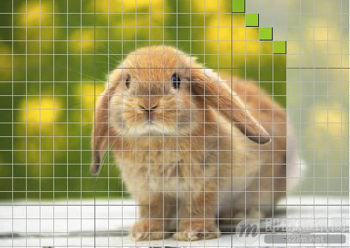
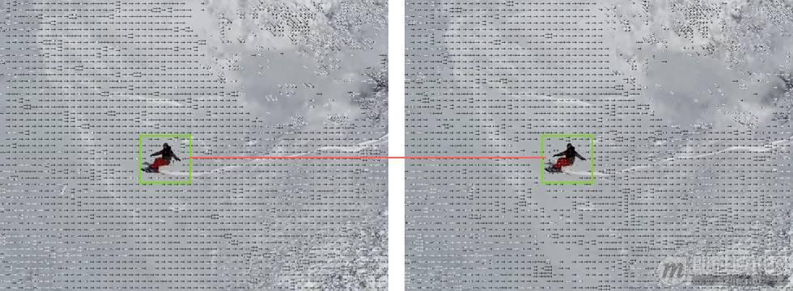
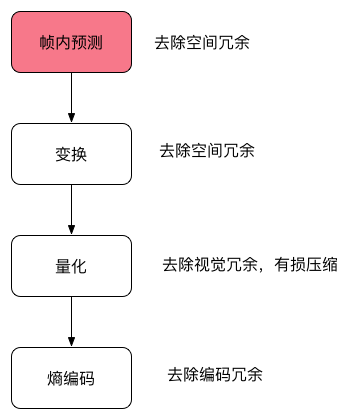
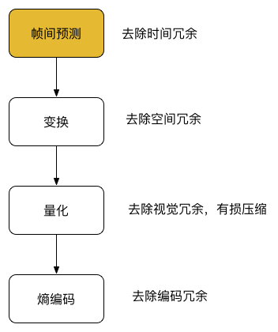
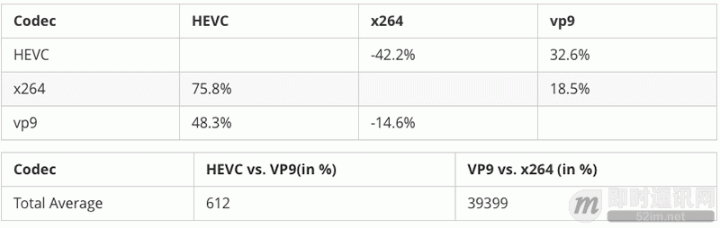

**移动端实时音视频直播技术详解（四）：编码和封装**

## 1、前言


在上一期的《[移动端实时音视频直播技术详解（三）：处理](http://www.52im.net/thread-960-1-1.html)》中，我们介绍了讲解常见视频处理功能如美颜、视频水印、滤镜、连麦等。 本篇是是《移动端实时音视频直播技术详解》系列文章之第四篇：我们将从整体讲解编码和封装。

视频编码是本系列一个重要的部分，如果把整个流媒体比喻成一个物流系统，那么编解码就是其中配货和装货的过程，这个过程非常重要，它的速度和压缩比对物流系统的意义非常大，影响物流系统的整体速度和成本。同样，对流媒体传输来说，编码也非常重要，它的编码性能、编码速度和编码压缩比会直接影响整个流媒体传输的用户体验和传输成本。

## 2、系列文章


**本文是系列文章中的第4篇，本系列文章的大纲如下：**


- 《[移动端实时音视频直播技术详解（一）：开篇](http://www.52im.net/thread-853-1-1.html)》
- 《[移动端实时音视频直播技术详解（二）：采集](http://www.52im.net/thread-955-1-1.html)》
- 《[移动端实时音视频直播技术详解（三）：处理](http://www.52im.net/thread-960-1-1.html)》
- 《[移动端实时音视频直播技术详解（四）：编码和封装](http://www.52im.net/thread-965-1-1.html)》（本文）
- 《[移动端实时音视频直播技术详解（五）：推流和传输](http://www.52im.net/thread-967-1-1.html)》
- 《[移动端实时音视频直播技术详解（六）：延迟优化](http://www.52im.net/thread-972-1-1.html)》


## 3、视频编码的意义


- 原始视频数据存储空间大：一个 1080P 的 7 s 视频需要 817 MB；
- 原始视频数据传输占用带宽大：10 Mbps 的带宽传输上述 7 s 视频需要 11 分钟。


而经过 H.264 编码压缩之后，视频大小只有 708 k 、10 Mbps 的带宽仅仅需要 500 ms ，可以满足实时传输的需求，所以从视频采集传感器采集来的原始视频势必要经过视频编码。

## 4、基本原理


那为什么巨大的原始视频可以编码成很小的视频呢？这其中的技术是什么呢？

**核心思想就是去除冗余信息：**


- **空间冗余：**图像相邻像素之间有较强的相关性；
- **时间冗余：**视频序列的相邻图像之间内容相似；
- **编码冗余：**不同像素值出现的概率不同；
- **视觉冗余：**人的视觉系统对某些细节不敏感；
- **知识冗余：**规律性的结构可由先验知识和背景知识得到。


视频本质上讲是一系列图片连续快速的播放，最简单的压缩方式就是对每一帧图片进行压缩，例如比较古老的 MJPEG 编码就是这种编码方式，这种编码方式只有帧内编码，利用空间上的取样预测来编码。形象的比喻就是把每帧都作为一张图片，采用 JPEG 的编码格式对图片进行压缩，这种编码只考虑了一张图片内的冗余信息压缩，如图 1，绿色的部分就是当前待编码的区域，灰色就是尚未编码的区域，绿色区域可以根据已经编码的部分进行预测（绿色的左边，下边，左下等）。





▲ 图 1

但是帧和帧之间因为时间的相关性，后续开发出了一些比较高级的编码器可以采用帧间编码，简单点说就是通过搜索算法选定了帧上的某些区域，然后通过计算当前帧和前后参考帧的向量差进行编码的一种形式，通过下面两个图 2 连续帧我们可以看到，滑雪的同学是向前位移的，但实际上是雪景在向后位移，P 帧通过参考帧（I 或其他 P 帧）就可以进行编码了，编码之后的大小非常小，压缩比非常高。





▲ 图 2

可能有同学对这两张图片怎么来的感兴趣，这里用了 FFmpeg 的两行命令来实现，具体 FFmpeg 的更多内容请看后续章节。

**第一行生成带有移动矢量的视频：**

ffmpeg -flags2 +export_mvs -i tutu.mp4 -vf codecview=mv=pf+bf+bb tutudebug2.mp4


**第二行把每一帧都输出成图片：**

ffmpeg -i tutudebug2.mp4 'tutunormal-%03d.bmp'


**除了空间冗余和时间冗余的压缩，主要还有编码压缩和视觉压缩，下面是一个编码器主要的流程图：**





▲ 图 3





▲ 图 4

图 3、图 4 两个流程，图 3 是帧内编码，图 4 是帧间编码，从图上看到的主要区别就是第一步不相同，其实这两个流程也是结合在一起的，我们通常说的 I 帧和 P 帧就是分别采用了帧内编码和帧间编码。

本节我们梳理了一下编码器的原理和基本流程，编码器经历了数十年的发展，已经从开始的只支持帧内编码演进到现如今的 H.265 和 VP9 为代表的新一代编码器，下节我们将就目前一些常见的编码器进行分析，带大家探索一下编码器的世界。

## 5、编码器的选择之H.264编码


### 1H.264 简介


H.264/AVC 项目意图创建一种视频标准。与旧标准相比，它能够在更低带宽下提供优质视频（换言之，只有 MPEG-2，H.263 或 MPEG-4 第 2 部分的一半带宽或更少），也不增加太多设计复杂度使得无法实现或实现成本过高。另一目的是提供足够的灵活性以在各种应用、网络及系统中使用，包括高、低带宽，高、低视频分辨率，广播，DVD 存储，RTP/IP 网络，以及 ITU-T 多媒体电话系统。

H.264/AVC 包含了一系列新的特征，使得它比起以前的编解码器不但能够更有效的进行编码，还能在各种网络环境下的应用中使用。这样的技术基础让 H.264 成为包括 YouTube 在内的在线视频公司采用它作为主要的编解码器，但是使用它并不是一件很轻松的事情，理论上讲使用 H.264 需要交纳不菲的专利费用。


### 2专利许可


和 MPEG-2 第一部分、第二部分，MPEG-4 第二部分一样，使用 H.264/AVC 的产品制造商和服务提供商需要向他们的产品所使用的专利的持有者支付专利许可费用。这些专利许可的主要来源是一家称为 MPEG-LA LLC 的私有组织，该组织和 MPEG 标准化组织没有任何关系，但是该组织也管理著 MPEG-2 第一部分系统、第二部分视频、MPEG-4 第二部分视频和其它一些技术的专利许可。

其他的专利许可则需要向另一家称为 VIA Licensing 的私有组织申请，这家公司另外也管理偏向音频压缩的标准如 MPEG-2 AAC 及 MPEG-4 Audio 的专利许可。


### 3H.264 的开源实现：OpenH264、x264


OpenH264 是思科实现的开源 H.264 编码，虽然 H.264 需要交纳不菲的专利费用，但是专利费有一个年度上限，思科把 OpenH264 实现的年度专利费交满后，OpenH264 事实上就可以免费自由的使用了。
x264 是一个采用 GPL 授权的视频编码自由软件。x264 的主要功能在于进行 H.264/MPEG-4 AVC 的视频编码，而不是作为解码器（decoder）之用。

**除去费用问题比较来看：**


- OpenH264 CPU 的占用相对 x264低很多；
- OpenH264 只支持 baseline profile，x264 支持更多 profile。


更多文章，请见《[即时通讯音视频开发（十七）：视频编码H.264、VP8的前世今生](http://www.52im.net/thread-274-1-1.html)》、《[即时通讯音视频开发（十三）：实时视频编码H.264的特点与优势](http://www.52im.net/thread-266-1-1.html)》、《[国际电联H.264视频编码标准官方技术手册（中文版）[附件下载\]](http://www.52im.net/thread-264-1-1.html)》、《[即时通讯音视频开发（五）：认识主流视频编码技术H.264](http://www.52im.net/thread-237-1-1.html)》。

## 6、编码器的选择之HEVC/H.265编码


### 1HEVC/H.265 简介


高效率视频编码（High Efficiency Video Coding，简称 HEVC）是一种视频压缩标准，被视为是 ITU-T H.264/MPEG-4 AVC 标准的继任者。2004 年开始由 ISO/IEC Moving Picture Experts Group（MPEG）和 ITU-T Video Coding Experts Group（VCEG）作为 ISO/IEC 23008-2 MPEG-H Part 2 或称作 ITU-T H.265 开始制定。第一版的 HEVC/H.265 视频压缩标准在 2013 年 4 月 13 日被接受为国际电信联盟（ITU-T）的正式标准。HEVC 被认为不仅提升视频质量，同时也能达到 H.264/MPEG-4 AVC 两倍之压缩率（等同于同样画面质量下比特率减少了 50%），可支持 4K 分辨率甚至到超高清电视（UHDTV），最高分辨率可达到 8192×4320（8K 分辨率）。


### 2专利许可


HEVC Advance 要求所有包括苹果、YouTube、Netflix、Facebook、亚马逊等使用 H.265 技术的内容制造商上缴内容收入的 0.5%作为技术使用费，而整个流媒体市场每年达到约 1000 亿美元的规模，且不断增长中，征收 0.5%绝对是一笔庞大的费用。而且他们还没有放过设备制造商，其中电视厂商需要支付每台 1.5 美元、移动设备厂商每台 0.8 美元的专利费。他们甚至没有放过蓝光设备播放器、游戏机、录像机这样的厂商，这些厂商必须支付每台 1.1 美元的费用。最无法令人接受的是，HEVC Advance 的专利使用权追溯到了厂商的「」”，意思是之前已经发售的产品依然要追缴费用。


### 3H.265 的开源实现：libde265、x265


libde265 HEVC 由 struktur 公司以开源许可证 GNU LesserGeneral Public License (LGPL) 提供，观众可以较慢的网速下欣赏到最高品质的影像。跟以前基于H.264标准的解码器相比，libde265 HEVC 解码器可以将您的全高清内容带给多达两倍的受众，或者，减少 50%流媒体播放所需要的带宽。高清或者 4K/8K 超高清流媒体播放，低延迟/低带宽视频会议，以及完整的移动设备覆盖。具有「拥塞感知」视频编码的稳定性，十分适合应用在 3/4G 和 LTE 网络。

x265 是由 MulticoreWare 开发，并开源。采用 GPL 协议，但是资助这个项目的几个公司组成了联盟可以在非 GPL 协议下使用这个软件。

## 7、编码器的选择之VP8


### 1VP8 简介


VP8 是一个开放的视频压缩格式，最早由 On2 Technologies 开发，随后由 Google 发布。同时 Google 也发布了 VP8 编码的实做库：libvpx，以 BSD 授权条款的方式发行，随后也附加了专利使用权。而在经过一些争论之后，最终 VP8 的授权确认为一个开放源代码授权。

目前支持 VP8 的网页浏览器有 Opera、Firefox 和 Chrome。


### 2专利许可


2013 年三月，Google 与 MPEG LA 及 11 个专利持有者达成协议，让 Google 获取 VP8 以及其之前的 VPx 等编码所可能侵犯的专利授权，同时 Google 也可以无偿再次授权相关专利给 VP8 的用户，此协议同时适用于下一代 VPx 编码。至此 MPEG LA 放弃成立 VP8 专利集中授权联盟，VP8 的用户将可确定无偿使用此编码而无须担心可能的专利侵权授权金的问题。


### 3VP8 的开源实现：libvpx


libvpx 是 VP8 的唯一开源实现，由 On2 Technologies 开发，Google 收购后将其开放源码，License 非常宽松可以自由使用。

## 7、编码器的选择之VP9


### 1VP9 简介


VP9 的开发从 2011 年第三季开始，目标是在同画质下，比 VP8 编码减少 50% 的文件大小，另一个目标则是要在编码效率上超越 HEVC 编码。

2012 年 12 月 13 日，Chromium 浏览器加入了 VP9 编码的支持。Chrome 浏览器则是在 2013 年 2 月 21 日开始支持 VP9 编码的视频播放。

Google 宣布会在 2013 年 6 月 17 日完成 VP9 编码的制定工作，届时 Chrome 浏览器将会把 VP9 编码默认引导。2014 年 3 月 18 日，Mozilla 在 Firefox 浏览器中加入了 VP9 的支持。

2015 年 4 月 3 日，谷歌发布了libvpx1.4.0 增加了对 10 位和 12 位的比特深度支持、4:2:2 和 4:4:4 色度抽样，并 VP9 多核心编/解码。


### 2专利许可


VP9 是一个开放格式、无权利金的视频编码格式。


### 3VP9 的开源实现：ibvpx


libvpx 是 VP9 的唯一开源实现，由 Google 开发维护，里面有部分代码是 VP8 和 VP9 公用的，其余分别是 VP8 和 VP9 的编解码实现。


### 4VP9 和 H.264 和 HEVC 比较





### 5HEVC 和 H.264 在不同分辨率下的比较


跟 H.264/MPEG-4 相比，HEVC 的平均比特率减低值为：


- 可见码率下降了 60% 以上；
- HEVC (H.265) 对 VP9 和 H.264 在码率节省上有较大的优势，在相同 PSNR 下分别节省了 48.3% 和 75.8%；
- H.264 在编码时间上有巨大优势，对比 VP9 和 HEVC(H.265) ，HEVC 是 VP9 的 6 倍，VP9 是 H.264 的将近 40 倍。

## 8、编码器的选择之FFmpeg


### 1FFmpeg简介


谈到视频编码相关内容就不得不提一个伟大的软件包 - FFmpeg。

FFmpeg 是一个自由软件，可以运行音频和视频多种格式的录影、转换、流功能，包含了 libavcodec -这是一个用于多个项目中音频和视频的解码器库，以及 libavformat -一个音频与视频格式转换库。

FFmpeg 这个单词中的 FF 指的是 Fast Forward。有些新手写信给 FFmpeg 的项目负责人，询问 FF 是不是代表 Fast Free 或者 Fast Fourier 等意思，FFmpeg 的项目负责人回信说：「Just for the record, the original meaning of FF in FFmpeg is Fast Forward.」

这个项目最初是由 Fabrice Bellard 发起的，而现在是由 Michael Niedermayer 在进行维护。许多 FFmpeg 的开发者同时也是 MPlayer 项目的成员，FFmpeg 在 MPlayer 项目中是被设计为服务器版本进行开发。

FFmpeg 下载地址是https://ffmpeg.org/download.html :
可以浏览器输入下载，目前支持 Linux ,Mac OS,Windows 三个主流的平台，也可以自己编译到 Android 或者 iOS 平台。

如果是 Mac OS ，可以通过 brew 安装：

brew install ffmpeg --with-libvpx --with-libvorbis --with-ffplay


我们可以用 FFmpeg 来做哪些有用有好玩的事情呢？通过一系列小实验来带大家领略 FFmpeg 的神奇和强大。


### 2FFmpeg 录屏


**通过一个小例子看一下怎么在 Mac OS 下面使用 FFmpeg 进行录屏:**

```
输入：``ffmpeg -f avfoundation -list_devices ``true` `-i ``""``输出：``[AVFoundation input device @ 0x7fbec0c10940] AVFoundation video devices:``[AVFoundation input device @ 0x7fbec0c10940] [0] FaceTime HD Camera``[AVFoundation input device @ 0x7fbec0c10940] [1] Capture ``screen` `0``[AVFoundation input device @ 0x7fbec0c10940] [2] Capture ``screen` `1``[AVFoundation input device @ 0x7fbec0c10940] AVFoundation audio devices:``[AVFoundation input device @ 0x7fbec0c10940] [0] Built-``in` `Microphone
```

给出了当前设备支持的所有输入设备的列表和编号，我本地有两块显示器，所以 1 和 2 都是我屏幕，可以选择一块进行录屏。

**查看当前的 H.264 编解码器：**

输入：
ffmpeg -codecs | grep 264
输出：
DEV.LS h264           H.264 / AVC / MPEG-4 AVC / MPEG-4 part 10 (decoders: h264 h264_vda ) (encoders: libx264 libx264rgb )


**查看当前的 VP8 编解码器：**

输入：
ffmpeg -codecs | grep vp8
输出：
DEV.L. vp8            On2 VP8 (decoders: vp8 libvpx ) (encoders: libvpx )


**可以选择用 VP8 或者 H264 做编码器：**

ffmpeg -r 30 -f avfoundation -i 1 -vcodec vp8 -quality realtime screen2.webm
\# -quality realtime 用来优化编码器，如果不加在我的 Air 上帧率只能达到 2
or
ffmpeg -r 30 -f avfoundation -i 1 -vcodec h264 screen.mp4


**然后用 ffplay 播放就可以了：**

ffplay screen.mp4
or
ffplay screen2.webp


### 3FFmpeg 视频转换成 gif


有一个特别有用的需求，在网上发现了一个特别有趣的视频想把它转换成一个动态表情，作为一个 IT 从业者，我第一个想到的不是下载一个转码器，也不是去找一个在线转换网站，直接利用手边的工具 FFmpeg，瞬间就完成了转码：

ffmpeg -ss 10 -t 10 -i tutu.mp4 -s 80x60 tutu.gif
\## -ss 指从 10s 开始转码,-t 指转换 10s 的视频 -s


### 4FFmpeg 录制屏幕并直播


可以继续扩展例子1，直播当前屏幕的内容，向大家介绍一下怎么通过几行命令搭建一个测试用的直播服务。

**Step 1：首先安装 docker**
访问 https://www.docker.com/products/docker ，按操作系统下载安装。

**Step 2：下载 nginx-rtmp 镜像**

docker pull chakkritte/docker-nginx-rtmp


**Step 3：创建 nginx html 路径，启动 docker-nginx-rtmp**

mkdir ~/rtmp
docker run -d -p 80:80 -p 1935:1935 -v ~/rtmp:/usr/local/nginx/html chakkritte/docker-nginx-rtmp


**Step 4：推送屏幕录制到 nignx-rtmp**

ffmpeg -y -loglevel warning -f avfoundation -i 2 -r 30 -s 480x320 -threads 2 -vcodec libx264 -f flv rtmp://127.0.0.1/live/test


**Step 5：用 ffplay 播放**

ffplay rtmp://127.0.0.1/live/test


总结一下，FFmpeg 是个优秀的工具，可以通过它完成很多日常的工作和实验，但是距离提供真正可用的流媒体服务、直播服务还有非常多的工作要做，这方面可以参考七牛云发布的七牛直播云服务 。

## 9、封装


介绍完了视频编码后，再来介绍一些封装。沿用前面的比喻，封装可以理解为采用哪种货车去运输，也就是媒体的容器。

所谓容器，就是把编码器生成的多媒体内容（视频，音频，字幕，章节信息等）混合封装在一起的标准。容器使得不同多媒体内容同步播放变得很简单，而容器的另一个作用就是为多媒体内容提供索引，也就是说如果没有容器存在的话一部影片你只能从一开始看到最后，不能拖动进度条（当然这种情况下有的播放器会话比较长的时间临时创建索引），而且如果你不自己去手动另外载入音频就没有声音。

**下面介绍几种常见的封装格式和优缺点：**


- **1）AVI 格式（后缀为 .avi）:**
  它的英文全称为 Audio Video Interleaved ，即音频视频交错格式。它于 1992 年被 Microsoft 公司推出。这种视频格式的优点是图像质量好。由于无损 AVI 可以保存 alpha 通道，经常被我们使用。缺点太多，体积过于庞大，而且更加糟糕的是压缩标准不统一，最普遍的现象就是高版本 Windows 媒体播放器播放不了采用早期编码编辑的 AVI 格式视频，而低版本 Windows 媒体播放器又播放不了采用最新编码编辑的 AVI 格式视频，所以我们在进行一些 AVI 格式的视频播放时常会出现由于视频编码问题而造成的视频不能播放或即使能够播放，但存在不能调节播放进度和播放时只有声音没有图像等一些莫名其妙的问题。
- **2）DV-AVI 格式（后缀为 .avi）:**
  DV 的英文全称是 Digital Video Format ，是由索尼、松下、JVC 等多家厂商联合提出的一种家用数字视频格式。数字摄像机就是使用这种格式记录视频数据的。它可以通过电脑的 IEEE 1394 端口传输视频数据到电脑，也可以将电脑中编辑好的的视频数据回录到数码摄像机中。这种视频格式的文件扩展名也是 AVI。电视台采用录像带记录模拟信号，通过 EDIUS 由IEEE 1394端口采集卡从录像带中采集出来的视频就是这种格式。
- **3）QuickTime File Format 格式（后缀为 .mov）:**
  美国 Apple 公司开发的一种视频格式，默认的播放器是苹果的 QuickTime。具有较高的压缩比率和较完美的视频清晰度等特点，并可以保存 alpha 通道。
- **4）MPEG 格式（文件后缀可以是 .mpg .mpeg .mpe .dat .vob .asf .3gp .mp4等) :**
  它的英文全称为 Moving Picture Experts Group，即运动图像专家组格式，该专家组建于 1988 年，专门负责为 CD 建立视频和音频标准，而成员都是为视频、音频及系统领域的技术专家。MPEG 文件格式是运动图像压缩算法的国际标准。MPEG 格式目前有三个压缩标准，分别是 MPEG－1、MPEG－2、和 MPEG－4 。MPEG－1、MPEG－2 目前已经使用较少，着重介绍 MPEG－4，其制定于 1998 年，MPEG－4 是为了播放流式媒体的高质量视频而专门设计的，以求使用最少的数据获得最佳的图像质量。目前 MPEG-4 最有吸引力的地方在于它能够保存接近于 DVD 画质的小体积视频文件。
- **5）WMV 格式（后缀为.wmv .asf）:**
  它的英文全称为 Windows Media Video，也是微软推出的一种采用独立编码方式并且可以直接在网上实时观看视频节目的文件压缩格式。WMV 格式的主要优点包括：本地或网络回放,丰富的流间关系以及扩展性等。WMV 格式需要在网站上播放，需要安装 Windows Media Player（ 简称 WMP），很不方便，现在已经几乎没有网站采用了。
- **6）Real Video 格式（后缀为 .rm .rmvb）:**
  Real Networks 公司所制定的音频视频压缩规范称为Real Media。用户可以使用 RealPlayer 根据不同的网络传输速率制定出不同的压缩比率，从而实现在低速率的网络上进行影像数据实时传送和播放。RMVB 格式：这是一种由 RM 视频格式升级延伸出的新视频格式，当然性能上有很大的提升。RMVB 视频也是有着较明显的优势，一部大小为 700 MB 左右的 DVD 影片，如果将其转录成同样品质的 RMVB 格式，其个头最多也就 400 MB 左右。大家可能注意到了，以前在网络上下载电影和视频的时候，经常接触到 RMVB 格式，但是随着时代的发展这种格式被越来越多的更优秀的格式替代，著名的人人影视字幕组在 2013 年已经宣布不再压制 RMVB 格式视频。
- **7）Flash Video 格式（后缀为 .flv）:**
  由 Adobe Flash 延伸出来的的一种流行网络视频封装格式。随着视频网站的丰富，这个格式已经非常普及。
- **8）Matroska 格式（后缀为 .mkv）:**
  是一种新的多媒体封装格式，这个封装格式可把多种不同编码的视频及 16 条或以上不同格式的音频和语言不同的字幕封装到一个 Matroska Media 档内。它也是其中一种开放源代码的多媒体封装格式。Matroska 同时还可以提供非常好的交互功能，而且比 MPEG 的方便、强大。
- **9）MPEG2-TS 格式 (后缀为 .ts)（Transport Stream「传输流」，又称 MTS、TS）：**
  是一种传输和存储包含音效、视频与通信协议各种数据的标准格式，用于数字电视广播系统，如 DVB、ATSC、IPTV 等等。MPEG2-TS 定义于 MPEG-2 第一部分，系统（即原来之 ISO/IEC 标准 13818-1 或 ITU-T Rec. H.222.0）。Media Player Classic、VLC 多媒体播放器等软件可以直接播放 MPEG-TS 文件。


目前，我们在流媒体传输，尤其是直播中主要采用的就是 FLV 和 MPEG2-TS 格式，分别用于 RTMP/HTTP-FLV 和 HLS 协议。

## 10、下篇内容提要


在下一篇连载中，我们将详细介绍推流和传输，尽情期待！