本文主要分享了七牛人工智能实验室在视频 AI 方面的一些工作，分别有两个关键词：一个是**多维度融合**，另外一个关键词是**视频 AI** 。

**首先介绍一下七牛 ATLAB，帮助大家了解人工智能实验室。**

这个实验室成立仅两年的时间，主要的任务是在整个七牛云的平台上，为广大的客户提供一些人工智能方面的服务。在 ATLAB 之前，七牛的整个多媒体服务是通过 DORA 这个产品给大家做展现。了解过七牛云整个系统的人应该都知道 DORA 是一个包罗万象的东西。之所以起名叫 DORA 是因为希望它能像哆啦 A 梦一样，万能口袋里有各种东西，给大家带来无限的可能。整个平台做得很大，每天的请求量大概在百亿级的水平。

它的基础架构包括三层：首先是底下会依托整个七牛的基础服务，包括云存储和容器计算以及日志服务；还有上面提供图片和视频 API，包括图片的裁剪、缩放、瘦身之类的同步 API 和视频转览之类的 API，为大家提供一些音视频的服务，这是最初 DORA 整个设计的初衷。

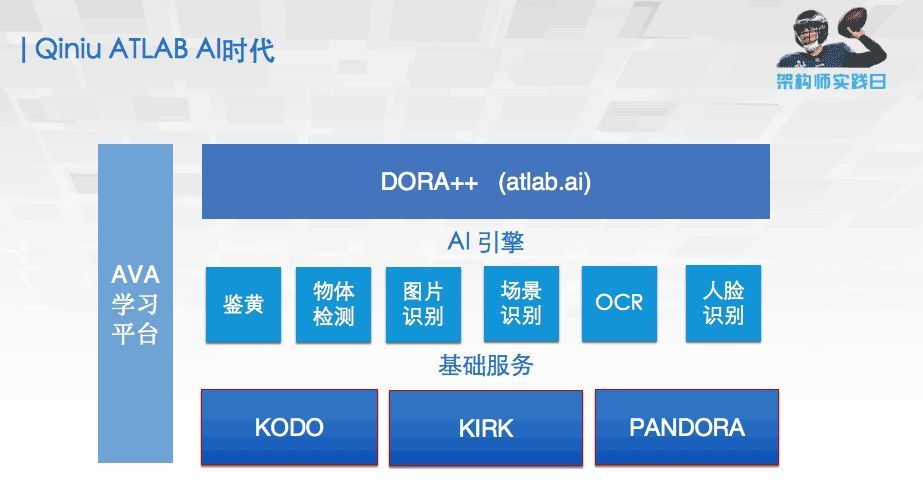

ATLAB 整个人工智能实验室就是基于整个 DORA 之后，在上面继续布了一套 AI 的引擎，里面会包括一些鉴黄、物体检测以及图片相关的一些 AI 引擎和 AI 的深度学习平台，这样就称它为 DORA++ 。通过 atlab.ai 这个网址，就可以看到整个AI 引擎的 DEMO，里面会有一些类似这样的展示。

包括我们做了很久的图片鉴黄服务、物体场景检测识别服务、人脸检测服务，还有最后是一个图片分割的服务。现在整个 ATLAB 图片 AI，支持了包括 11000 类的图片分类、3000 类的检测、20 类比较精细的鉴黄、400 类的场景以及人脸相关的服务，其中人脸识别在百万人脸底库中的首选识别率已经逼近 99%。

**下面介绍第一个关键词：视频**

我们为什么要做视频？

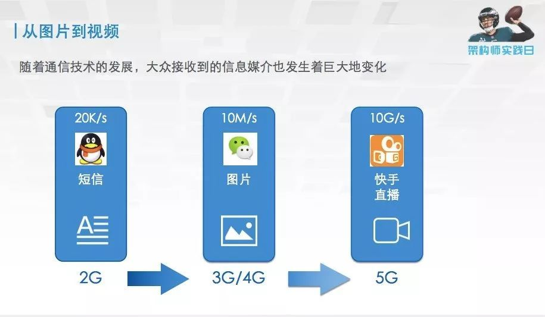

随着通信技术的发展，我们研究的一些事物的对象是会随着通信技术的发展发生改变的。遥想当年还是直板机诺基亚的时候，2G GPRS 网络的时候，QQ 能够聊天发短信就足以满足，因为当时的通信技术不足以支持你发更多的信息。而到了 3G、4G 年代，大家用的更多的是微信，交流更多的是图片和一些短视频等，所以我们 AI 研究的对象，就开始向图片发展。未来可能会到 5G 时代，数据传输速度会从原来的 10M 变成 10G 的水平，比如一些实时的视频通话，一些直播的应用，肯定会成为我们未来研究的很重要的对象。因此，随着通信技术的发展，视频总有一天会成为整个人工智能研究比较重要的对象。

图片 AI 就是随着深度学习技术的发展和非常广大的数据级的推动。视频跟图片相比，视频本身有很多自己的特点，生搬硬套图片那一套可能并不实用。

**首先视频内容的多样性**，视频和图片一样具有内容的多样性。而且有些分析的类别可能是在视频里才会有的。包罗到整个生活当中的方方面面。所有生活中的内容，都可能成为我们视频处理的对象。

**其次就是现有视频产生的场景的复杂性**，现今视频产生的场景大概分为：视频监控、直播，还有一些电视台的媒体，这三个场景是视频比较多的情况。仅仅是在这三大场景里面，也存在广泛的多样性。例如在视频监控的场景下，由于这些视频部署的对象不同，会导致所有部署的摄像头，位置高度以及它关心的对象有所不同，会导致处理的复杂性。同样的多样性也会在直播场景，遇到比如说有主播、演唱会、球赛，包括乔布斯的发布会之类的各种各样的场景。这些可能是视频处理起来比较难的一些方面。当然在媒体行业，也会有新闻、综艺、电视剧、电影这样不同类型的场景。

视频跟图片的区别，还有最重要的一点是只有当你看到视频的最后一秒，你才知道这个视频发生了什么。像球赛这张图展示的一样，大多数人可能都会觉得这个球进了，但是他偏偏就都踢在横梁上。**时序性的信息是视频独有的**，这与图片完全不同。

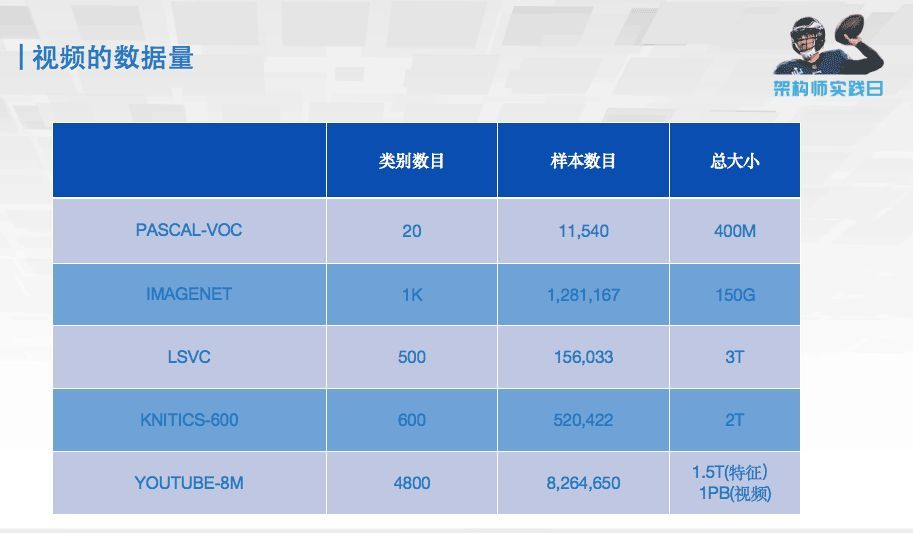

**最后说到的是视频数据量的问题**。视频如果简单一点理解，就可以看成是一连串图片的集合。那么我们比较了一下，现在市面上常见公开的数据级，前两个一个是检测的数据级、一个是分类的数据级。可见，它在一百万量情况下的大小，大概是 100 个 G 左右，而视频仅仅只有十几万的数据就可以达到 T 级的水平，也就是说视频的数据量相对于图片来说是爆炸式的，处理的时候也是难点。

以上是第一个关键词的内容。

****

**下面介绍第二个关键词：多维度融合**

我们怎么用融合的方式去做视频？

首先来谈谈，在做分类的时候，如何使用多维度的特征这样一个融合层次，去完成对视频的分析。去年 6 月份，在刚开始从事视频研究时，我们打算从视频竞赛入手开始研究视频的一些算法。

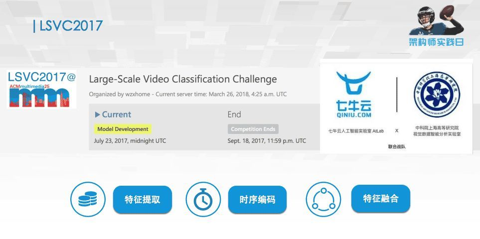

在当时 ACM（ LSVC2017 ）举办了一个视频分类的比赛，包含 500 个不同的类，几十万的视频。那个视频标注，就是一个视频整段的标注，没有把事件具体发生的片段标出来，这个难度是比较高的。当时我们的想法是我们去试水和了解我们和世界最先进的水平相差有多少的态度去参加了比赛，主要使用的方法是通过一个特征融合的方法去完成比赛。

首先我们用了一些很深的深度学习图片用的网络去提了一系列特征。

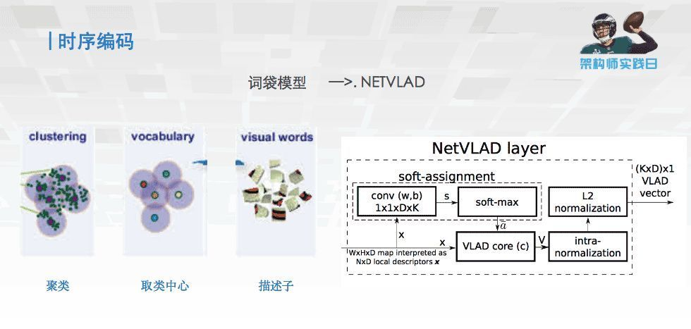

然后用了一个时序编码，用词袋模型推因出的 NETVLAD 的模型，核心思想是把视频长度不同的特征段变成等长的特征，相当于把长度五花八门的特征都变得一样长，做了这样一个编码的工作。同时还进行了一些简单的扩充，相当于在之前设定编码的时候，加入了一些我们自己设计的结构。

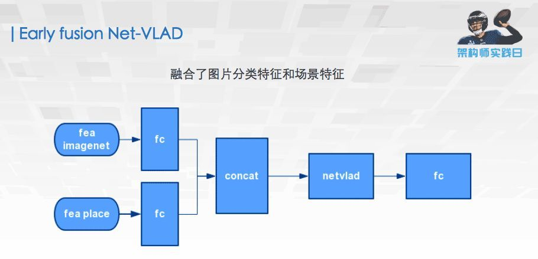

然后设计了一些 fusion 的方法，其中一个比较有特点的是 一个 early fusion Net-VLAD，相当于我们不是在最终分类的时候才将我们特征的结果做一个融合，而是在特征层面就把它进行融合，这样融合的好处是，可以大量减少最后这一层 FC 的参数量，使整个模型推理更快。

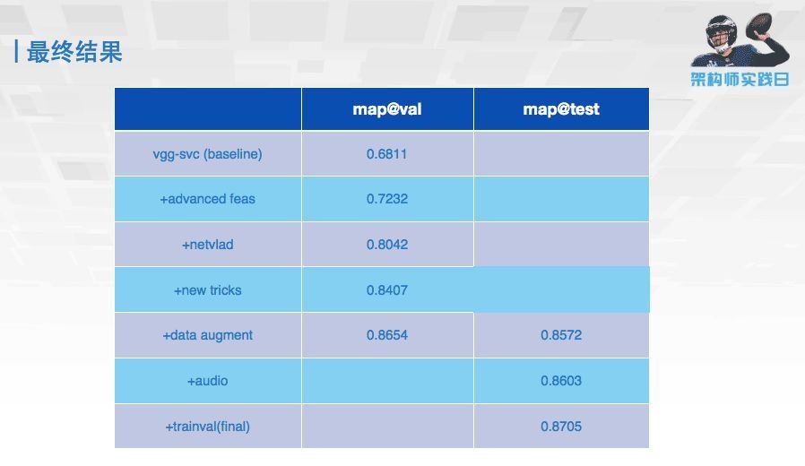

这是最终比赛的结果，可以看到 map 从最初跑的 0.68，到最后可以达到我们提交的 0.87，通过特征融合的方式可以极大地提高整个视频分类的准确度的。这就是我们最终的成绩，稍稍落后阿里拿了第 2 名。

虽然最终的成绩还可以，但是在整个比赛过程中，我们遇到了非常多的问题。数据量特别大的时候，下载数据就花了一个星期，处理预处理又花了一个星期，整个时间非常耗时。整个视频训练，要让它能够变得更快，我们就必须要整成一套流式的训练平台，相当于从视频端输进去大家就开始训练，然后通过多维度的工具链的融合，使整个训练速度加速，这样才可能训练出更好的模型。

**下面介绍一下七牛云整个的深度学习平台。**

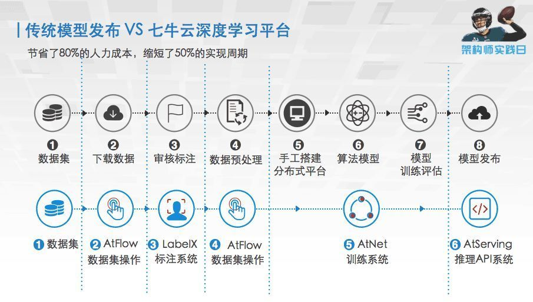

上面一套最开始传统模型发布的流程，它就包括整个数据级的整理、下载、标注，再做一些预处理，手工搭平台，再训练最终交付出去。我们的深度学习平台，就是将上面过程中可以自动化的事情，全部用自动化的手段实现，这样导致整个的训练过程，可以减少大概 80% 的人力和 50% 的时间。这是比赛时候就想做的事情，整个融合的工具链的入口是我们开发的 VOTT 标注的平台，在这个平台上可以很方便地标注各种视频片段的信息和一些视频类别的标签，然后通过这个进度条拖、拽等，可以很方便地找到你想标注的内容。

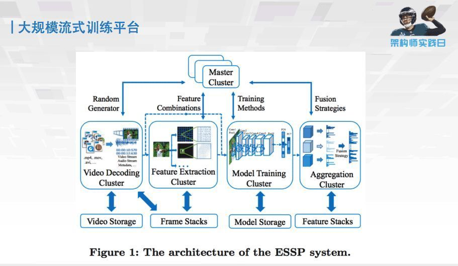

然后就是整套大规模的流式训练平台。整个平台我们拆成了四个部分：第一个部分是一些视频解码，存储解码等；第二个部分是一些特征提取的功能；第三个部分是模型训练；第四个部分是模型的融合。整个把它拆分成了四个完全独立的部分，它们之间互不相干，数据进来之后就可以进行源源不断的流式训练。

整个存储和编码解码用的是 ALLUXIO 和 NVIDIA 提供的 NVVL 工具。这个工具的好处是：它可以调用 GPU 上的解码器，将视频解码的信息直接存储在 GPU 上，省去了从 CPU 到 GPU 的拷贝过程，从而加快了整个训练的过程。

特征提取集群，是将原始的视频转化成我们要的例如单帧图像，多帧图像和光流之类的训练用的素材，然后拿来训练。同时我们发现图像对视频的表述，是比较局限的。有些时候还需要声音、文本这样的信息，这些额外信息的加入也可以提高我们训练的效果，所以一并把它们放在集群里。

这次最新的 CVPR 的比赛中，我们只花了七天七模型就完成了整个比赛，结果也不算太好，就拿了个第三名。七天七模型主要包括 TSN I3D non-local 等视频专用的模型，就不再是之前图片相关的网络，我们的技术报告链接在图片上，可以通过这个就详细地了解模型的一些情况和技术报告。

有了这个快速训练模型的能力之后，我们在视频分析可以去哪里落地。于是就会跟很多客户讨论，你们对视频有什么需求和要求，他们提到有一个视频通用结构化的需求。这个需求是指，有时候需要对视频里面的内容进行一些搜索，搜索里面一些敏感的人、敏感的事、或者是一些特定的物体。但肯定不能每次搜索的时候，就把整个视频全部拉回来跑一遍，毕竟这个成本是不能承受的。那么就需要把一个视频转成一个通用的结构化的可以搜索的一些东西去做这么一件事。

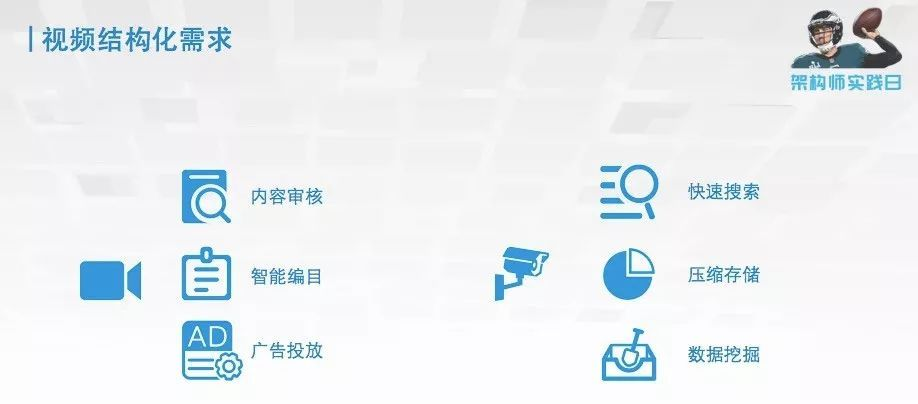

不同的客户，对于视频结构化的需求有不同的理解。比如一些媒体的客户，内容很合适他们的硬性要求，他对于里面出现的一些比如涉黄的内容，是比较敏感的，他需要这样一个东西；还有一些敏感人物是不能出现的，这是特别硬性的要求；另外还有一个要求，就是希望视频可以分门别类的分在提前预先设定好的类别下面。

之前这些事情都是人做的，比如《奔跑吧兄弟》就希望分在综艺的类别下，这是用户的需求。如果在安防的监控场景下，需求就可能是希望能够在杭州市全部的摄像头里面找到某一辆红颜色的车。这就需要做一个快速的搜索，同时把无关的信息全部压缩掉，不必存这么多视频，只要存下解构化的信息就可以，能不能从这些解构化的信息里面做一些预测，这是用户的需求。所以整个的需求，会分成很多种类型。

**怎么样描述一个视频？比方说《叶问》这个电影，可以从几个方面找到它。**

首先，搜索功夫片或者甄子丹这个人，都可能会搜到他。另外还有一个是一句非常有名的台词 “ 我要打十个 ”，可能也会搜索到。你搜索一个视频，可能从视频整体去搜索到它，或者从关键人物可以描述它，或者通过一些动作或者事件也可以找到它。这三个层级都是视频结构化需要做的事情，所以提出这样一个多层级的视频结构化架构。里面会有整段视频的结构化，还有一些关键人物的结构化和事件行为的结构化。

只有多维的技术相融合，才能完成多维度视频结构化这件事情。首先视频整体结构化就需要视频整理分类的能力；视频人物结构化，就需要有人，有检测跟踪的能力；事件检测化，就需要检测里面的事件和镜头分割的能力，有了这样的能力以后，才能完成整个多维的结构化的事情。

产品在这里不一一列举，直接跳到我们做的一些视频结构化的 DEMO。

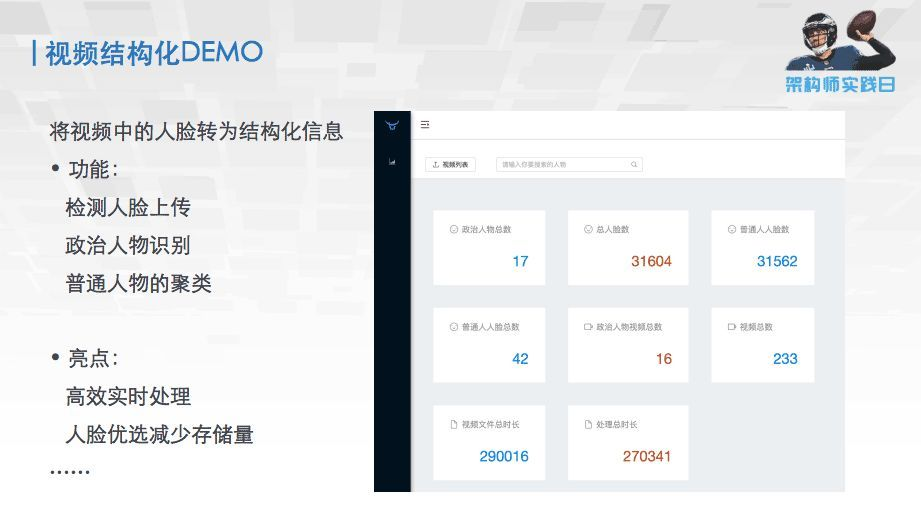

第一个是视频中人脸结构化的 DEMO。这是给电视台做的，需求是把里面的人全部结构化，方便后续搜索。经过整理下来的功能，第一是要实现人脸的检测和上传，把人脸的信息存下来；第二是要识别里面一些敏感人物，包括一些政治人物；第三是要把普通的人物，即不敏感的人归到一起，只要做这三个功能。

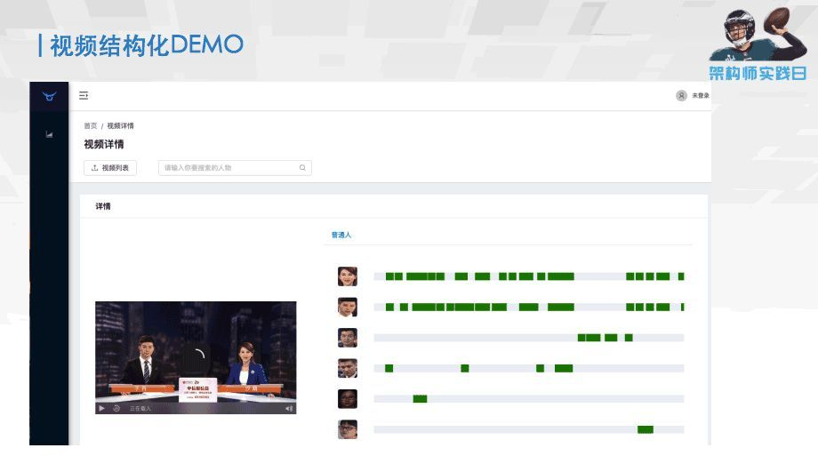

最终结果是这样的，这是在这个视频里面找到的人；这些绿色区域，就是这个人出现在视频当中的时间。如果当你需要很方便地去看这个人在视频中出现的片段，只需要把这个鼠标点到跟它相关的内容上面，就会自动地播放跟这个人相关的事件和工作。这是整个视频人脸结构化的项目。

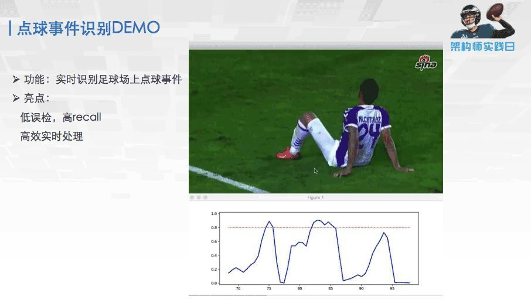

第二个是我们做了一个点球事件识别的 DEMO。可以看到这个曲线就表示的是这个事件，这个视频上点球的概率是多少。当出现点球的时候，这个事情会超过这个红线，是一个预测值，超过这个红线的时候就会知道点球事件发生了。我们训练模型经过测试之后，整场球赛可以把点球都找出来，误检很少，整个的效果还可以。

但是大家看到这个点球 DEMO 会觉得，点球 DEMO 有点 low，因为只能告诉你这个时候发生的点球，唯一能做的是把整个赛季的视频跑遍，然后做成一个点球合集，然后一直看。为什么会导致这个东西好像没什么用呢？

经过分析我们发现，一场很好的球赛，它不仅仅包括球场上的一些事件，还要包括整个教练员的排兵布阵，包括一些明星球员的超神的发挥和一些球队与球队之间的历史和恩怨等。整个事件加在一起，才会是一场比较精彩的球赛。而只有足球事件是可以用视频结构化的方法得到，而剩下的这些东西，则需要一些知识图谱和自然语言处理的东西，我们必须要把多维的信息融合起来，才能得到一个完整的东西。

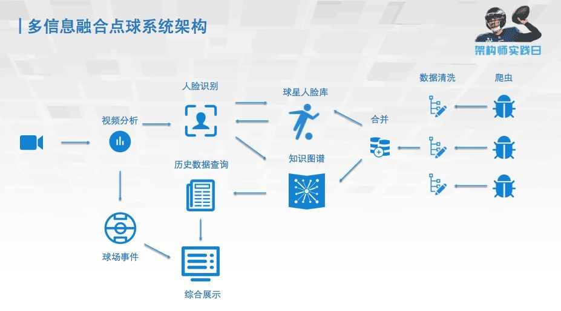

所以我们就重新设计了一个点球的架构，将爬虫爬到的关于足球的知识，经过数据清洗跟合并之后，建成了球星人脸库和知识图谱。当处理视频的时候，不仅检测球场上的事件，还对球场上的人进行识别，通过与球星人脸库和知识图谱的相互调用，就会得到一些历史的数据。之后就将历史数据跟球场事件做一个综合的展示。这样就相当于有多维度的信息了。我们第二个版本可以达到的效果是：当梅西踢点球的时候，就可以在左上角显示出来他是谁、他是哪个国家的、他之前踢进了多少球、这样整个演示的内容就显得丰满一些。

通过我们一年多来的一些实践，我们认为单独的内容可能没有很好地解决实际当中视频的需求，我们需要结合各种各样多维度的包括知识、技术、能力、产品之类的内容，去把它打一个包，才能整体地解决一些视频上的问题。所以在我们未来的产品架构里面，会带上学习引擎，同时也会带上我们各种识别引擎，还有我们自己视频的一些引擎，经过合力才能成为一个比较好的视频产品。

我们一直坚信视频肯定是未来的大势所趋，总有一天所有的智能分析都要走上视频的道路，希望七牛云在这方面做的产品，可以给大家一个更好的视频的 AI 的体验。