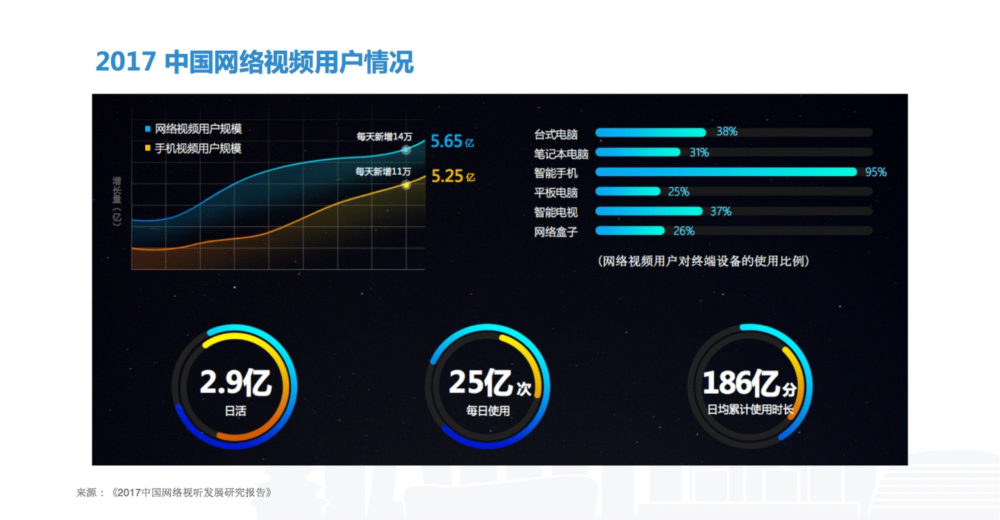
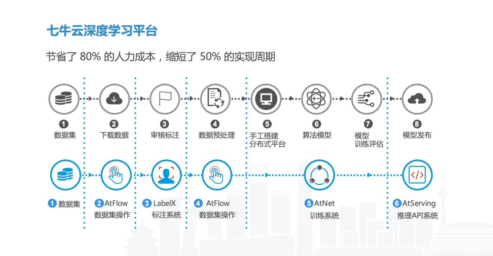

继图片之后，视频结构化成为了深度学习领域又一个热点。相比图片，视频内容无疑具有更大的复杂性。面对不同场景的视频结构化需求，需要采用什么策略才能取得最大化的效果？ *AI* 视频结构化对于互联网、广电等行业的变革又有什么样的价值？

在 4 月 20 日 QCon 全球软件开发大会上，七牛云人工智能实验室首席架构师姚唐仁分享了在深度学习视频结构化的实践经验。

## 1.人工视频摘要与 AI 视频结构化的优势

根据哈佛商学院的研究，视觉是人获取信息最主要的方式，占全部感官的 83%。因为通过图片和视频的载体，我们能获得的信息量是最大的。相比静态的图片，动态的视频增加了时间的维度，拥有更丰富的组合性。根据目前网络视频的情况，**整个国内视频规模依旧保持高速增长。**

其实，视频规模增长不仅限于互联网行业。**许多行业可能存有更多视频数据，广电行业就是其中之一。**广电行业不仅面临视频数据的爆发式增长，更多情况下还受困于存量视频数据的管理。面对海量的存量和增量视频数据，传统的手工视频摘要方法就会暴露出以下缺陷：

- 内容不完整：当看到一个视频的时候，每个人都会有自己的关注点。而对于关注点外的内容就会有不同程度的忽视。每个视频忽视一部分累积起来就会造成巨大的信息缺失。
- 依赖经验：人工视频摘要在很大程度上会依赖审核人员的经验，描述结果往往就是相应人员对于这个视频的理解。而当审核团队中加入了许多新手后，描述可能就不够精准、丰富。
- 实时性差：人工审核只能在事件发生后很长一段。面对突然爆发的数据增长，人工几乎不可能做到实时审核、标注，造成实时性较低的结果。
- 时效性差：当某些特定事件（明星丑闻、事件反转）发生时，同一视频在事件前后会带有不同的标签（例如：某当红艺人，在发生涉毒丑闻后，被列为「劣迹艺人」）人工标注很难根据突发情况快速批量上线或下架相关视频。

面对视频处理过程中这么多的问题，**用人力结局显然会造成巨大的成本。**这个时候，AI 视频结构化就是最好的解决方案。

**优势 1：识别范围广**

人摘要时，关注点非常有限，机器没有这个问题。利用机器学习进行识别的**第一个优势在于能够不断增加识别的广度。**可能最初的模型识别的内容不够多，但随着机器学习模型的不断迭代，识别的内容和准确性也都会随之大幅提高。

**优势 2：效率高**

GPU 机器的效率远超过人的效率，而且机器可以持续运行，人摘要视频受限于物理播放的时间，而机器可以随着物理计算能力和模型效率的提高来提升结构化速率。

**优势 3：可迭代**

我们通过模型的迭代**能够不断优化内容识别的准确性。**

**优势 4：创新基础**

有了这样一个高效的方式，而不是差异化对内容的认知，这样的方式可以对业务带来很多的创新。

- 内容审核：随着图片和视频取代文字成为主流的传播方式，**针对图片和视频的内容审核正变得越来越重要。**比如说艺人发生了劣迹行为，需要立即对他封禁。如果我们完成了内容视频结构化，就非常容易找到与他相关的视频。另外，还可以对视频的内容进行检索、编目，这些都是广编里面需要的功能。
- 广告植入：当我们进行广告投放的时候，能够实现广告定向投放。比如在视频中所有易拉罐的罐身上都打上想要的内容，完成广告植入。
- 热点预测：比如当一些热点事件发生时，我们能分析出这个事件的特征标签，并且把相关标签相关的视频进行关联和推荐。类似的功能对于互联网运营具有极大的价值。

## 2.AI 视频结构化的实现步骤

**2.1 视频的分解**

首先，一个视频里面我们首先要分解的不同场景，不同的镜头，再对里面的内容进行识别。 例中是我们的一个视频分类的标注系统，其实这个标注的系统过程，其实也是我们对这个内容的理解，怎么去做结构化的识别方向。

从模型角度讲，我们对内容的识别要做哪些方面？首先第一个我们要进行分割，分割是镜头的拆割。拆割之后要理解一段镜头所表达的主题，进一步根据帧来识别里面的内容，按照人、物、场景的维度来做。

**2.2 视频结构化描述**

举个例子，当我们要描述一个足球视频的时候，会把它分成三级。

- 第一级是视频中的基本元素：球员、足球、草坪、文字。同时，草坪不是普通的草坪，是足球场；文字不是无意义的文字，是场边广告牌。
- 第二级是视频中的场景：巴塞罗那队参加的一场西甲联赛。
- 第三级是一个完整的故事：体育新闻正在报道一场球赛，巴塞罗那队的梅西率队赢得了比赛。

拿到一段棒球视频，可以这么来处理：

- 第一步是将它截帧，进行帧的内容识别。
- 第二步要做一些光流，目的是获取运动信息。视频里面运动信息比较复杂，而做了光流之后就更易于描述前后帧之间位置的变化，这样就能描述一个运动。描述出运动之后，通过运动信息场景进行关联，判断这是棒球比赛。
- 第三步是借助声音辅助判断，可以根据语音中识别到的信息，对画面信息进行补充。
- 最后是利用视频画面中其他的信息，例如周边广告、字幕、台标等相关信息辅助判断。通过这些信息，我们能知道这个场景属于哪个分类，是综艺还是新闻。

**2.3 深度学习训练平台**

模型训练是很重要的关节，而且视频的数据量非常大，需要一个高效的深度学习平台来支撑模型训练、视频分析的前提。为了能够提高学习的效率，七牛云深度学习平台从数据的收集、标注、清洗、过滤，到训练、推理、上线，完成了整个流水线的搭建，并且不断进行迭代。

面对数量庞大、格式各异的视频，我们将整个过程进行解耦。以分布式队列的方式进行模型训练，**还需要对模型进行融合，取得更好的效果。**

我们视频结构化的策略，是先将视频按镜头分拆，并根据主题分类，**将视频里面的人、物、场景进行解读之后，与图像、声音和文字进行关联。**

这里讲到特征提取，对于不同数据的提取是有差异的特征是每种网络对数据的提取是有差异的。**这时候我们就多端网络进行提取，然后进行融合。可以看到示例中网络提取的特征对狗的运动信息特征表达明显。**

在视频做主题分类的时候，我们一开始通过 LSTM，把一帧一帧进行串起来，进行 LSTM 网络模型训练。后来，我们采用了 3D 转接的方式，但是由于它的通道是几何级的运算，就会造成巨大的计算量，第三种方法就是**先将图片和光流进行融合，再做模型融合。**

在模型融合的时候有两种做法，前融合和后融合，前融合是指不同方法提取的特征进行融合。后融合是指网络连接输出之后进行的融合。

刚才讲到提取它的一些特征，但是如果对一个视频抽帧度过高的话，计算量就会变得非常大。目前，我们通常采用一个场景用前面、中间、后面三段视频的做法。抽帧之后再进行融合，这样从效果和计算量来讲，是一个比较平衡有效的做法。

## 3.视频结构化注意点和实践经验

**3.1 人物信息结构化**

人物的关键是在人脸的识别上。在视频里面我们连续帧的播放，每一帧里面脸是在变化，所以我们不仅要检测到人脸，还要对脸进行评价：包括人脸角度、眼镜等遮挡物。最后就是人脸跟踪。比如转向、点头等。

有时候，当人脸跟踪的时候移动到了后脑勺，或者侧角比较高的时候，往往会很难保证较高的准确率。但是，在人脸跟踪的过程中，其实只要抓到评价点，就能知道整个过程跟踪的是同一个对象数据，就能基于此进行评价。**基于评价点完成了评价之后，这一段跟踪的人，就会呈现比较高的特征。另外，如果我们将人脸与场景关联之后再进行比对，效果就会更好。**

**人物信息结构化的实践**

在进行人脸关联的时候，还可以借助与之相关的关系图谱。关系图谱是整个视频结构化的过程中，非常重要的一点。

举个例子，假设我们在分析一段梅西的比赛视频，但在视频中他的正脸并未面对镜头，只有侧脸。这个时候，我们通过场景分析得出这是一场球赛，通过队服知道比赛双方是谁。我们可以通过在网上获取的信息，知道梅西的球队、教练、队友是谁，并且建立关系图谱。

这个时候就可以将梅西的侧脸和侧脸库中的数据进行比对，比如Top 10 或者Top 20 相比，有了关系图谱之后，这个准确度就能大幅提高。只是侧脸置信度和误点率非常高。

除此之外，我们还可以根据球衣号识别梅西的队友。所以看似是一个比较简单的人脸描述，但是在不同的场景下，就可以更多的进行深度挖掘去描述它。否则机器只是认脸了之后，由于数据信息量不足，跟真实的结果差距非常大。

**实践中的注意点**

在实践中，我们会发现很多问题。比如这是一个新闻中的投票视频，有许多人在投票箱前依次投票，投票人不停地在更换。这个时候，如果用位置比较跟踪，由于在同位置的识别框中一直有人进行投票，结果很有可能会判断始终是同一个人在投票。如果我们能够先根据人物的动作和周围场景，识别出这是一个投票活动，不采取跟踪而是检测。

这是我们视频结构化的 demo。在这段视频里，我们可以所有人物出现的时间轴连接起来。这样在搜索人物的时候，通过视频结构化识别很轻易的能找到相关的内容。

**3.2 物体信息结构化**

和人不一样，物体识别的时候没有人脸这样明显的特征。这个时候，就可以直接用模型在不同地方进行检测，检测准确度依赖于模型，模型需要较强的泛化能力，能够检测出物体不同角度。

**物体信息结构化的实践**

这时候，我们就需要将物体出现的时间进行区间合并。比如视频中有一个歌手，他手中的话筒在视频中反复出现，由于话筒在视频中出现的时段不是连续的，我们就需要找到一个比较好的阀值对他进行识别。在新闻、电影等不同的主题中，不同内容的合并有不同的手段。

与人脸一样，物体结构化也需要和场景相关联。就像足球案例一样，检测到草坪后，通用的识别里面就是一个草坪，但是通过这个场景判断是在踢球。这个时候输出物体是输出球场，这就是场景上下文之间的关系。

**实践中的注意点**

在实践中，我们在决定检测帧密度的时候，做过许多尝试。直观上，我们肯定认为是密度越高效果越好。我们选了几个值进行测试：0.1 秒、0.2 秒、0.5 秒、1 秒和 2 秒。经过实践，1 秒时一个比较合适的值。

虽然理论上说检测帧的密度越高越好，但是会带来一些计算量的代价。检测密度为 0.1 秒的时候，计算量就是 1 秒的 10 倍。我们推测一下 1 秒比较合适的原因：大部分视频描述的时候，场景切换不会特别频繁，1 秒以内快速反复切换场景不会带来太好的观看体验，所以在物体检测的时候，以 1 秒为检测密度即可。

**3.3 场景识别**

当描述这样一张场景照片时，我们第一眼就能看到这个图片能包含什么的内容，动物海星，海浪、室外，海滩。但是在输出标签的时候，我们会输出两个场景标签。为什么标两个？因为物体本身在不同场景中的时候，场景表现不一样。

在这张图片里可以看到，有山、河流，这些元素构成了一个自然景观，同时自然景观从属于室外的范围。这样构建的原因是在结构化的之后，在你搜索的时候会有会有很多作用。比如搜索开会的场景，也可以搜索室内；搜索一座山的时候，也可能搜索景观。通过不同的标签，都能搜到同一个内容。同一个内容，既属于自然景观，但在更大的范围里属于室外的范畴。

**实践中的注意点**

这是一个体育新闻的案例，我们首先要确定场景的主题，是电视娱乐厅、娱乐室还是游戏厅。确定了主题之后，就切入不同的镜头，之后再进行关联检测到分类的时候，才能更准确地描述。

**3.4 声音对于识别的帮助**

声音在视频中是有用的信息，对于声音内容，我们要分两类处理。

第一类，是声音转文字，我们可以根据视频中的内容，提取主题。所以声音中提取的文字能够辅助确定这样一个主题的。这是我们一般能想到的。

第二类是声纹特征，比如某些场景是没有文字的，比如一个人在那里尖叫或者一个人在那里痛苦，我们就能通过声纹特征来进行识别场景。

这是整个的视频结构化的视图。最底层我们需要一些基础模型，用来识别我们来识别对每个东西对它的场景是什么，物体是什么，它的人脸是什么，还有相关的属性是什么，这个是最基础的模型。

这个模型实践下来，在视频的维度就会有一些特征，视频的帧，光流，还有持续的关系。再往上走，在利用模型和特征，还有实践的时候，怎么来构建结构化的平台？这个平台就是我们要对事件进行描述，最早是去分割视频，然后也通过知识图谱，这个平台就是这么来利用这些东西。

要分割，建立知识图谱，再后来通过底下的模型描述事件。最上层应用是什么，可能是进行内容审核，当然也可能是广告植入，这是一些应用方式的整合。

我觉得视频这个领域的结构化真正来落地也是刚刚开始，也需要更多的人来实践，更多的人来探索。视频时间维度带来的变化很丰富，比如下面的两个例子，一个是反时序，一个是片段化的视频看不出真正的主题，这些方面的问题需要我们持续探索和实践。