从通过电视机看《西游记》到手机上刷抖音小姐姐，我们每天都在进行的视频消费经历过什么样的演进？

从直播美颜到互动连麦，七牛云为视频场景化的需求提供了什么核心价值？

未来视频技术的发展和挑战有哪些？如何更好地应对？

关于以上问题，七牛视频云架构师卢俊在NIUDAY 深圳站中为我们带来了他的解答。

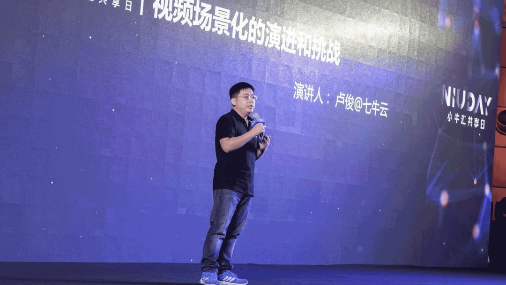

01

**视频消费是如何演进的？**

世界杯直播看球、抖音刷漂亮的小姐姐、通过视频通话给亲人问候，这些我生活里经常遇到的场景，都离不开视频。相信大家也和我一样，每天都在进行着视频的消费。那视频的消费是如何演进的呢？

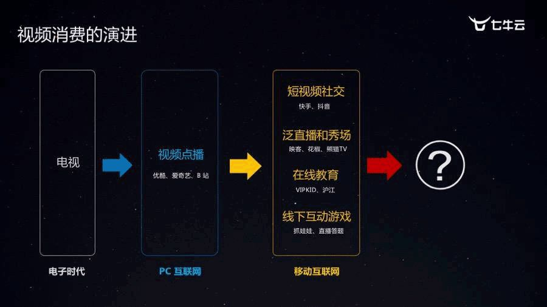

大概在 80 年代，人们主要通过电视进行视频的消费。暑假守在电视机前陪爷爷奶奶一遍一遍地看《西游记》，相信已经成为很多 80 后们的共同记忆；随着互联网的发展，视频消费进入了 PC 互联网时代。出现了 B 站、优酷、爱奇艺这样的点播网站，人们终于可以在互联网上观看电影和电视剧。

再后来，随着智能手机的普及，视频消费进入到移动互联网时代。围绕着视频消费应用的移动互联网公司逐步成长起来了，比如短视频社交领域的快手、抖音，泛直播领域的熊猫 TV、映客、花椒，随后，也逐渐出现一些如 VIPKID、沪江（在线教育），以及把线下互动游戏搬到线上的在线娃娃机、直播答题等。

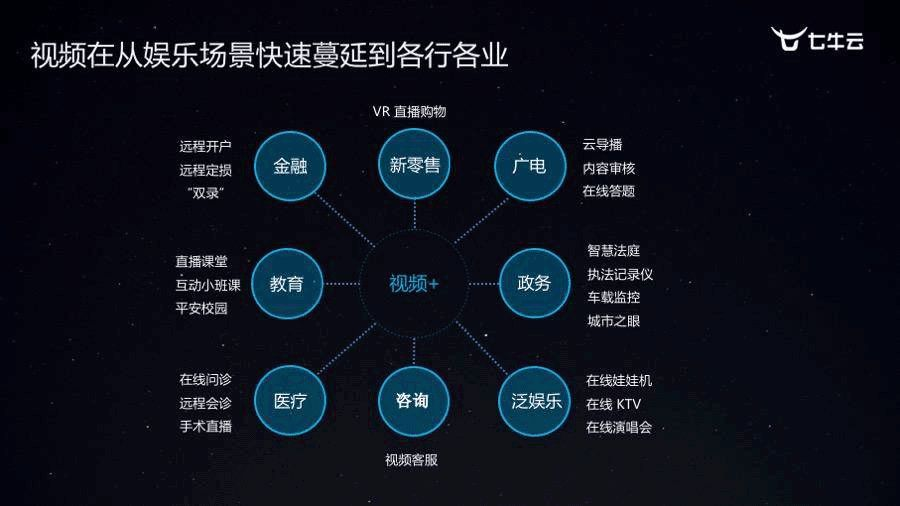

我们可以看到这样一个规律，早期的视频消费主要集中在娱乐场景，然后快速蔓延到了各行各业，如金融、新零售、广电、教育、医疗、政务等等。

02

**为什么视频可以这么快地蔓延到各行各业？**

本质上是两个原因：

**1、消费体验的升级**

视频的清晰度越来越高，延时可以做到越来越低，从而使得曾经难以实现的一些场景，得以实现，比如 VR 看房、VR 直播购物，一对一在线教育、远程开户等等。

**2、数据驱动业务的思维升级**

现在很多公司都知道要看数据，其实通过数据他们会发现，视频技术的应用对于客户业务增长有非常大的促进作用。正因如此，各行各业才愿意将图片、文字的交互体验逐步升级为更加立体的视频应用。

03

**是什么促进了音视频技术的升级迭代？**

正如之前我们提到的，视频消费最初集中在娱乐场景，而娱乐场景对视频消费体验逐步升级，反过来也促进了音视频技术的升级和迭代。

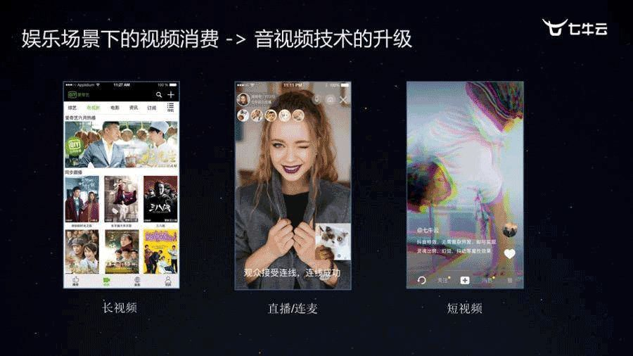

比如长视频点播、直播连麦、短视频，最开始都集中在娱乐消费领域。

在我初进七牛云时，直播方兴未艾。那段时间我们每天聊的都是直播技术，直播相比长视频而言，最大区别在于它的视频是实时生产、实时分发的，另外一个区别是，在移动互联网下的直播，更多是通过 Android 或者 iOS 设备进行视频采集、编码和推流的。

那时候 Android 设备硬编兼容性还很差，有着很多问题，我们那时候在二手市场租了好几十台 Android 机器，背到客户现场，一台一台地调试、一台一台地做兼容，从而逐步取得了客户的信任，成功接入了美拍、熊猫 TV 这些的大客户。

再后来，娱乐应用场景下，对视频技术一次次地提出各种新的需求和挑战，比如：“秒开”、“美颜”、“连麦”、“短视频特效” 等等，逐步使得各家音视频技术服务厂商把网络优化、端上的各种音视频特效玩到了极致。

04

**娱乐场景下的音视频技术服务，我们提供的核心价值究竟是什么 ？**

首先简单用一张图来看看，面对这种场景，我们的主要技术对策是什么？

• 端到端全平台的解决方案

• 遍布全球的 CDN 加速网络

• 海量可扩展的云存储服务

• 云端配套的功能（比如：转码、鉴权等）

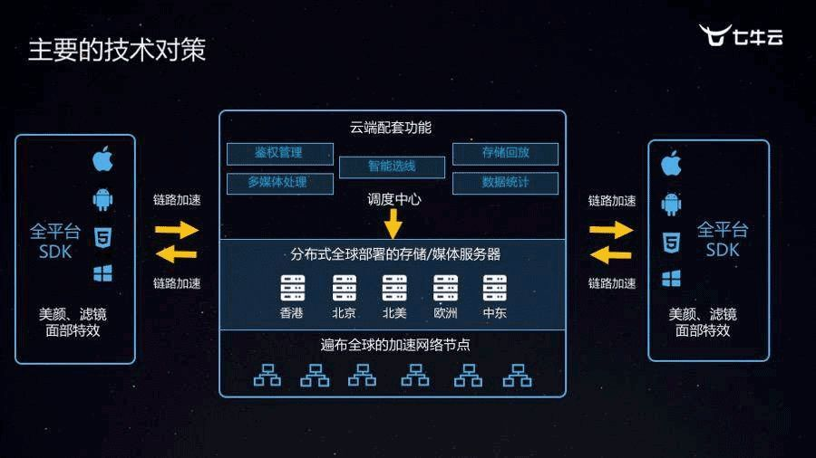

如果要用一句话来概括我们提供的核心价值，我觉得是下面五个字：“**技术平民化**”。

因为这些音视频技术和服务的提供，让客户不用那么了解音视频技术细节，就能非常好地实现产品经理的构想，专注于应用和业务的开发。

在娱乐场景下，七牛云在为客户持续升级和优化音视频技术和服务的过程中，逐步构建起了整个音视频的产品体系和支撑能力。

行业音视频技术升级

样例——智慧法庭

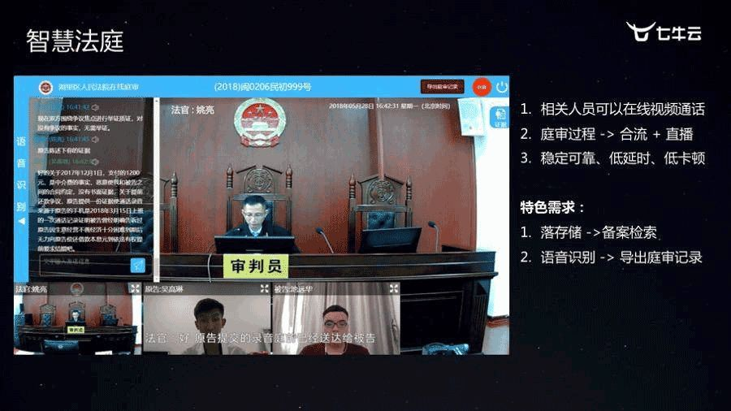

随着音视频在各个行业的扩展，七牛云也在不断尝试，帮助更多行业做音视频技术的升级。其中，智慧法庭就是一个很好的样例。

智慧法庭的场景需要法官、原告、被告都可以在线上进行庭审互动，同时要将整个庭审过程转推到直播云，被其他网上观众收看。其相比普通的娱乐连麦，对于稳定性、延时、卡顿率有着更高的要求。

另外，要求支持对整个庭审过程落存储、备案和检索，还需要通过语音识别技术，将每个人说的话展示在庭审画面中，从而可以很方便地导出庭审记录，极大减轻法庭书记员的工作压力，提升工作效率。

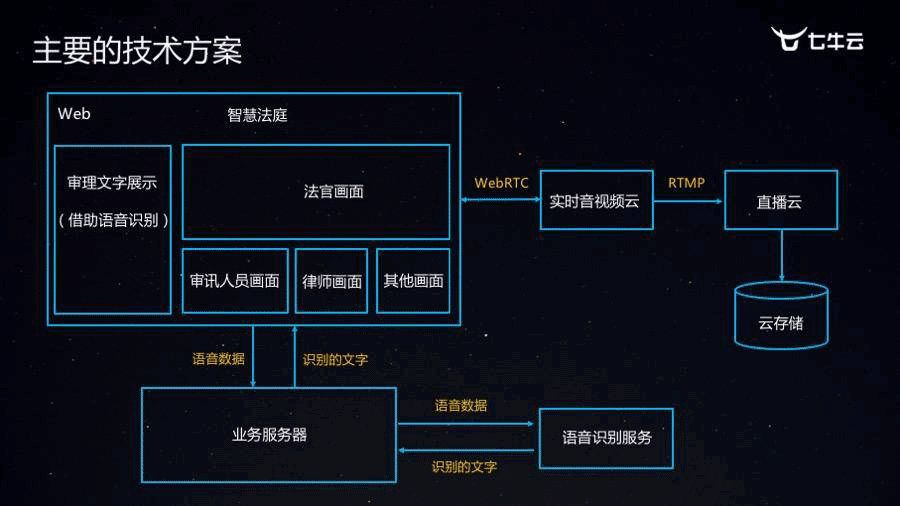

智慧法庭的技术方案是这样的，法官和原告、被告不需要额外下载插件或者应用，而是直接可以通过浏览器完成整个庭审过程。首先，通过 WebRTC 实现实时的音视频连麦互动，然后再服务端对画面进行合成，然后转推 RTMP 推到直播云，利用直播云进行切片、存储和分发。另一条链路，则是在 Web 端把每个人的语音数据回调出来，通过业务服务器调用语音识别服务，将语音转换成文字，展示在 Web 界面上。

这个方案用到很多音视频相关的产品和技术，比如低延时的音视频传输技术、直播技术、云存储、语音识别等等。这反映出一个问题，提供音视频技术和服务的公司，**版图完整**非常非常重要，通过各个产品之间的组合，可以非常灵活地应对各行各业的特色需求和场景。

05

**帮助传统行业进行音视频技术的升级，我们究竟提供了什么核心价值**

如果同样用一句话来概述，我觉得是「**数据价值**」。

如前面介绍的「智慧法庭」，通过这套连麦+直播+语音识别+存储的系统，我们把所有的庭审过程、视频数据都保存下来了，为以后做大数据分析和视频智能，提供非常宝贵和有价值的数据。

在获得有价值的数据后，下一步就是如何挖掘这些数据的价值，怎么理解这些视频数据。

视频内容理解的案例——电视台

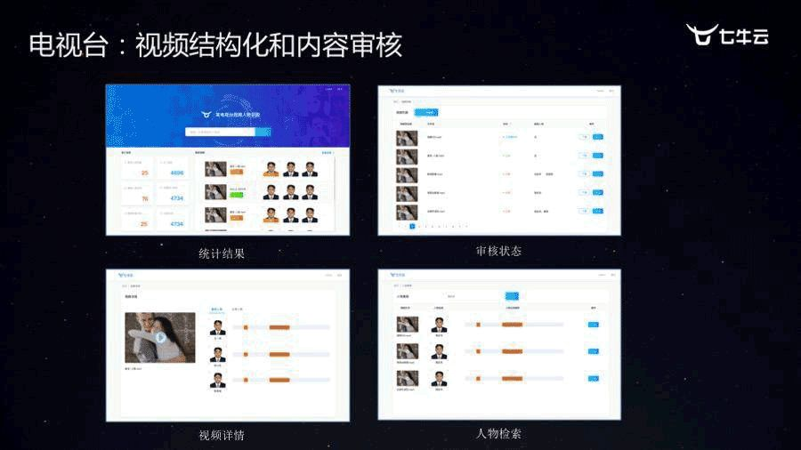

以一些电视台的共性诉求为例，很多电视台都有着视频结构化和内容审核的诉求。

**1、视频结构化**

因为电视台属于国家的官方媒体，所以落马高官、政治敏感的画面是不能播放的。我们利用人工智能技术，帮助客户识别视频中有哪些政治人物，这些人都出现在什么时间点。反过来也可以支持在整个电视台的媒体资源库里搜索指定的人在哪些视频、什么时间点出现过，基于这些信息，电视台可以更好地规避政策的风险，同时也能更好地通过检索特定素材，完成一些视频专题的制作。

**2、内容审核**

视频内容的审核一直是一件投入人力巨大的事情，我们通过机器识别，帮助客户检测视频流是否有黄色、是否有暴恐，并且将问题片段剪辑存储下来，提供给人工进行二次确认，极大的节省了做内容审核的人力成本。这套系统也不止用于电视台，随着国家监管的加强，在很多网红直播、短视频场景其实也有着类似的需求。

这两个场景都是人工智能在视频场景下的典型应用，其实都离不开数据的收集、打标和模型的训练。怎么样让我们更高效地完成这个过程以及应对客户的变化？我们实现了一套数据深度学习平台，把数据集的管理、标注、模型训练、计算资源调度、产品化等功能都集合到一起，让算法工程师和 AI 应用工程师从繁琐的事情中脱离出来，专注于为客户提供最核心的价值。

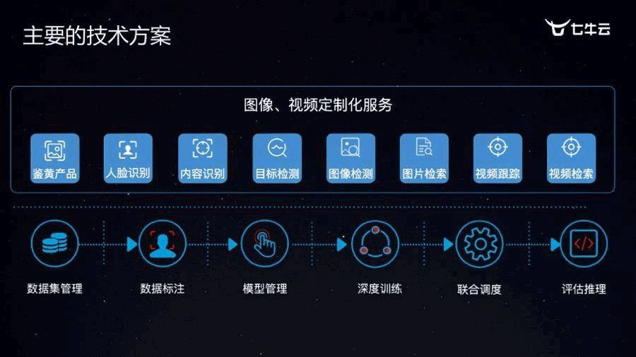

在视频场景下，单单有人工智能的图片识别和比对还不够，因为数据源可能有多种，比如点播文件、直播流或者客户私有格式的数据流。因此，在人工智能服务的前端，也要依靠音视频技术，把客户各种格式的流拉进来，管理起来，定时截帧调用 AI 的服务完成结构化和审核的功能。

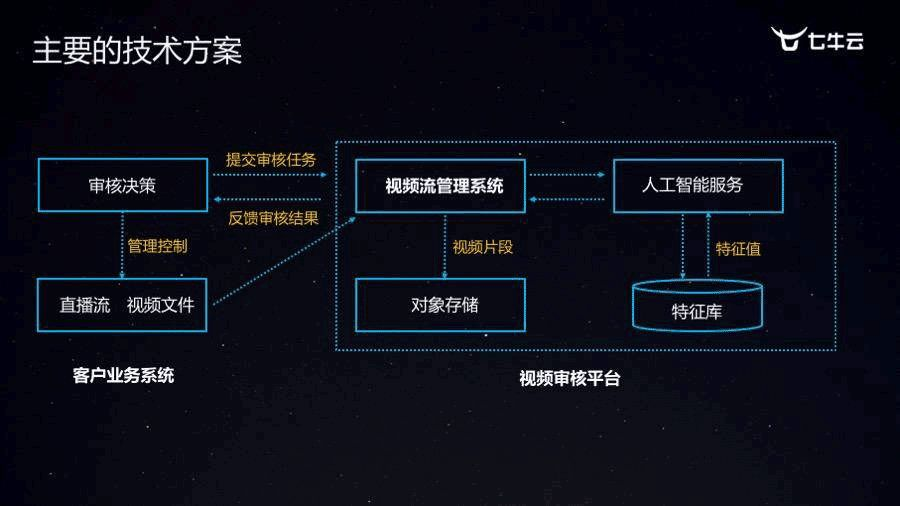

06

**帮助客户理解视频内容，我们提供的核心价值究竟是什么 ？**

在这样一种场景下，我们所提供的核心价值是 「**数据价值的挖掘**」。

我们帮助客户完成理解视频数据、挖掘视频数据背后的东西。这样客户就可以利用我们帮助他挖掘到的信息，做满足客户业务的场景和应用。

07

**未来视频技术的挑战和解决方案**

毫无疑问，视频技术和 AI 的结合，将是未来的方向，在这样的结合下，它会遇到什么样的挑战？

**中心存储和计算：延时、带宽**

**将成为升级瓶颈**

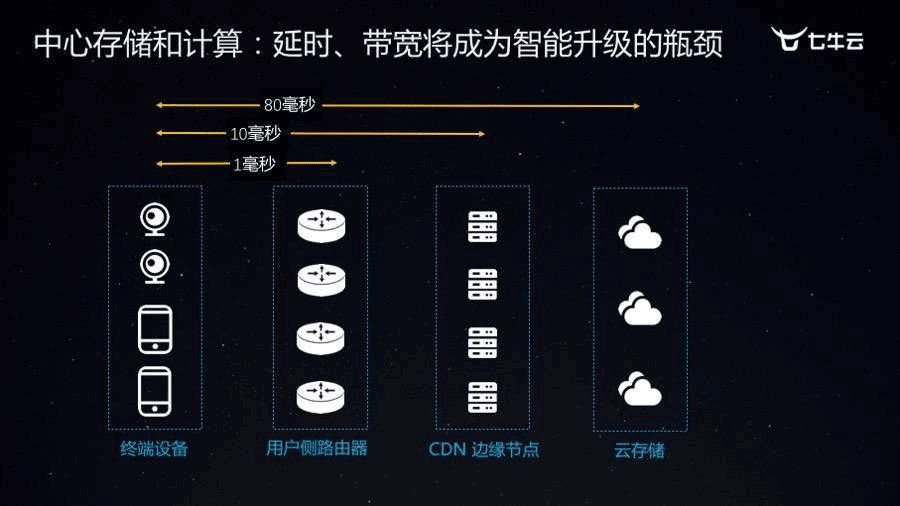

如图所示，终端设备到用户侧路由器的延时其实是很短的，但是到中心机房的延时会达到 80ms 以上，而且中国的网络带宽分上下行，下行带宽虽然越来越大，而上行带宽却不尽如人意，只有几兆甚至几百K。当一个终端产生的视频必须上传到中心存储再进行 AI 的计算，用户的体验是非常差的。

**解决方案：边缘存储&边缘计算**

怎么样解决延时和带宽对视频智能化升级带来的挑战呢？答案就是边缘计算和边缘存储。

以社会化监控的场景为例，我们首先将摄像头产生的视频存储到边缘节点，然后将 AI 的能力直接部署到边缘节点，然后直接对视频其进行分析、浓缩、摘要、结构化等处理，然后再把结构化的元数据上传到云端，进行存储和比对。通过这样的一种方式，就能很好地解决网络带宽和延时对视频监控场景下智能应用的阻碍。

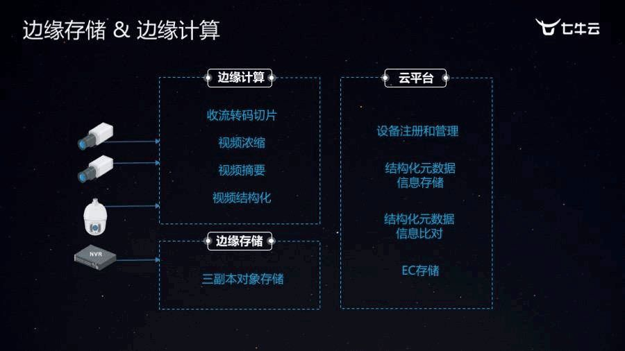

其实边缘计算也不是一个特别高大上的概念，我们在很多场景下，都有用到边缘计算。它不止在边缘 CDN 节点上做，比如视频的水印、转码、视频剪辑，这些曾经都要在云端进行的功能，现在下沉到端上，可以通过短视频 SDK 来完成。再比如直播和点播客户用到的 P2P 技术，利用二级节点，甚至用户侧的路由器，帮助完成 CDN 内容的分发，其实也是一种边缘计算；还有超分辨率技术，通过深度学习模型，将低清晰度的图片还原成高清画面，其实更多的是在播放器端上进行，也属于边缘计算。

有国际数据预测表明，到 2020 年，将有超过 500 亿的设备联入到互联网，其中，超过 50% 的数据会在边缘进行存储和计算。

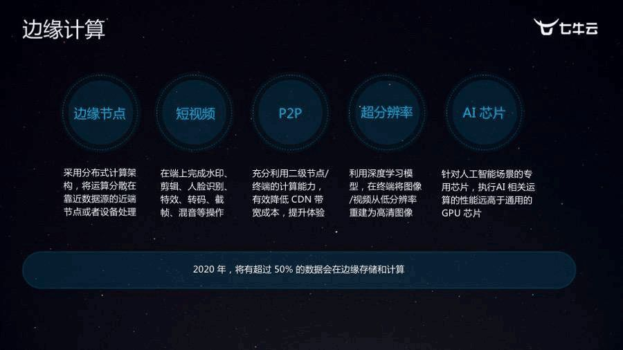

所以关于视频技术的未来，我认为视频技术的未来，一定会跟 AI 相结合，而 AI 在视频场景下的落地，会遇到带宽、延时的挑战，而边缘存储、边缘计算可以有效地缓解这种压力，让 AI 能够更快地在视频的场景下落地。

最后总结一下，在人类所有的感官里，视觉的比例占比是最高的，大概有 83%，因此我相信，在未来，视频依然会在我们的工作和生活中发挥巨大作用，而七牛云也会不遗余力地在视频技术和视频智能这件事情上做出自己的努力，以给大家提供更好的服务！