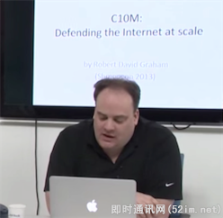

**高性能网络编程(三)：下一个10年，是时候考虑C10M并发问题了**

## 1、前言

在本系列文章的上篇中我们回顾了过云的10年里，高性能网络编程领域著名的C10K问题及其成功的解决方案（上篇请见：《[高性能网络编程(二)：上一个10年，著名的C10K并发连接问题](http://www.52im.net/thread-566-1-1.html)》）。本文将讨论单机服务器实现C10M（即单机千万并发连接）的可能性及其思路。

截至目前，40gpbs、32-cores、256G RAM的X86服务器在Newegg网站上的报价是几千美元。实际上以这样的硬件配置来看，它完全可以处理1000万个以上的并发连接，如果它们不能，那是因为你选择了错误的软件，而不是底层硬件的问题。

可以预见在接下来的10年里，因为IPv6协议下每个服务器的潜在连接数都是数以百万级的，单机服务器处理数百万的并发连接（甚至千万）并非不可能，但我们需要重新审视目前主流OS针对网络编程这一块的具体技术实现。

## 2、C10K问题系列文章

**本文是C10K问题系列文章中的第3篇，总目录如下：**

- 《[高性能网络编程(一)：单台服务器并发TCP连接数到底可以有多少](http://www.52im.net/thread-561-1-1.html)》
- 《[高性能网络编程(二)：上一个10年，著名的C10K并发连接问题](http://www.52im.net/thread-566-1-1.html)》
- 《[高性能网络编程(三)：下一个10年，是时候考虑C10M并发问题了](http://www.52im.net/thread-568-1-1.html)》（本文）
- 《[高性能网络编程(四)：从C10K到C10M高性能网络应用的理论探索](http://www.52im.net/thread-578-1-1.html)》
- 《[高性能网络编程(五)：一文读懂高性能网络编程中的I/O模型](http://www.52im.net/thread-1935-1-1.html)》
- 《[高性能网络编程(六)：一文读懂高性能网络编程中的线程模型](http://www.52im.net/thread-1939-1-1.html)》
- 《[高性能网络编程(七)：到底什么是高并发？一文即懂！](http://www.52im.net/thread-3120-1-1.html)》
- 《[高性能网络编程经典：《The C10K problem(英文)》[附件下载\]](http://www.52im.net/thread-560-1-1.html)》

## 3、解决C10M问题并非不可能

很多人会想当然的认为，要实现C10M（即单机千万）并发连接和处理能力，是不可能的。不过事实并非如此，现在系统已经在用你可能不熟悉甚至激进的方式支持千万级别的并发连接。

要知道它是如何做到的，我们首先要了解Errata Security的CEO Robert Graham，以及他在Shmoocon 2013大会上的“天方夜谈”视频记录： [C10M Defending The Internet At Scale](http://www.youtube.com/watch?v=73XNtI0w7jA#!)（此为Yutube视频，你懂的）。

Robert用一种我以前从未听说的方式来很巧妙地解释了这个问题。他首先介绍了一点有关Unix的历史，Unix的设计初衷并不是一般的服务器操作系统，而是电话网络的控制系统。由于是实际传送数据的电话网络，所以在控制层和数据层之间有明确的界限。问题是我们现在根本不应该使用Unix服务器作为数据层的一部分。正如设计只运行一个应用程序的服务器内核，肯定和设计多用户的服务器内核是不同的。

Robert Graham的结论是：OS的内核不是解决C10M问题的办法，恰恰相反OS的内核正是导致C10M问题的关键所在。

**这也就意味着：**

不要让OS内核执行所有繁重的任务：将数据包处理、内存管理、处理器调度等任务从内核转移到应用程序高效地完成，让诸如Linux这样的OS只处理控制层，数据层完全交给应用程序来处理。

最终就是要设计这样一个系统，该系统可以处理千万级别的并发连接，它在200个时钟周期内处理数据包，在14万个时钟周期内处理应用程序逻辑。由于一次主存储器访问就要花费300个时钟周期，所以这是最大限度的减少代码和缓存丢失的关键。

面向数据层的系统可以每秒处理1千万个数据包，面向控制层的系统，每秒只能处理1百万个数据包。这似乎很极端，请记住一句老话：可扩展性是专业化的，为了做好一些事情，你不能把性能问题外包给操作系统来解决，你必须自己做。

## 4、回顾一下C10K问题

10年前，开发人员处理C10K可扩展性问题时，尽量避免服务器处理超过1万个的并发连接。通过改进操作系统内核以及用事件驱动服务器（典型技术实现如：Nginx和Node）代替线程服务器（典型代表：Apache），使得这个问题已经被解决。人们用十年的时间从Apache转移到可扩展服务器，在近几年，可扩展服务器的采用率增长得更快了。

以传统网络编程模型作为代表的Apache为例，我们来看看它在C10K问题上的局限表现在哪些方面，并针对性的讨论对应的解决方法。

Apache的问题在于服务器的性能会随着连接数的增多而变差，实际上性能和可扩展性并不是一回事。当人们谈论规模时，他们往往是在谈论性能，但是规模和性能是不同的，比如Apache。持续几秒的短期连接：比如快速事务，如果每秒处理1000个事务，只能有约1000个并发连接到服务器。如果事务延长到10秒，要维持每秒1000个事务则必须打开1万个并发连接。这种情况下：尽管你不顾DoS攻击，Apache也会性能陡降，同时大量的下载操作也会使Apache崩溃。

如果每秒处理的连接从5千增加到1万，你会怎么做？比方说，你升级硬件并且提高处理器速度到原来的2倍。到底发生了什么？你得到两倍的性能，但你没有得到两倍的处理规模。每秒处理的连接可能只达到了6000。你继续提高速度，情况也没有改善。甚至16倍的性能时，仍然不能处理1万个并发连接。所以说性能和可扩展性是不一样的。

问题在于Apache会创建一个CGI进程，然后关闭，这个步骤并没有扩展。为什么呢？内核使用的O(N^2)算法使服务器无法处理1万个并发连接。

**OS内核中的两个基本问题：**

- 连接数=线程数/进程数：当一个数据包进来，内核会遍历其所有进程以决定由哪个进程来处理这个数据包。
- 连接数=选择数/轮询次数（单线程）：同样的可扩展性问题，每个包都要走一遭列表上所有的socket。

通过上述针对Apache所表现出的问题，实际上彻底解决并发性能问题的解决方法的根本就是改进OS内核使其在常数时间内查找，使线程切换时间与线程数量无关，使用一个新的可扩展epoll()/IOCompletionPort常数时间去做socket查询。

因为线程调度并没有得到扩展，所以服务器大规模对socket使用epoll方法，这样就导致需要使用异步编程模式，而这些编程模式正是Nginx和Node类型服务器具有的。所以当从Apache迁移到Nginx和Node类型服务器时，即使在一个配置较低的服务器上增加连接数，性能也不会突降。所以在处理C10K连接时，一台笔记本电脑的速度甚至超过了16核的服务器。这也是前一个10年解决C10K问题的普遍方法。

## 5、实现C10M意味着什么？

**实现10M（即1千万）的并发连接挑战意味着什么：**

- **1千万的并发连接数**；
- **100万个连接/秒：**每个连接以这个速率持续约10秒；
- **10GB/秒的连接：**快速连接到互联网；
- **1千万个数据包/秒：**据估计目前的服务器每秒处理50K数据包，以后会更多；
- **10微秒的延迟：**可扩展服务器也许可以处理这个规模（但延迟可能会飙升）；
- **10微秒的抖动：**限制最大延迟；
- **并发10核技术：**软件应支持更多核的服务器（通常情况下，软件能轻松扩展到四核，服务器可以扩展到更多核，因此需要重写软件，以支持更多核的服务器）。

## 6、为什么说实现C10M的挑战不在硬件而在软件？

### 1理由概述

硬件不是10M问题的性能瓶颈所在处，真正的问题出在软件上，尤其是*nux操作系统。理由如下面这几点：

**首先：**最初的设计是让Unix成为一个电话网络的控制系统，而不是成为一个服务器操作系统。对于控制系统而言，针对的主要目标是用户和任务，而并没有针对作为协助功能的数据处理做特别设计，也就是既没有所谓的快速路径、慢速路径，也没有各种数据服务处理的优先级差别。

**其次：**传统的CPU，因为只有一个核，操作系统代码以多线程或多任务的形式来提升整体性能。而现在，4核、8核、32核、64核和100核，都已经是真实存在的CPU芯片，如何提高多核的性能可扩展性，是一个必须面对的问题。比如让同一任务分割在多个核心上执行，以避免CPU的空闲浪费，当然，这里面要解决的技术点有任务分割、任务同步和异步等。

**再次：**核心缓存大小与内存速度是一个关键问题。现在，内存已经变得非常的便宜，随便一台普通的笔记本电脑，内存至少也就是4G以上，高端服务器的内存上24G那是相当的平常。但是，内存的访问速度仍然很慢，CPU访问一次内存需要约60~100纳秒，相比很久以前的内存访问速度，这基本没有增长多少。对于在一个带有1GHZ主频CPU的电脑硬件里，如果要实现10M性能，那么平均每一个包只有100纳秒，如果存在两次CPU访问内存，那么10M性能就达不到了。核心缓存，也就是CPU L1/L2/LL Cache，虽然访问速度会快些，但大小仍然不够，我之前接触到的高端至强，LLC容量大小貌似也就是12M。

### 2解决思路

解决这些问题的关键在于如何将功能逻辑做好恰当的划分，比如专门负责控制逻辑的控制面和专门负责数据逻辑的数据面。数据面专门负责数据的处理，属于资源消耗的主要因素，压力巨大，而相比如此，控制面只负责一些偶尔才有非业务逻辑，比如与外部用户的交互、信息的统计等等。我之前接触过几种网络数据处理框架，比如[Intel的DPDK](http://dpdk.org/)、[6wind](http://www.6wind.com/)、[windriver](http://www.windriver.com/)，它们都针对Linux系统做了特别的补充设计，增加了数据面、快速路径等等特性，其性能的提升自然是相当巨大。

**看一下这些高性能框架的共同特点：**

- **数据包直接传递到业务逻辑：**
  而不是经过Linux内核协议栈。这是很明显的事情，因为我们知道，Linux协议栈是复杂和繁琐的，数据包经过它无非会导致性能的巨大下降，并且会占用大量的内存资源，之前有同事测试过，Linux内核要吃掉2.5KB内存/socket。我研究过很长一段时间的DPDK源码，其提供的82576和82599网卡驱动就直接运行在应用层，将接管网卡收到的数据包直接传递到应用层的业务逻辑里进行处理，而无需经过Linux内核协议栈。当然，发往本服务器的非业务逻辑数据包还是要经过Linux内核协议栈的，比如用户的SSH远程登录操作连接等。
- **多线程的核间绑定：**
  一个具有8核心的设备，一般会有1个控制面线程和7个或8个数据面线程，每一个线程绑定到一个处理核心（其中可能会存在一个控制面线程和一个数据面线程都绑定到同一个处理核心的情况）。这样做的好处是最大化核心CACHE利用、实现无锁设计、避免进程切换消耗等等。
- **内存是另外一个核心要素：**
  常见的内存池设计必须在这里得以切实应用。有几个考虑点，首先，可以在Linux系统启动时把业务所需内存直接预留出来，脱离Linux内核的管理。其次，Linux一般采用4K每页，而我们可以采用更大内存分页，比如2M，这样能在一定程度上减少地址转换等的性能消耗。

**关于Intel的DPDK框架介绍：**

随着网络技术的不断创新和市场的发展，越来越多的网络设备基础架构开始向基于通用处理器平台的架构方向融合，期望用更低的成本和更短的产品开发周期来提供多样的网络单元和丰富的功能，如应用处理、控制处理、包处理、信号处理等。为了适应这一新的产业趋势， Intel推出了基于Intel x86架构DPDK (Data Plane Development Kit，数据平面开发套件) 实现了高效灵活的包处理解决方案。经过近6年的发展，DPDK已经发展成支持多种高性能网卡和多通用处理器平台的开源软件工具包。

有兴趣的技术同行，也许可以参考下[DPDK的源代码](http://dpdk.org/download)，目前DPDK已经完全开源并且可以网络下载了。

## 7、解决C10M问题的思路总结

**综上所述，解决C10M问题的关键主要是从下面几个方面入手：**

**网卡问题：**通过内核工作效率不高
**解决方案：**使用自己的驱动程序并管理它们，使适配器远离操作系统。

**CPU问题：**使用传统的内核方法来协调你的应用程序是行不通的。
**解决方案：**Linux管理前两个CPU，你的应用程序管理其余的CPU，中断只发生在你允许的CPU上。

**内存问题：**内存需要特别关注，以求高效。
**解决方案：**在系统启动时就分配大部分内存给你管理的大内存页。

以Linux为例，解决的思咯就是将控制层交给Linux，应用程序管理数据。应用程序与内核之间没有交互、没有线程调度、没有系统调用、没有中断，什么都没有。 然而，你有的是在Linux上运行的代码，你可以正常调试，这不是某种怪异的硬件系统，需要特定的工程师。你需要定制的硬件在数据层提升性能，但是必须是在你熟悉的编程和开发环境上进行。

## 8、参考资料

[1] [The Secret To 10 Million Concurrent Connections -The Kernel Is The Problem, Not The Solution](http://highscalability.com/blog/2013/5/13/the-secret-to-10-million-concurrent-connections-the-kernel-i.html)
[2] [*nux平台上的C10M问题](http://www.lenky.info/archives/2013/07/2320)
[3] [千万级并发实现的秘密：内核不是解决方案，而是问题所在](http://www.csdn.net/article/2013-05-16/2815317-the-secret-to-10m-concurrent)
[4] [为什么QQ用的是UDP协议而不是TCP协议？](http://www.52im.net/thread-279-1-1.html)
[5] [移动端IM/推送系统的协议选型：UDP还是TCP？](http://www.52im.net/thread-33-1-1.html)
[6] [高性能网络编程经典：《The C10K problem(英文)》[附件下载\]](http://www.52im.net/thread-560-1-1.html)
[7] [高性能网络编程(一)：单台服务器并发TCP连接数到底可以有多少](http://www.52im.net/thread-561-1-1.html)
[8] 《The C10K problem （[英文在线阅读](http://www.kegel.com/c10k.html)、[英文PDF版下载](http://www.52im.net/thread-560-1-1.html)、[中文译文](http://blog.csdn.net/goldou/article/details/2579781)）》
[9] [高性能网络编程经典：《The C10K problem(英文)》[附件下载\]](http://www.52im.net/thread-560-1-1.html)
[10] [[通俗易懂\]深入理解TCP协议（上）：理论基础](http://www.52im.net/thread-513-1-1.html)
[11] [[通俗易懂\]深入理解TCP协议（下）：RTT、滑动窗口、拥塞处理](http://www.52im.net/thread-515-1-1.html)
[12] 《[TCP/IP详解 卷1：协议 (在线阅读版)](http://www.52im.net/topic-tcpipvol1.html)》